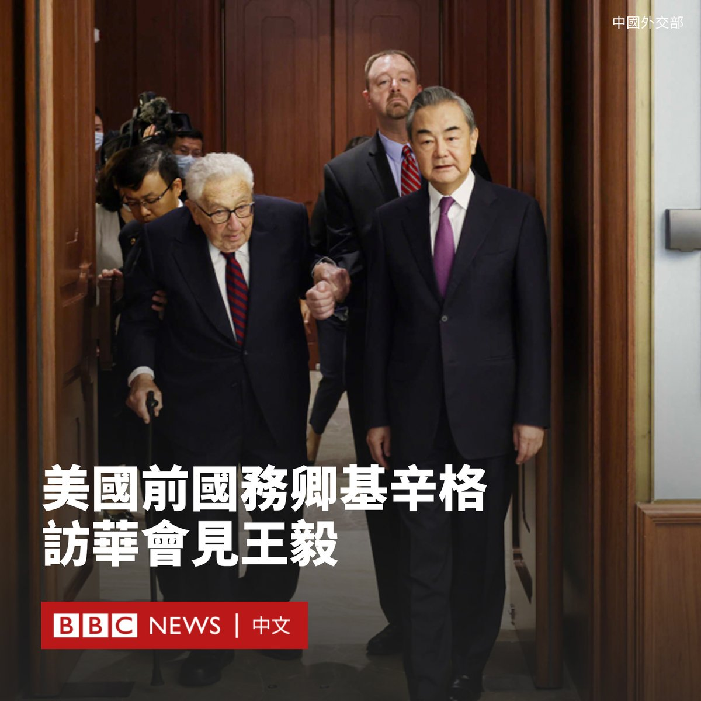
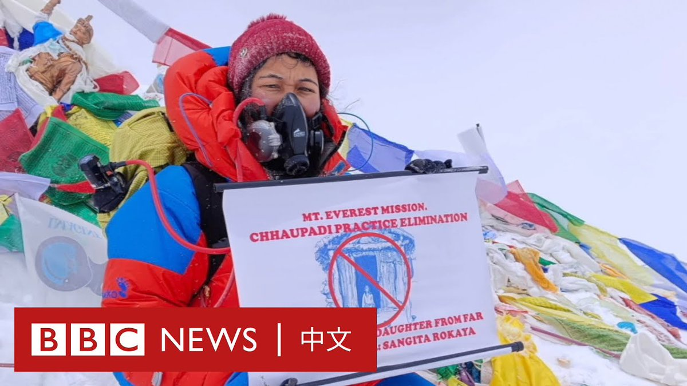
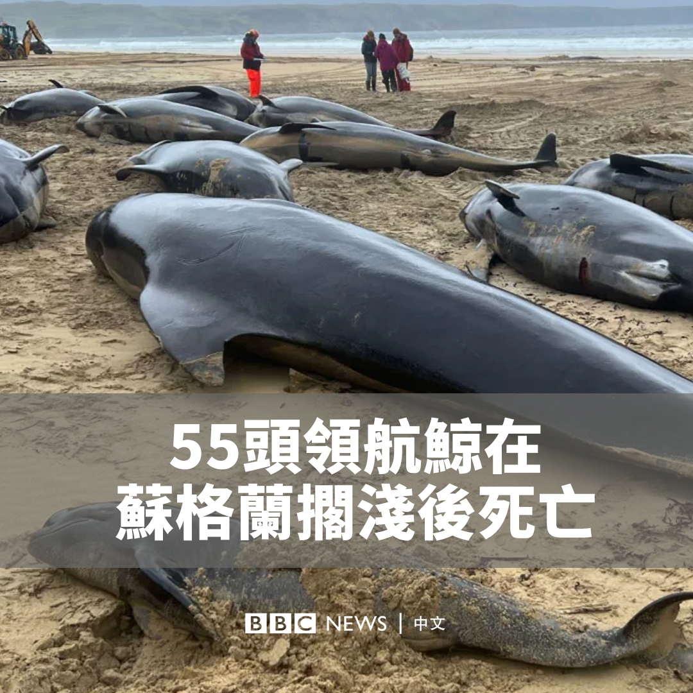
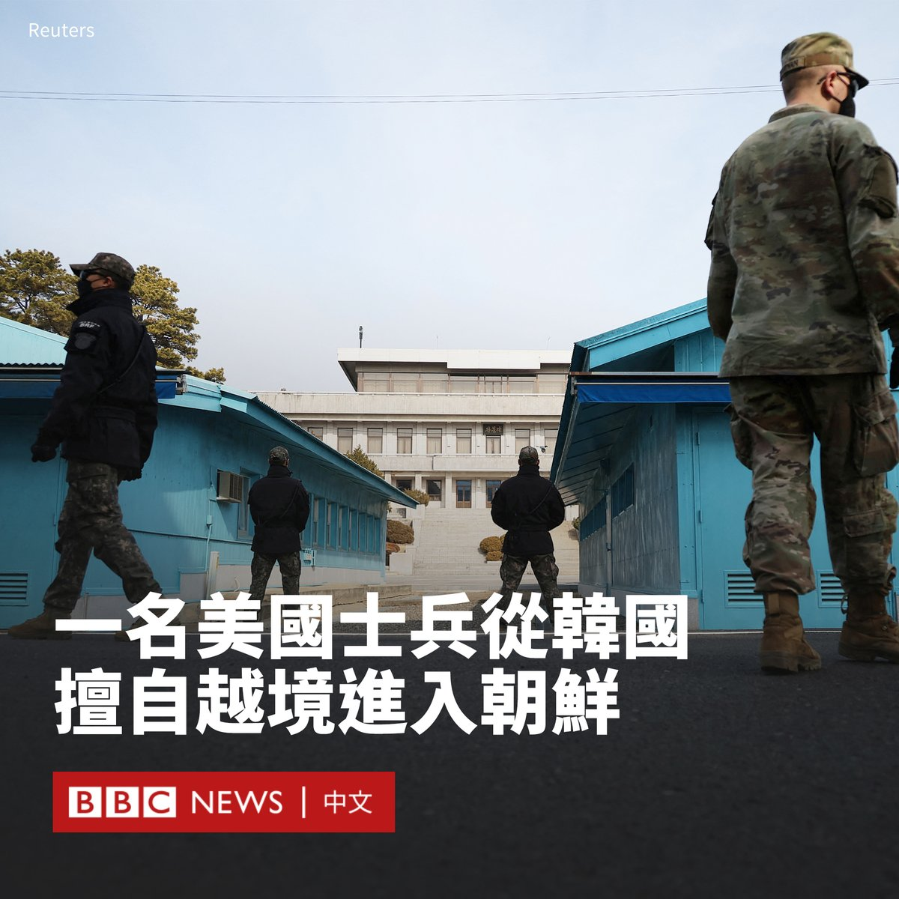

D英国广播公司BBC 北京时间 2023-07-19T15:35:55Z 1681568534533660674 已经100岁高龄的美国前国务卿基辛格（Henry Kissinger）本周访问中国。他先后与中国国防部长李尚福以及中国最高外交官员王毅会面。

基辛格曾在美苏冷战时期担任美国国务卿，他促成了时任美国总统尼克松（Richard Nixon）在1972年历史性访问北京，被视为对美中破冰起到了重要作用。

中国外交部的一份声明显示，王毅周三（7月19日）在会晤时表示，“中国的发展有强大内生动力和必然历史逻辑，试图改造中国是不可能的，围堵遏制中国更是做不到的”。

王毅表示，华盛顿的对华政策“需要基辛格式的外交智慧，需要尼克松式的政治勇气”。

在声明中，王毅还用“博士”和“老朋友”称呼基辛格，这样的用语在中国外交中意味着很高的赞誉。

据报道，基辛格对王毅说，“美中保持稳定关系，事关世界的和平、稳定和人类福祉”。他称，“无论如何困难，双方都应平等相待，保持接触，试图孤立或隔绝另一方都是不可接受的”。

此前一天，中国国防部长李尚福也与基辛格会晤。李尚福指责美国“一些人”未同中方相向而行，致使两国关系徘徊在“建交以来的低谷”，呼吁华盛顿作出“正确的战略判断”。

美国国务院发言人马修·米勒（Matthew Miller）表示，华盛顿事先知悉基辛格的访问计划，并表示基辛格是以普通公民的身份会见李尚福的，尽管后者仍在美国的制裁名单中。

今年6月，北京拒绝了美方提出的让李尚福与美国国防部长奥斯汀（Lloyd Austin）在新加坡香格里拉对话会会晤的邀请。   D英国广播公司BBC 北京时间 2023-07-19T13:40:47Z 1681539562022277120 据香港媒体报导，一名香港电竞选手因参与国际赛事时，其游戏昵称含“光复”二字，被取消比赛资格，并被要求停赛三年。

在2019年香港抗议时，示威者曾广泛使用“光复香港，时代革命”的口号。香港当局后来禁止了该口号，指其具有“港独”性质。

电竞比赛“AESF亚运征途——DOTA 2”周日（7月16日）迎来中国对中国香港赛事。香港电竞选手林奇隆在游戏开始时的名称为“Eazy.D.L光复”。

据报导，当日比赛的直播片段显示，比赛开始约10分钟后，“光复”二字被以星号代替，不过比赛并无中断，最终中国队以2比0胜出。

事发后，中国香港电竞总会先在周日发布声明，指这名选手的参赛资格已被亚洲电子体育联合会（AESF）取消，并于周一（7月17日）再发声明，决定对林奇隆作出停赛三年的惩处。

“这项决定对该选手来说无疑是一项严厉的处罚，然而，我们认为这是必要的措施，以维护整个赛事的公平性和遵守竞赛道德。”中国香港电竞总会在一份声明中写道。

“在国际赛事中，非竞技因素和个人情绪应被排除在外，我们期望每位选手能够理解并遵守这一原则。”   D英国广播公司BBC 北京时间 2023-07-19T11:39:30Z 1681509037916196866 在尼泊尔的乡村地区，许多女性被迫接受“月经隔离”（Chhaupadi），在经期期间离家到户外的小屋独自生活。不少人在隔离期间遭遇强暴或死于恶劣环境。
 
为抗议这项传统，26岁的桑吉塔（Sangeeta Rokaya）登上珠穆朗玛峰，希望透过登顶——另一个束缚尼泊尔女性的禁忌——传播反对歧视的讯息。 https://t.co/2t9YeVBRjh   D英国广播公司BBC 北京时间 2023-07-19T09:21:51Z 1681474399290138624 英国潜水员海洋生物救援组织称，苏格兰西北部的一个岛屿上，有55头领航鲸在大规模搁浅后死亡。 https://t.co/k2q3Bu4TMO   D英国广播公司BBC 北京时间 2023-07-19T10:00:49Z 1681484202624307201 一名23岁的美国士兵未经授权从韩国越过重兵把守的朝韩军事分界线，据信他已被朝鲜方面拘留。

事发时，这名名为特拉维斯·金（Travis King）的二等兵报名参加了前往朝韩非军事区（DMZ）的旅行团，他从韩方一侧进入朝鲜。

特拉维斯因纪律问题本应被遣送回国，但他在被送往仁川国际机场后，似乎并未登上飞机，而是擅自逃出航站楼。

美国国务院发言人米勒（Matthew Miller）表示，这名士兵是“在未经授权的情况下故意”越境进入朝鲜。

与他一起参加板门店旅行团的目击者描述说，他听到这名士兵在逃跑前大笑。

负责管理非军事区的联合国军司令部表示，相信这名士兵目前已被朝鲜拘留。

一名美国高级指挥官表示，目前没有与这名士兵取得联系，驻韩美军正在调查这一事件。

“我们正在密切监测和调查这一情况，并正在通知该士兵的亲人。”美国国防部长奥斯汀（Lloyd Austin）说。“我绝对最关心的是我们军人的福祉。因此，我们将继续关注此事。”   