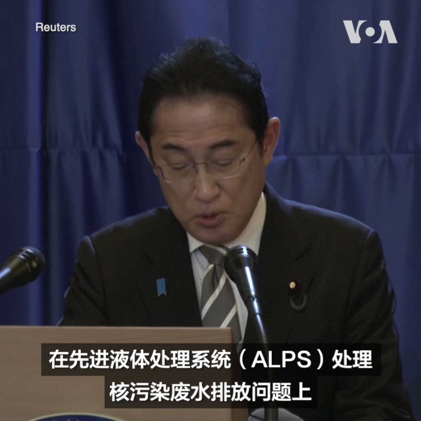
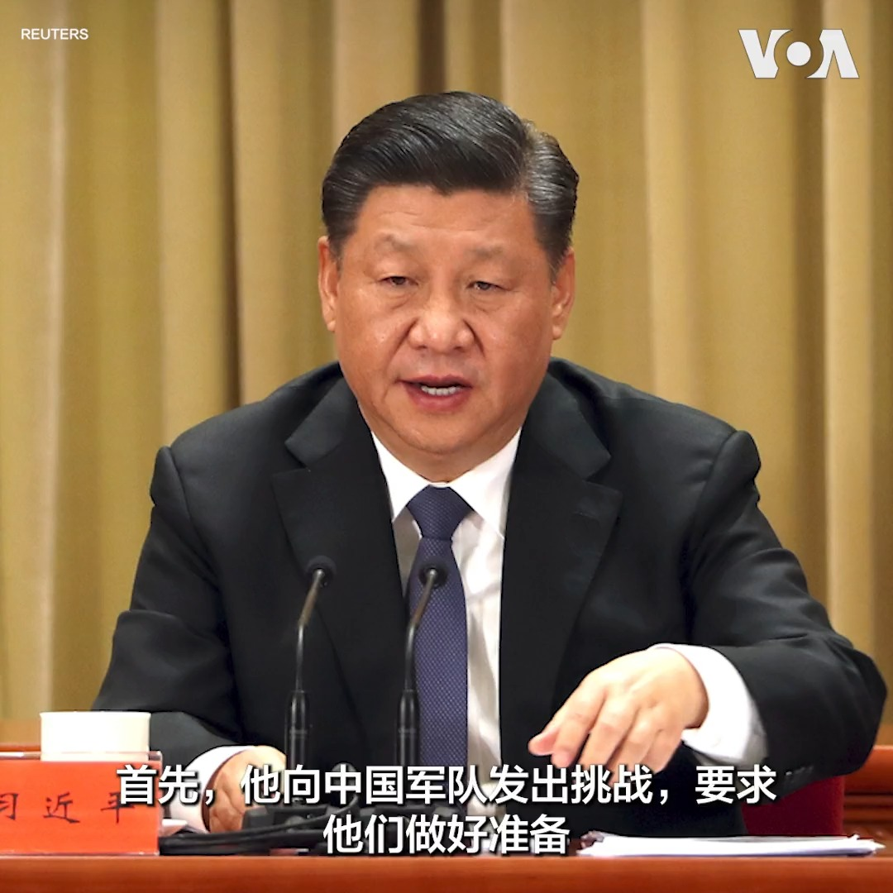
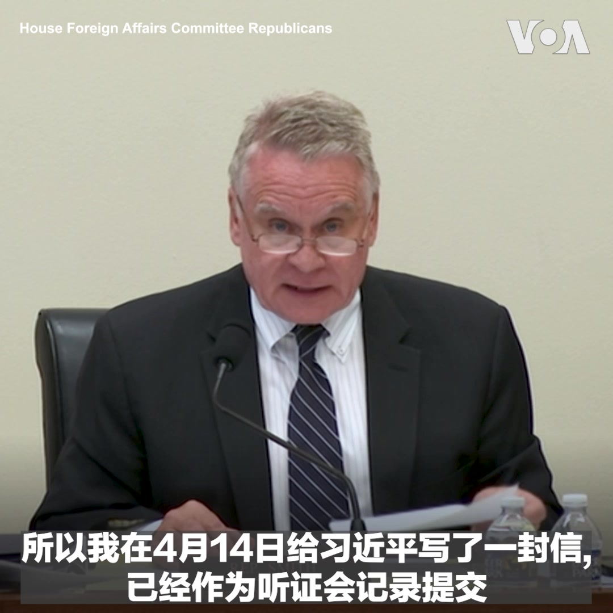
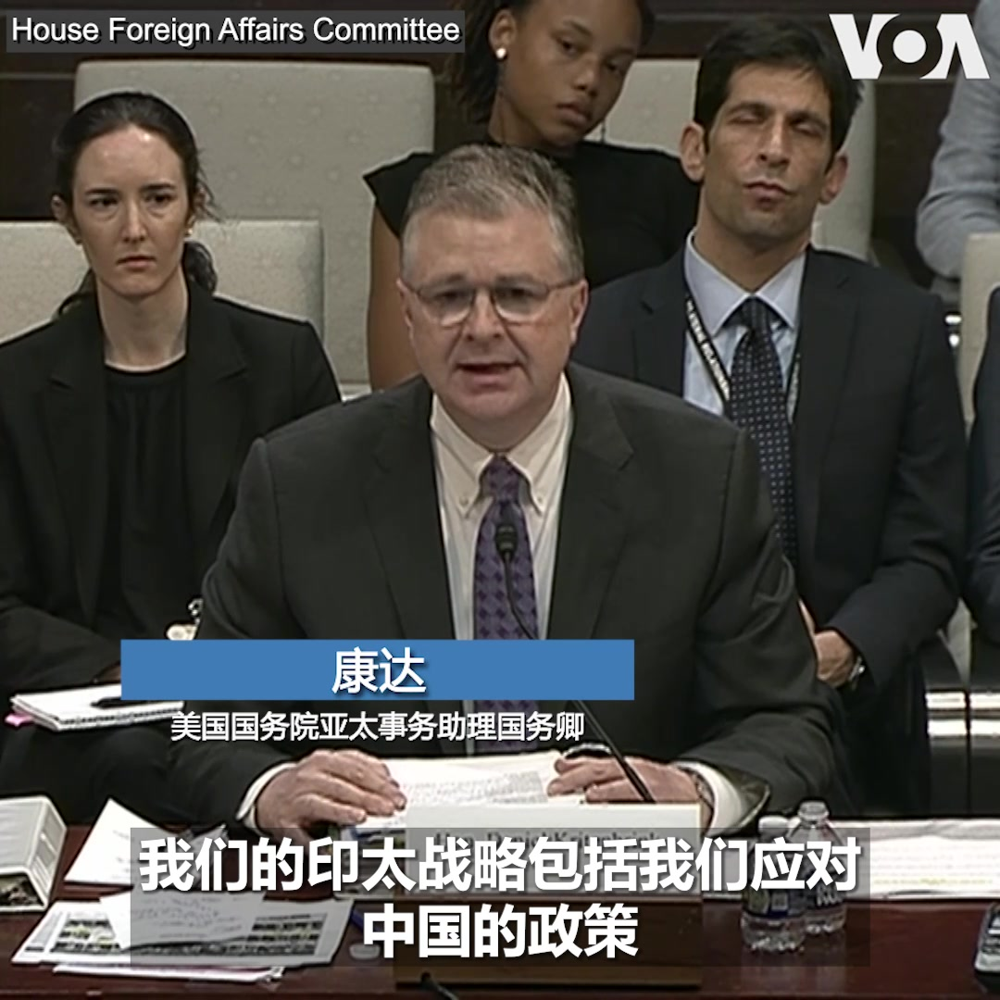
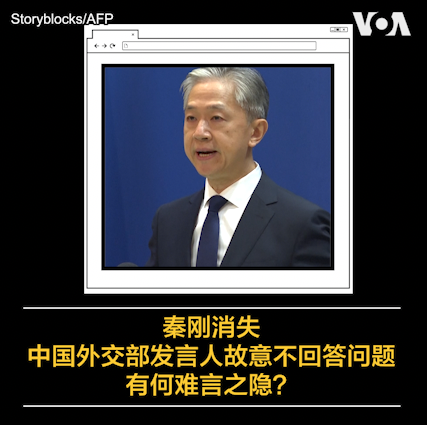
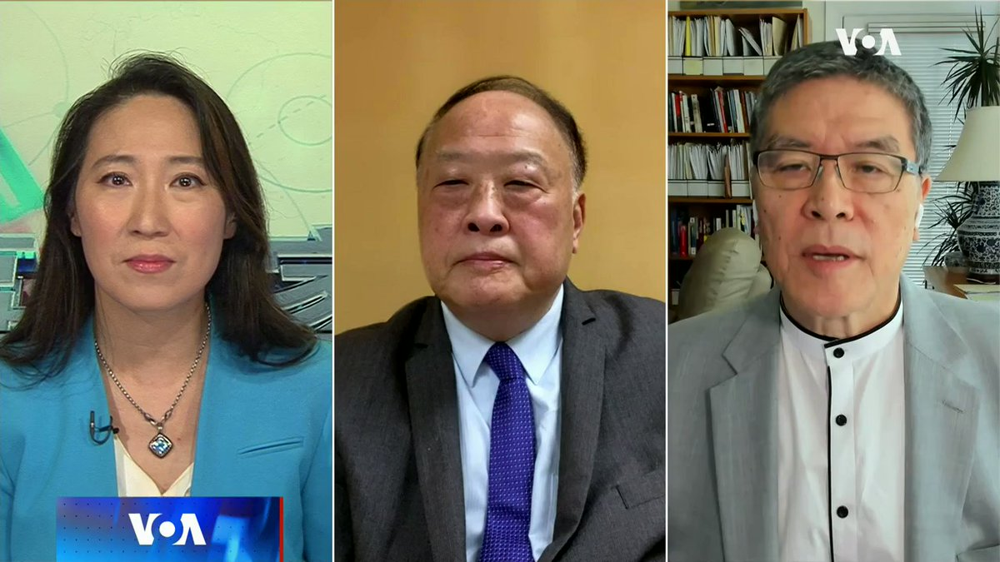
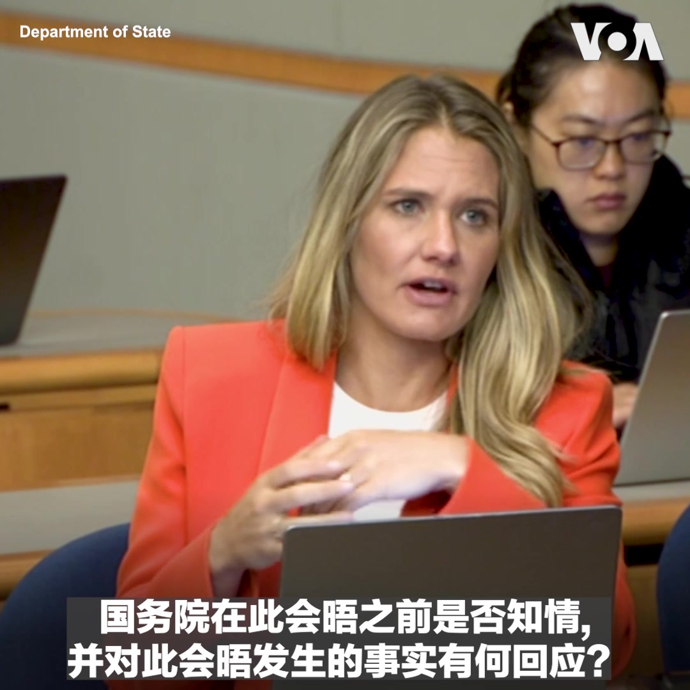
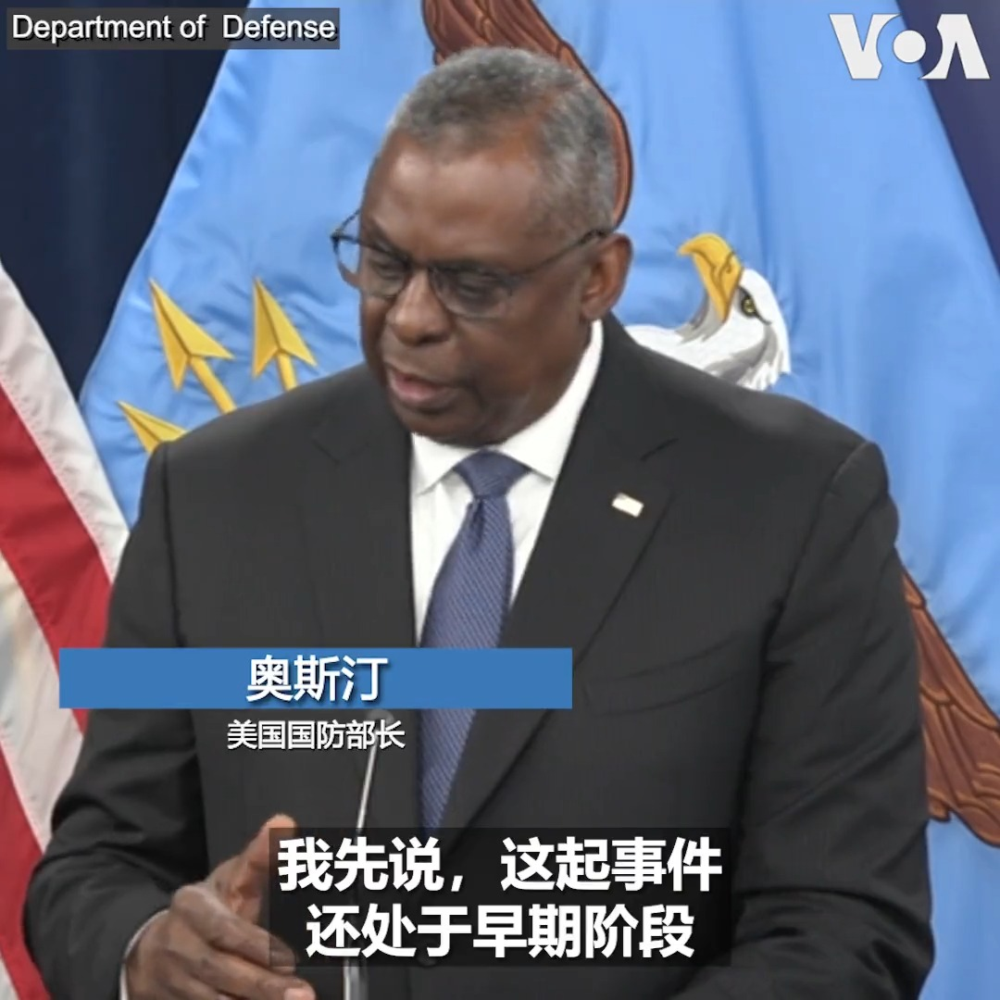

美国之音中文网 北京时间 2023-07-19T22:25:35Z 1681671630538547200 决意加强对香港的控制，北京任命国安部副部长出任香港国安公署署长 https://t.co/EsxLg0joIi   美国之音中文网 北京时间 2023-07-19T22:49:09Z 1681677563360428034 中国报道--金哲：中国外交部发言人展示“一尊”习近平的犹豫与为难 https://t.co/8Zuo2wmllI https://t.co/Fa1Lc45Upd   美国之音中文网 北京时间 2023-07-19T22:49:36Z 1681677675113349122 日本首相岸田文雄7月18日敦促中国以“基于科学的”态度评论日本福岛核处理水排海问题。国际原子能机构（IAEA）本月早些时候就福岛第一核电站先进液体处理系统（ALPS）处理水排放发布了评估报告。中国官员说，日本采用的ALPS系统无法去除核污水中的所有放射性物质。 https://t.co/eiyyNMlUx1   美国之音中文网 北京时间 2023-07-19T23:42:38Z 1681691019883192320 美国气候特使克里呼吁北京将气候问题与政治分开处理 https://t.co/XM7lNjW1ni   美国之音中文网 北京时间 2023-07-19T23:48:36Z 1681692524333912064 南非确认普京不会出席金砖国家峰会，避免执行对普京的逮捕令 https://t.co/iWmjvDQYzZ   美国之音中文网 北京时间 2023-07-19T20:59:00Z 1681649840944734209 台湾副总统赖清德打算于8月出访巴拉圭时，过境美国，引发中国强烈反弹。对此，美国在台协会(AIT)处长孙晓雅（Sandra Oudkirk）19日表示，台湾副总统过境美国已是惯例，中国不应以此为借口来进行任何挑衅行为。报道：https://t.co/mVgWM97sbV https://t.co/eNl9Rx4dTu   美国之音中文网 北京时间 2023-07-19T21:20:43Z 1681655306189783040 7/19 【#时事大家谈】美中气候博弈，北京一面称其“枷锁”一面视之"商机"？德国首份“中国战略”，打脸李强“首访首站”？

嘉宾：中国民主党全国委员会主席王军涛博士; 澳大利亚蒙纳士大学商学院副教授史鹤凌博士
主持人：平章    

YouTube： https://t.co/5DNR2wg4qS https://t.co/Ia5a3ZXDLv   美国之音中文网 北京时间 2023-07-19T22:06:57Z 1681666942497693696 英国军情六处负责人理查德·摩尔7月19日说，该机构目前的首要工作重点是中国，而不是俄罗斯。这位英国情报部门最高级别官员表示，英国会在重要国际问题上与中国保持接触，但目前，军情六处将最多资源用于应对中国。 https://t.co/Sj60YqiUxC   美国之音中文网 北京时间 2023-07-19T22:15:10Z 1681669011854196736 美国敦促埃及释放人权研究员 https://t.co/f6V3FlY31y   美国之音中文网 北京时间 2023-07-19T20:00:02Z 1681635001199206402 中国报道--金哲：秦刚消失，中国外交部发言人故意不回答问题，有何难言之隐？https://t.co/8Zuo2wmllI https://t.co/KzUTX2AuLF   美国之音中文网 北京时间 2023-07-19T16:59:05Z 1681589465494728704 北京声称将对赖清德过境美国作出“有力回应” https://t.co/jP3NeiZDUo   美国之音中文网 北京时间 2023-07-19T17:41:14Z 1681600074013622272 美众议院举行听证会审视应对中国AI武器化 https://t.co/Ogif1Xr2hL   美国之音中文网 北京时间 2023-07-19T17:41:18Z 1681600089096327168 AIT：台湾副总统过境美国符合非官方关系本质 不希望中国借此挑衅 https://t.co/FKRkeM2Dfc   美国之音中文网 北京时间 2023-07-19T18:11:34Z 1681607705331654656 为应对中国收紧数据监管 摩根士丹利将200名技术人员撤出中国 https://t.co/EtYufvX90v   美国之音中文网 北京时间 2023-07-19T14:55:34Z 1681558382464081921 参院辩论《国防授权法案》 舒默突出人工智能、与中国竞争、芬太尼危机等议题 https://t.co/DQ4x8T5heB   美国之音中文网 北京时间 2023-07-19T14:16:05Z 1681548445017063426 抗衡中国影响力 奥斯汀将出访巴新和澳大利亚 https://t.co/30Wk7jsSZj   美国之音中文网 北京时间 2023-07-19T11:20:00Z 1681504130496606208 美印太司令部司令阿奎利诺18日在阿斯彭安全论坛上说，美国对乌克兰数十亿美元的武器支援并不影响美军在印太地区的行动，也不影响美国向台湾提供武器。他说，如果习近平要求解放军在2027年做好攻台准备，他的责任是让美军做好准备威慑对方，如果威慑失败，美军也有信心赢得胜利https://t.co/7plS2olM94 https://t.co/jpiNKvMrfZ   美国之音中文网 北京时间 2023-07-19T07:08:05Z 1681440736011784192 走进中国异议艺术家在加州沙漠创立的雕塑公园 https://t.co/8nVS4SMCVY   美国之音中文网 北京时间 2023-07-19T07:12:04Z 1681441736416198663 美中重启气候对话，北京又在用气候合作要挟美国？扩张煤炭经济，中国的减排承诺可信吗？一面抱怨减排目标阻碍自身发展，一面从别国的减排努力中赚钱，中国对新能源供应链的控制带来风险？另一方面，德国发布“中国战略”，欧洲对华经济依赖最深的大型经济体也转向？请留言参与7/19时事大家谈。 https://t.co/9MSGfU7zmZ   美国之音中文网 北京时间 2023-07-19T07:33:19Z 1681447085541818369 “如果他们(中共)说，一切都是开放的，欢迎来看看，我们没什么可隐藏的，那我想现在就去，“长期关注中国人权的美国会众院外委会全球卫生和人权小组委员会主席克里斯·史密斯7月18日在一场关于全球宗教自由的听证会上再次表示希望能访问新疆。史密斯说他曾在4月致函给习近平要求访问，但未得到回复。 https://t.co/tVOiAH0uBZ   美国之音中文网 北京时间 2023-07-19T07:45:02Z 1681450031860023296 美国国务院亚太事务助理国务卿康达(Daniel Kritenbrink)周二出席众议院外交事务委员会听证会时表示，美国的印太战略包括对中国的政策，但并非由这一点来定义整个战略。“行政部门对中国采取的策略是投资（美国）、协调（盟友）和竞争（中国），”康达说。 https://t.co/dNAgmg6NNT   美国之音中文网 北京时间 2023-07-19T07:51:34Z 1681451679785582598 北京安排李尚福会晤基辛格，就两军交流问题向美国施压 https://t.co/wvgBRAZ8fg   美国之音中文网 北京时间 2023-07-19T08:00:01Z 1681453804481310721 中国报道--金哲：秦刚消失，中国外交部发言人故意不回答问题，有何难言之隐？https://t.co/ZpJRLkkTb7 https://t.co/E6yHTz9Xw1   美国之音中文网 北京时间 2023-07-19T08:26:34Z 1681460485848436736 特朗普称自己是2020年选举舞弊调查的目标 https://t.co/C068CyCKi6   美国之音中文网 北京时间 2023-07-19T08:26:37Z 1681460500339785730 遭港府通缉抗争者: 当局目的在于破坏互信 香港人要维持抗争信念 https://t.co/vpWcSB55Q1   美国之音中文网 北京时间 2023-07-19T08:30:00Z 1681461349681967107 中共外长秦刚消失的原因究竟是婚外情还是内斗？美国欧道明大学国际商学教授李少民告诉美国之音，习近平这些年一直在进行政治清洗，拿下秦刚不是对美、对俄的外交路线之争。完整访谈请看7/18【#时事大家谈】：https://t.co/mSzi6X1d68 https://t.co/PNFDfq3E1W   美国之音中文网 北京时间 2023-07-19T08:41:05Z 1681464139045273601 密歇根州对16名代表特朗普的假选举人提出违反选举法与伪造文书的重罪指控 https://t.co/Kf5JqfgSlL   美国之音中文网 北京时间 2023-07-19T08:56:06Z 1681467917614055424 澳大利亚男子和狗在太平洋漂流三个月获救，“庆幸”自己还活着 https://t.co/VvMQByVQEf   美国之音中文网 北京时间 2023-07-19T08:56:08Z 1681467926317260801 赫尔佐格对拜登说，以色列民主在美国对司法改革的担心中依然无损 https://t.co/BFM2W8sAI7   美国之音中文网 北京时间 2023-07-19T09:00:00Z 1681468898325979136 中国报道—王刚：有的年轻人为追逐利益而入党；有的中年人为移民美国而退党，都不容易。https://t.co/5MZsC35wTB https://t.co/0WBqfvkPFF   美国之音中文网 北京时间 2023-07-19T09:06:35Z 1681470554824482819 美国前国务卿基辛格在北京会晤被美国政府制裁的中国防长李尚福，这是否有问题？美国国务院发言人马修·米勒7月18日在记者会上表示，会晤并不违反制裁。
报道：https://t.co/839YbC3D1B https://t.co/nUqEImae7j   美国之音中文网 北京时间 2023-07-19T09:30:00Z 1681476448417378304 中共外长秦刚消失逾三周，原因众说纷纭，究竟出了什么事？资深媒体人魏碧洲研判网上盛传的婚外情只是烟幕弹，秦刚出事背后应该是中共内部出现了对美、对俄的外交路线之争。完整访谈请看 7/18【#时事大家谈】：https://t.co/mSzi6X1KVG https://t.co/iP8SCioKIs   美国之音中文网 北京时间 2023-07-19T09:36:35Z 1681478107226841089 首尔在美中接触中寻求与北京重置关系 https://t.co/oBcfrpbyWh   美国之音中文网 北京时间 2023-07-19T09:36:39Z 1681478122187915266 美国对乌克兰援助的监督成为国会关注焦点 https://t.co/BI2UJMkPuN   美国之音中文网 北京时间 2023-07-19T10:08:04Z 1681486030938185733 耶伦：将要出台的规则不会“广泛影响”对华投资 https://t.co/Rz5tCwMIKP   美国之音中文网 北京时间 2023-07-19T10:21:35Z 1681489432606822400 美军印太司令：美国对乌克兰的支援并没有影响美军在印太地区的行动 https://t.co/HrwOnRmsVo   美国之音中文网 北京时间 2023-07-19T10:38:05Z 1681493581901750272 共和党人忧拜登政府对华政策太软，国务院官员：我们出拳毫无保留 https://t.co/9A3mP40vKF   美国之音中文网 北京时间 2023-07-19T04:34:35Z 1681402105524006912 日本：朝鲜发射弹道导弹 https://t.co/qZKXE2KvJ0   美国之音中文网 北京时间 2023-07-19T05:06:37Z 1681410165722210304 美军最高将领：乌克兰反攻远远说不上失败 https://t.co/qgzKKiAGlO   美国之音中文网 北京时间 2023-07-19T05:15:35Z 1681412422710759424 一名面临纪律处分的美国士兵越过韩朝分界线后被朝鲜拘留 https://t.co/yAPSVidcO1   美国之音中文网 北京时间 2023-07-19T05:32:05Z 1681416576376115200 中国经济放缓有助于美国降低通胀？ https://t.co/x2FL6L0Qfb   美国之音中文网 北京时间 2023-07-19T05:46:35Z 1681420225592586240 世界气象组织：数十万人死于可预防的高温相关原因 https://t.co/I8ZLpIWEo4   美国之音中文网 北京时间 2023-07-19T05:46:39Z 1681420241954566144 国会辩论来年资金拨款，关塔那摩湾拟保持运作 https://t.co/IwsB1Ewoxz   美国之音中文网 北京时间 2023-07-19T06:15:05Z 1681427397860798464 斯里兰卡领导人寻求解除印度对中国的担忧 https://t.co/zpQ0QyLvsC   美国之音中文网 北京时间 2023-07-19T06:16:32Z 1681427762777604096 在拉脱维亚首都里加有一家中餐外卖店，老板商翱来自中国河南，留学德国后一度回国，但“国内有点太卷了，压力太大”他告诉美国之音。10年前他来到拉脱维亚，喜欢这里较安逸的生活。他说当地中国人不多，这几年随着移民政策收紧，有许多中国人离开了。 https://t.co/nvWMl21duS   美国之音中文网 北京时间 2023-07-19T03:40:39Z 1681388531015352337 美国国防部长奥斯汀周二证实，一位美国军人在7月18号未经授权跨越韩朝军事分界线，现在已被朝鲜居留。白宫发言人让-皮埃尔表示，美国政府和联合国正在共同努力处理此事。 https://t.co/6WPEqvxFWG   美国之音中文网 北京时间 2023-07-19T04:08:40Z 1681395583179792394 美国之音采访团队正在波罗的海国家拉脱维亚。这个国家总人口不到两百万，但三分之一的人都生活在首都里加。当地民众对中国的认识主要在文化和饮食方面，他们对两岸紧张和中国挑战虽有耳闻，但了解有限。 https://t.co/9WPe4W3BKL   美国之音中文网 北京时间 2023-07-19T01:06:04Z 1681349629399678976 台湾希望采购拦截能力超强的美国NASAMS地空导弹系统 https://t.co/tL3yAhMOHu   美国之音中文网 北京时间 2023-07-19T01:06:06Z 1681349637696016384 中芯国际频换董事长 北京幕后施加更大控制？ https://t.co/lhBW7KLSdl   美国之音中文网 北京时间 2023-07-19T01:53:59Z 1681361688581341188 绿色和平组织的研究人员7月17日说，气候变化让中国举世闻名的敦煌壁画面临威胁。该机构强调，强降雨天气导致洞窟遭雨水渗漏和湿度飙升，直接对壁画造成更多更大的伤害，有些洞窟甚至发生垮塌。详细：https://t.co/sqcpkGew0s https://t.co/p2hGzhSD6O   