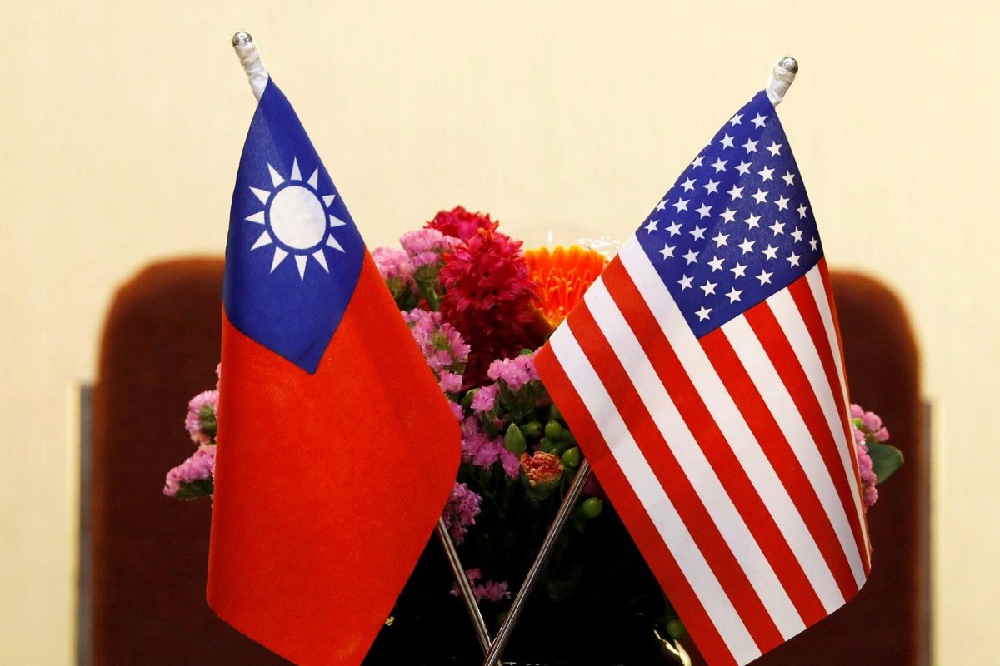
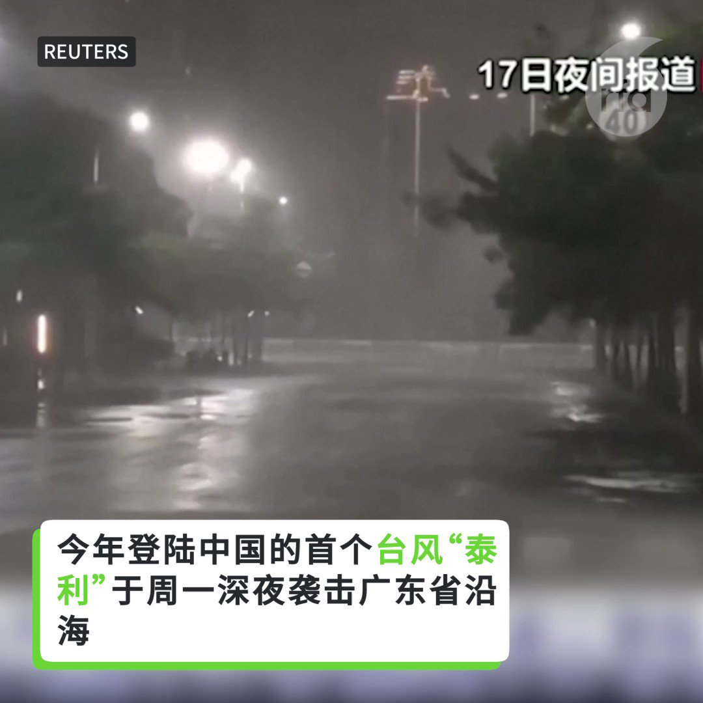
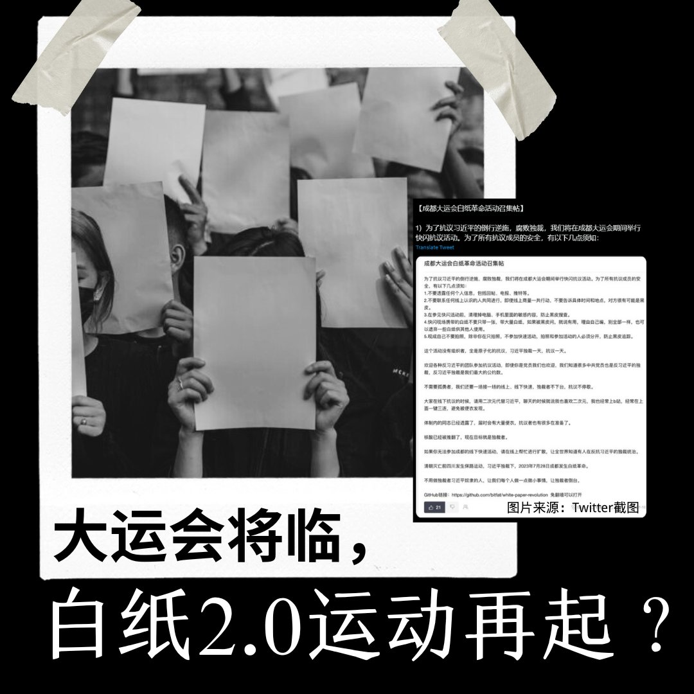

自由亚洲电台 北京时间 2023-07-19T07:00:09Z 1681438736553492480 【#亚太报道（2023-7-18）】
欢迎收听和订阅播客【亚太报道】 https://t.co/MjLNSvVMqc
#王毅 会晤 #美国气候特使克里 / #浙江删除火化数据 引发热议 / 美国议员针对 #新疆强迫劳动 提案 / 谁欠民众一个 #秦刚 下落的交代？/#长江存储 凸显中国芯片产业困境 https://t.co/ZWTaRrtqun   自由亚洲电台 北京时间 2023-07-19T10:07:30Z 1681485887350140929 RT @RFA_Chinese: 外媒追问中国外交部：

#秦刚 何时返回岗位？
他为什么缺席公开场合三周半？
与调查 #傅晓田 绯闻有关吗？
秦刚现在还是中国外长吗？
他现在的情况到底怎么样？ https://t.co/TKsbIZR6rk   自由亚洲电台 北京时间 2023-07-19T10:08:25Z 1681486115277078530 RT @RFA_Chinese: 【#亚太报道（2023-7-18）】
欢迎收听和订阅播客【亚太报道】 https://t.co/MjLNSvVMqc
#王毅 会晤 #美国气候特使克里 / #浙江删除火化数据 引发热议 / 美国议员针对 #新疆强迫劳动 提案 / 谁欠民众一个…   自由亚洲电台 北京时间 2023-07-19T10:24:31Z 1681490168279080960 RT @RFA_Chinese: 【欢迎加入自由亚洲电台电报群】https://t.co/UkKZmFSRkG https://t.co/Qid2LNZxJn   自由亚洲电台 北京时间 2023-07-19T10:24:38Z 1681490196783841281 【美台贸易倡议首批协定实施法案 美国国会过关】
据中央社报道，继美国众议院后，美国联邦参议院18日晚间以“一致同意”（unanimous consent）方式通过“#美台21世纪贸易倡议首批协定实施法案”（US-Taiwan Initiative on 21st-Century Trade First Agreement Implementation Act）。众议院稍早已于6月21日口头表决通过法案。法案正式送出国会后，将递交美国总统拜登签署后生效。https://t.co/oCsny6tO5y   自由亚洲电台 北京时间 2023-07-19T04:31:40Z 1681401373198548992 中国外交部长 #秦刚 目前已连续数周处于失踪状态。而有关他的下落，官方至今仍没有发布明确的信息。有观察人士认为，当局这种不透明的姿态可能蕴含某种政治用意。
本台记者王允 @Jeff23Wang 报道。

 https://t.co/k2CWa4reFw   自由亚洲电台 北京时间 2023-07-19T04:52:02Z 1681406495538434048 【恒大为什么能负债那么多?】
中国 #恒大 集团7月17日连发多份公告，两年净亏损超过8000亿元人民币，负债总额高达2.4万亿，震惊网民。由此引发了网民对 #银行借贷监管 的质疑。 https://t.co/D9wFGsZJvt   自由亚洲电台 北京时间 2023-07-19T04:59:34Z 1681408391959425024 【台风泰利发威】
今年登陆中国的首个台风“#泰利”于周一深夜袭击广东省沿海，广东省港口城市湛江遭遇强降雨和大风。受台风影响福建省出现不同程度的降雨，部分地区引发洪水。 https://t.co/AYMHf604kl   自由亚洲电台 北京时间 2023-07-19T05:30:01Z 1681416056311795713 台湾的副总统 #赖清德 八月将率团出席 #巴拉圭总统就职典礼，并会依惯例在美国过境。对此，美国国务卿 #布林肯（Antony Blinken）17日表示，赖清德前往巴拉圭的往返行程中将 #过境美国，这是例行性做法，中国没有理由以此作为挑衅行动的借口。
 https://t.co/OAHrN5d52k   自由亚洲电台 北京时间 2023-07-19T05:50:40Z 1681421252387569672 近日，中国共产党发布统计公报，宣布党员人数达9804.1万名。其中，2022年30岁以下党员数量和2021年相比减少15%。
您有分析，中国青年的入党人数为什么减少了？ https://t.co/b1G3sDIg3P   自由亚洲电台 北京时间 2023-07-19T05:52:16Z 1681421653195259905 世界大学生运动会7月28日将于四川成都揭幕。海内外网传“成都大运会白纸革命活动召集帖”，号召民众在赛事期间进行快闪抗议活动，“抗议习近平的倒行逆施，腐败独裁”，网上称之为“白纸2.0运动”。
您认为这样的行动有意义吗？预测会有什么效果？ https://t.co/9cRwWY8RgE   自由亚洲电台 北京时间 2023-07-19T06:00:01Z 1681423603919888384 7月18日，中国国防部长 #李尚福 会见到访的美国前国务卿 #基辛格，批评美国"不与中国相向而行"，导致两国关系陷入低谷。
与此同时，中国在印太地区构成的安全威胁也再次成为美国政界关注的焦点。

 https://t.co/5buVlAaUBO   自由亚洲电台 北京时间 2023-07-19T02:34:41Z 1681371933181624320 【#变态辣椒：不平等的烟民】
朝鲜当局正在打压在公共场所吸烟的女性，说她们"兴资灭无"。朝鲜公民表示，当局执法采取双重标准，只针对女性却不管男性。朝鲜传统上认为男人吸烟是天经地义，但却反对妇女吸烟。朝鲜最高领导人金正恩本人就烟瘾很大，在官媒上就经常可以见到他手持点燃的香烟。 https://t.co/Hk8biI25Sq   自由亚洲电台 北京时间 2023-07-19T03:59:24Z 1681393250710732800 #李尚福 在会晤中批评美方一些人“未同中方相向而行”。
#基辛格 则表示，他此行是作为“中国的朋友”而来。他强调，美中双方“应消除误解、和平共存、避免对抗”,  美中任何一方都承担不起把对方作为对手的代价。   自由亚洲电台 北京时间 2023-07-19T00:49:35Z 1681345483195977728 根据中国媒体财新网周一（7月17日）的报道，＃浙江省民政厅 早前在官方网站，公布第一季多项与民生相关的数据，在殡葬服务栏列出的 ＃火化遗体数字 为17.1万具，同比增加近73%，远高于2022年首季度的9万多具，但浙江省民政厅官网后来把相关数据下架。 https://t.co/OgVkuQjhiE   自由亚洲电台 北京时间 2023-07-19T01:33:00Z 1681356409785696257 继上月江西一所职校食堂曝出“#指鼠为鸭”事件后，中国广州一所职校日前又出现“指套为鸭”事件，引发舆论关注。

 https://t.co/c6PMh3lnAV   自由亚洲电台 北京时间 2023-07-19T02:02:40Z 1681363873776160768 评论 | #魏京生：#习近平 的救命稻草，间谍
 https://t.co/wVTEQO1Z0q   自由亚洲电台 北京时间 2023-07-19T00:10:49Z 1681335726372442112 本周二，正在北京访问的美国气候特使约翰·＃克里（John Kerry）与中国总理 ＃李强 和中共中央外办主任 ＃王毅 举行会晤。
王毅在谈到美中气候合作之外，还提出了所谓的“＃一中原则”，并要求美方妥善处理台湾问题

 https://t.co/1iLCKKvOq6   自由亚洲电台 北京时间 2023-07-19T00:14:48Z 1681336728357941249 本周二，多位美国参、众议员向国会提案，呼吁对支持和协助中国当局侵犯 #维吾尔 和其他少数族群人权的个人及实体实施二级制裁。
https://t.co/gyHF6dfvCj   