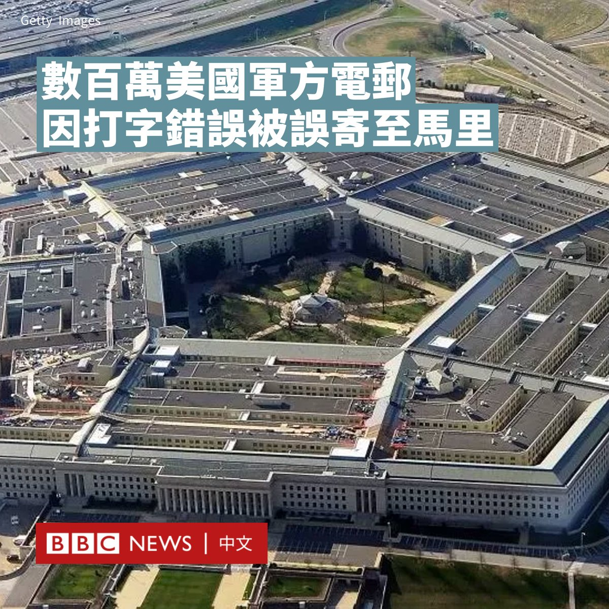
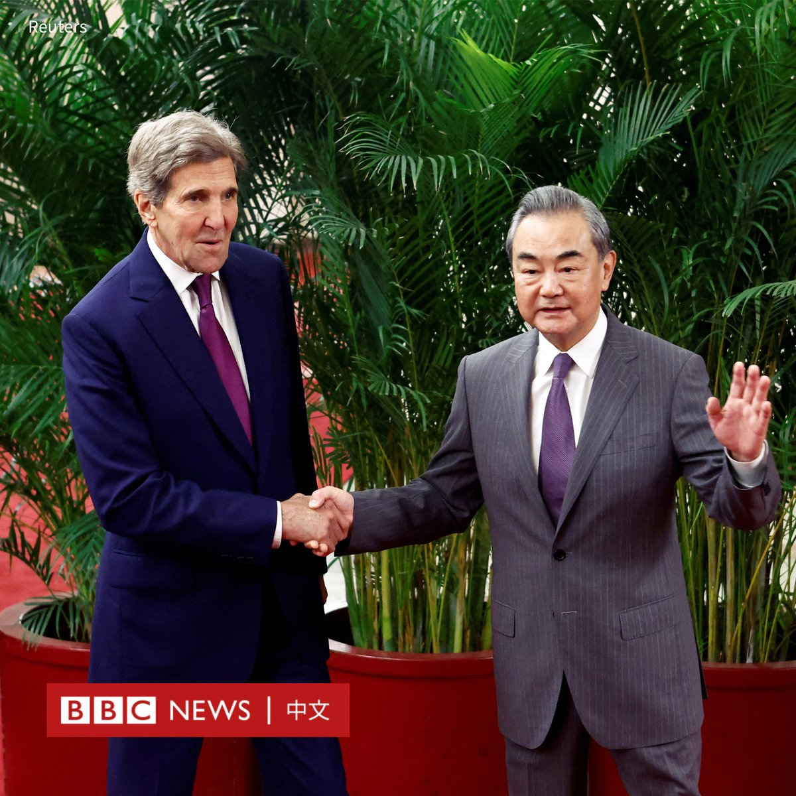
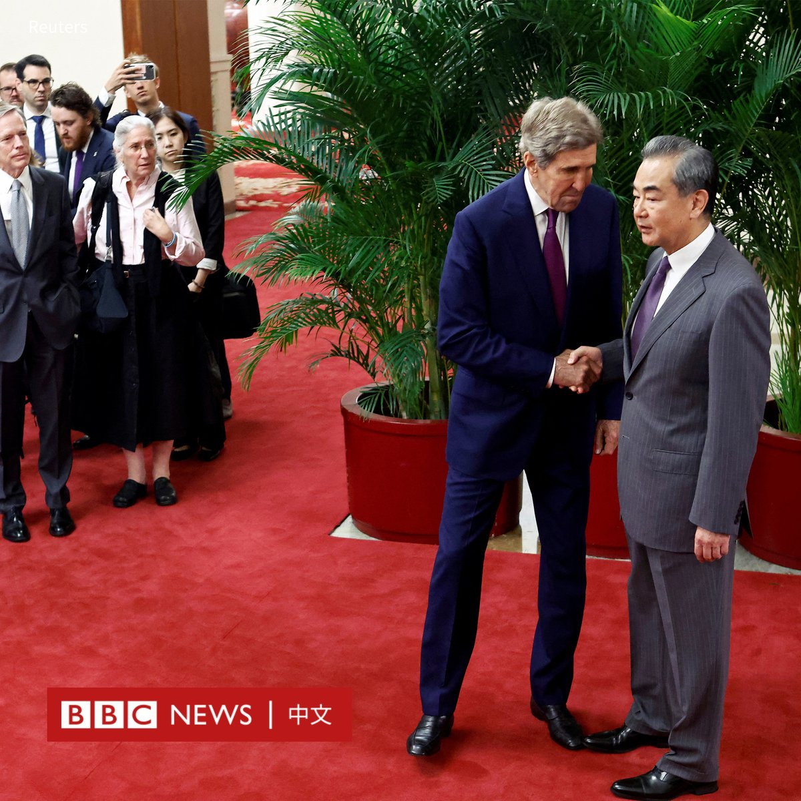
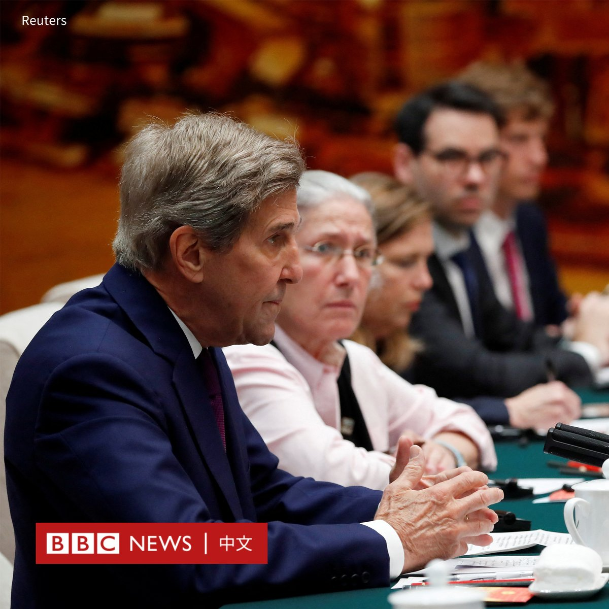
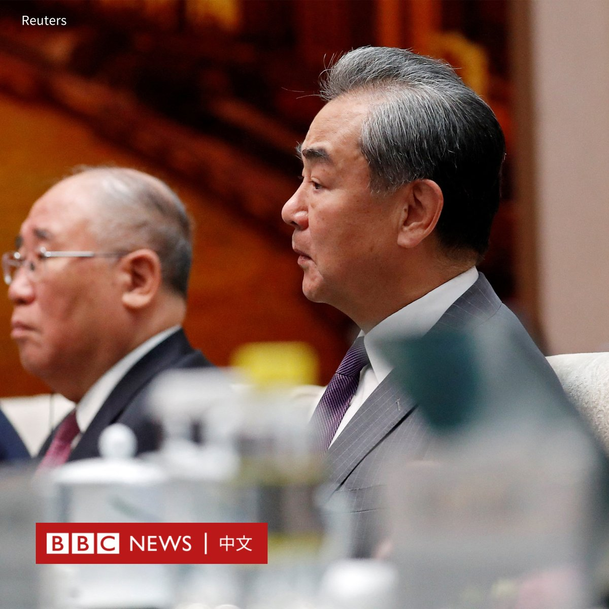
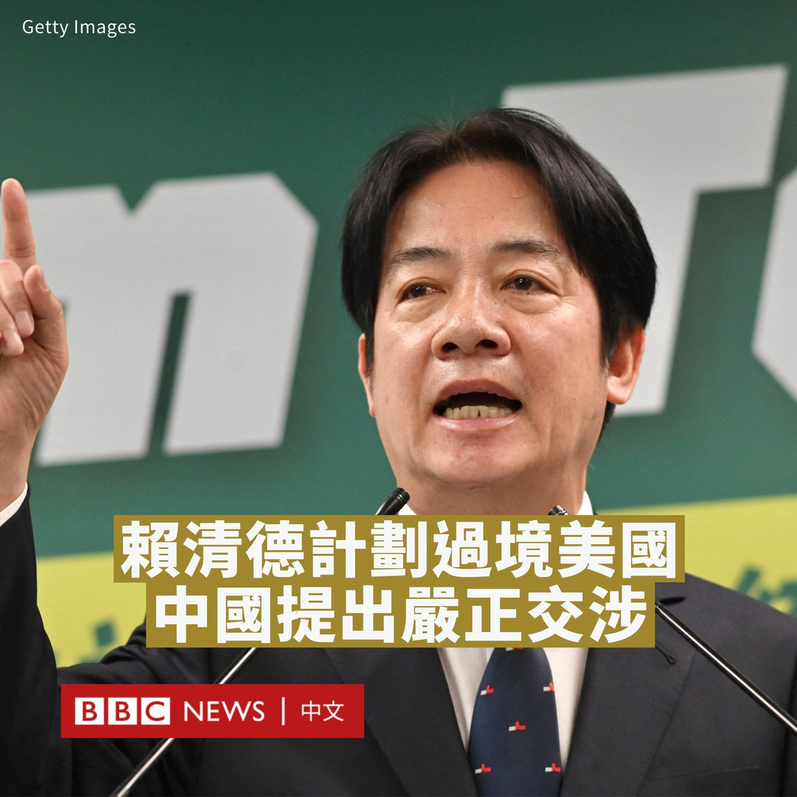

D英国广播公司BBC 北京时间 2023-07-18T12:30:44Z 1681159545295613952 打字时发生的一个小错误，导致数百万份美国军方电子邮件被错误地发送到了俄罗斯的盟友马里。

过去几年，由于少打了一个“i”，本应被发送到美国军方“.mil”域名的电子邮件被发送到马里后缀的邮箱，这个西非国家的域名是“.ml”。

据报道，其中一些电子邮件包含敏感信息，如密码、医疗记录和高级官员的行程安排。

五角大楼表示，他们已经采取措施解决这个问题。

据最先披露此事的《金融时报》报道，荷兰互联网企业家祖比尔（Johannes Zuurbier）在十多年前就已经发现了这个问题。

自2013年以来，他一直负责管理马里的国家域名，并在最近几个月里收集了数以万计的错误邮件。

虽然没有邮件被标记为机密，但据该报称，这些邮件包括医疗数据、美国军事设施地图、财务记录、官方出差计划文件以及一些外交信息。

祖比尔本月写信向美国官员发出警报。他表示，他与马里政府的合同即将到期，这意味着“风险是真实存在的，可能会被美国的对手利用”。

马利的军政府原计划于周一（7月17日）接管该域名。

据现任和前美国官员表示，标记为“机密”和“绝密”的美国军方通信是通过分开的IT系统传输的，因此不太可能被意外泄露。

但曾担任美国国土安全部情报法律部门高级法律顾问的史蒂文·斯特兰斯基（Steven Stransky）表示，即使是看似无害的信息，但如果包括个人详细信息，也可能被美国的对手利用。

美国国防部发言人向BBC表示，国防部已经意识到这个问题，并且正在认真对待。

他们表示，国防部目前已经设定将发送至域名“.ml”的邮件拦截，而且发件人会收到通知。   D英国广播公司BBC 北京时间 2023-07-18T10:29:10Z 1681128949953474560 美国气候特使约翰·克里（John Kerry）与中国最高外交官员、中共中央外事工作委员会办公室主任王毅周二（7月18日）在北京人民大会堂会晤。

此行是克里作为美国气候特使第三次访华，标志着两国高级别气候外交的恢复。这位前国务卿是过去一个月里访问北京的第三位美国高级官员。

此前，中美这两个世界上最大的碳排放国之间的气候谈判已中止了近一年。尽管两国在贸易、人权和其他问题上的紧张关系不断加剧，但北京和华盛顿希望在部分领域重建互信，包括在应对气候变化上展开合作。   D英国广播公司BBC 北京时间 2023-07-18T09:52:44Z 1681119783876714496 台湾副总统赖清德计划于8月过境美国。中国外交部回应称，已向美国“提出严正交涉”。

台湾外交部次长俞大㵢周一（7月17日）宣布，总统蔡英文指派副总统赖清德担任特使，8月将率团出席巴拉圭新任总统的就职典礼，期间赖清德将在美国过境。

随着中美在数月的针锋相对后试图恢复高层接触并稳定关系，而台湾一直处于两国紧张关系的中心，赖清德此行可能使两国纷争进一步复杂化。

美国国务卿安东尼·布林肯（Antony Blinken）证实了赖清德的访问计划，他表示其过境是“例行公事”，符合过往做法，因为包括赖清德本人在内的10位台湾副总统都曾途经美国。

布林肯表示：“中华人民共和国没有理由借故进行挑衅行径。”

然而北京有着不同的看法。中国外交部发言人毛宁周一表示，中国政府已就赖清德的过境向美国提出严重交涉，将采取“坚决有力措施”。

她说，中方坚决反对美台开展任何形式的官方往来，坚决反对台独分裂分子以任何名义、任何理由美台串联，坚决反对美方以任何形式纵容支持台独分裂分子。

63岁的赖清德是民进党在2024年总统选举的候选人，在大多数民调中都处于领先地位。他以对北京的强硬派路线而著称，北京则将其视为“台独分子”。

今年四月，蔡英文出访中美洲途中，在洛杉矶会见美国众议院议长凯文·麦卡锡（Kevin McCarthy），中国在台湾周围举行了军事演习。

本月初，赖清德曾在美国《华尔街日报》发表署名文章，提出台海和平的“四大支柱”（Four-pillar plan for peace），强调要加强台湾国防，两岸问题维持现状。

台湾主要反对党国民党候选人侯友宜尚未证实他是否计划访问美国。第三位候选人前台北市长柯文哲曾在今年四月访问美国。   