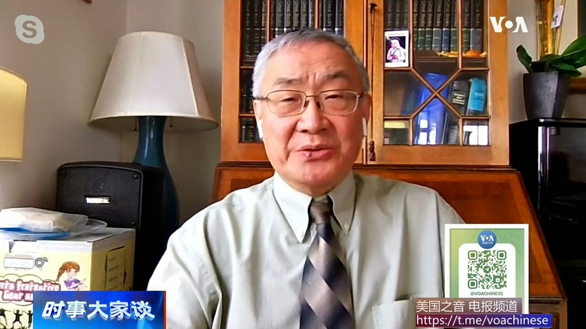
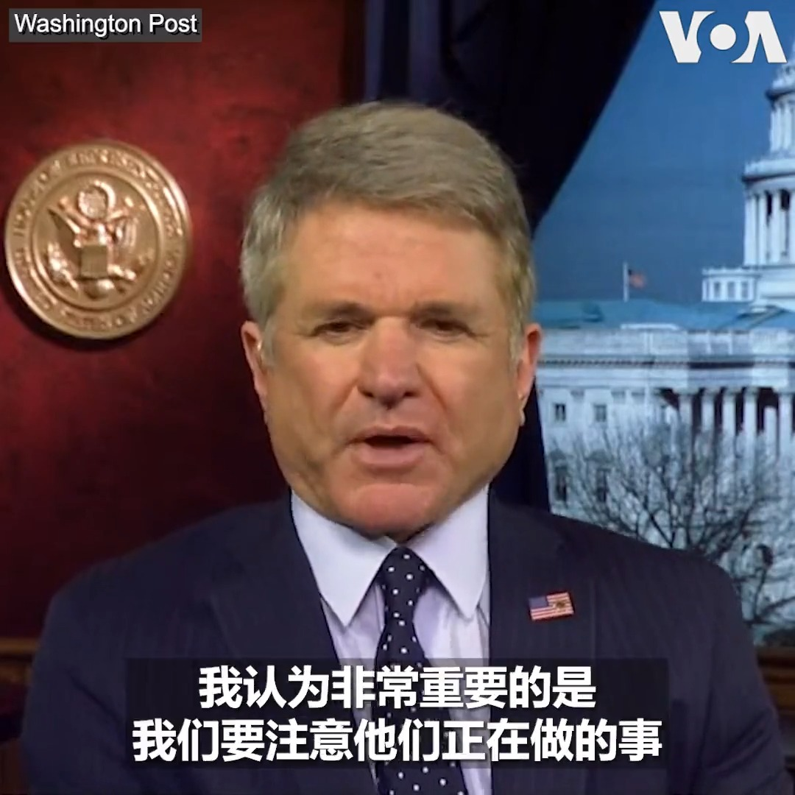
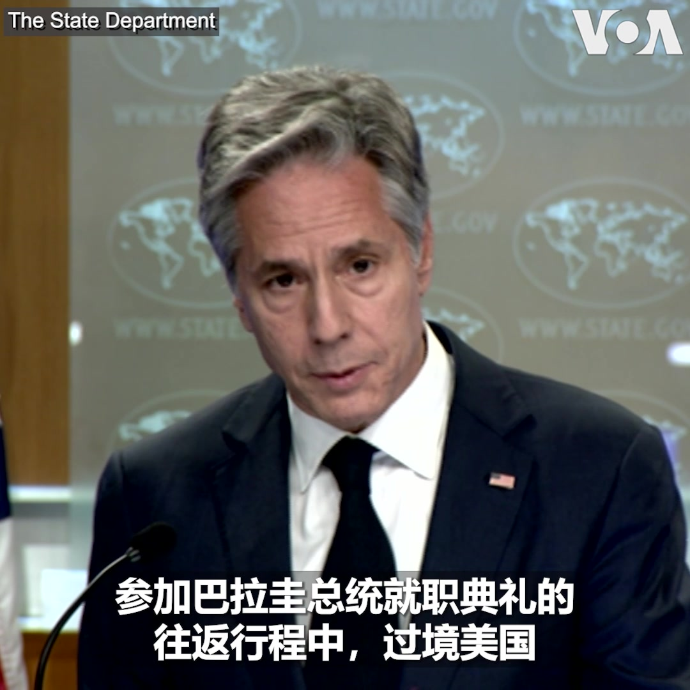
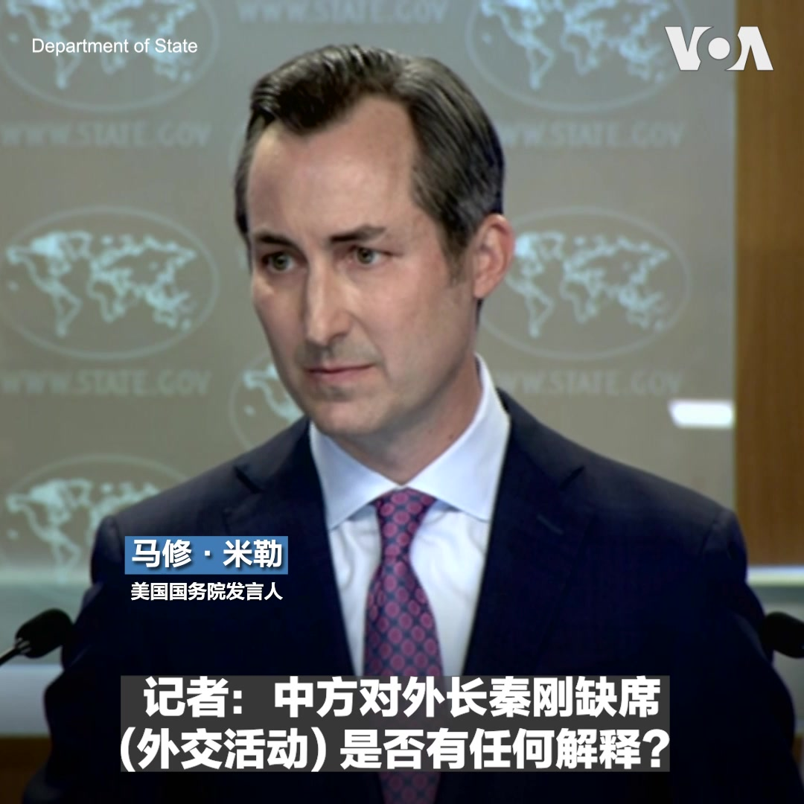
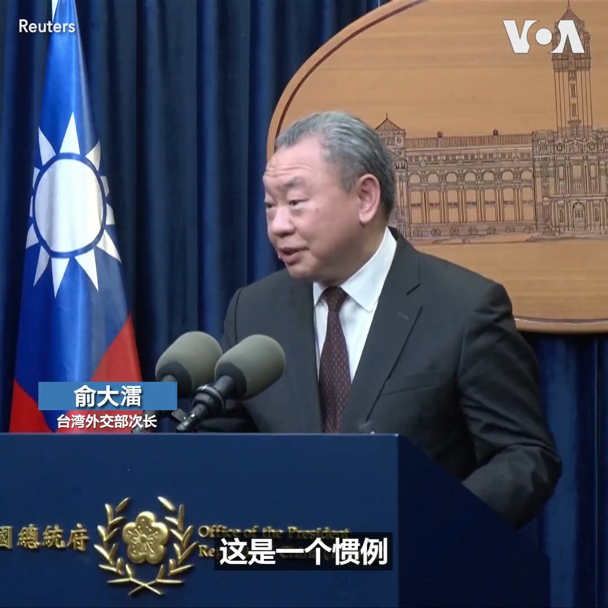

美国之音中文网 北京时间 2023-07-18T15:05:15Z 1681198428238524417 保育类石首鱼销往中国供不应求 拜登要求墨西哥加强禁捕措施 https://t.co/L5sIIoOpZl   美国之音中文网 北京时间 2023-07-18T16:06:03Z 1681213730405900288 克里见李强、王毅 呼吁借由气候合作重启美中合作关系 https://t.co/0L7yyHbh0W   美国之音中文网 北京时间 2023-07-18T13:48:35Z 1681179137929781250 美国芯片业者游说政府松手对中国制定更多出口限制 https://t.co/YHoqkJbUBY   美国之音中文网 北京时间 2023-07-18T10:35:00Z 1681130418123186176 第15届金砖国家领导人峰会定于8月22-24日在南非约翰内斯堡举行。预计吸纳新成员和“去美元化”以及建立金砖共同货币将是这届峰会的主要议题。为什么越来越多的国家寻求加入这个由中国和俄罗斯主导的组织？它会成为一个“反美”和“反西方”的阵营吗？报道内容：https://t.co/8KI1l9mhSk https://t.co/WlqyhWayzr   美国之音中文网 北京时间 2023-07-18T06:39:55Z 1681071258736181249 关于中国国务委员兼外长秦刚近来缺席外交活动，美国国务院发言人马修·米勒在7月17日的例行记者会上回答记者提问时表示，“他们说他正在处理健康问题”。https://t.co/4RqYMtD7Tv https://t.co/Vlpx7Axw0k   美国之音中文网 北京时间 2023-07-18T07:05:00Z 1681077570069237761 美国国务卿布林肯呼吁中国抓住美中关系缓和的势头，派遣高官员到华盛顿来，继续美中高层恢复交流对话的势头，但目前看来，北京的反应并不热烈，甚至十分冷淡。史汀生中心中国问题专家孙韵说，中国表面看来很倨傲，但究竟是强者的冷淡，还是弱者的无奈？ #时事大家谈完整版：https://t.co/6r7lRKLvVj https://t.co/j25AZYBBsc   美国之音中文网 北京时间 2023-07-18T07:05:05Z 1681077592689102849 扩员、去美元，“金砖五国”会蜕变成“反美”阵营吗？ https://t.co/zvNeVt2Jjc   美国之音中文网 北京时间 2023-07-18T07:22:05Z 1681081871395098624 枢机主教:教宗访问蒙古将展示他的奉献精神 https://t.co/1ZL2AsYIcF   美国之音中文网 北京时间 2023-07-18T07:22:09Z 1681081888717537281 美学者称《南华早报》删除了他文章中有关秦刚失踪的部分 https://t.co/uoM0OPUv0J   美国之音中文网 北京时间 2023-07-18T07:47:36Z 1681088293365243904 台湾副总统赖清德8月出访巴拉圭将在美停留 专家：过境规格与待遇可显示美对中发出的信号 https://t.co/miPITICW9L   美国之音中文网 北京时间 2023-07-18T08:00:01Z 1681091415840026625 中国一些经济学家和媒体也在担心，中国有可能出现日本1990年代“失去的十年” 并且有意无意地淡化日本“失去的十年”的后果和影响。但是美国三一学院经济系荣休教授文贯说，一旦中国出现日本上个世纪最后十年的通货紧缩和经济萧条，其就业、民生和社会维稳的压力将远超日本。完整版https://t.co/6r7lRKLvVj https://t.co/VQ4JgkIVgk   美国之音中文网 北京时间 2023-07-18T08:00:01Z 1681091416414453760 【家事国事天下事，你有何见解】先前看似获得当今中国“一尊”的习近平赏识和重用的中国外长秦刚突然消失。外交部发言人早前说其消失是因为生病，但后来又不再说生病，但也不说秦何时会复出。你认为秦刚如此消失能说明什么问题？不能说明什么问题？外交部发言人说秦刚下落时的为难又展示了什么？ https://t.co/T2dajKBLCK   美国之音中文网 北京时间 2023-07-18T08:34:34Z 1681100109352714241 中共外长秦刚消失超过3周，外交部发言人在多家外媒追问下竟无可奉告，秦刚究竟出了什么大事？以《红色赌盘》一书揭露中共高层金权交易秘辛的沈栋到美国国会听证，称习近平把在华美企当人质，他还在听证会中披露了哪些惊人内幕？美东时间周二上午9点【时事大家谈】欢迎留言参加讨论。 https://t.co/MQwkZqsCHC   美国之音中文网 北京时间 2023-07-18T08:46:34Z 1681103130086494208 伊斯兰圣战组织：巴勒斯坦安全部队在杰宁逮捕5名其成员 https://t.co/plDk5oMLvp   美国之音中文网 北京时间 2023-07-18T09:00:01Z 1681106514696708102 一键解锁#美国热搜 榜 1、经济衰退而官方数据光鲜，统计局要求正确理解宏观数据与微观感受的温差2、中国监控系统的软肋3、习近平新时代枫桥经验与群众路线4、巨资建高铁站客流不到百人5、人民对中国政府信任度网络调查6、大白沦为精神病人7、三代总书记的官场写真 https://t.co/asnoUW8Vz1 https://t.co/1j9R4S2Mep   美国之音中文网 北京时间 2023-07-18T09:18:04Z 1681111056528310272 以色列承认摩洛哥对西撒哈拉的主权 https://t.co/VkKaFCgweK   美国之音中文网 北京时间 2023-07-18T09:55:34Z 1681120495658475520 联合国秘书长与美国务卿批评俄退出谷物协议；莫斯科指责基辅袭击克里米亚大桥 https://t.co/eN7U9rYXlp   美国之音中文网 北京时间 2023-07-18T10:08:58Z 1681123867950034944 美国国会众院外交事务委员会主席麦考尔 @RepMcCaul 周一在参加《华盛顿邮报》的一场活动时表示，尽管近来中国经济复苏表现不如预期，但他相信习近平最在意的目标之一是 “是要恢复帝制中国和实现毛泽东的承诺“。“他和普京在这方面的心态相同，”麦考尔说。 https://t.co/1RS5EZOO6H   美国之音中文网 北京时间 2023-07-18T04:28:05Z 1681038079677849600 泰国联盟重申支持皮塔再次努力担任总理 https://t.co/qd8sbxtSx6   美国之音中文网 北京时间 2023-07-18T04:36:25Z 1681040177832116230 在乌克兰战争爆发前后逃离到立陶宛的乌克兰难民目前处境如何？美国之音记者在维尔纽斯探访了一些来自乌克兰第二大城市哈尔科夫的人。在一位立陶宛朋友的帮助下，这些从事不同工作的乌克兰人投入到“一人一故事”剧场，通过这种即兴戏剧表演的形式，帮助难民应对现实。 https://t.co/qojO9AX3P7   美国之音中文网 北京时间 2023-07-18T04:51:25Z 1681043951904595971 提到“坦克人”，人们想到的是89年天安门广场上阻挡坦克前进的那位中国男子。1991年1月在立陶宛遭苏联坦克镇压时，同样出现一位身挡坦克的人，美国之音记者莉雅专访这位坦克人-道诺拉维修斯医生（Dr. Daunoravicius），讲述这段至今仍令许多立陶宛人热烈盈眶的经历。请锁定美国之音收听收看专访内容。 https://t.co/1fwKFGE1vn   美国之音中文网 北京时间 2023-07-18T05:12:03Z 1681049144855764992 美参议院将就年度大规模国防支出法案进行辩论 https://t.co/ytRobJVSIj   美国之音中文网 北京时间 2023-07-18T05:21:34Z 1681051539841118208 拜登邀请以色列总理访问白宫 https://t.co/bxXdVjcTVZ   美国之音中文网 北京时间 2023-07-18T05:27:58Z 1681053153762983936 美国国务卿布林肯7月17日表示，台湾副总统赖清德前往巴拉圭的往返行程中将过境美国，这是例行做法，中国没有理由借此进行任何挑衅行为。此前，台湾总统府宣布，赖清德将于8月14日抵达台湾邦交国巴拉圭，代表台湾总统蔡英文参加当选总统贝尼亚的就职典礼。
报道： https://t.co/uljuezu1SF https://t.co/YNLX98SIqy   美国之音中文网 北京时间 2023-07-18T05:31:12Z 1681053965281288193 所罗门群岛领导人回击有关与中国安全关系加深的批评 https://t.co/FCeLmnKf6S   美国之音中文网 北京时间 2023-07-18T06:00:13Z 1681061267031613441 为什么美国现在急于跟中国缓和关系，恢复高层对话，甚至不惜放下身段，展示近乎一厢情愿的主动，像中国媒体所说，美方高层官员竞相“赶赴北京”，“跑步访华”？南卡大学商学院教授谢田说，中国官员享受美国官员竞相朝拜的感觉，而拜登政府重在了解对手。#时事大家谈完整版：https://t.co/6r7lRKKY5L https://t.co/CKKZUl9whV   美国之音中文网 北京时间 2023-07-18T06:05:00Z 1681062470868434944 关于中国国务委员兼外长秦刚近来缺席外交活动，美国国务院发言人马修·米勒在7月17日的例行记者会上回答记者提问时表示，“他们说他正在处理健康问题”。 https://t.co/qYUYX5LQCg   美国之音中文网 北京时间 2023-07-18T06:09:33Z 1681063616332849153 美国特使克里在中国会谈，呼吁就气候问题采取“紧急行动” https://t.co/PhbfWrakHi   美国之音中文网 北京时间 2023-07-18T04:02:43Z 1681031698052444160 乌克兰顿涅茨克地区的布霍罗登切尼村在是乌俄两军过去一年在乌地区进行拉锯战的主要战场之一。当地居民柳波乌·多洛申科在去年8月俄军占领这座村落前被迫撤离。多洛申科在乌军夺回布霍罗登切尼村后返回了家园。她在最近接受路透社采访时表示，自己不会再离开这里。 https://t.co/GBaJE8NUFc   美国之音中文网 北京时间 2023-07-18T04:03:34Z 1681031910896844800 布林肯告诫北京不要将台湾副总统计划在美停留当作采取挑衅行动的借口 https://t.co/bzskRyXhzC   美国之音中文网 北京时间 2023-07-18T00:47:59Z 1680982690890235904 西班牙17日遭受今年夏天的第三次热浪，许多城市气温高达40摄氏度。西班牙气象机构 AEMET警告说南部气温可能会达到44摄氏度。 AEMET说热浪可能会持续19日。 https://t.co/gaElUl9JbN   美国之音中文网 北京时间 2023-07-18T00:57:51Z 1680985175268769792 美国常驻联合国代表琳达·托马斯-格林菲尔德7月17日批评俄罗斯宣布中止执行黑海谷物倡议。她说，俄罗斯的决定将使全球粮食供应受到干扰。俄罗斯和乌克兰两国政府代表去年7月在土耳其签署黑海谷物倡议。该协议确保乌克兰可以通过黑海出口粮食。 https://t.co/IlTouCYPts   美国之音中文网 北京时间 2023-07-18T01:31:04Z 1680993532746797057 热浪席卷全球，吐鲁番盆地三宝镇刷新中国高温纪录 https://t.co/1cvglKHZgG   美国之音中文网 北京时间 2023-07-18T01:35:33Z 1680994662818144256 中共“宗教中国化”大动作：沙甸大清真寺面临拆改 https://t.co/bBCx2U7ZGp   美国之音中文网 北京时间 2023-07-18T02:04:03Z 1681001836218826753 台湾呼吁CPTPP对其申请入会案进行“迅速公平审核” https://t.co/9pO97qMosN   美国之音中文网 北京时间 2023-07-18T02:10:48Z 1681003532143427585 台湾副总统、民进党总统参选人赖清德计划下月参加巴拉圭新总统贝尼亚就职仪式时将过境美国访问；中国对此表达强烈不满；外交部发言人毛宁17日说已就此向美国提出交涉。台湾表示这是惯例，没有理由过度反应。 https://t.co/cUdtfGsJdM   美国之音中文网 北京时间 2023-07-18T00:03:34Z 1680971513632296964 气候变化对敦煌壁画等中国的世界文化遗产构成直接威胁 https://t.co/FKmKKDf1fN   美国之音中文网 北京时间 2023-07-18T00:18:04Z 1680975161376505862 香港餐馆业应对港府对日本水产品禁令忙于寻找替代货源 https://t.co/4p1v6EmSTi   