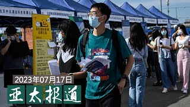
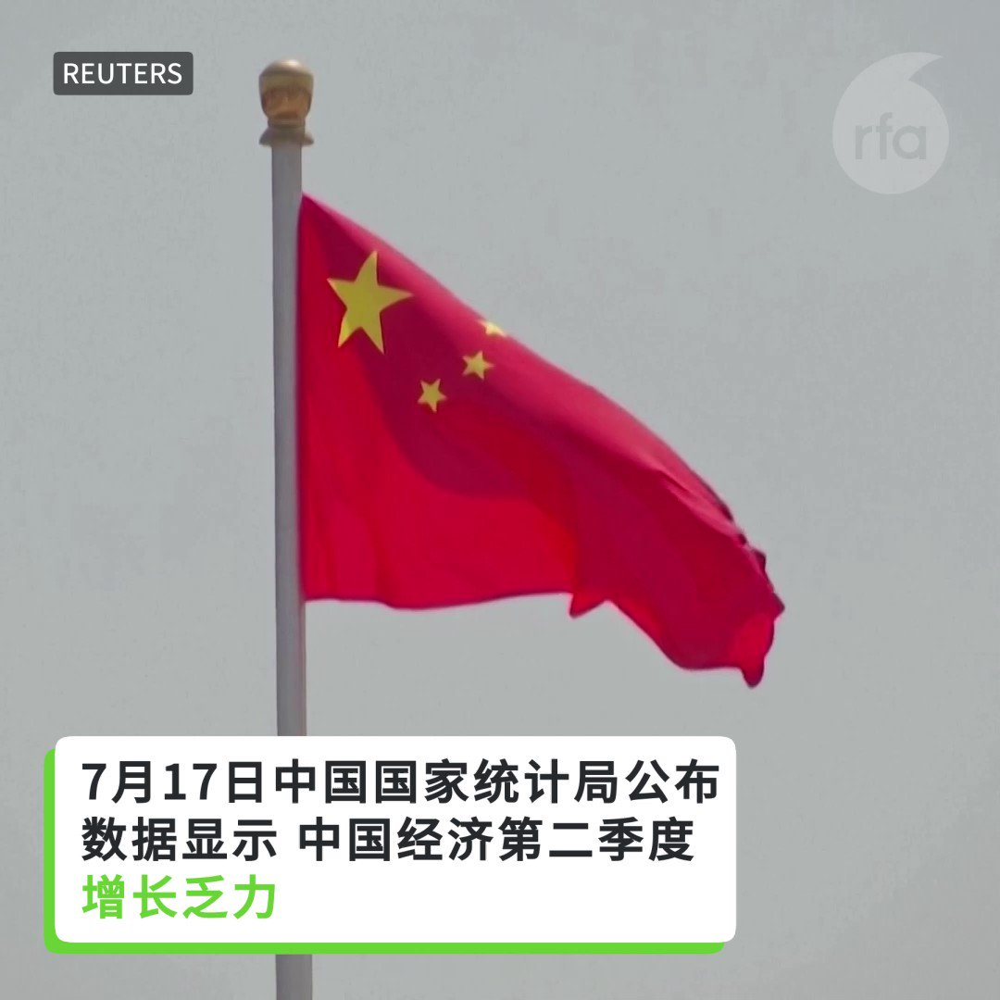
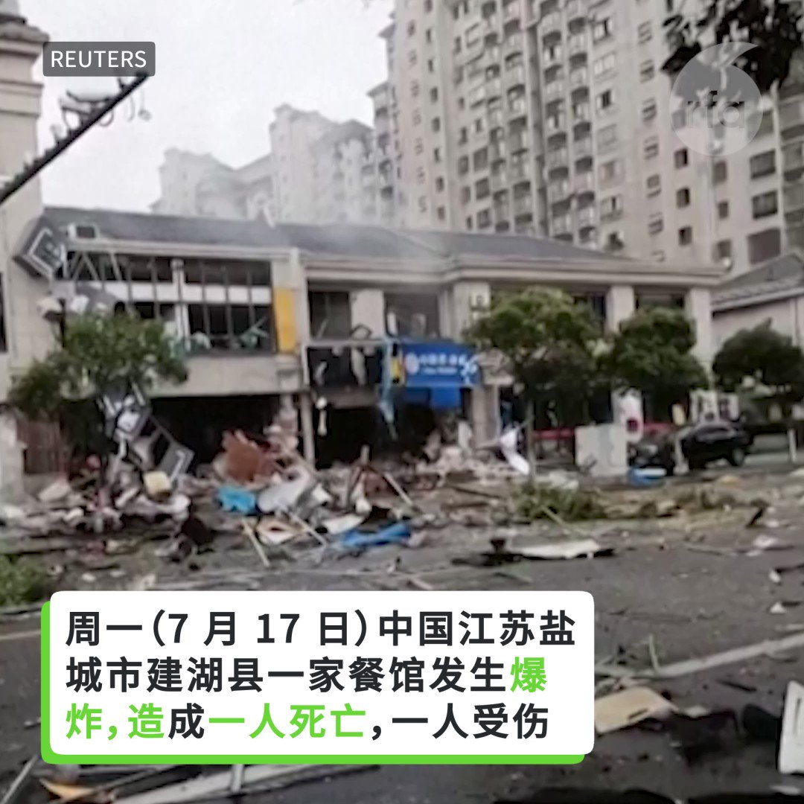
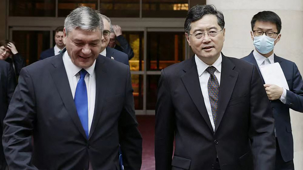

自由亚洲电台 北京时间 2023-07-18T05:21:48Z 1681051600054304769 原定7月10日上线的励志网剧《我的中国芯》出师未捷，上映前夕被临时叫停。

该剧以中国研发先进芯片、反制外国封杀为主题，在宣传阶段已引起很大争议。有人认为可弘扬民族精神，为中国芯片产业打气；有人质疑其“低级红，高级黑”，突显中国芯片技术“落后西方20多年”；还有人指其“造芯神剧”，“芯片没整出来剧先整出来了，是科幻片吧。”

您怎么看？   自由亚洲电台 北京时间 2023-07-18T06:29:55Z 1681068740929290241 专栏 | #夜话中南海：傅二奶事小，“秦二世“事大
#秦刚 #傅晓田 

 https://t.co/ynt0UYzSTh   自由亚洲电台 北京时间 2023-07-18T07:57:35Z 1681090805321326592 今年前六个月，中国整体上已创下了有记录以来最多的“#高温天气 日”（以超过35℃的天数来衡量）。

 https://t.co/9ZxmyiUtMd   自由亚洲电台 北京时间 2023-07-18T08:03:36Z 1681092319901286400 【#亚太报道（2023-7-16）】
欢迎收听和订阅播客【亚太报道】 https://t.co/MjLNSvVMqc

中国 #第二季度GDP 增幅低于预期 / 中国 #青年失业率 逐月上升 / #克里 与 #解振华 在北京会晤 / 歌手“#疯狂老张”遭中国当局恐吓 / 台湾社会进入大选前政治热身 https://t.co/QBScDCYOb6   自由亚洲电台 北京时间 2023-07-18T09:40:37Z 1681116733082411010 RT @RFA_Chinese: 【谁说我是 #独裁者？｜“#动物庄园”动画剧场】
⻰家宪法第一章写得明明白白,⻰家的政体是“#人⺠⺠主专政 ”——people's democratic dictatorship。
问题来了，既然是广大人⺠的无产阶级独裁, 为什么又变成大红龙一…   自由亚洲电台 北京时间 2023-07-18T09:40:51Z 1681116792637345792 RT @RFA_Chinese: 【#亚太报道（2023-7-16）】
欢迎收听和订阅播客【亚太报道】 https://t.co/MjLNSvVMqc

中国 #第二季度GDP 增幅低于预期 / 中国 #青年失业率 逐月上升 / #克里 与 #解振华 在北京会晤 / 歌手“#疯…   自由亚洲电台 北京时间 2023-07-18T09:42:47Z 1681117280275398656 RT @RFA_Chinese: 专栏 | #夜话中南海：傅二奶事小，“秦二世“事大
#秦刚 #傅晓田 

 https://t.co/ynt0UYzSTh   自由亚洲电台 北京时间 2023-07-18T09:48:45Z 1681118781312237568 美国《华尔街日报》17日发文，从多方面透视中国经济的严峻形势。文章说，虽然中国今年报告的经济增长总体上稳健，但在许多中国人看来，感觉更像是“经济陷入了衰退”。

 https://t.co/zUq6IwrJiB   自由亚洲电台 北京时间 2023-07-18T10:05:45Z 1681123058910674944 RT @RFA_Chinese: 原定7月10日上线的励志网剧《我的中国芯》出师未捷，上映前夕被临时叫停。… https://t.co/8FR14Bzvdw   自由亚洲电台 北京时间 2023-07-18T10:06:27Z 1681123233641164800 RT @RFA_Chinese: 【外长继续消失中】
https://t.co/mgxsGXiCYG
在周一(17日)的外交部例行记者会上，英国《金融时报》记者问及秦刚何时返回工作岗位时，外交部发言人 #毛宁 表示，没有可以提供的讯息。

记者追问：“《泰晤士报》报道 #秦刚…   自由亚洲电台 北京时间 2023-07-18T10:07:28Z 1681123490336743424 RT @RFA_Chinese: 【流亡美国的中国创作歌手讽习】
【遭中国当局越洋威吓】
流亡美国的中国创作歌手“Crazy老张”（疯狂老张）的最新作品，内容触及当下中国的社会现象，引起广泛回响，却也因而触动中国当局的神经。近日“Crazy老张”先后遭中国不同政府部门恫吓，他表…   自由亚洲电台 北京时间 2023-07-18T04:35:10Z 1681039863402070016 美国民间人权组织"#公民力量"创办人 #杨建利 近日受意大利参议员圣阿加塔·朱利奥（Terzi di Sant´Agata Giulio）邀请，将于7月19日去意大利出席对中国"#一带一路"项目的评估会议。杨建利周一接受本台记者王允 @Jeff23Wang 专访，呼吁国际社会建立以价值观为基础的 #经济北约。 https://t.co/dZrpIY6cLZ   自由亚洲电台 北京时间 2023-07-18T04:42:25Z 1681041690633859072 #事实查核｜#秦刚 遭外交部官网除名了吗？
 https://t.co/Q1Zds9643U   自由亚洲电台 北京时间 2023-07-18T04:59:10Z 1681045903233388544 评论 | 胡平 @huping1：#秦刚 怎么啦？
 https://t.co/BS64fMYaHM   自由亚洲电台 北京时间 2023-07-18T05:25:14Z 1681052464240263168 7月17日，中国国家统计局公布的数据显示，中国经济第二季度增长乏力 https://t.co/R9n1lWwooX   自由亚洲电台 北京时间 2023-07-18T05:30:01Z 1681053666290302976 随着中国的毕业季来临，今年6月份，中国16-24岁 #青年人失业率 已经高达21.3%。如此高的青年失业率，究竟和 #毕业季 有多大关系？中国国家统计局新闻发言人和接受本台采访的中国青年，给出了不同的答案。

 https://t.co/xu8EA9oMGq   自由亚洲电台 北京时间 2023-07-18T02:47:10Z 1681012686207832064 【外长继续消失中】
https://t.co/mPzATIP6vW
在周一(17日)的外交部例行记者会上，英国《金融时报》记者问及秦刚何时返回工作岗位时，外交部发言人 #毛宁 表示，没有可以提供的讯息。

记者追问：“《泰晤士报》报道 #秦刚 不见踪影，涉及他被调查与凤凰卫视女记者傅晓田有婚外情，#傅晓田 最近在美国分娩，你有何评论？”

发言人毛宁回应称：“我不了解你所说的情况。”

记者又问：“秦刚现时是中国外长吗？他现况如何？何以几个星期都没有露面？”

毛宁回答说：“你的第一个问题，建议你查阅中国外交部的网站，我也没有其他更多的信息，可以提供。”

在中国外交部的官网上，秦刚作为外交部部长的网页仍然维持不变。   自由亚洲电台 北京时间 2023-07-18T03:02:57Z 1681016657282572292 【江苏盐城烧烤店爆炸 1死1伤】
中国江苏盐城市建湖县一烧烤店发生爆炸，造成一死一伤，事故原因为煤气罐阀门未关导致煤气泄漏。 https://t.co/MJAMdVz03f   自由亚洲电台 北京时间 2023-07-18T03:32:48Z 1681024170891816960 麦考尔说，在美国《国防授权法》和即将投票的《国防拨款法案》中，均授权军方增加用来与中国竞争所需的海军舰艇配额“我们不会向中国出售在先进武器系统中使用的设备和技术...我们会让他们知道，如果真的入侵台湾，不仅会有军事后果，还会有经济后果，让习近平三思而后行。” https://t.co/Jg9ZKLP6PP   自由亚洲电台 北京时间 2023-07-18T04:06:12Z 1681032575991820288 #克里 周日抵达北京后，与中国气候变化事务特使 #解振华 共进晚餐，7月17日早上正式展开会谈。首日会谈时间长达4个小时。

 https://t.co/GFLZKCeDXR   自由亚洲电台 北京时间 2023-07-18T01:26:10Z 1680992301261389824 被港府悬红通缉、人称“揽炒巴”的 #刘祖迪 现居英国，他认为英国外交部发出的“外交照会”，意味 #英国 政府行动的升级。

 https://t.co/IWcGvmARhE   自由亚洲电台 北京时间 2023-07-18T02:20:23Z 1681005943109058560 【外长继续消失中】
在周一(17日)的外交部例行记者会上，英国《金融时报》记者问及秦刚何时返回工作岗位时，外交部发言人 #毛宁 表示，没有可以提供的讯息。

记者追问：“《泰晤士报》报道 #秦刚 不见踪影，涉及他被调查与凤凰卫视女记者傅晓田有婚外情，#傅晓田 最近在美国分娩，你有何评论？”

发言人毛宁回应称：“我不了解你所说的情况。”

记者又问：“秦刚现时是中国外长吗？他现况如何？何以几个星期都没有露面？”

毛宁回答说：“你的第一个问题，建议你查阅中国外交部的网站，我也没有其他更多的信息，可以提供。”

在中国外交部的官网上，秦刚作为外交部部长的网页仍然维持不变。   自由亚洲电台 北京时间 2023-07-18T00:04:25Z 1680971729714450432 “落实居住正义，唤回司法正义！”距离2024年1月13日台湾的总统大选只剩不到6个月，上万名民众在7月16日顶着烈日、身穿白衣，聚集在总统府前的凯道上，参加网红“馆长”#陈之汉、前时代力量党籍立委 #黄国昌 举办的“#公平正义救台湾”集会，展现“白色力量”。

 https://t.co/9bbsk68bVh   