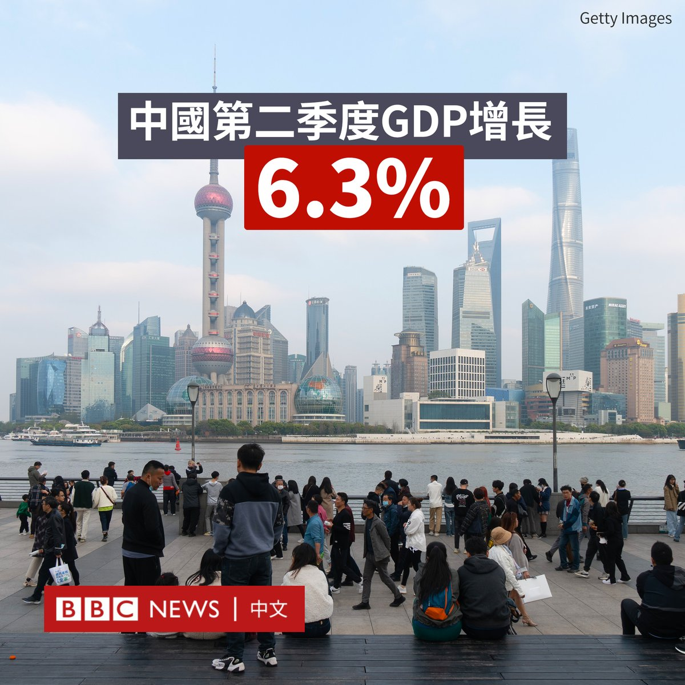

D英国广播公司BBC 北京时间 2023-07-17T10:52:13Z 1680772363728855040 中国官方数据显示，该国第二季度GDP同比增长6.3%，增幅大于第一季度的4.5%，但不及市场预期。

由于该数据为跟上一年同期进行比较，而去年二季度中国经济由于多地疫情封锁导致的停工而严重受挫，基数较低。

按环比看，第二季度GDP环比增长0.8%；先前第一季度环比增长2.2%。

中国国家统计局宣布，中国上半年GDP同比增长5.5%。

中国在去年12月放开疫情限制措施。但由于国内需求疲软、出口萎缩和房地产低迷等多重因素，中国经济复苏势头仍显乏力。

此外，中国6月份规模以上工业增加值同比实际增长4.4%；6月份16至24岁的青年失业率为21.3%；上半年全国房地产开发投资同比下降7.9%。   D英国广播公司BBC 北京时间 2023-07-17T08:48:22Z 1680741194580787200 “日本对她们犯下了非常严重的罪行。世界不应该忘记这一点，日方该为此付出代价。”

在马帕尼奇这个菲律宾的乡村，大约有20多位妇女，是菲律宾的最后一批慰安妇幸存者。现在她们已经80或90多岁，仍为了从日本获得公开道歉和赔偿而奋斗。

https://t.co/MPvhyFqUWU   