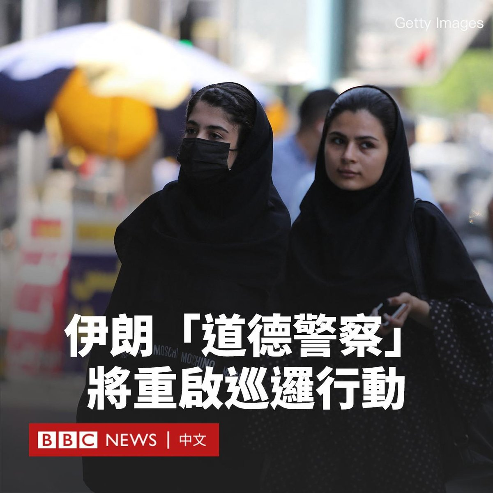
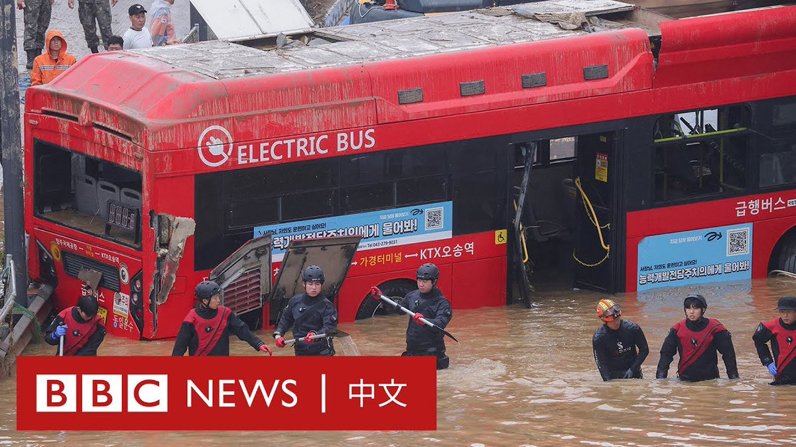
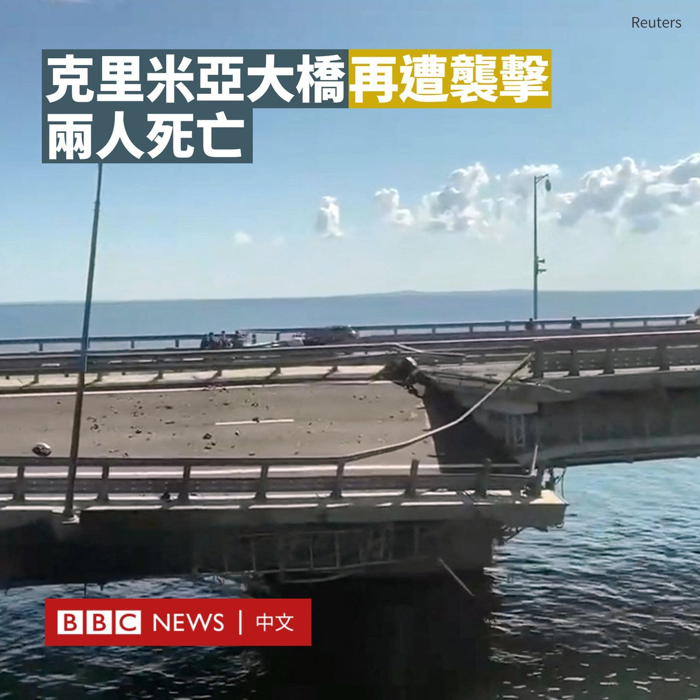
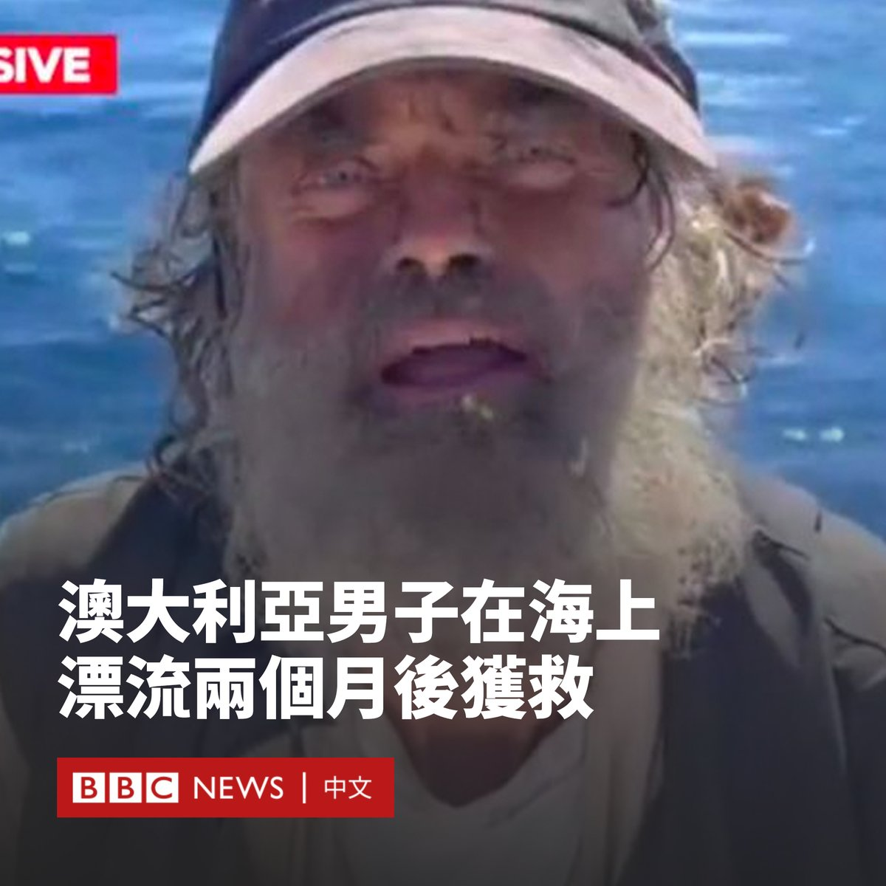
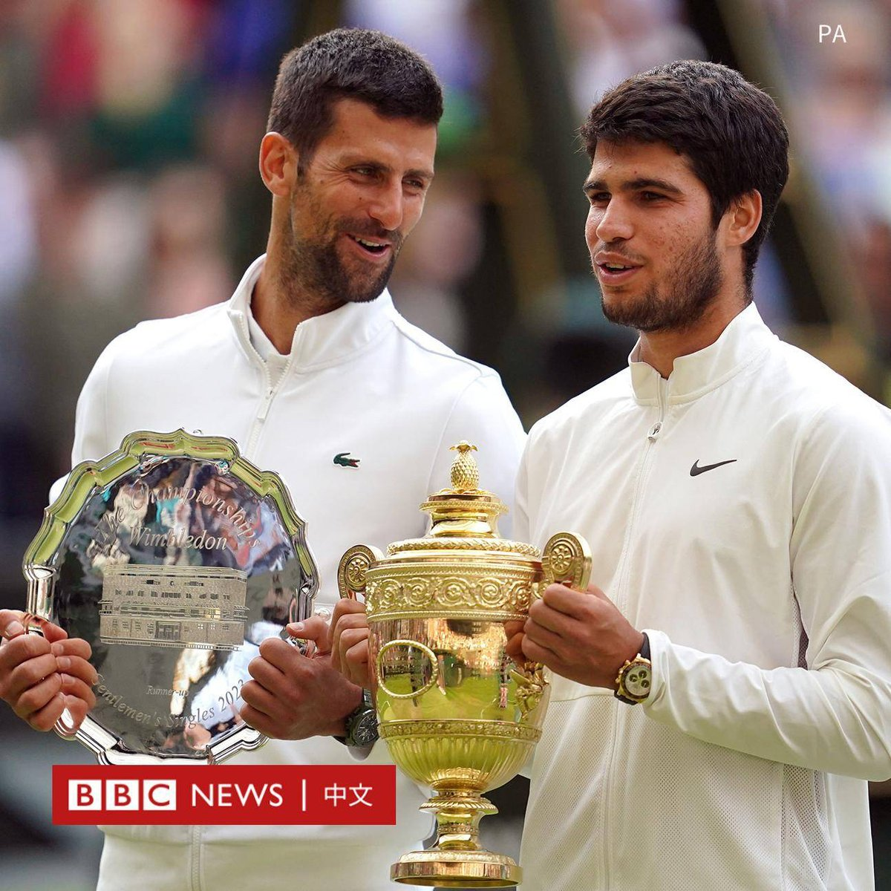
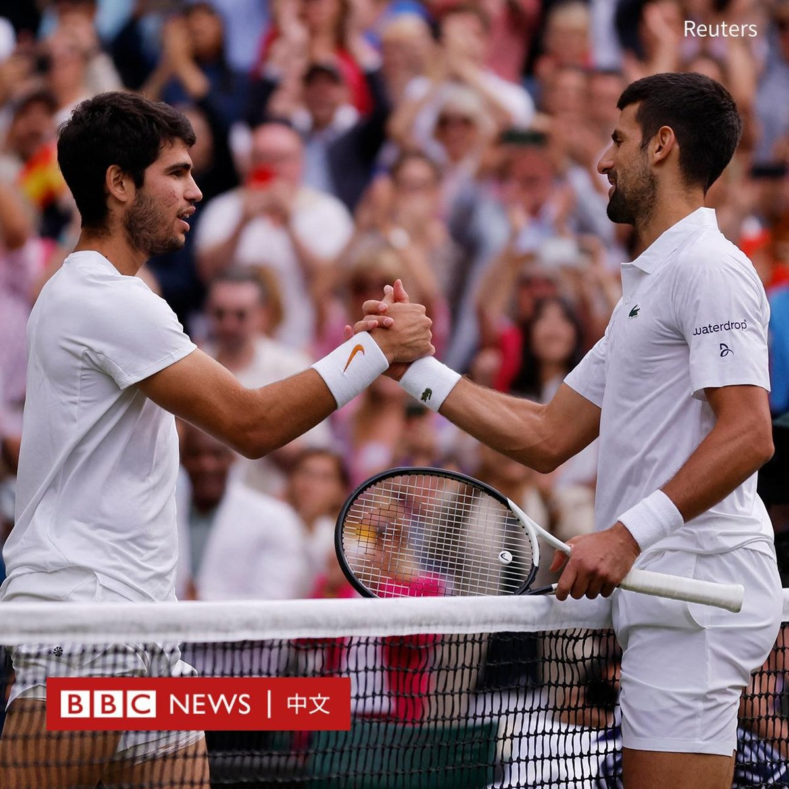
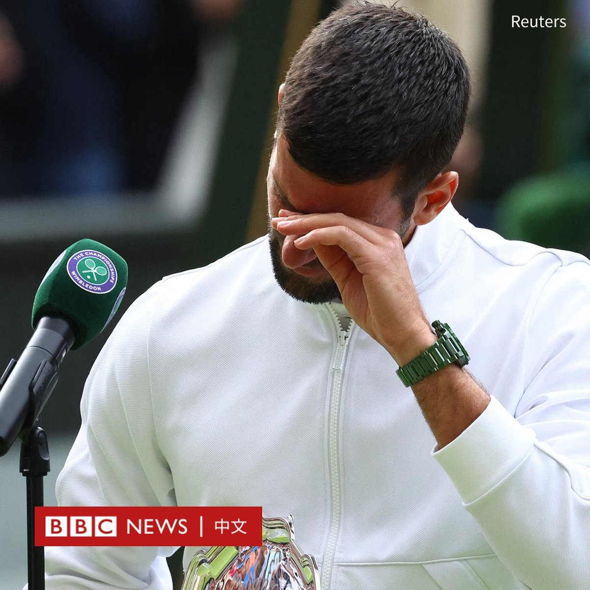
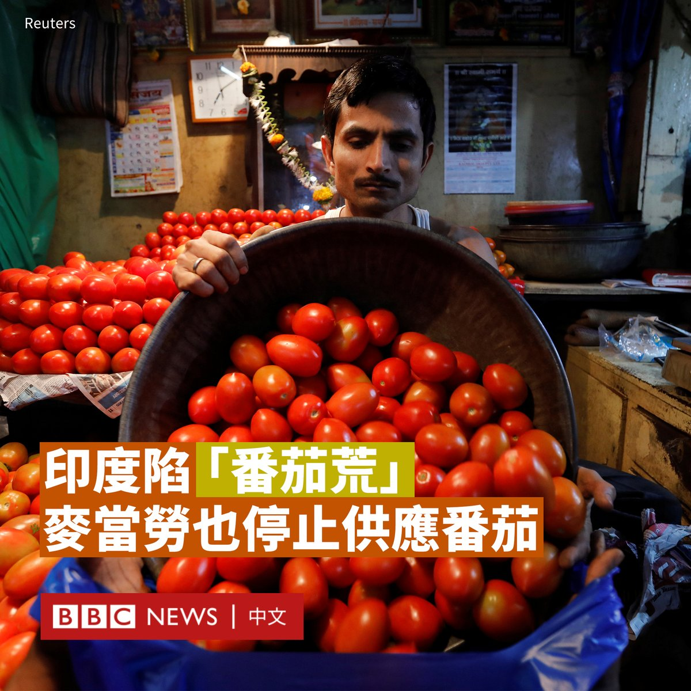

D英国广播公司BBC 北京时间 2023-07-17T19:49:07Z 1680907479285370880 据伊朗官方媒体报导，伊朗“道德警察”将恢复有争议的巡逻行动，以“确保女性遵守着装规定，在公共场合佩戴头巾”，并对违规女性作出警告或拘留。

伊朗“道德警察”的正式名称是指导巡逻队。1979年，伊朗伊斯兰革命胜利后，当局要求所有女性在公共场所均需佩戴头巾。2005年，独立的指导巡逻队组建。

十个月前，22岁的伊朗女子阿米尼（Mahsa Amini）因涉嫌未正确佩戴头巾，被指导巡逻队逮捕，在拘留期间疑遭刑讯后身亡，引发伊朗大规模抗议活动，“道德警察”一度从街头消失。

然而，伊斯兰强硬派一直要求恢复巡逻行动。该国的解释是基于伊斯兰法规，妇女必须用头巾遮盖头发，穿着宽松的长袍来掩盖身材。

“道德警察”的任务是确保人们遵守规定，并拘留那些被视为“不当”着装的人。

警方发言人表示，在巡逻期间，警察将首先警告不遵守规定的妇女。如果他们不听从命令，警方可能会选择“法律行动”。   D英国广播公司BBC 北京时间 2023-07-17T20:38:25Z 1680919886250512384 韩国连日的暴雨在各地引发洪灾，全国已有至少40人死亡、数千人被疏散。

周六（7月15日），中部清州市的防洪堤溃堤导致附近隧道的开车民众被泥水困住，搜救团队已寻获至少13具遗体。许多失踪者家属与当地民众批评政府的对应不足。

韩国媒体报导，河流管制相关单位曾在隧道淹水几小时前发布洪水警告，但政府并没有关闭隧道或管制周边交通。   D英国广播公司BBC 北京时间 2023-07-17T16:31:26Z 1680857728896626689 连接被占领的克里米亚半岛和俄罗斯的刻赤大桥遭到袭击。据俄媒报导，事件造成一对夫妇死亡。

有报道称，在周一（7月17日）凌晨，该大桥发生了两起爆炸。

经过核实的影片显示桥梁路面受损。但尚不清楚支撑桥梁的结构是否也有损坏。

俄占克里米亚首脑谢尔盖·阿克肖诺夫（Sergey Aksyonov）宣布桥梁因“紧急状况”，需暂停通行。

俄罗斯外交部发言人玛丽亚·扎哈罗娃（Maria Zakharova）指责乌克兰是桥梁袭击的幕后黑手，并声称美国和英国情报部门向基辅提供了援助。

莫斯科说，大桥的路基受损。俄罗斯国家反恐委员会声称，这次袭击是由两架乌克兰海军无人机实施的。

乌克兰安全部门的一名消息人士告诉BBC俄语部，这次袭击是“乌克兰武装部队海军和乌克兰安全部门的一次特殊行动”。

目前，大桥的公路段已关闭，但铁路段仍有火车行驶。

2014年，俄罗斯吞并了克里米亚。这座桥于2018年开通，其将克里米亚与俄罗斯本土相连接。去年10月，该大桥在一次爆炸后部分关闭，直到今年2月才完全重新开放。   D英国广播公司BBC 北京时间 2023-07-17T18:05:37Z 1680881431138951168 如果按照环比算，中国二季度GDP仅增长0.8%，而第一季度环比增长为2.2%，体现出经济复苏放缓的趋势。
https://t.co/YDaE1M56FQ   D英国广播公司BBC 北京时间 2023-07-17T15:39:06Z 1680844559667044353 一名澳大利亚水手在太平洋上靠吃生鱼和喝雨水生存了两个月。医生表示，目前他“状况稳定，情况良好”。

51岁的悉尼居民蒂姆·沙多克（Tim Shaddock）和他的狗“贝拉”（Bella）于4月乘船离开墨西哥，前往法属波利尼西亚，但几周后他们的船在风暴中受损。

直到本周，他们幸运地被一架直升机发现，一艘拖网渔船将他们救起。

这艘金枪鱼拖网渔船上的医生告诉澳大利亚媒体，该男子“生命体征正常”。

此前，沙多克从墨西哥的拉巴斯出发，计划开始长达6000多公里的航行，但由于恶劣天气，船上的电力被切断，他很快就陷入困境。

这名水手和他的狗开始在广阔汹涌的北太平洋中漂流。

两个月后，当他们最终在墨西哥海岸附近被发现时，他瘦了很多，胡子拉碴。

“我在海上经历了非常艰难的磨难。”他说道。他称，船上的渔具帮助他生存下来，他还曾躲在船篷下，避免被晒伤。   D英国广播公司BBC 北京时间 2023-07-17T14:13:51Z 1680823104719949824 温布尔登网球男单决赛于周日（7月16日）举行，20岁的西班牙球王卡洛斯·阿尔卡拉斯（Carlos Alcaraz）击败了男单史上最多23座大满贯冠军、在温网已经夺取34连胜的诺瓦克·德约科维奇（Novak Djokovic），首次赢得温网男单冠军。

这场“世纪对决”历时约五小时，经过五盘大战，最终阿尔卡拉斯以1:6 、7:6（8:6）、6:1、3:6、6:4取胜。

36岁的德约科维奇本想取得五连霸，赢得职业生涯的温网第八冠，以及夺得第24座大满贯冠军，这些都是创纪录的成绩。

这次是阿尔卡拉斯继去年美国网球公开赛后的第二座大满贯，首夺这项传统锦标。

阿尔卡拉斯表示为自己感到骄傲：“在这个阶段击败处于最佳状态的诺瓦克，创造历史，成为打败在球场上保持10年不败的人，对我来说太棒了。”

在座无虚席的中心球场，包括威尔士亲王和王妃（Prince and Princess of Wales）、演员布莱德·彼特（Brad Pitt）和两届冠军得主安迪·穆雷（Andy Murray）都起立为新科冠军喝彩。

按照传统，阿尔卡拉斯从球场的楼梯上跑到自己的包厢，与教练胡安·卡洛斯·费雷罗（Juan Carlos Ferrero）以及他的家人和朋友拥抱。

德约科维奇在场上发言时流泪，他表示输掉比赛是“难以接受的”，但他会“继续前进”。

“当你离它这么近的时候，这很难让你接受。”他说：“我输给了一个更好的球员，我必须恭喜他，然后继续前进，希望变得更强。”   D英国广播公司BBC 北京时间 2023-07-17T11:54:54Z 1680788138745298944 在印度，有关番茄的争论不再是它是水果还是蔬菜，而在于它变得贵得离谱，甚至在最近，印度北部和东部的麦当劳（McDonald’s）食品里也不再有番茄。

麦当劳表示，这是“由于季节性作物问题”，优质番茄（西红柿）供不应求，因此汉堡和卷饼中不再使用番茄。

在德里的两家麦当劳店内张贴的告示写道：“尽管我们尽了最大努力，但仍无法获得通过我们严格质量检查的足够数量的番茄。”

在过去几周里，番茄的价格一直在急剧攀升，部分地区目前的价格接近每公斤200卢比（3美元），而往常仅需40至50卢比。

具有讽刺意味的是，近两个月前，印度的番茄批发市场供过于求，价格跌至每公斤2至3卢比，农民将成箱的番茄倾倒在路上。

番茄是印度食物中几乎必不可少的食材，几乎每道菜都有番茄。因此，当它变得稀缺和昂贵时，它成为头条新闻甚至政治争论的主题。

在印度西部城市浦那，一名商贩和顾客因250克番茄的价格产生争执后，小贩涉嫌用磅秤打了这名顾客的脸。

在被称为印度教圣城的瓦拉纳西，有人雇佣了两名保镖，以防止人们在其商店里就番茄价格讨价还价。

还有报道称，有人从田地里偷番茄，并劫持装满番茄的卡车。

政府将番茄价格上涨归咎于季风强降雨扰乱了运输和分销，导致歉收。近几个月来，消费者还一直面临牛奶和香料等商品的涨价。

哈里亚纳邦的番茄种植者阿温德·马利克（Arvind Malik）告诉《卫报》，他通常每年能卖出3万公斤番茄，但今年由于作物被害虫毁坏，他只能收获一半。

政府表示，价格飙升是一个“暂时问题”，未来几个月将会回落。一些州开始在政府经营的商店降价出售番茄，以帮助消费者。

经济学家表示，物价急涨可能会破坏印度脆弱的通胀平衡，将零售品通货膨胀率从4月和5月的4-5%推高至7月和9月的5.5%。   D英国广播公司BBC 北京时间 2023-07-17T10:52:13Z 1680772363728855040 中国官方数据显示，该国第二季度GDP同比增长6.3%，增幅大于第一季度的4.5%，但不及市场预期。

由于该数据为跟上一年同期进行比较，而去年二季度中国经济由于多地疫情封锁导致的停工而严重受挫，基数较低。

按环比看，第二季度GDP环比增长0.8%；先前第一季度环比增长2.2%。

中国国家统计局宣布，中国上半年GDP同比增长5.5%。

中国在去年12月放开疫情限制措施。但由于国内需求疲软、出口萎缩和房地产低迷等多重因素，中国经济复苏势头仍显乏力。

此外，中国6月份规模以上工业增加值同比实际增长4.4%；6月份16至24岁的青年失业率为21.3%；上半年全国房地产开发投资同比下降7.9%。   D英国广播公司BBC 北京时间 2023-07-17T08:48:22Z 1680741194580787200 “日本对她们犯下了非常严重的罪行。世界不应该忘记这一点，日方该为此付出代价。”

在马帕尼奇这个菲律宾的乡村，大约有20多位妇女，是菲律宾的最后一批慰安妇幸存者。现在她们已经80或90多岁，仍为了从日本获得公开道歉和赔偿而奋斗。

https://t.co/MPvhyFqUWU   