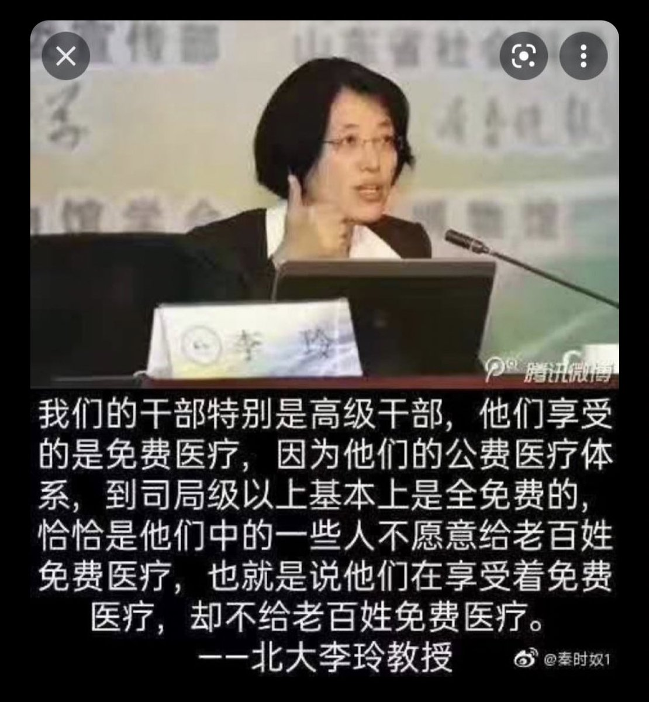

Ivy未央 北京时间 2023-07-17T11:17:13Z 1680778655654453249 转）北大教授李玲：我们的干部特别是高级干部，他们享受的是免费医疗，他们公费医疗体系，到司局级以上基本上是全免费的，恰恰是他们中的一些人不愿意给老百姓免费医疗。所以，我觉得还是执政理念的问题。这些人都拿着免费医疗在说老百姓不能享受免费医疗，这其实是理念的问题。靠他们怎么打破特权呢？ https://t.co/pG7oxmaZEy   Ivy未央 北京时间 2023-07-17T09:39:51Z 1680754151603548160 1968年是很多中国知识分子的生死劫，这也是他们信中共的结局
以史为鉴，你还敢信中共吗？
觉醒吧，渴望民主自由的人 https://t.co/7JHT3LwTs0   