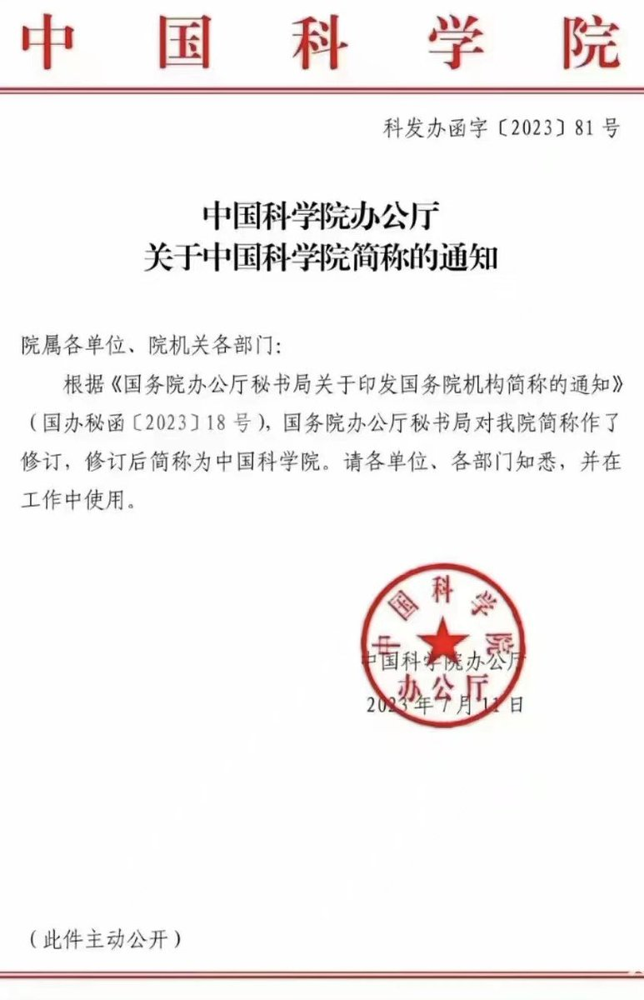

Petrichor 北京时间 2023-07-17T08:27:28Z 1680735935334432768 这番思想，是秦刚告诉她的吗？ https://t.co/xvq0rRABel   Petrichor 北京时间 2023-07-17T09:03:58Z 1680745122340786177 李强主政国务院后修改了国务院的职能，那就是国务院是执行党中央和习总命令的办事机构。一些人发现面对外贸、房地产和经济下行、失业率升高、公费医疗等当急民生问题，国务院没有及时出台有效应对方案。其实国务院还是做事的，例如最近发文规定“中国科学院”简称为“中国科学院”，大手笔，下大棋！ https://t.co/MlENJQT1Ji   Petrichor 北京时间 2023-07-17T05:28:39Z 1680690937943523328 阿拉伯数字是印度人发明的吗？ https://t.co/zk4uiNI4Fw   