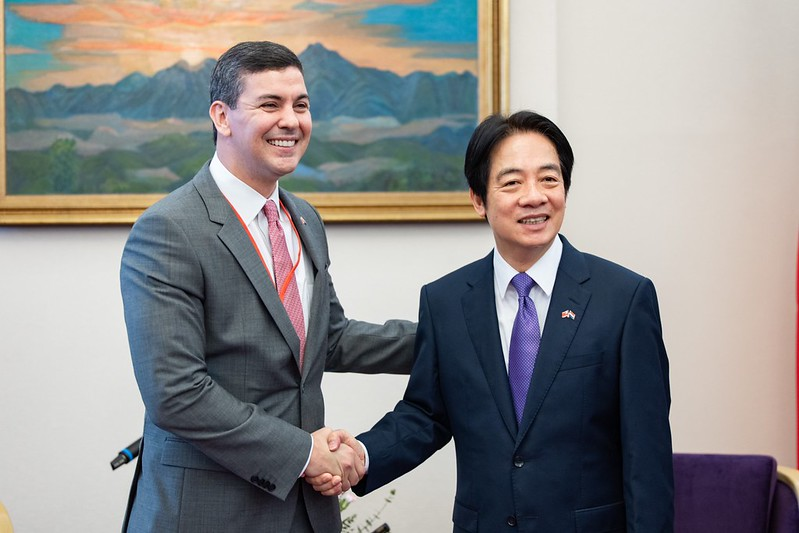

自由亚洲电台 北京时间 2023-07-17T14:40:08Z 1680829722006265856 【#赖清德 8月出访 #巴拉圭 将 #过境美国】
台湾外交部次长俞大㵢17日说，蔡英文总统指派副总统赖清德担任特使，8月将率团出席巴拉圭共和国总统圣地亚哥·培尼亚（Santiago Peña Palacios）的就职典礼。他说，以往出访南美都会在美国过境，这次也会依惯例，按舒适、便利、安全、尊严等原则办理。培尼亚预定8月15日就职，俞大㵢在总统府的记者会上表示，赖清德订于8月14日抵达巴拉圭、15日参加就职典礼。报道 :https://t.co/iFJDTNOhfX   自由亚洲电台 北京时间 2023-07-17T10:38:50Z 1680768997304975361 【中国统计局:上半年 #GDP 同比增5.5%】
【年轻人 #失业率 21.3%比5月20.8%再恶化】

中国国家统计局周一（7月17日）公布今年上半年GDP等经济数据，第二季度经济增长为6.3%，同比增长5.5%；初步核算，今年年上半年国内生产总值593034亿元，按不变价格计算，同比增长5.5%。
至于备受外界关注的失业率，6月失业率为5.2%，与上月持平。16-24岁、25-59岁劳动力调查失业率分别为21.3%、4.1%。年轻人失业率较5月的20.8%再恶化。上半年全国城镇调查失业率平均值为5.3%，比一季度下降0.2个百分点。
中国国家统计局新闻发言人付凌晖表示，上半年经济社会全面恢复常态化，宏观政策显效发力，国民经济回升向好，高质量发展稳步推进，但上半年仍面对覆杂严峻的国际环境，以及艰巨繁重的国内改革发展稳定任务，各地各部门做好稳增长、稳就业、稳物价工作，市场需求逐步恢复，生产供给持续增加，经济运行整体回升向好。
另外，上半年中国全国的房地产开发投资下降7.9%，全国商品房销售面积下降5.3%；商品房销售额63092亿元，增长1.1%。
详细报道：https://t.co/I7F8S2uIXr   自由亚洲电台 北京时间 2023-07-17T09:52:12Z 1680757258937065472 中国国防部网站7月16日证实，参加“北部·联合-2023”演习的中方海空军已分别从青岛某军港和长春某机场出发，在抵达预定海域后，将与俄罗斯兵力开展联合军事演习。

 https://t.co/uMqW89JTi5   自由亚洲电台 北京时间 2023-07-17T02:56:27Z 1680652633844101121 台湾前立委黄国昌与网红“馆长”陈之汉以司法改革和居住正义等诉求，号召民众在周日（7月16日）民进党举行全代会的同时，在总统府外的凯达格兰大道，参与"公平正义救台湾”集会，国民党总统参选人侯友宜、民众党总统参选人柯文哲、鸿海创办人郭台铭先后出席，并上台发言。

 https://t.co/99ruaY1D3I   自由亚洲电台 北京时间 2023-07-17T03:07:33Z 1680655428034740231 【寻子老兵被警察殴打】
据中国民间权益组织民生观察7月15日发布的消息，越战老兵陈育信夫妇近日在福建福州市街头寻找被拐儿子，引起路人围观。但随后，夫妻二人却遭到当地城管和警察的驱赶、殴打。

据介绍，现年65岁的陈育信曾是一名越战老兵。2001年3月26日，其儿子陈帅在云南省昆明市官渡区双桥村自家楼下和小朋友玩耍时被人拐走。当时的陈帅只有5岁，现年应已是26岁。20多年来，陈育信和妻子在全国寻子，并多次向有关部门寻求帮助但都没有结果。

民生观察披露，7月12日下午，陈育信和妻子在福州街头寻子过程中先是遭到陌生男子阻挠，后被城管以“寻子扰民”为由要求离开，此举引起围观群众和陈育信家人的不满。警察到场后，同样要求陈育信停止寻子行动。陈育信因与警方发生争执，被多名警察拖入警用围挡内殴打。陈育信妻子上前查看时，陈育信已失去意识倒地不起。该事件通过围观群众拍摄视频后，在网络传播。   自由亚洲电台 北京时间 2023-07-17T03:30:00Z 1680661077372313600 民#进党全国党员代表大会 16日在台北圆山饭店举行，#蔡英文 总统授旗给副总统、民进党2024总统参选人 #赖清德。蔡英文表示相信赖清德，呼吁团结一致支持赖清德。

 https://t.co/UjCbk0Nddc   自由亚洲电台 北京时间 2023-07-17T03:33:41Z 1680662004069965825 RT @RFA_Chinese: 【调查报道 |中国“秘密警察站”在纽约】林海:寻找没有恐惧的土地
https://t.co/SpNH1RA0J4
2019年从中国逃亡到美国的林海从没想到，他会在曼哈顿街头的民主活动上，遭到不明身份的人挥舞五星红旗袭击。但随着中国“秘密警察站”…   自由亚洲电台 北京时间 2023-07-17T01:50:23Z 1680636008189272064 #美国气候特使克里抵达北京
7月16日，美国总统气候问题特使约翰·克里乘机抵达北京。中国官方央视新闻客户端仅表示，“明天起，中美双方将就合作应对气候变化深入交换意见。”
 https://t.co/jUovweX5o4   