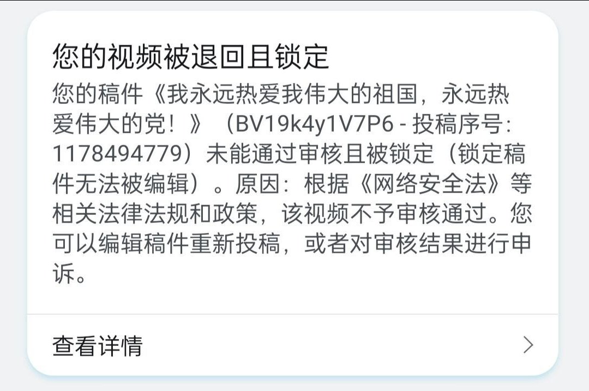
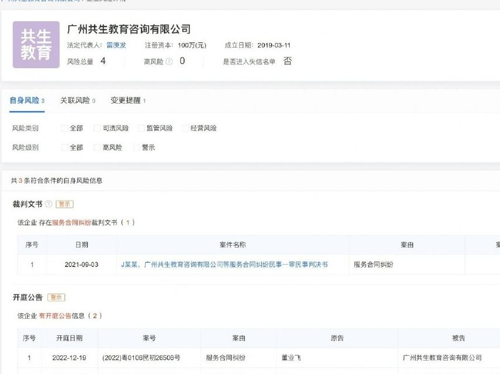
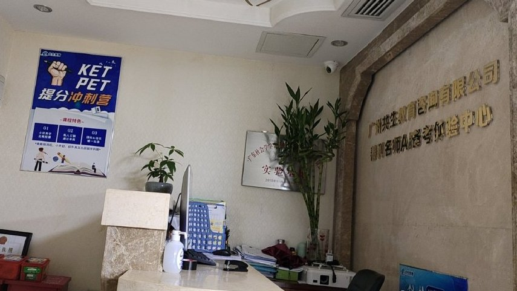
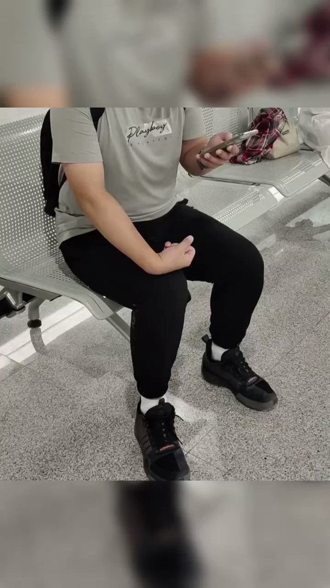
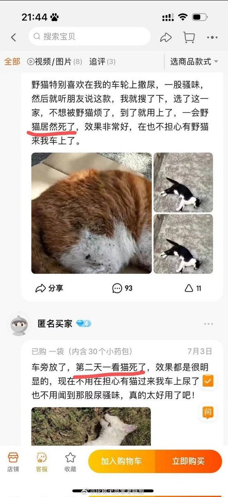
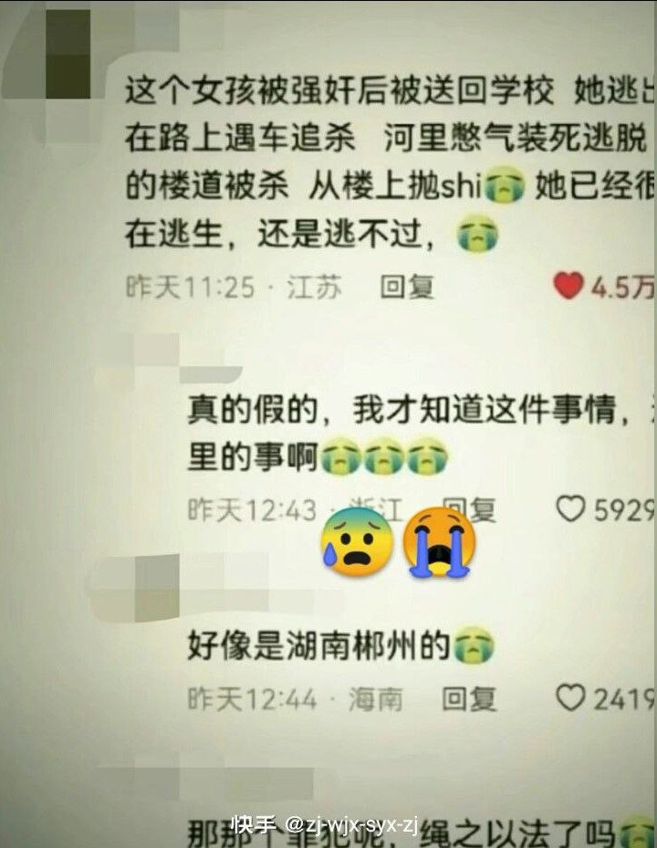
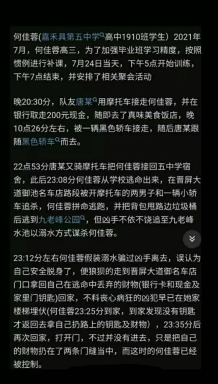
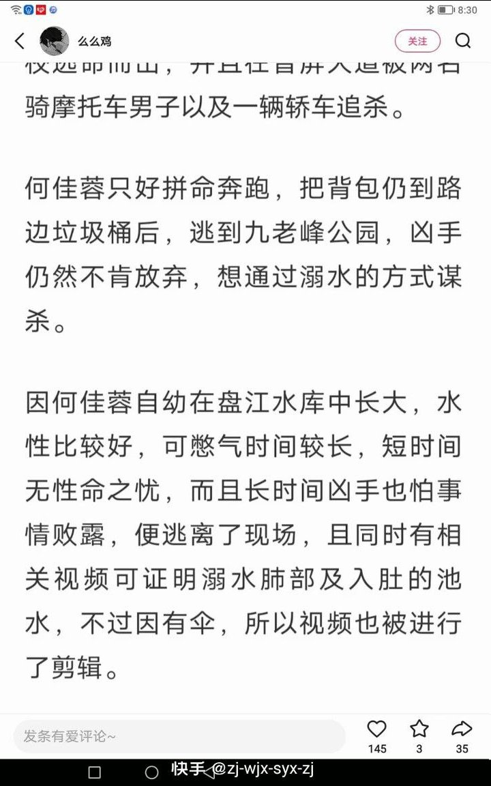
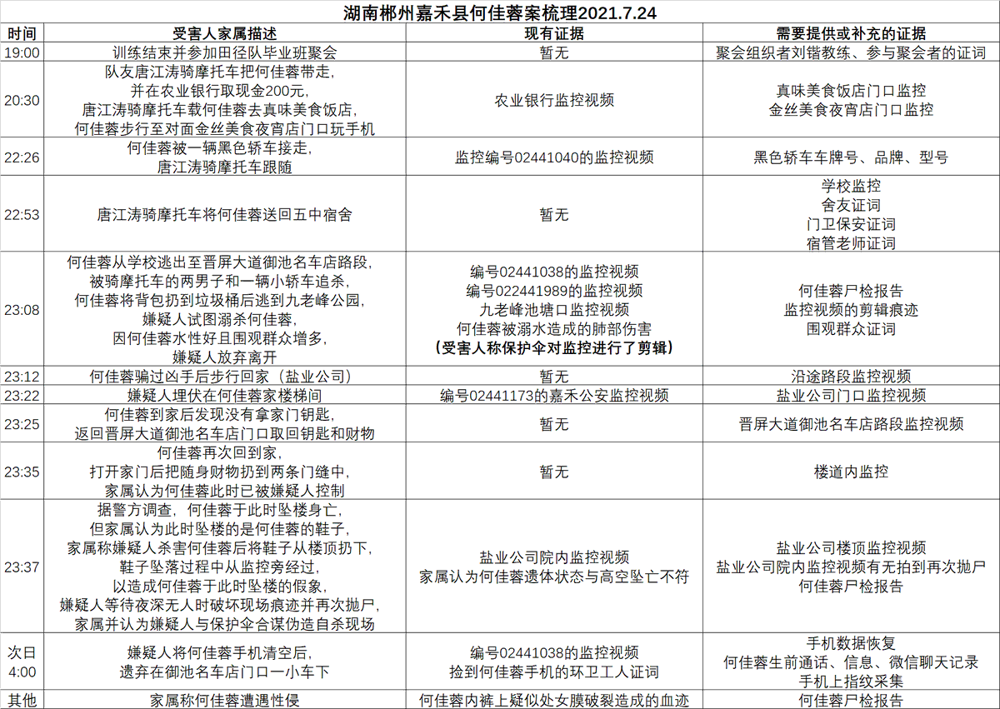

谁将十万横扫三江 北京时间 2023-07-17T19:59:42Z 1680910142693588994 RT @laodongqushi: 作者访谈了广东一快递物流仓库的15位工人，调查工资所得、工作时间、休假休息、工作量、管理等劳动条件。研究发现该仓库劳动强度高，许多工人“熬不住”在短时间内离职，使临时工常态化。这为企业开脱了许多法律责任，包括不缴社保费、劳务派遣公司乱扣费等。…   谁将十万横扫三江 北京时间 2023-07-17T22:04:39Z 1680941586560225280 不客气地说，“衡水系”为代表的超级中学模式，之于教育，某些方面像莆田系之于医疗。

社会对衡水系之类超级中学模式有三大误解：

误解一：
以为衡水系帮助底层寒门学生逆袭。
事实上，中产家庭才能负担衡水系。
衡水一中公示的收费标准，应届生每学期学费+住宿费=10075元，一年2万多，加上生活费和各种杂项开销，高中3年下来10万元起步。
复读生更贵。
《中国青年报》采访过衡水系毕业生与家长，一年教育支出5万。

误解二：
以为衡水中学重点大学尤其北大、清华升学率高，是因为横中有灵验秘方式的教学方法。
其实，升学率最大秘方是，招生时采用灰色地带的【生源掐尖】。
中考之后，衡中招生人员想方设法从河北各市中学老师或家长那里拿到“尖子生”名单，以学费折扣等方法，吸引尖子生跨区就读横中，以便抬高横中的高考升学率。
那些学习基础很好、自驱力很高的尖子生，即使不去横中，高考也不会差。
【生源掐尖】于私、于公危害有2：
1. 于私：让尖子生陷入更激烈的“内卷”。
北、清每年在河北招生额度有变化不大的上限。
北、清在河北录取率，城市0.12%，农村0.01%.
近年大家都懂了，系统资源出现配额式上限后，系统内具体个人的拼搏程度就是“内 卷”程度。
再拼搏也不会增加额度、不会做大蛋糕；越拼搏只会导致分得单位蛋糕所付出的消耗更大。
横中把尖子生汇集到两三所学校，设计了反人性的超长学习时间，休闲放松压缩到趋近于0.
压力大到出现连续跳楼事件，学校治标不治本、违反消防法加装铁丝网护栏。
但这是人为抬高的拼搏和压力。就为了造成横中教学有方的幻觉。
如果尖子生分散在各校，以相对自然的“拼搏”状态竞争，结果还是同样的北、清录取率。
2. 于公：【生源掐尖】造成教育整体生态萎缩。
邢台中考前100名的学生，70人流向衡水中学和石家庄二中，邢台只剩30人。
第一步，少数超级中学以一定优惠掐走尖子生，制造升学率；
第二步，对超级中学其他中学生收取高额学费，维持利润；
第三步，拿出利润一部分挖走各地各公立学校优质师资；
第四步，各公立学校生源、师资流失后逐年萎缩；
第五步，广大家庭和学生失去了有质量保障的公共教育。
在这一维度，衡水系为代表的超级中学模式类似莆田系在医疗领域的扩张。

误解三：
以为衡水系等超级中学以高压力、高强度培训出来的学生，在日后竞争力上有更优异表现。
2019年厦门大学有针对性研究论文，结论是，超级中学毕业生在各项指标中都没有显著优势。

总之，衡水系为代表的超级中学模式，既没有帮助底层寒门，反而让中产家庭耗费更多教育支出；
也没有提供独特灵验的升学技巧，升学率取决于掐尖，并给尖子生造成更激烈内卷；
最重要的，破坏了公共整体的教育资源分布。
那么最大收益方是谁呢？
是挂靠衡中等超级中学，搞教育产业化的学区房地产。   谁将十万横扫三江 北京时间 2023-07-17T19:51:01Z 1680907957146652673 根据相关法律法规和政策
↓
根据网络安全法等相关法律法规和政策
据悉，此前相关法律法规和政策一般指《计算机信息网络国际联网安全保护管理办法》和《中华人民共和国治安管理处罚法》   谁将十万横扫三江 北京时间 2023-07-17T20:20:52Z 1680915469828751360 RT @whyyoutouzhele: 网友投稿
7月16日，北京。一保安与外卖小哥发生争执，将其抱摔在地。 https://t.co/jOdQIMrvQ9   谁将十万横扫三江 北京时间 2023-07-17T14:53:18Z 1680833036437585920 网友投稿：讨薪！避雷！招聘时在越秀正佳广场，老板问我不要去工作，当时没谈具体薪资，后来五月十号工作，六月初老板想留人，问我要不要全职，每天让人讲课跟催命一样，周末打电话，管理混乱拉人救急，我说考虑一下，六月十五日发五月工资，克扣工时，工资奇低，遂跟老板说暑期合作终止不想呆，之后又继续被要求六月份上课，期末结束后老板拒付工资。垃圾公司还我血汗钱！
老板专门找一些应届大学生，跟家长学生谎称211 985，觉得小白脸皮薄不好拒绝，一个人干三个人活。觉得应届大学生不敢谈薪水，垃圾老板！   谁将十万横扫三江 北京时间 2023-07-17T14:58:10Z 1680834260209643521 主要是企业承担不起政治风险 https://t.co/gEPT3V8oUo   谁将十万横扫三江 北京时间 2023-07-17T12:31:20Z 1680797307326046208 RT @Qiangguofanzei: 中国是一个低收入，高物价，高隐形税率的国家，而且还是一个贫富差距大到天际的国家。加拿大人看到来的中国人都很有钱，主要是因为（相对）有钱的人才可以来的了加拿大，仅此而已。99%以上的中国人不用说在加拿大买房子，就是去加拿大的能力都没   谁将十万横扫三江 北京时间 2023-07-17T12:34:24Z 1680798078306222080 灰衣男生安检后，在步行地铁通道中背上双肩包，估计动作太大，甩到了身后走路靠太近的女生手部，导致女生手机掉地，看女生还能正常使用手机，手机因该没大问题。

按女生描述，女生追上男生要求道歉，还问其所在职公司，男生没理她，女生对着男生拍了足足两分钟，要求男生道歉，男生沉默一声不发。

目前某app上，女生的这条视频内容，未给男生打码。   谁将十万横扫三江 北京时间 2023-07-17T14:19:08Z 1680824436352778240 RT @pear14525902: 中修武装统一台湾属于帝国主义战争，是不正义的，按马列主义我们应帮台湾人抵抗中修帝国主义的武装入侵。台湾政府是资产阶级政府，脱离人民群众，不懂人民战争理论，不懂毛泽东思想，战略战术也是错的，高价购买不实用的武器，还没有全民发枪。它没有办法有效抵…   谁将十万横扫三江 北京时间 2023-07-17T07:47:33Z 1680725891557773313 https://t.co/xSnttxDdwK   谁将十万横扫三江 北京时间 2023-07-17T08:40:25Z 1680739195520958465 😭 https://t.co/HeLvxWaPKS   谁将十万横扫三江 北京时间 2023-07-17T09:15:11Z 1680747946437136385 知乎看到的：我是湖南省郴州市嘉禾县第五中学何佳蓉的爸爸何江洪，我女儿被害我一直在往上级申诉，不但无果，还被当地公安陷害我袭警，并以袭警罪控制了我的自由，因此特向全网发声，请求全网助我发声要求上级政府为何佳蓉立案，为我们家平冤

目前受害人家属举证仅有孩子的身份证学生证 https://t.co/tAmHUamWXN   