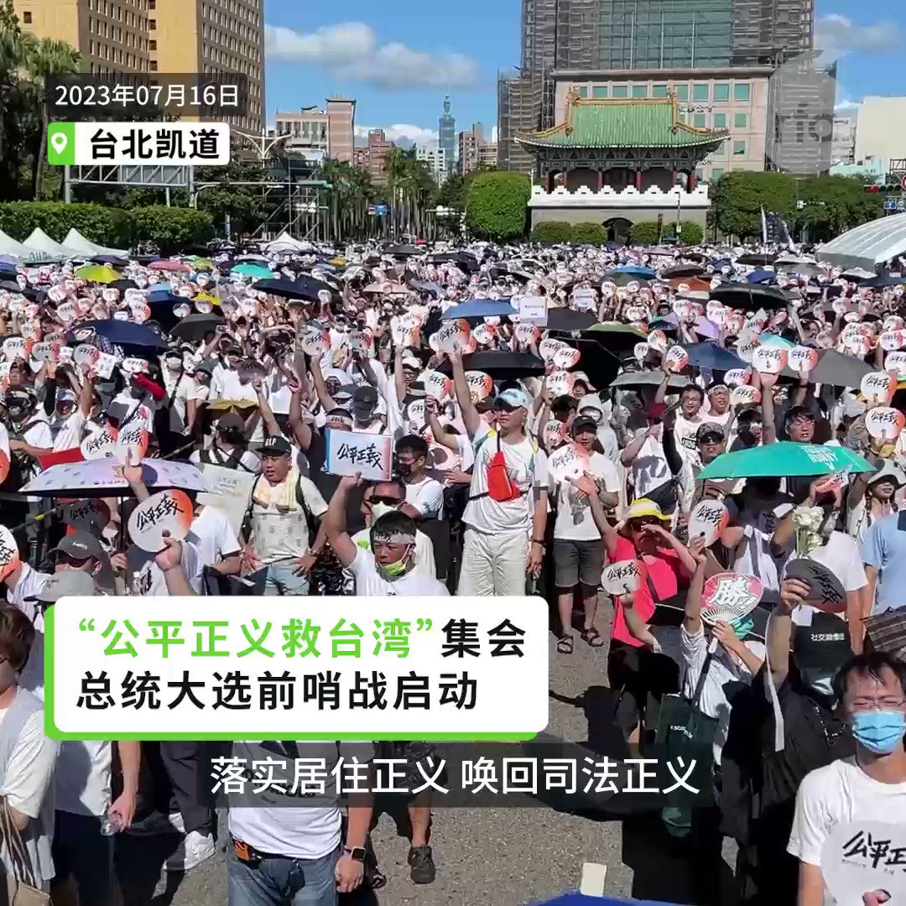
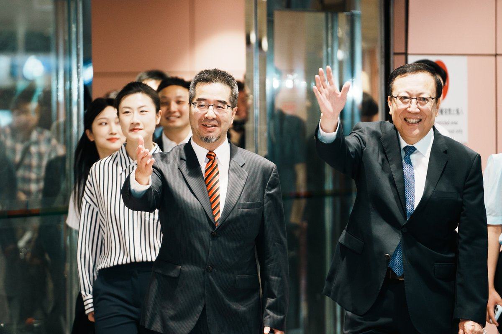
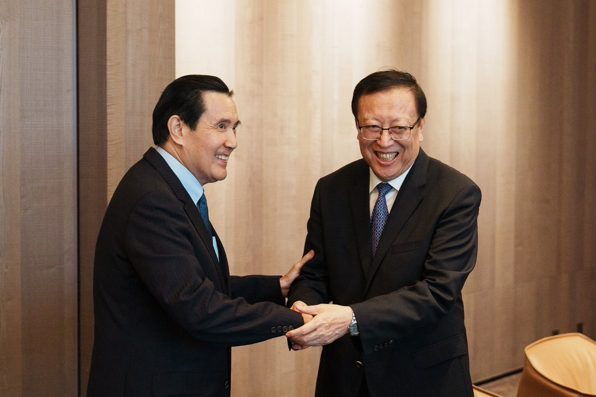
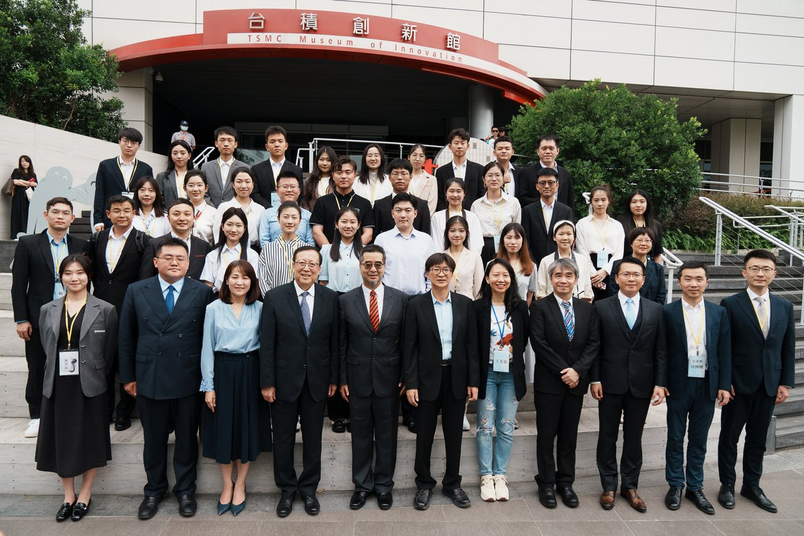
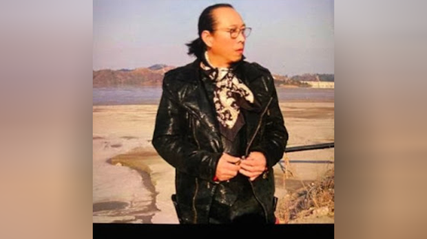

自由亚洲电台 北京时间 2023-07-16T20:09:41Z 1680550266997710848 RT @RFA_Chinese: 【上海将率先推出“城市码”】
【 疫情产物构建城市“治理体系”】
上海将在“#健康码”基础上，更新迭代推出“#城市码”。上海大数据中心通过“#一人一码”掌握个人资讯，同时对企业也实施“#一企一码”。官方的解释是“构建全方位的城市服务和治理体系”…   自由亚洲电台 北京时间 2023-07-16T20:17:42Z 1680552285384892417 【“公平正义救台湾”集会】
【台湾总统选举前哨战启动】
台湾前立委黄国昌与网红“馆长”陈之汉以司法改革和居住正义等诉求，号召民众16日参与“#公平正义救台湾”集会，国民党总统参选人 #侯友宜、民众党总统参选人 #柯文哲、鸿海创办人 #郭台铭 先后出席，并上台发言。参与的人潮高喊”落实居住正义，唤回司法正义”等口号。   自由亚洲电台 北京时间 2023-07-16T16:31:34Z 1680495377173315584 【#马英九 邀陆生访台】
【盼两岸青年增加情谊避免战争】
台湾前总统马英九成立的“#马英九基金会”邀请中国大陆学生参访团15日抵达台湾展开9天参访，这个参访团由北京大学党委书记郝平率队，大陆学生来自北大、清华、复旦、武汉、湖南等五校共37人。现为北大研究生的前中国奥运金牌桌球选手丁宁也來台，成为媒体关注热点。详细报道:https://t.co/rCLWL2FqmT   自由亚洲电台 北京时间 2023-07-16T10:57:47Z 1680411377653936128 RT @RFA_Chinese: 【沈栋：习近平是掌控中国的"皇帝"】
2023年7月13日，美国国会众议院中国特设委员会举办听证会。
《#红色赌盘》作者 #沈栋 以亲身经历证明：在中国，政治权力凌驾于一切之上。#习近平 是掌控中国的"皇帝"。 https://t.co/B31…   自由亚洲电台 北京时间 2023-07-16T10:57:52Z 1680411397778288640 RT @RFA_Chinese: #沈栋：“在中国，政治力量凌驾一切...中国共产党凌驾于法律，而 #习近平 则是掌控共产党和国家的皇帝。”

英国风险管理咨询公司中慧（ChinaWhys）总裁Peter… https://t.co/mxVhg8FYGY   自由亚洲电台 北京时间 2023-07-16T07:53:43Z 1680365053420396544 #梵蒂冈 任命 #上海主教 批评中方调任未征求意见
 https://t.co/JdilvkpZdD   自由亚洲电台 北京时间 2023-07-16T07:54:50Z 1680365335202127873 原三十八军老军人 #高宏毅 近日在青岛市拘留所被莫名拘留7天。为搞清原因，高宏毅多次前往实施拘留的济南市公安局市南分局询问，收到警方在2021年1月23日开出的《行政处罚决定书》。原来是因他在两年前接受国际媒体采访，而遭到青岛警方以“寻衅滋事罪”行政拘留7天。

 https://t.co/C2cgcmqqIJ   自由亚洲电台 北京时间 2023-07-16T07:56:35Z 1680365775067009024 今年初参与武汉退休老人抗议医改的“#白发运动”的出租车司机 #童梦兰 本周二（7月11日）以不予起诉获释，此前他已经被羁押近五个月。

童梦兰今年2月15日在得知武汉市中山公园有医保维权活动后，自发前往围观，并表达了对抗议者们的支持。但这一行动受到警方打压，童梦兰今年2月20号在上海被警方抓回武汉羁押。

3月29日，童梦兰被武汉市公安局江汉区分局以涉嫌寻衅滋事罪逮捕，此后羁押在武汉市江汉区看守所。

在他之前，已经有武汉疫情死难者家属张海，因为在网上传播白发运动的视频而被警方在深圳跨省抓捕，目前已被正式逮捕，被关押在武汉市第二看守所；但他的家属至今没有收到逮捕通知书，自行聘请律师被政府阻挠。   自由亚洲电台 北京时间 2023-07-16T08:56:51Z 1680380945042374657 RT @RFA_Chinese: 中国外长秦刚原定今天出席在雅加达举行的东盟外长相关会议，但自6月25日起，他就没有露面。
7月12日，前中国外交部发言人赵立坚之妻在其微博帐号“大聪和臭丫头”上说：“今天是个好日子”，网友纷纷猜测，喜从何来？… https://t.co/yYL…   自由亚洲电台 北京时间 2023-07-16T04:38:39Z 1680315964154585088 中国和整个亚洲出口锐减　预示着什么？
 https://t.co/5GtyBCzBPB   自由亚洲电台 北京时间 2023-07-16T04:07:42Z 1680308175852142595 美众议院通过《#国防授权法》 禁止使用台湾被列入中国领土地图
 https://t.co/t4jzsvZYCk   