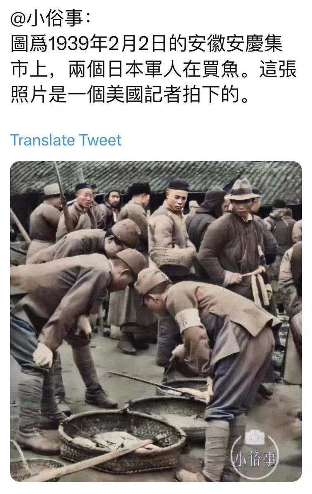

Petrichor 北京时间 2023-07-15T06:10:55Z 1679976798052859904 他没有说到点子上，中国的最大问题是没有言论自由，于是就带来大量的社会问题。大家不敢讲话，都装B，其实心里明白，暗自较劲，如何做最大的利己主义者。媒体没有真话，对官员没有监督能力。官大一级压死人，无法无天，百姓人权和私有财产得不到保护。君子不入危邦，良禽择木而栖。 https://t.co/qYmg45n26I   Petrichor 北京时间 2023-07-15T02:13:30Z 1679917050976665612 转发我朋友的评论：“竟然没有像我们的城管一样，抢摊贩的商品，差评，一点没有侵略军的样子”。我知道她是调侃，对城管恨铁不成钢。 https://t.co/HRWPccNPsE   Petrichor 北京时间 2023-07-15T02:16:48Z 1679917879678861326 西安威尼斯街，边吃夜宵，边观漂流。
城市建设：只顾地上，不顾地下。 https://t.co/zJPscO2Cuy   