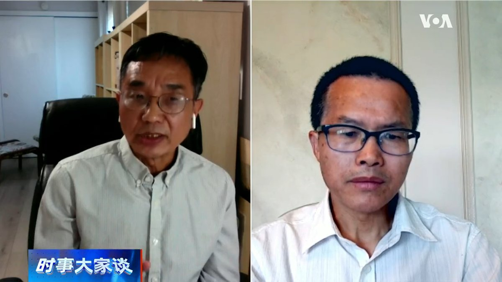
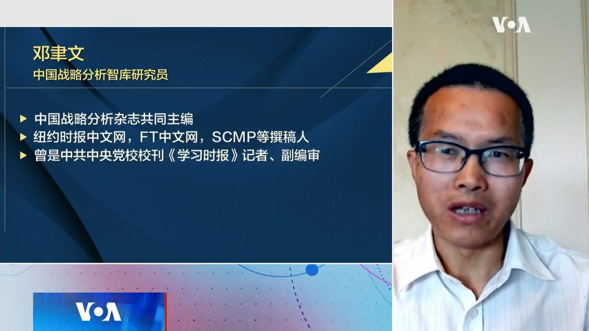
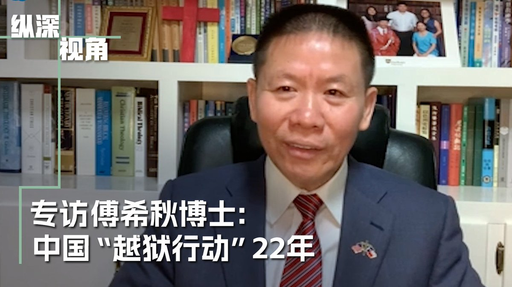
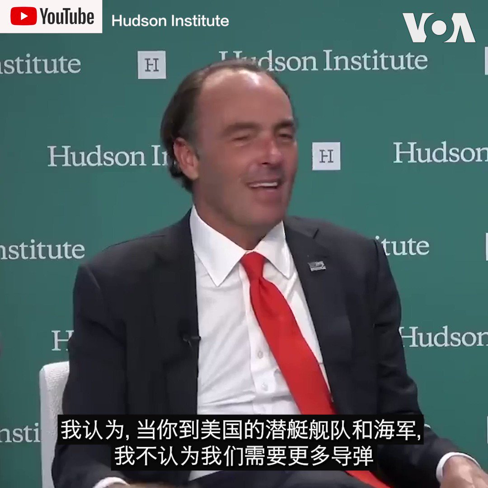
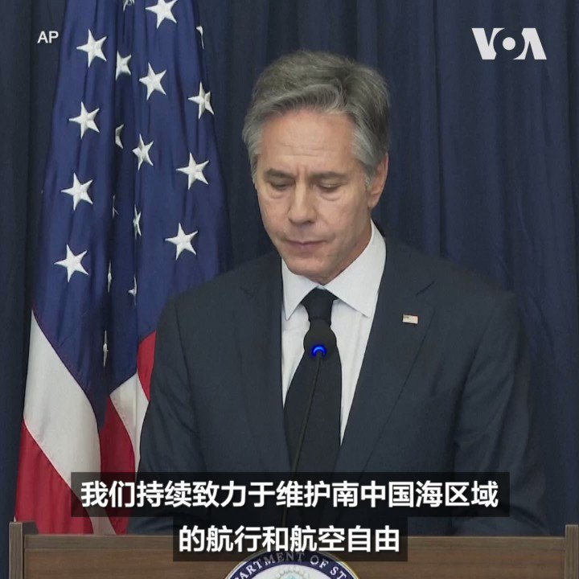
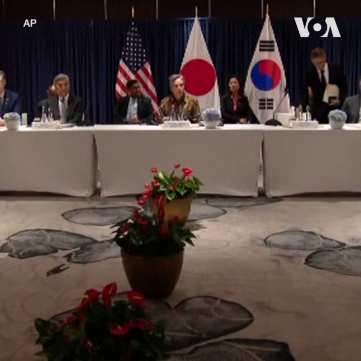

美国之音中文网 北京时间 2023-07-15T22:07:03Z 1680217416134184960 北京终于承认房价开始下滑，北上广也在其中 https://t.co/MdAW7T1IL8   美国之音中文网 北京时间 2023-07-15T14:41:04Z 1680105178832457728 中国第二季经济增长被看好？ 专家指恐被误导性夸大 https://t.co/MNO3Xq2D7B   美国之音中文网 北京时间 2023-07-15T16:09:03Z 1680127323847421952 韩国吁中国发挥建设性角色 遏制朝鲜威胁 https://t.co/G5mL3Twig0   美国之音中文网 北京时间 2023-07-15T12:57:33Z 1680079129046319105 中印边境紧张局势升温 王毅敦促与印度保持稳定关系 https://t.co/yxj51jDvNf   美国之音中文网 北京时间 2023-07-15T11:45:02Z 1680060881181495296 南非总统西里尔·拉马福萨(Cyril Ramaphosa)周四(7月13日)欢迎华为(Huawei)在约翰内斯堡开设新的创新中心，称赞这家中国公司“对南非经济及其潜力充满信心”。
 https://t.co/teh26DFUz8   美国之音中文网 北京时间 2023-07-15T12:03:03Z 1680065415375110144 中国快时尚品牌Shein再传负面消息 设计师控其严重侵权 https://t.co/oSrgkuih9T   美国之音中文网 北京时间 2023-07-15T10:05:04Z 1680035724375232512 缅甸民主派阵营批评泰国外长秘密会晤昂山素季 https://t.co/VDvk2medCO   美国之音中文网 北京时间 2023-07-15T10:30:00Z 1680041996541386753 习近平蔡奇联手面对从北京到雄安疏解难结果会如何？政论作家、独立学者吴祚来先生说：习搞副首都雄安新区是为党中央政治安全，这是他的政治动机。他怕风吹草动再来一个八九。有了这个政治考虑，他们会不择手段。现在是两边都不能败。#时事大家谈 完整版：https://t.co/5bGUNCUuBU https://t.co/8wjRFWtBwX   美国之音中文网 北京时间 2023-07-15T10:39:05Z 1680044284140228608 美国芯片公司高管计划到华府与当局讨论中国政策 https://t.co/ClYkYZ1xHf   美国之音中文网 北京时间 2023-07-15T11:00:00Z 1680049548843180038 《人民日报》发表《树立正确的就业观》，说明习有搞上山下乡意图？“中国战略分析智库”研究员邓聿文先生说：现在农村就业人口本身就在往外迁，大规模上山下乡，哪怕小规模，即使习近平有这个想法，注定也做不成。舆论鼓动一下，到时候就无疾而终了。#时事大家谈 完整版：https://t.co/5bGUNCV2rs https://t.co/NZm7BPo37U   美国之音中文网 北京时间 2023-07-15T07:00:02Z 1679989157844901889 澳大利亚外交部长黄英贤(Penny Wong) 在雅加达举行的一次峰会的间歇与中国最高外交主管王毅举行了她所说的“坦率交谈”。 https://t.co/dNAJNkTYGC   美国之音中文网 北京时间 2023-07-15T07:30:02Z 1679996707227176960 周五(7月14日)，巴基斯坦为该国最大的民用核电站举行了破土动工仪式，这座核电站由中国建造，每天将为巴基斯坦国家电网提供1,200兆瓦的电力，估计耗资至少35亿美元。 https://t.co/2Fiwpakhfb   美国之音中文网 北京时间 2023-07-15T08:00:01Z 1680004254571044865 微软在周五(7月14日)发布的一篇博客文章中表示，中国黑客得以利用“微软代码中的一个验证错误”来从事网络间谍活动。这篇博客为震惊网络安全行业和美中关系的黑客事件提供了迄今为止最详尽的解释。北京否认参与任何间谍活动。 https://t.co/z2qmbnYLWu   美国之音中文网 北京时间 2023-07-15T09:00:01Z 1680019354342105094 一键解锁#美国热搜 榜：1、美国工业安全局107新规让中美处于战争状态 2、解码美国对华芯片的封锁行动 3、习近平关掉了中国经济复苏的引擎，把中国逼上绝路 4、专家建议收失业税防止年轻人躺平 5、学习强国可用作孕妇胎教 6、结婚请帖上新人姓氏也辱党 7、小粉红的动漫阴谋论 https://t.co/hn8busxkk8   美国之音中文网 北京时间 2023-07-15T09:09:41Z 1680021785658654720 两位美国国会参议员推出一部法案，计划以立法方式对美国在中国的投资进行追踪。目前，白宫也正在努力完成一项外界等待已久的行政命令，也将对某些领域的投资实施具有高度针对性的限制。 https://t.co/uFYbhAwmgq   美国之音中文网 北京时间 2023-07-15T09:36:03Z 1680028422326882306 美众院表决通过2024财年《国防授权法》 台立委团感谢美国会跨党派力挺 https://t.co/BMzAnpabwK   美国之音中文网 北京时间 2023-07-15T09:38:43Z 1680029089912979457 从2009年到现在，对华援助协会成功帮助上百位中共受难者从中共大监狱“越狱”成功。协会主席傅希秋博士首次向观众披露其中鲜为人知的故事。这其中有他们如何筛选被营救者，解放军高层出手相助以及美国政府与北京的摊牌式介入。请于7月15日上午9点收看美国之音纵深视角专访傅希秋博士。 https://t.co/Dgk8LmHe6c   美国之音中文网 北京时间 2023-07-15T09:50:00Z 1680031929834393600 有美国议员日前倡议美国与盟友打造环太平洋“火力环”来抵消中国导弹的主场优势。海曼资本创始人凯尔·巴斯 @Jkylebass 认为，中国可能会在未来12至18个月内攻台，但比起导弹威慑，西方世界的“核按钮”是将中国踢出SWIFT，这会使中国经济会在一个月内停滞。报道内容：https://t.co/uWxjVHf6lO https://t.co/NBzY6QHFIN   美国之音中文网 北京时间 2023-07-15T04:30:02Z 1679951408458760192 美国联邦众议院星期四（7月13日）通过的2024财政年度国防授权法案（NDAA）中包含一则涉台修正案，该修正案禁止美国国防部使用任何将台湾作为中国一部分的地图。 https://t.co/SMdUuIPv1G   美国之音中文网 北京时间 2023-07-15T04:50:02Z 1679956443515228163 北大西洋公约组织（NATO）结束了在立陶宛首都维尔纽斯举行的为期两天的峰会。峰会发布公报重申中国对北约的“利益、安全和价值观”构成系统性挑战。公报同时表示，将加强与亚太伙伴的对话与合作。中国对公报反应激烈，驳斥北约公报“充斥着冷战思维和意识形态偏见”。 https://t.co/c50hET5JoA   美国之音中文网 北京时间 2023-07-15T05:30:02Z 1679966508464881664 在美国政府不断加强对中国人工智能(AI)产业实施严厉限制之际，美国芯片制造商英特尔(Intel)本星期宣布面向中国市场推出了一款全新的人工智能芯片，这是美国科技公司绕过政府出口管制、竭力投身中国市场的最新一例。 https://t.co/WRpuOUZDb2   美国之音中文网 北京时间 2023-07-15T05:51:02Z 1679971794923450368 2004年台湾“二二八事件”周年纪念日上，一场“牵手护台湾”活动，吸引大约200万台湾人手牵手排列出一条500公里的人链。这场活动的灵感就来自1989年发生在爱沙尼亚、拉脱维亚和立陶宛的“自由之链”活动。2016年当地民众捐资买砖，建造了一面纪念墙。美国之音记者带您到现场看看。 https://t.co/0KHsVukKIy   美国之音中文网 北京时间 2023-07-15T06:00:02Z 1679974057788461056 俄罗斯入侵乌克兰已经一年半了，未爆地雷和弹药可见于近40%的乌克兰领土。乌克兰的朋友日本、柬埔寨、波兰和美国正在协助排雷努力。美国之音(VOA)走访了波兰的一处设施，柬埔寨专家在这里培训乌克兰紧急事务工作人员使用日本的排雷设备。 https://t.co/6ZVc981AXV   美国之音中文网 北京时间 2023-07-15T02:48:05Z 1679925752874274816 路透社周五（7月14日）发表的一篇独家报道说，中国金融监管机构正在筹备一个特别研讨会，邀请全球一些最大的投资公司参加。研讨会的议题是如何在地缘政治局势紧张和经济严重疲软之际鼓励外国投资者继续向中国这个世界第二大经济体投资。 https://t.co/Q1Gn1miMP5   美国之音中文网 北京时间 2023-07-15T02:58:02Z 1679928254831132672 俄罗斯总统普京在上个月底瓦格纳集团雇佣军发动的兵变流产后与其首领耶夫根尼·普里戈津（Yevgeny Prigozhin）以及其他指挥官和公司高管会晤时曾表示，瓦格纳雇佣军仍然可以自成一体继续作战，但是普里戈津则不能再担任其首领。 https://t.co/JsIZuBXlVx   美国之音中文网 北京时间 2023-07-15T02:58:21Z 1679928336854790144 美国国务卿安东尼·布林肯7月14日说，美国对中国在南中国海和台海地区咄咄逼人的姿态表达关切。他说，美国将继续向中方清楚表明本国立场和意图，并会持续以负责任的态度管控双边关系。布林肯是在雅加达出席东盟外长会议期间说这番话的。 https://t.co/kkxM8euB0U   美国之音中文网 北京时间 2023-07-15T02:59:03Z 1679928510993907713 美国国会共和党人敦促拜登政府加大力度，要求美国高校履行申报收受外国捐赠的法律义务。共和党人说，美国高校体系不透明的财物捐赠申报制度正在被中国共产党所利用，使其对美国校园施加不正当的影响力。报道内容：
https://t.co/hNGAAOz5EC https://t.co/V6feWPGaXX   美国之音中文网 北京时间 2023-07-15T03:00:03Z 1679928763747020800 英国国防部星期五在有关乌克兰的每日报告中说，俄罗斯最近宣布，俄罗斯北方舰队的核动力潜艇将不会参加7月30日在圣彼得堡举行的海军日舰队检阅，“主要是由于”维护和可用性的担忧。 https://t.co/iwbSYotyyj   美国之音中文网 北京时间 2023-07-15T03:15:02Z 1679932533700706304 中国国家网信办等七部门周四（7月13日）公布了《生成式人工智能服务管理暂行办法》，明确要求人工智能的发展和应用必须与维护国家安全和社会公共利益相联系。 https://t.co/E7UEk3JjoR   美国之音中文网 北京时间 2023-07-15T03:30:03Z 1679936311992676353 澳大利亚参议院本周就社媒安全问题举行系列听证会，TikTok高层在会上坦承，中国员工能获取澳大利亚用户数据，而微信母公司则是直接拒绝派员出席。 https://t.co/jV9h6UY5mX   美国之音中文网 北京时间 2023-07-15T03:45:02Z 1679940083619889152 美国加州旅游局和纽约市旅游局在未来几周内将开启中国销售之旅，在8月和9月进行自疫情爆发以来首次赴华招揽生意，吸引中国游客到美国旅游。美国品牌总公司综合营销高级副总裁斯塔西·梅尔曼表示：“中国对美国的需求非常高，但是目前航班的容量实在有限”。 https://t.co/4tmtGb3LNO   美国之音中文网 北京时间 2023-07-15T04:00:03Z 1679943861387563011 全面与进步跨太平洋伙伴关系协定(CPTPP)的成员计划在本周日（7月16日）在新西兰奥克兰开会，讨论中国和台湾的加入申请。这个议题可能会加深成员国之间的分歧。
 https://t.co/dqTVkHa1NT   美国之音中文网 北京时间 2023-07-15T04:20:28Z 1679949002219966466 澳大利亚参议院本周举行一场听证会，TikTok高层在会议上坦承，中国员工能获取澳大利亚用户数据，而微信母公司则是直接拒绝派员出席。专家分析，这显示TikTok和微信仍存有重大安全疑虑，中共的审查之手可能已经伸向澳大利亚，但澳大利亚不太可能因此全面禁用TikTok及微信。https://t.co/KrsdDww2eN https://t.co/kaXbo9U9NC   美国之音中文网 北京时间 2023-07-15T01:43:15Z 1679909434632306691 美国国务卿安东尼·布林肯、日本外务大臣林芳正和韩国外长朴振7月14日谴责朝鲜再度发射洲际弹道导弹。正在雅加达出席东亚合作系列外长会议的三国外长重申，三国致力于共同维护东亚地区的和平与安全。朝鲜7月12日发射了使用固体燃料的“火星-18”型洲际弹道导弹。 https://t.co/0HPVHctMDW   美国之音中文网 北京时间 2023-07-15T02:25:07Z 1679919971176939520 希腊遭受热浪袭击，气温可达摄氏40多度。著名景点雅典卫城14日在中午提早关闭，一些游客表示失望。当局还限制旅游景点为游客服务的马和驴等动物在温度达35-39摄氏度时在中午到下午5点之间或超过39度时任何时间都不得工作。 https://t.co/7bM0gAw3Ip   美国之音中文网 北京时间 2023-07-15T00:07:11Z 1679885259108671488 法国14日庆祝国庆(巴士底日) 。来访的印度总理莫迪与法国总统马克龙一道观看法国与印度军人在巴黎的香榭丽舍大道游行。 https://t.co/5RRAir4tWX   