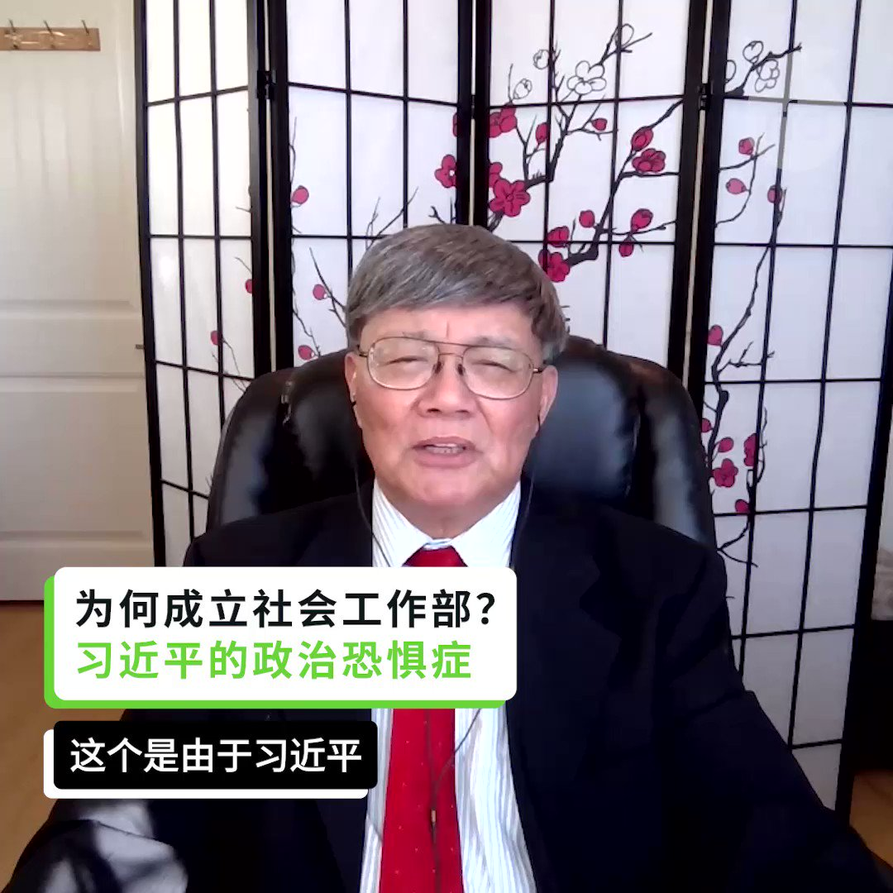
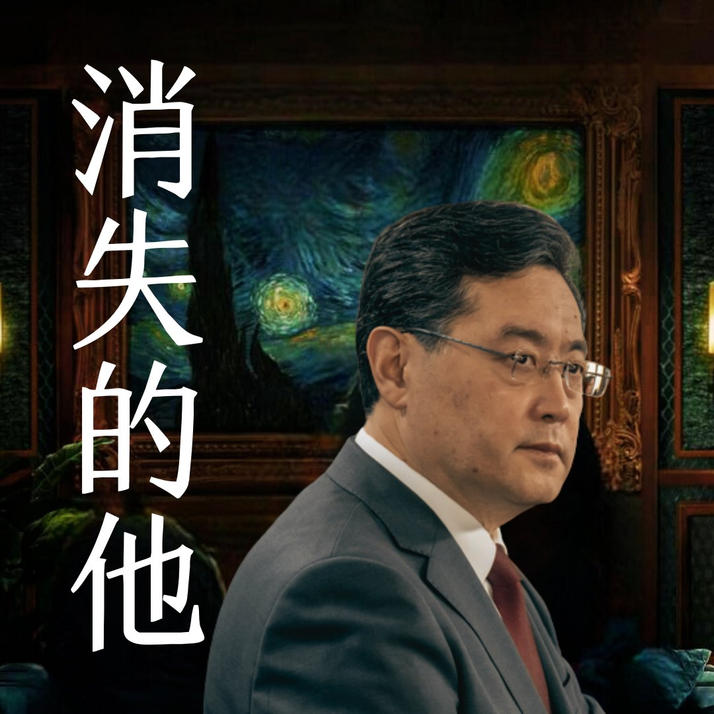
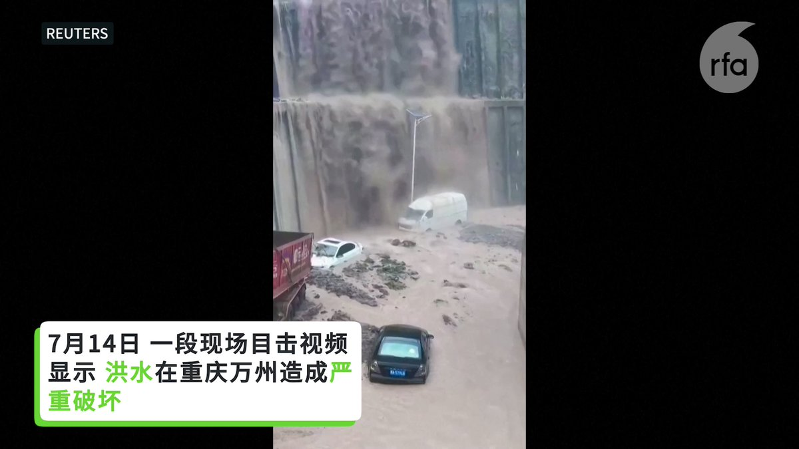
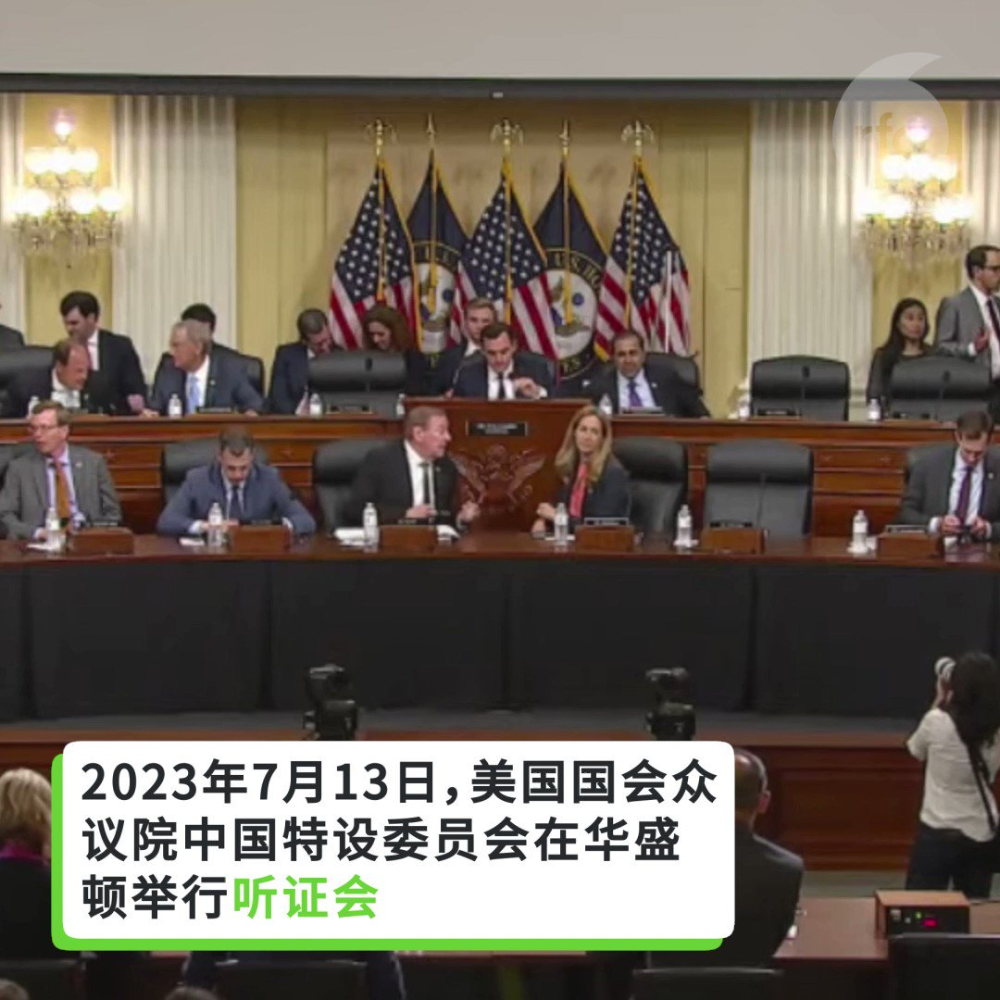

自由亚洲电台 北京时间 2023-07-15T16:48:13Z 1680137177336782848 RT @RFA_Chinese: 【沈栋：习近平是掌控中国的"皇帝"】
2023年7月13日，美国国会众议院中国特设委员会举办听证会。
《#红色赌盘》作者 #沈栋 以亲身经历证明：在中国，政治权力凌驾于一切之上。#习近平 是掌控中国的"皇帝"。 https://t.co/B31…   自由亚洲电台 北京时间 2023-07-15T12:33:38Z 1680073108756086784 RT @RFA_Chinese: 【中共 #中央社会工作部 成立】
【宋永毅：基于习近平的政治恐惧症】
【宋国诚：危机严重企图作社会控制】
最新一期 #亚洲很想聊 https://t.co/ce5l9BWT3u https://t.co/QFYAvsLwTb   自由亚洲电台 北京时间 2023-07-15T12:35:08Z 1680073489225506816 RT @RFA_Chinese: 中国外长秦刚原定今天出席在雅加达举行的东盟外长相关会议，但自6月25日起，他就没有露面。
7月12日，前中国外交部发言人赵立坚之妻在其微博帐号“大聪和臭丫头”上说：“今天是个好日子”，网友纷纷猜测，喜从何来？… https://t.co/yYL…   自由亚洲电台 北京时间 2023-07-15T12:35:31Z 1680073583521923072 RT @RFA_Chinese: 【沈栋：习近平是掌控中国的"皇帝"】
2023年7月13日，美国国会众议院中国特设委员会举办听证会。
《#红色赌盘》作者 #沈栋 以亲身经历证明：在中国，政治权力凌驾于一切之上。#习近平 是掌控中国的"皇帝"。 https://t.co/B31…   自由亚洲电台 北京时间 2023-07-15T06:56:11Z 1679988190441275392 在周四举行的美国国会众议院中国特设委员会听证会聚焦在华美企面临的风险。委员会主席加拉格尔及美国中国委员会高级研究员拉贾·克利胥纳莫提忧心忡忡，言辞犀利。 https://t.co/MblFcXMitH   自由亚洲电台 北京时间 2023-07-15T07:06:17Z 1679990729957859328 【#事实查核｜泽连斯基在 #北约峰会 上"受冷落"了吗？】 
亚洲事实查核实验室在Getty Images图库找到了这张由摄影师Yves Herman拍的照片，还有许多泽连斯基夫妻与他国政要热络互动的照片。
https://t.co/8NxzEaUOeN   自由亚洲电台 北京时间 2023-07-15T07:07:59Z 1679991157005352960 #台湾立法院 的台美国会议员联谊会访团 本周到访美国首都华盛顿，并拜会了美国国会参、众议员及行政部门官员，以深化美台合作。
访问团成员周五（7月14日）表示，此行重点围绕 #美国国防授权法案（NDAA）及 #美台二十一世纪贸易倡议 等议题，与美方进行了坦诚交流。

 https://t.co/BbKcuvSJQt   自由亚洲电台 北京时间 2023-07-15T07:13:12Z 1679992471546400769 【#亚太报道（2023-7-14）】
欢迎收听和订阅播客【亚太报道】 https://t.co/MjLNSvVMqc

#布林肯 会晤 #王毅 / 中国发布 #人工智能服务管理办法 / 《#红色赌盘》作者 #沈栋 在美国会作证 / #中国军事院校招生遇冷
 https://t.co/X6MUwIVYt7   自由亚洲电台 北京时间 2023-07-15T04:43:40Z 1679954840108122113 中国外长秦刚原定今天出席在雅加达举行的东盟外长相关会议，但自6月25日起，他就没有露面。
7月12日，前中国外交部发言人赵立坚之妻在其微博帐号“大聪和臭丫头”上说：“今天是个好日子”，网友纷纷猜测，喜从何来？
外长消失，这在中共历史上十分罕见。针对外媒询问，外交部发言人汪文彬7月11日说秦刚“因身体原因难以出席此次（东盟）系列外长会议”，7月14日拒绝回答。
社交媒体上出现各种猜测。您认为，秦刚怎么了？   自由亚洲电台 北京时间 2023-07-15T04:59:40Z 1679958866409168896 重庆万州山洪暴发如瀑布！多辆汽车被淹 https://t.co/lKoWoduRcX   自由亚洲电台 北京时间 2023-07-15T05:26:24Z 1679965595364888576 专栏 | 夜话中南海：“六四绿卡”是否为易纲的政治污点？
 https://t.co/ZeZbe7B8ME   自由亚洲电台 北京时间 2023-07-15T02:30:26Z 1679921312196866051 胡平：“他（#昆德拉）讲的故事就是我们的故事。当时整个国际很少有作品讲我们的故事，全是别人的故事。他讲的故事，主要人物都是有思想、有知识的，就更能引起同样身份的中国人的兴趣。”

 https://t.co/F75eUmNMrl   自由亚洲电台 北京时间 2023-07-15T02:59:34Z 1679928640929402881 据台湾中央社报道，#成都世界大学生运动会 将于本月底召开，中国网络近日广传“成都 #大运会 #白纸革命 活动召集帖”，号召民众在赛事期间进行快闪行动，抗议习近平的独裁统治。网上言论称之为白纸2.0。

 https://t.co/nTawo4p9uF   自由亚洲电台 北京时间 2023-07-15T03:15:35Z 1679932671017857024 #沈栋：“在中国，政治力量凌驾一切...中国共产党凌驾于法律，而 #习近平 则是掌控共产党和国家的皇帝。”

英国风险管理咨询公司中慧（ChinaWhys）总裁Peter Humphrey：“在为一家美国客户提供背景调查服务后，我与我的妻子于2013年在上海被捕，我们的咨询公司也因此被强制关闭。今天的状况比2013年糟了10倍，在中国完成尽职调查根本是不可能的工作，外国公司只能在地雷间穿梭。”
详细报道 https://t.co/uEpsnqnbkc
#段伟红   自由亚洲电台 北京时间 2023-07-15T03:47:09Z 1679940617684541440 【沈栋：习近平是掌控中国的"皇帝"】
2023年7月13日，美国国会众议院中国特设委员会举办听证会。
《#红色赌盘》作者 #沈栋 以亲身经历证明：在中国，政治权力凌驾于一切之上。#习近平 是掌控中国的"皇帝"。 https://t.co/B31NdXgNcB   自由亚洲电台 北京时间 2023-07-15T04:16:57Z 1679948117607870464 过去十多年，中国一直是美国的最大贸易伙伴，但根据最新披露的数据，今年前四个月，#墨西哥 已取代 #中国 成为 #美国最大的贸易伙伴。这一变化，对美中未来的走向意味着什么？

 https://t.co/R0Tc4Ap1vp   自由亚洲电台 北京时间 2023-07-15T01:14:09Z 1679902112917106688 记者：“听说猫眼都装了摄像头？”
酒店员工：“对，对，对，都装了摄像头。运动会前就装了，（和派出所）联网的，和你身份证登记对比以下，对得上的可以住进去，对不上的就不可以住。”
 https://t.co/OYgrLZsUQw   自由亚洲电台 北京时间 2023-07-15T01:50:26Z 1679911245565292545 有学生家长在网上留言：俄罗斯发动的战争，让百姓看到了什么叫炮灰。功不可没！有的留言：谁愿意让孩子上战场？还有的留言：韭菜越来越不好忽悠了。
#高考 #军校 #参军 
 https://t.co/MU1pAInInB   自由亚洲电台 北京时间 2023-07-15T00:22:49Z 1679889193793904640 如果中国参与制定 #人工智能（AI）与监管的国际框架，对世界意味着什么？
 https://t.co/Uc8GVFQMmV   