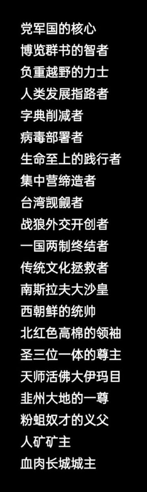
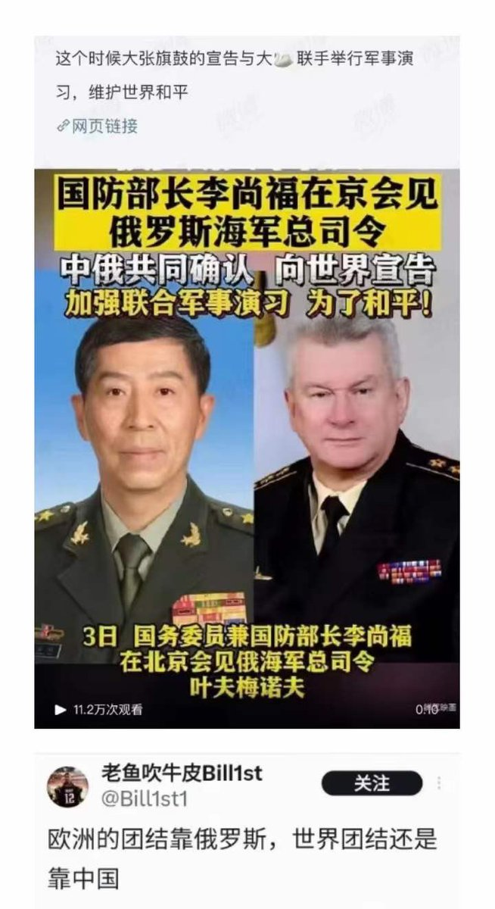
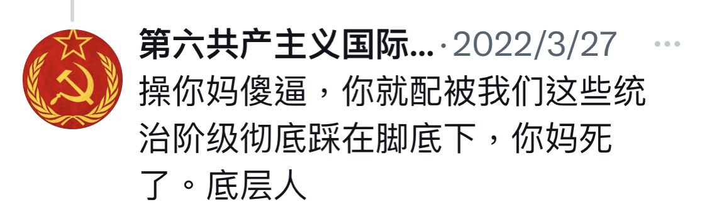
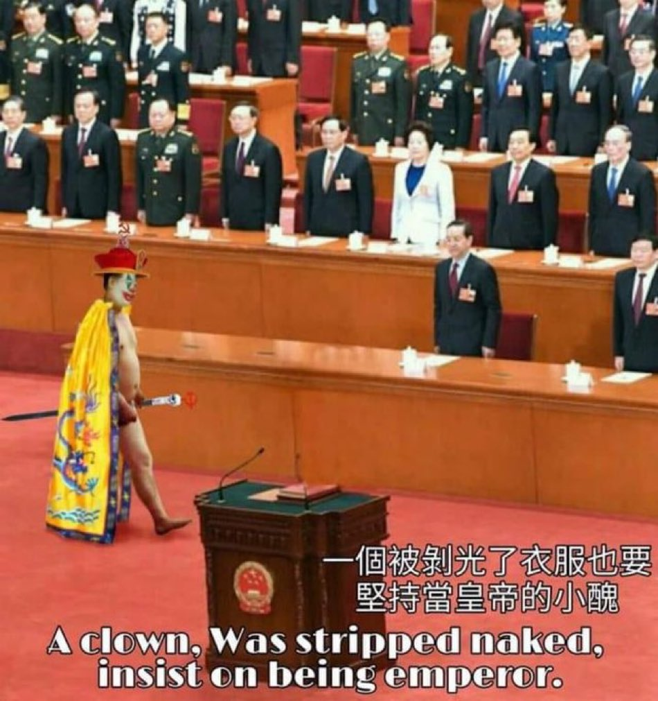

D每日反共 北京时间 2023-07-14T16:34:41Z 1679771384225095680 https://t.co/r57EITJkje   D每日反共 北京时间 2023-07-14T11:02:05Z 1679687683348774912 当年日本人来了，都没这么横👇 https://t.co/Ar9QjvEL8z   D每日反共 北京时间 2023-07-14T11:02:43Z 1679687841985736704 它是谁？😁 https://t.co/L9RJmVcO7g   D每日反共 北京时间 2023-07-14T11:45:44Z 1679698668935577600 和失败者加速绑定，还没见过这么蠢的😅 https://t.co/vs8uxbTX22   D每日反共 北京时间 2023-07-14T10:13:35Z 1679675478796541952 RT @gushenyiren8964: 共產馬列蘇維埃的真面目：

奪權前牠們說：
我們為人民服務，底層人要當家作主。

奪權後牠們說：
👇🏻 https://t.co/qq2xu0lTFk   D每日反共 北京时间 2023-07-14T10:14:45Z 1679675771668041728 没错，它就是一个被剥光了衣服也要坚持当皇帝的小丑🤡 https://t.co/iRkGxdEsph   D每日反共 北京时间 2023-07-14T10:15:15Z 1679675896641495041 这就是共匪口中的“盛世”👇 https://t.co/x53xOSU0L9   