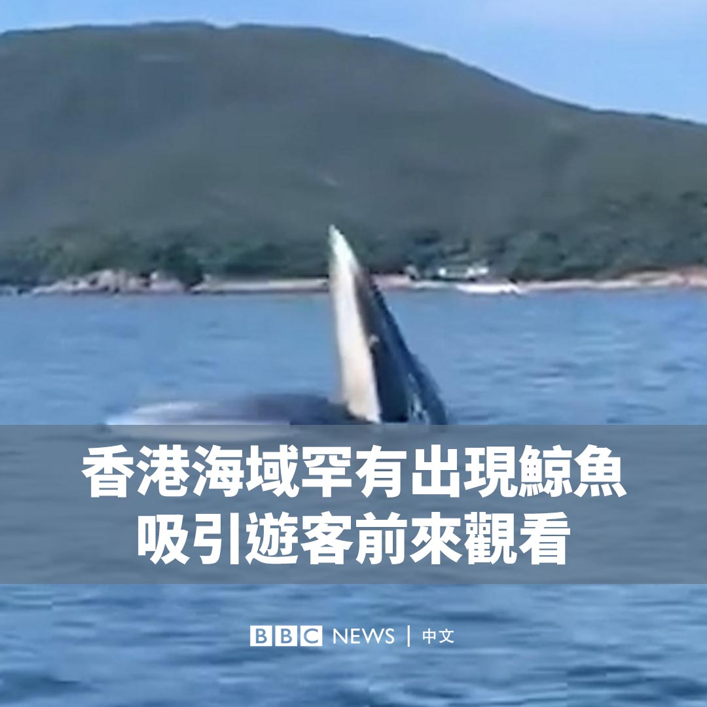
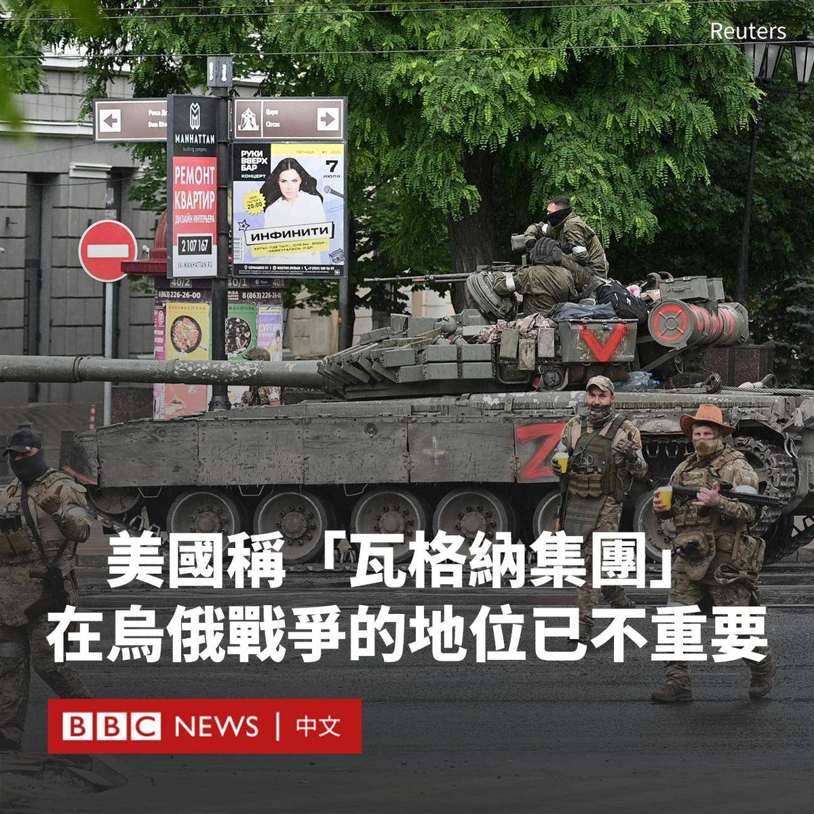
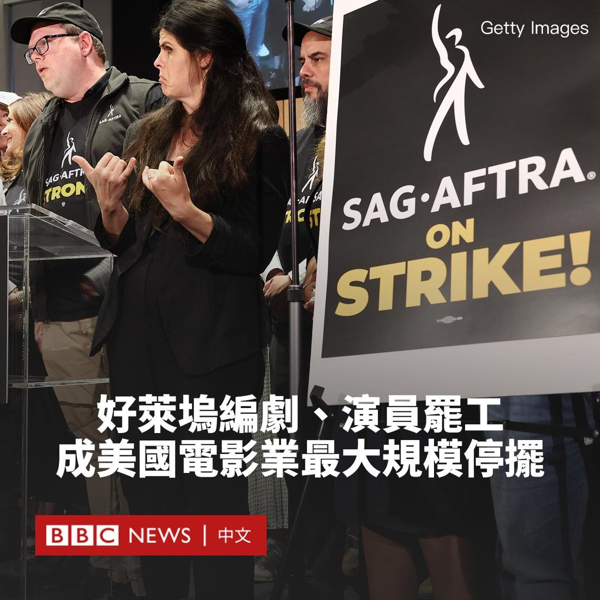
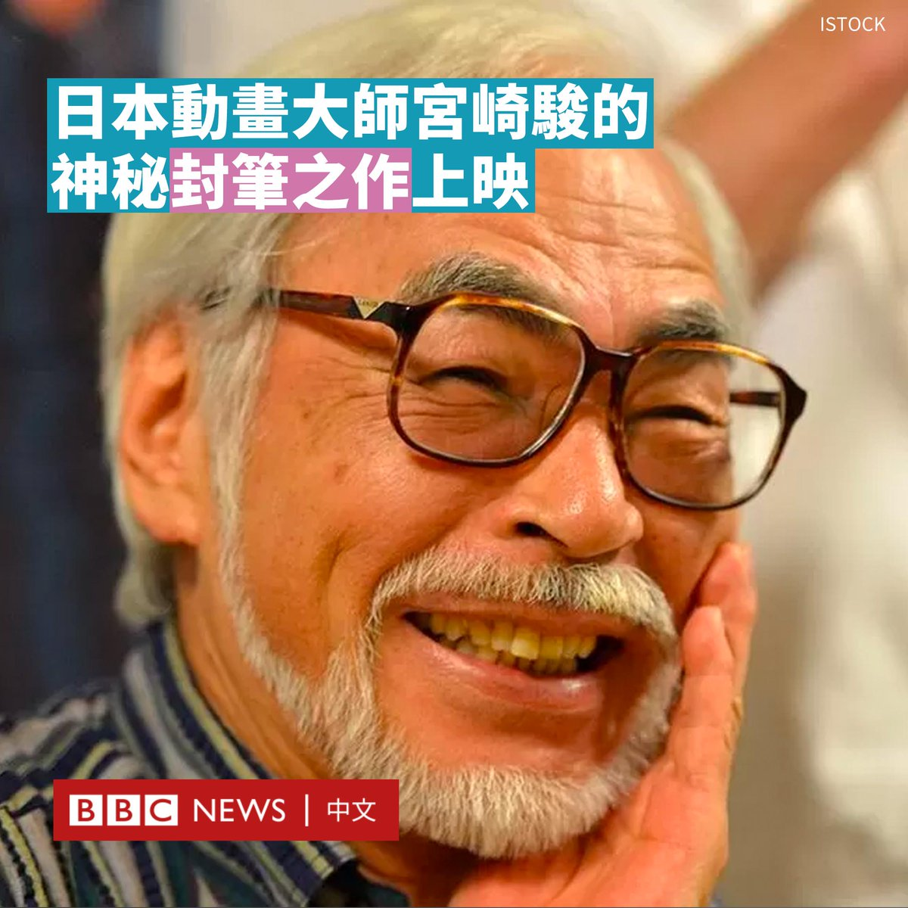
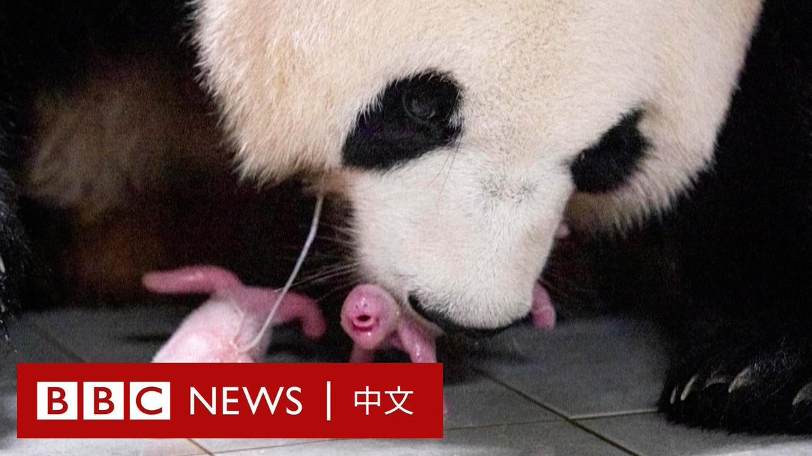
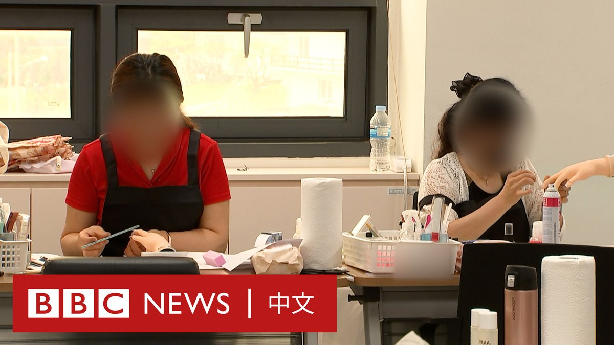

D英国广播公司BBC 北京时间 2023-07-14T19:33:22Z 1679816350632640512 香港白沙湾游艇会周四（7月13日）在西贡的南风湾拍摄到鲸鱼出没，影片在网上引起热议。

目击者、帆船教练莉莉（Lily Reid）和山姆（Sam Somerville）告诉BBC中文，该水域因为常有船只往来，鲸鱼出现非常罕见。 https://t.co/j0y0uqfZI8   D英国广播公司BBC 北京时间 2023-07-14T20:34:28Z 1679831730520485889 美国国防部表示，俄罗斯瓦格纳雇佣兵组织不再“参与任何支持在乌克兰作战行动的重要工作”。

瓦格纳被认为在2014年帮助俄罗斯吞并了克里米亚，并参加了最近在乌克兰境内的一些最血腥的战斗，例如巴赫穆特之战。

上个月，瓦格纳集团首领普里戈津（Yevgeny Prigozhin）发动兵变，挥师前往莫斯科，但他随后与克里姆林宫达成协议，反叛活动被平息。

本周早些时候，克里姆林宫表示，俄罗斯总统普京（Vladimir Putin）在叛乱后几天曾在莫斯科会见了普里戈津。

据俄罗斯媒体报道，普京称，在那次会面中他已经向瓦格纳战士明确了自己的提议，他们可以选择“继续服役”于俄罗斯正规军。

他说：“他们将由一直担任他们真正指挥官的人领导”。他还强调，私人军事组织不符合法律框架，并称从法律层面看“瓦格纳集团并不存在”。

当天早些时候，美国总统拜登（Joe Biden）在芬兰的新闻发布会上表示，普里戈津应该小心被毒害。

他说：“只有上帝知道他可能会做什么。我们甚至不确定他在哪里，他与普京有什么关系。如果我是他，我会小心我吃什么。我会关注我的菜单。”

拜登在赫尔辛基与北欧领导人举行峰会后还表示，普京没有可能赢得乌克兰战争。

拜登说：“他已经输掉了那场战争。”俄罗斯总统最终会“认识到继续这场战争对俄罗斯经济、政治或其他利益都不利。但我无法预测具体会发生什么。”   D英国广播公司BBC 北京时间 2023-07-14T17:18:23Z 1679782382143180800 好莱坞的演员们决定加入罢工编剧们的行列。美国演员工会（SAG）在与电影制片公司和串流媒体服务公司的合同谈判破裂后，周四（7月13日）午夜开始罢工。

好莱坞编剧自五月份起发动罢工行动，而演员的加入将导致美国电影行业陷入60多年来最大规模的停摆。

SAG是好莱坞最大的工会，代表16万电影和电视演员，他们希望在串流媒体时代下，获得更公平的利润分配机制和更好的工作条件。

此前，编剧工会要求在串流媒体时代提高编剧的工资待遇，并确保他们不会被人工智能取代。

演员工会与各大电影公司周三进行谈判后未能达成协议，于是决定罢工。

正式宣布罢工后，席尼·墨菲（Cillian Murphy）、马特·达蒙（Matt Damon）和艾米莉·布朗特（Emily Blunt）等明星提早离开了由克里斯托弗·诺兰（Christopher Nolan）编剧和执导的电影《奥本海默》（Oppenheimer）在伦敦的首映礼。

罢工行动于周五（7月14日）上午开始，演员们将前往奈飞（Netflix）加州总部门前开始抗议，然后前往派拉蒙影业（Paramount）、华纳兄弟（Warner Bros.）和迪士尼（Disney）。

SAG正式名称为“演员工会-美国电视和广播艺人联合会”（SAG-AFTRA），其要求确保不使用人工智能（AI）和计算机生成的虚拟面孔和声音来替代演员。

罢工期间，演员将不会前往片场拍摄，甚至无法宣传他们已制作的电影。   D英国广播公司BBC 北京时间 2023-07-14T16:15:30Z 1679766557986263041 宫崎骏执导的日本动画电影《你想活出怎样的人生》（How Do You Live）周五（7月14日）在日本上映，这可能是这位日本知名动画导演和动画师的封笔之作。

这部耗时七年的电影标题来自小说家吉野源三郎在1937年发表的同名著作，但故事情节由宫崎骏执笔。

这部电影以第二次世界大战期间的日本为背景，围绕着一个名叫牧真人的小男孩展开，他的母亲在轰炸中丧生。他对继母感到不满，而在被疏散的房子附近，他发现一座废弃的洋楼。

他被一只苍鹭告知，生母其实还活着，在洋楼等待救援，随后他开始了一场奇幻冒险。

该电影并未大张旗鼓地宣传，几乎采用“零宣发”上映，上映前几乎没有故事内容和演员阵容等，也没有预告片，仅有一张神秘的海报。

这种反公关行动是吉卜力工作室经理、该片制片人铃木敏夫的一项策略。他在今年6月对媒体表示：“我认为发布太多信息会降低观众的兴趣。”

周五下午，对东京新宿的几家影院进行的调查显示，上午和晚上的场次几乎售罄，但下午和午夜场仍有座位。

现年82岁的宫崎骏是日本殿堂级的动画大师，其三部电影《幽灵公主》、《千与千寻》和《哈尔的移动城堡》均跻身日本票房最高的十部电影榜单。

宫崎骏曾多次表示要退休，最近一次是在2013年发布动画电影《起风了》时，吉卜力工作室就对外宣布这将是宫崎骏的告别之作。

但是2016年，宫崎骏食言了，开始制作《你想活出怎样的人生》。考虑到他的高龄和制作电影的繁重过程，这可能是他的最后一部长篇作品。   D英国广播公司BBC 北京时间 2023-07-14T12:40:00Z 1679712323739500545 韩国迎来了该国第一对熊猫双胞胎。大熊猫“爱宝”顺利产下一对雌性双胞胎幼崽。两只宝宝出生时体重分别为180克和140克。 https://t.co/Gu0zUA2dyj   D英国广播公司BBC 北京时间 2023-07-14T13:47:28Z 1679729304098439168 你吃“白人饭”了吗？最近几周，一股新的饮食趋势席卷了中国的社交平台。

但当你点击这些带有“白人饭”标签的帖子，其中的照片并不是令人垂涎欲滴的大餐，也不是特别的新菜谱。相反，是一张又一张平平无奇，甚至让人没有什么食欲的午餐图片。

例如，几片面包配上蔬菜和蘸酱，或是火腿片搭配烤土豆和鸡蛋。

目前尚不清楚谁最先发明了这个词，但许多使用者都表示，其灵感源自北美和欧洲人吃午餐的方式。

许多帖子并未批评西餐，但带一些嘲讽意味。一些博主认为，这种饭食味如嚼蜡，但优点在于简单和健康，这对于很多忙碌的年轻上班族来说尤为重要。

“饿不死就行。糊弄一天是一天，主打一个省事！”一名小红书网友写道。

中国人对食物的热爱有悠久的历史，甚至人们常用“你吃了吗”来互相问候。但随着职场竞争的日益激烈以及上升的经济压力，以热食居多、需要慢慢烹调的传统中餐对许多年轻人来说，变得耗时耗力。

还有一些人认为，“白人饭”虽然不好吃，但更加清淡，对于久坐不动的人来说可以降低脂肪摄入，让自己更加健康。

在Tiktok和推特上，“白人饭”一词也引发了一些西方用户的关注。一名加拿大推特网友调侃道：“这不是白人的食物，它是‘极简主义’。”

但也有人担忧，这种基于人种的简单归类会强化“刻板印象”：“很多国家都是白人，大家并不一样。”   D英国广播公司BBC 北京时间 2023-07-14T11:12:18Z 1679690254247182338 中国西南部的四川省多地持续经历暴雨，绵阳市一座在建大桥上的积水垂泻，宛如巨大的水帘。 https://t.co/Zqjwq9vQ6w   D英国广播公司BBC 北京时间 2023-07-14T10:31:00Z 1679679860032020483 坐落在距首尔大约两个小时车程的乡村，“统一院”（Hanawon）是韩国为逃离朝鲜的难民提供支持的机构。

在这里，初来的“脱北者”学习电脑等生活技能，以快速融入韩国社会。 https://t.co/DhVlZx9JOH   D英国广播公司BBC 北京时间 2023-07-14T09:19:36Z 1679661891063300099 近日卷入付费购买色情图片丑闻的BBC主播，被确认是休·爱德华兹。他是英国最知名的新闻主播之一，参与多个重大事件报道，包括宣读女王逝世的消息。

爱德华兹目前遭到停职。伦敦警方表示，没有证据显示他有刑事犯罪行为，BBC则表示将继续其内部调查。https://t.co/s4TgzKMfUa   