美国之音中文网 北京时间 2023-07-14T22:37:31Z 1679862695321825283 美国总统拜登13日在赫尔辛基参加与北欧国家的峰会时表示美国不确定俄罗斯雇佣军瓦格纳集团首领普里戈津在哪里，并且说“如果我是他, 我会对自己吃的东西很小心” 。 https://t.co/8Pn8JJ9p04 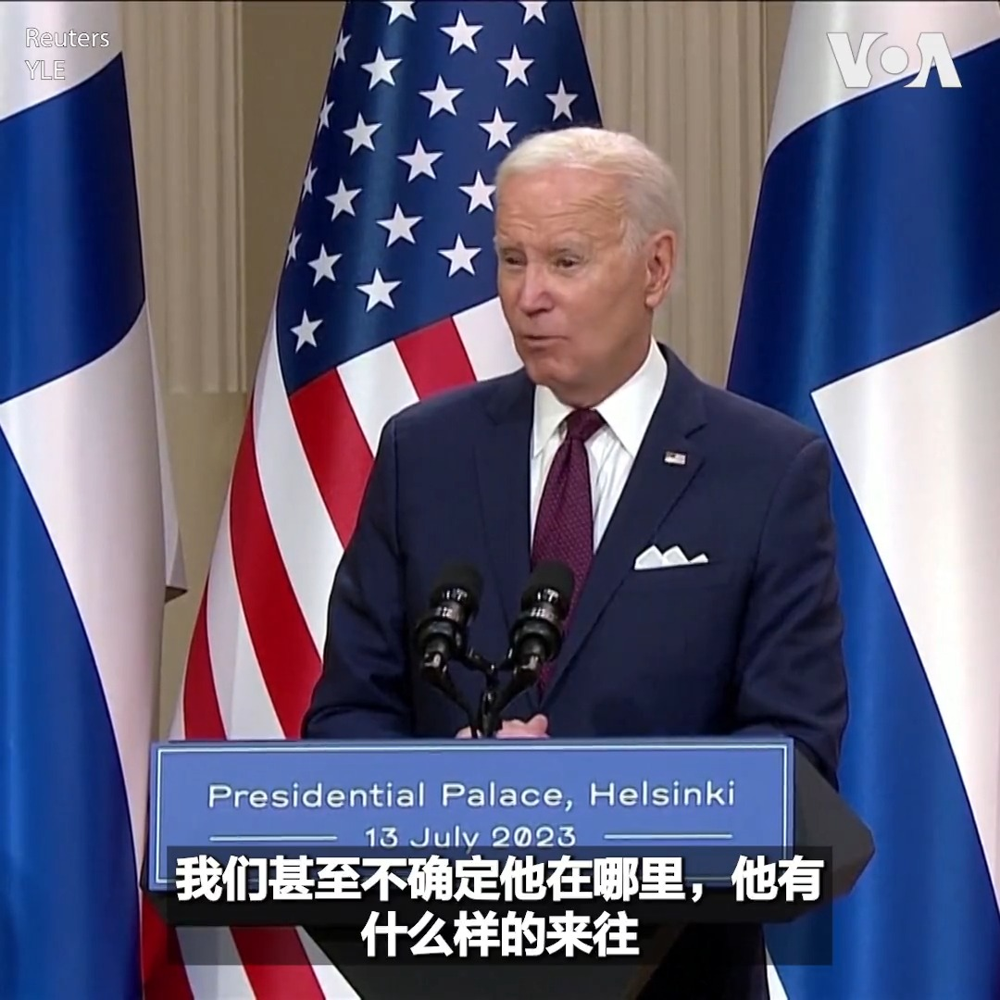  美国之音中文网 北京时间 2023-07-14T23:14:32Z 1679872012548808704 一名乌克兰军人7月13日展示了乌军如何利用自制无人机在东部城市巴赫穆特地区与俄军作战。这名代号Skiba的军人说，乌军自主研发的“自杀式”无人机可以携带爆炸装置直接撞向俄军车辆。 https://t.co/hUMSXReIiW   美国之音中文网 北京时间 2023-07-14T23:41:29Z 1679878790787522560 日本外交大臣林芳正星期五（7月14日）在与中共中央政治局委员、中央外事办主任王毅会晤时，呼吁北京以“科学态度”对待日本福岛核电站废水排海问题。 https://t.co/dSQzBRqTSj   美国之音中文网 北京时间 2023-07-14T21:00:02Z 1679838161923629056 太平洋岛国所罗门群岛和中国本周签署警务合作协议，引澳大利亚及其盟邦的高度关切，并敦促公布警务协议的细节。所罗门群岛总理办公室周五（7月14日）通过声明表示，中国能在网络安全和社区警务方面提供1500名警力的帮助，并反驳西方对协议可能“威胁到太平洋区域和平”的指称。 https://t.co/GWWhGkh6Uu   美国之音中文网 北京时间 2023-07-14T21:00:46Z 1679838349085876226 7/14【#时事大家谈】“树立正确的就业观”，人民日报到底想说啥？雄安搬迁“纸面疏解”+“变相回流”，习近平蔡奇们怎么办？   

嘉宾：政论作家、独立学者吴祚来先生、“中国战略分析智库”研究员邓聿文先生
主持人：陈小平  

Youtube🔗 https://t.co/9wIrwiiIsf https://t.co/sI8vC2Be4I   美国之音中文网 北京时间 2023-07-14T21:30:02Z 1679845711381417984 美国国会议员周四（7月13日）指控中国共产党正在利用胁迫性经济行为来实现超越美国，称霸全球的主导地位。 https://t.co/0k1CZwGjNw   美国之音中文网 北京时间 2023-07-14T22:10:40Z 1679855938029735938 美国总统气候问题特使约翰·克里7月13日说，他希望对中国的访问有助于恢复双边关系的稳定，并促成两国在气候问题上的合作。克里是在国会众议院外交事务委员会接受质询时这样说的。克里将于16日至19日访问中国。 https://t.co/OqJxRehJb9 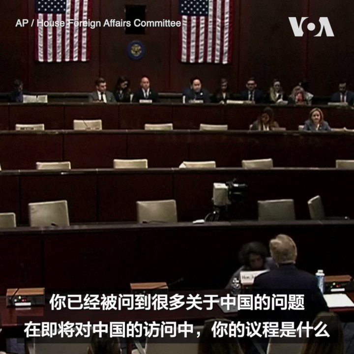  美国之音中文网 北京时间 2023-07-14T18:41:22Z 1679803265695793152 俄罗斯的军事装备在俄乌战场上表现不佳，分析人士表示，中国武器系统基本上跟俄罗斯是“师出同门”，同属俄系，中国的军火销售也可能会受到波及。中国的战狼外交更加深限制了中国武器出口的契机。报道：https://t.co/0Lgcebtvtg https://t.co/pbTWxs4byG   美国之音中文网 北京时间 2023-07-14T18:47:15Z 1679804744850898945 美国国会共和党人敦促拜登政府加大调查力度，要求美国高校履行申报收受外国捐赠的法律义务。共和党人说，美国高校体系不透明的财物捐赠申报制度正在被中国共产党所利用，使其对美国校园施加不正当的影响力。 https://t.co/hNGAAOzDua   美国之音中文网 北京时间 2023-07-14T19:08:30Z 1679810092827308032 美国会众院中国特设委员会 @committeeonccp 周四召开听证会聚焦在华美企面临的风险。“ 你可能一觉醒来，发现你的中国梦变成了中国噩梦，”委员会首席克里希纳莫提会后对美国之音说。委员会主席加拉格尔表示，虽然美企已开始意识到风险，但国会仍亟需通过一项资本外流监管法案。https://t.co/jsIqvzbELa https://t.co/F0EFYSMeMj 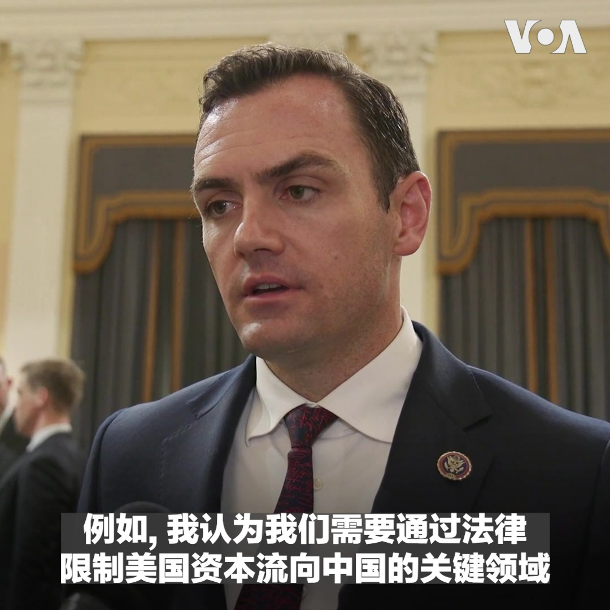  美国之音中文网 北京时间 2023-07-14T19:53:57Z 1679821531504070657 7月13日是中国的诺贝尔和平奖得主刘晓波逝世六周年纪念日。周四（7月13日），位于纽约的《六四纪念馆》举行了刘晓波追思会，放映了纪念刘晓波的记录片，他的前好友介绍了他对推动中国民主事业做出的杰出贡献，并在中央公园刘晓波长椅前举行烛光纪念活动。 https://t.co/URimAxWuS8   美国之音中文网 北京时间 2023-07-14T20:02:03Z 1679823569528950788 为了在远程打击火力方面与中国公平竞争, 美国国会众议院美国与中共战略竞争特设委员会主席加拉格尔和爱荷华州联邦共和党参议员恩斯特日前撰文，呼吁五角大楼制定抑制中国导弹优势的战略，制定操作环太平洋火力的规则，在整个太平洋区域部署可信的战斗力，削弱中国的主场优势。 https://t.co/TGVTFWc2uu   美国之音中文网 北京时间 2023-07-14T20:09:05Z 1679825342314184704 美国国务卿布林肯14日在雅加达与东南亚国家联盟外长们在举行会议前身穿印尼传统服装拍集体照。 https://t.co/KYE6dwMl6E   美国之音中文网 北京时间 2023-07-14T20:12:39Z 1679826239820042240 著有《红色赌盘》一书的中国商人沈栋以自己亲身经验向美国国会提出警示，与中国做生意他学到的第一课是“游戏规则是由共产党说的算”。随着中国有关反间谍法规更新生效，愈来愈多人担心在中国经商的风险日益增高。有国会议员向美企喊话称，现在是时候看清真相“摘下金色眼罩了”。 https://t.co/GUIQFFgGXa   美国之音中文网 北京时间 2023-07-14T20:30:01Z 1679830609601105926 中国国家主席习近平上月接待巴勒斯坦总统马哈茂德·阿巴斯（Mahmoud Abbas）时提到，愿为巴勒斯坦和以色列和谈发挥积极作用。专家表示，中国在为以色列和巴勒斯坦之间实现和平的努力，很高机率将会以失败收场，但可能会形塑出美国在该地区的影响力正在减弱的形象。 https://t.co/p6RlNNIoXR   美国之音中文网 北京时间 2023-07-14T18:14:13Z 1679796431886925825 中国黑客近日攻破几个美国政府部门的电邮系统，连商务部长雷蒙多也遭殃。美国会众院中国特设委员会 @committeeonccp 主席迈克.加拉格尔7月13日在接受美国之音采访时对此感到担忧，“在我看来，这一切都是为了可能对台湾采取行动做准备“。他认为，在雷蒙多成了黑客目标后还去中国，“会发出错误信号”。 https://t.co/swCwqA9lRI 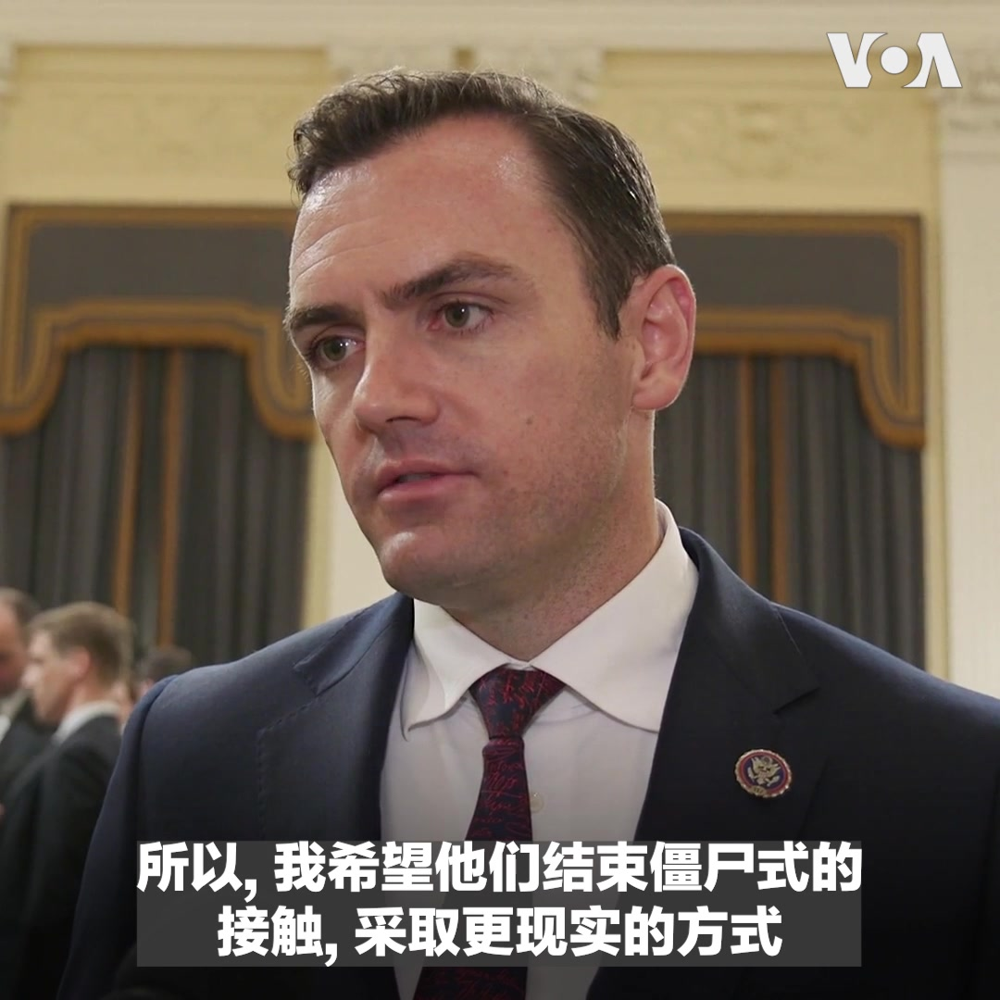  美国之音中文网 北京时间 2023-07-14T06:45:41Z 1679623159585075200 美国国会众议院中国特设委员会将在美东时间7月13日晚间7时召开听证会，聚焦讨论中国经商环境和风险。前北京政协委员，中国商人也是《红色赌盘》一书作者沈栋将列席作证。美国之音从6点45分起在官网、YouTube频道和推特平台进行同传直播，敬请收看。 https://t.co/TZw0j2lyzu   美国之音中文网 北京时间 2023-07-14T12:27:33Z 1679709190972116993 南非总统西里尔·拉马福萨(Cyril Ramaphosa)周四(7月13日)欢迎华为(Huawei)在约翰内斯堡开设新的创新中心，称赞这家中国公司“对南非经济及其潜力充满信心”。 https://t.co/S0jLfHj6O4   美国之音中文网 北京时间 2023-07-14T12:57:17Z 1679716673497227264 中国最高外交主管王毅星期四(7月13日)在雅加达会晤了俄罗斯外交部长谢尔盖·拉夫罗夫，他表示北京将加强与俄罗斯的战略沟通协调。同天早些时候，王毅会晤了美国国务卿安东尼·布林肯。

 https://t.co/uvehfqy7xp   美国之音中文网 北京时间 2023-07-14T14:00:11Z 1679732501802283009 对于中国黑客入侵包括美国国务院和商务部等政府部门电邮系统，白宫国安会战略沟通协调员科比13日在接受美国之音专访时表示，已立即采取行动来保护系统并减轻损害。至于这是否会影响未来几周美国高官访问中国，科比强调，两国间需有“开放的沟通渠道”来“进行艰难的对话”。 https://t.co/o14AGluuh5   美国之音中文网 北京时间 2023-07-14T11:28:25Z 1679694312114900993 美国演员们决定加入罢工编剧们的行列，这将对好莱坞产生巨大影响。代表演员的工会-美国电视和广播艺人联合会(SAG-AFTRA)领袖在与聘用演员的制片厂和流媒体服务公司的合同谈判破裂后，于星期四(7月13日)投票决定罢工。

 https://t.co/E6GexXUfMZ   美国之音中文网 北京时间 2023-07-14T12:18:42Z 1679706963163111425 《红色赌盘》作者沈栋7月13日出席美国国会众议院中国特设委员会@committeeonccp 听证会，谈在华美企所面临的风险。他用三个自己亲身经历的人生故事向美国国会议员说明在中国做生意的本质，以及他从中学到的教训。 https://t.co/dEHDHViQzb 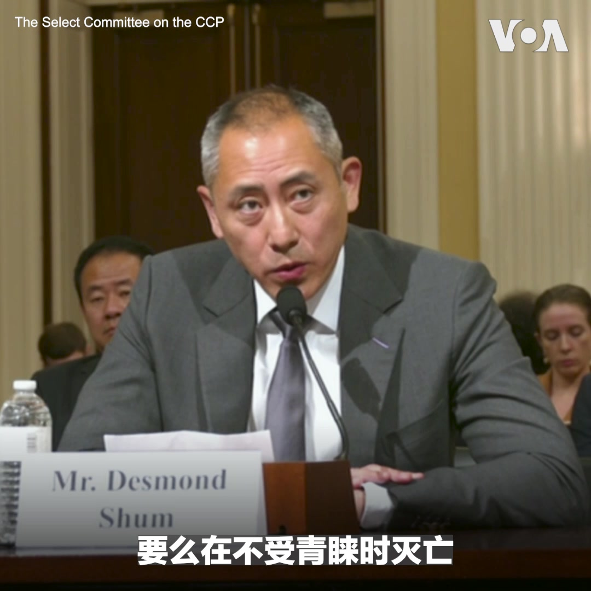  美国之音中文网 北京时间 2023-07-14T10:30:01Z 1679679615231721473 来自中国的黑客活动在今年6月前攻破了美国商务部和国务院等几十个机构的电邮系统，包括商务部长吉娜·雷蒙多(Gina Raimondo)的邮箱。雷蒙多预计在今夏访问中国。这次的黑客行动引起了不少针对拜登政府尝试与中国缓和关系做法的质疑。 https://t.co/r8FiR2VAMK   美国之音中文网 北京时间 2023-07-14T10:49:42Z 1679684567366598656 乌克兰希望能够快速成为北约成员国，北约领导人则表示现在不是接纳乌克兰入盟的合适时机，但北约峰会重申支持乌克兰加入这个军事联盟。北约2008年原则上同意让乌克兰加入，但一直以来都没有明确的乌克兰入盟路径。加入北约需要哪些条件？乌克兰到底何时能够入盟？ https://t.co/cze1w62oTN   美国之音中文网 北京时间 2023-07-14T06:24:15Z 1679617762887454721 北约实现历史性扩张，继芬兰后，瑞典也将入盟。俄方表示将采取措施回应。台湾“军情与航空”网站主编施孝玮先生认为，瑞典、芬兰将成为围堵俄罗斯海空力量的重要前哨，北约预置式军力部署足以喝阻俄军，再加上乌战的耗损，未来十年俄罗斯都不太可能再有军力挑战北约。完整版：https://t.co/JIaO1Hoa3s https://t.co/QImkgVpDEa 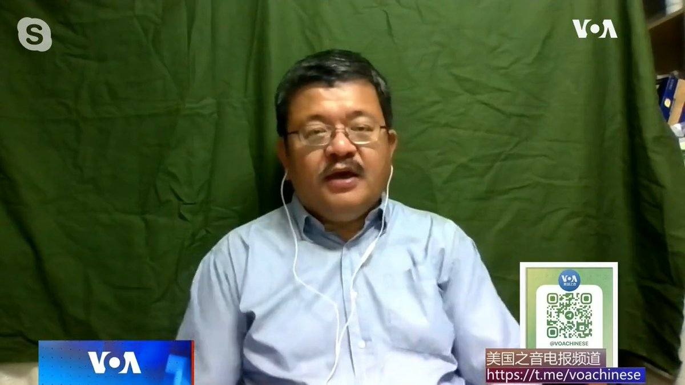  美国之音中文网 北京时间 2023-07-14T07:00:00Z 1679626761053827073 《人民日报》发表文章《树立正确的就业观》，有分析指出这个建设性意见完全符合主要领导的口味，此解成立 ？到农村去吃苦就是当今正确就业观？首批疏解去雄安新区名单上的高校拒绝整体搬迁、搞一校两区，习近平蔡奇双打能解“纸面疏解”和“变相回流”？ 请收看美国之音7月14日上午9点《时事大家谈》 https://t.co/ijVwekPxFg   美国之音中文网 北京时间 2023-07-14T07:09:07Z 1679629055711383552 美国总统乔·拜登(Joe Biden)星期四(2023年7月13日)表示，正在与俄罗斯进行谈判，以释放《华尔街日报》记者埃文·格什科维奇(Evan Gershkovich)。这名美国记者因间谍罪名被关押在莫斯科监狱已超过100天，但他否认这一指控。 https://t.co/uWW80Agzsu   美国之音中文网 北京时间 2023-07-14T07:45:02Z 1679638092318400512 莫桑比克前财政部长周二(7月11日)被送上一架美国飞机，从南非飞往纽约，他将在美国面临欺诈和洗钱的指控。 https://t.co/066Ba9JygC   美国之音中文网 北京时间 2023-07-14T08:00:01Z 1679641865606373376 克里姆林宫日前对外公布，瓦格纳兵变后五天，普京与普里戈津等瓦格纳高层会谈近3小时。时政评论人小民先生认为，克宫是在为普京挽回面子，兵变不可能是“二普”演的双簧，普京曾用雇佣军和正规军相互牵制，而兵变证明他“玩儿鹰被鹰啄了眼”。时事大家谈完整版：https://t.co/JIaO1Hoa3s https://t.co/ZpJBfjHfCV 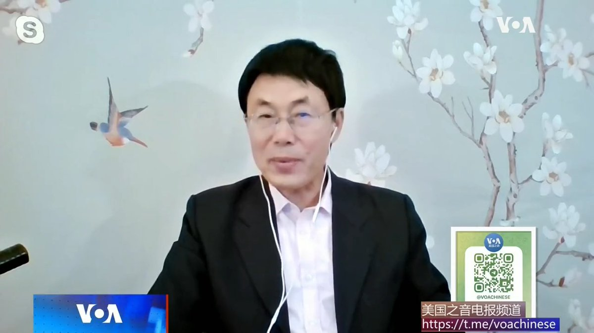  美国之音中文网 北京时间 2023-07-14T08:03:35Z 1679642761794822144 “维尔纽斯峰会是北约正在成为一个全球安全会议的最好例子,”立陶宛议会议员马尔德基斯7月13日在维尔纽斯接受美国之音专访时说。在他看来，北约向印太转向不仅是必要的，也是历史的必然。他批评法国总统马克龙反对北约转向印太是以欧洲和日本的安全为代价来获取中国的市场。 https://t.co/9aFo4sF8D6   美国之音中文网 北京时间 2023-07-14T08:10:27Z 1679644490628497408 美国总统乔·拜登(Joe Biden)结束欧洲三国之行之际发表了一份支持北约的响亮声明，试图缓解欧洲对美国政府更迭将意味着华盛顿与其跨大西洋盟友关系面临不确定性的担忧。 https://t.co/4EQfPnqVSW   美国之音中文网 北京时间 2023-07-14T08:28:32Z 1679649042546958346 7月13日是中国诺贝尔和平奖得主刘晓波逝世6周年纪念日。周四，位于纽约的《六四纪念馆》举行刘晓波追思会，放映了纪念刘晓波的记录片，他的生前好友介绍了他对推动中国民主做出的杰出贡献，并在中央公园举行烛光纪念活动。 https://t.co/Y4X62dZJaZ 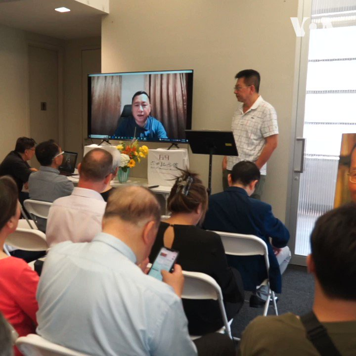  美国之音中文网 北京时间 2023-07-14T08:30:01Z 1679649413495668736 美国国会参议院外交关系委员会星期四(7月13日)在一个口头表决中通过了2023年《台湾税收协定法》 (S. 1457 Taiwan Tax Agreement Act of 2023)，此一法案旨在授权拜登行政当局与台湾协商并完成美台之间的税收协定https://t.co/9Kn3AJZfJa   美国之音中文网 北京时间 2023-07-14T09:23:02Z 1679662755006279681 #揭谎频道   2023年7月7日，美国销毁最后一批化学武器后，中国批评华盛顿没能遵守《禁止化学武器公约》规定的最后期限。 然而北京并没有指出处于居民安全考量，美国需要额外的时间来寻找更安全的方法处理这些致命武器。 https://t.co/NXuK8rnesp   美国之音中文网 北京时间 2023-07-14T09:50:13Z 1679669598751186945 对于中国黑客入侵包括美国国务院和商务部等政府部门网络，白宫国安会高官约翰.科比7月13日在接受美国之音@voayyh 专访时表示，已立即采取行动来保护系统并减轻损害，联邦调查局正对此进行调查。至于这是否会影响未来几周美国高官访问中国，科比强调，两国间需有“开放的沟通渠道“，来“进行艰难的对话”。 https://t.co/nylzy6d1zq 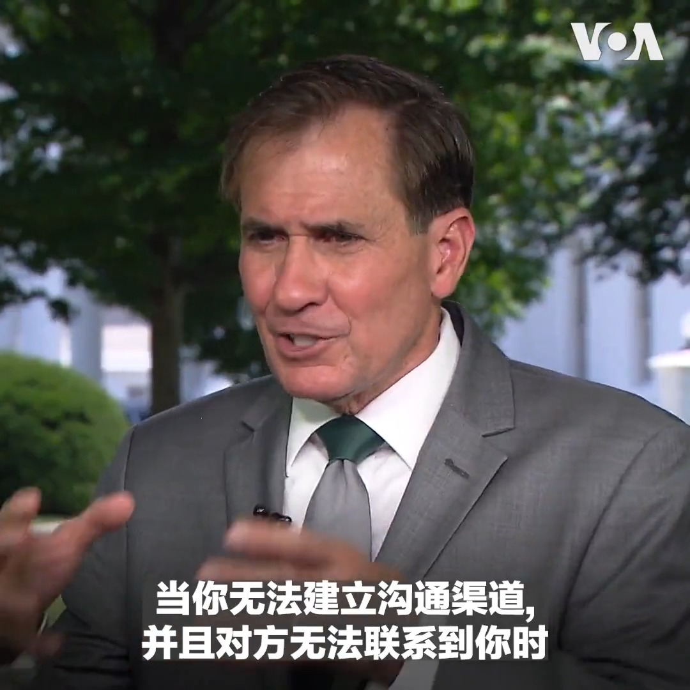  美国之音中文网 北京时间 2023-07-14T04:24:35Z 1679587649600856066 北约峰会7月11日发布公报，再次谴责中国的野心和“胁迫性政策”挑战北约的利益、安全和价值观，对欧洲-大西洋地区安全构成“系统性挑战”。中国则指责北约“罔顾基本事实，肆意歪曲中方立场和政策，刻意抹黑中国”，北约公报与以往有什么不同？ 北约到底担心中国什么？报道内容：https://t.co/c50hET5bz2 https://t.co/sJPwjiEANI 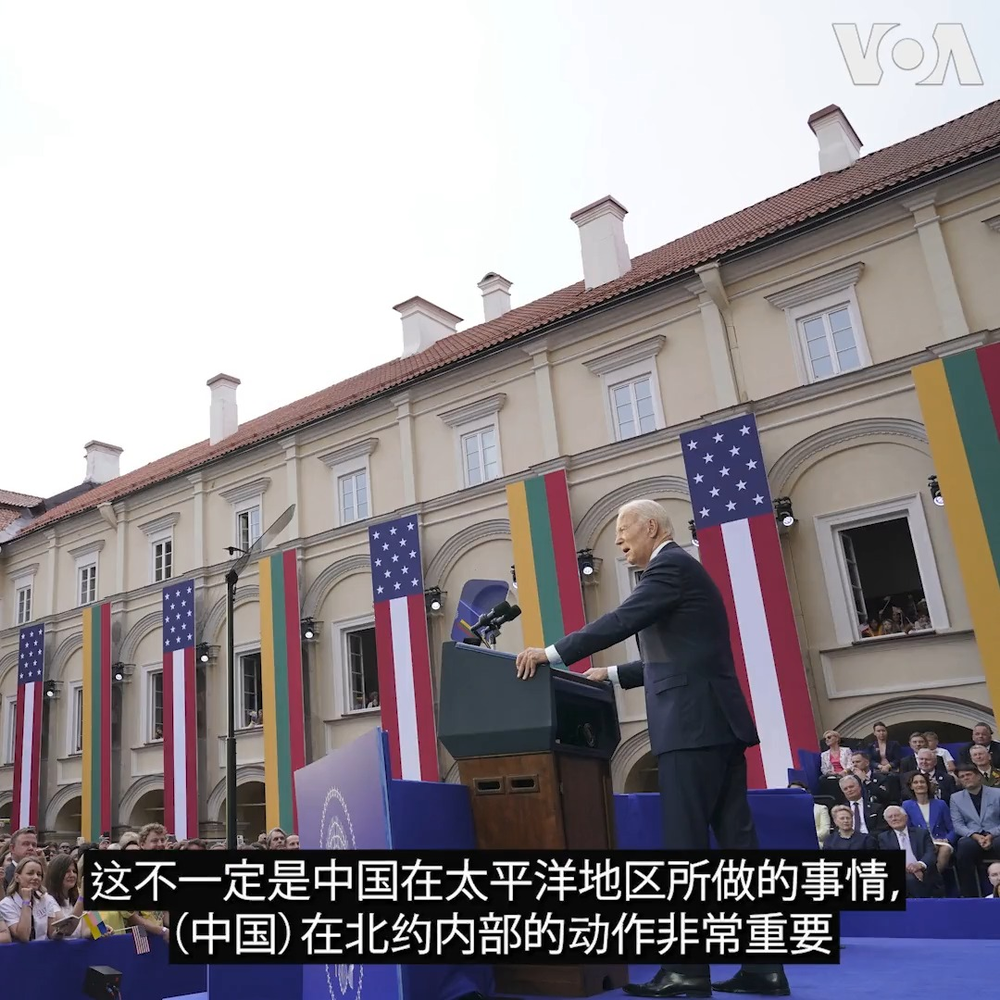  美国之音中文网 北京时间 2023-07-14T05:07:22Z 1679598416777838592 国际奥委会拒绝向俄罗斯和白俄罗斯发出参加2024年巴黎奥运会的正式邀请。国际奥委会星期四(2023年7月13日)表示，俄罗斯和白俄罗斯将不会收到参加2024年巴黎奥运会的正式邀请，而本月晚些时候将有200多支国家队按传统方式收到邀请。 https://t.co/jeNodjHBnF   美国之音中文网 北京时间 2023-07-14T05:11:44Z 1679599514880024577 “这就像一个里程碑，表明我们走在正确的道路上，”立陶宛议会议员马尔德基斯(Matas Maldeikis)13日接受美国之音专访，谈到拜登总统12号发表的演讲时这么说。台湾驻立陶宛代表黄钧耀对美国之音表示，拜登演说最令人印象深刻的是他对立陶宛人民追求自由民主和不畏强权威迫精神的强调。 https://t.co/C14hszykZ1 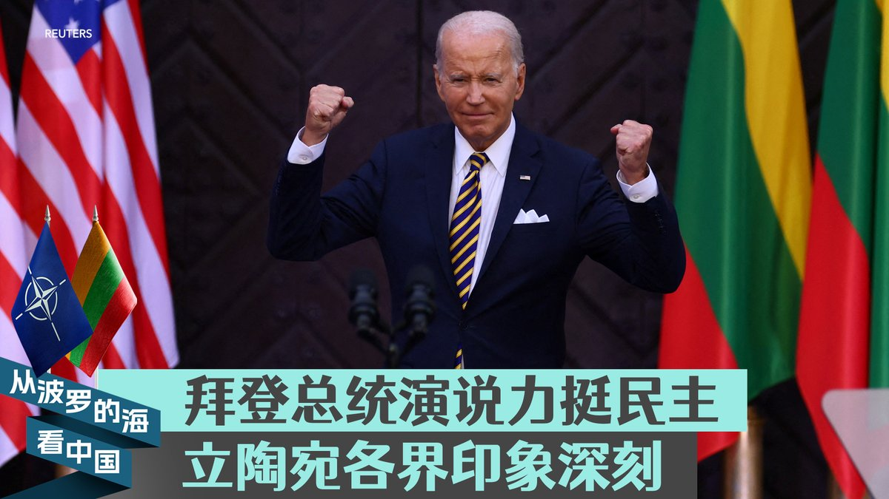  美国之音中文网 北京时间 2023-07-14T05:43:00Z 1679607382366646280 德国政府公布了酝酿已久的中国战略，该战略提出了去风险和降低对中国依赖的总体目标，这是德国历史上首份中国战略，这份文件的目的旨在更加现实地评估德国与中国合作的挑战和机遇。 https://t.co/70VXwZLjyJ 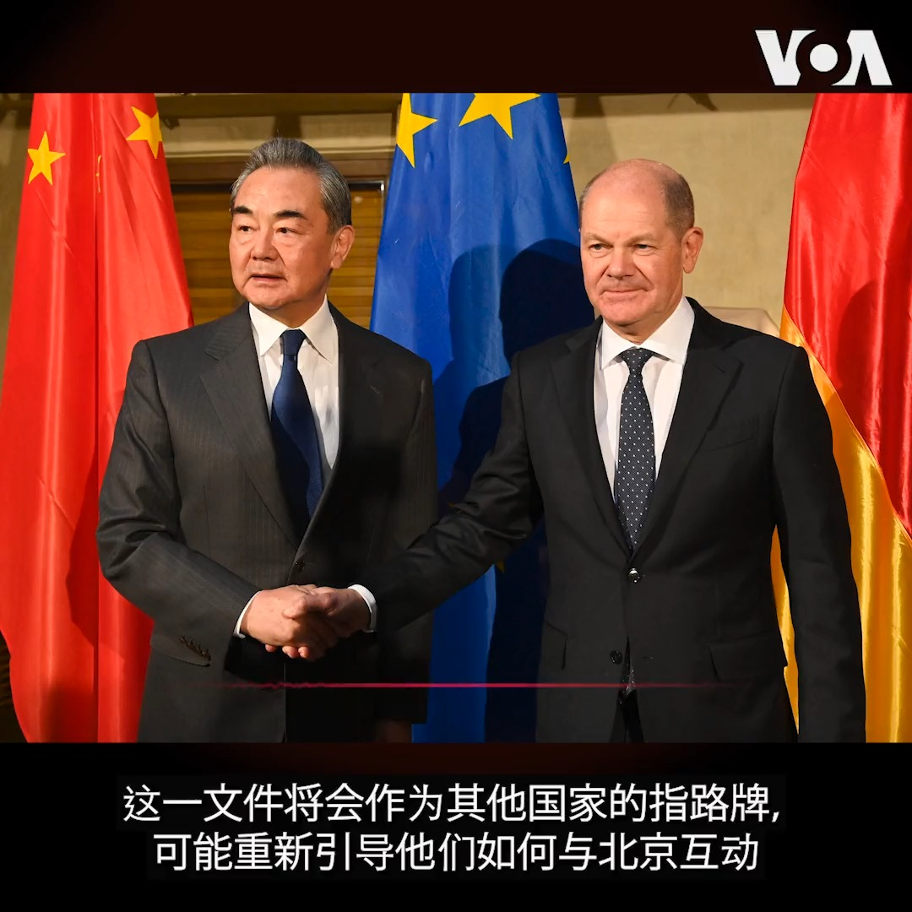  美国之音中文网 北京时间 2023-07-14T06:01:21Z 1679612003596537858 德国政府星期四(7月13日)公布了人们等待已久的对华关系战略，指出了德国与这个亚洲巨人是“系统性对手”并且需要减少经济依赖风险，但是也强调柏林方面希望与北京共事，应对气候变化等挑战并维持贸易关系。 https://t.co/T17DTuy3VJ   美国之音中文网 北京时间 2023-07-14T02:36:39Z 1679560486407360512 德国政府13日公布了中国战略。德国外交部长贝尔伯克在柏林的一个智库介绍这一战略时说 “我们不想和中国脱钩，但是要尽量减少风险” 。在经济方面，这一战略概括了减少在关键领域对中国依赖的提议，与欧盟此前达成的做法一致 。 https://t.co/Ms7iTwT6ft   美国之音中文网 北京时间 2023-07-14T02:41:19Z 1679561659898122243 美国国会众议院中国特设委员会将在美东时间7月13日晚间7时召开听证会，聚焦讨论中国经商环境和风险。目前流亡英国的前北京政协委员，同时也是《红色赌盘》作者的中国商人沈栋将与其他专家列席作证。美国之音将在官网、YouTube频道和推特平台进行同传直播，敬请收看。 https://t.co/78u6Q2d75d 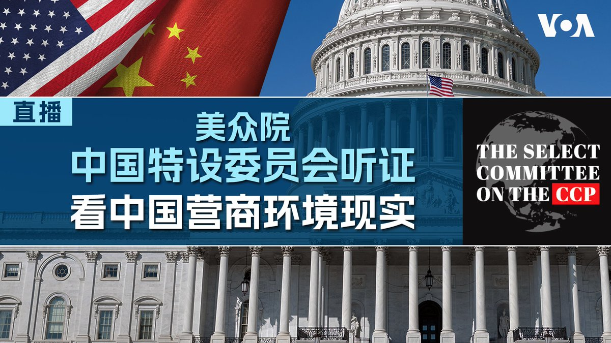  美国之音中文网 北京时间 2023-07-14T02:54:00Z 1679564852099178496 侵乌俄军一名高级将领因为向军方高层反映俄军士兵在乌克兰战场的真实惨状，谴责一些俄罗斯高级军官对俄军士兵支援不力形同背后捅刀，而被俄罗斯国防部撤职。https://t.co/3Q4M4ZPSKd   美国之音中文网 北京时间 2023-07-14T03:15:00Z 1679570137047789571 中国网络间谍利用微软云的一个基本漏洞，近日攻破了美国几十个机构的电邮系统，包括对中国技术公司实施严格出口限制的美国商务部及美国国务院的许多电邮账号，连商务部长吉娜·雷蒙多(Gina Raimondo)本人也未能幸免。https://t.co/IHm0mwphkX   美国之音中文网 北京时间 2023-07-14T03:50:59Z 1679579194781728769 分析人士表示，塔利班可能在将中巴经济走廊(CPEC)延伸至阿富汗的协议中取得了外交胜利，但该项目的实施仍面临挑战。
 https://t.co/uFVQ2Vck4g   美国之音中文网 北京时间 2023-07-14T00:30:00Z 1679528614478618624 中国与东盟（ASEAN）国家星期四（7月13日）同意努力在三年内完成一个拖延已久的不侵犯条约，以避免在繁忙的南中国海经常发生的领土争端演变成重大武装冲突。https://t.co/dSz0sUqLtE   美国之音中文网 北京时间 2023-07-14T00:45:00Z 1679532388710244353 美国和中国最高外交官员将在东盟会议期间会晤。

美国国务卿安东尼·布林肯将于星期四（7月13日）在印度尼西亚举行的东南亚国家联盟会议期间与中国最高外交官员王毅会面。https://t.co/hRMbxz2W7o   美国之音中文网 北京时间 2023-07-14T00:55:00Z 1679534904718282752 北大西洋公约组织（NATO）结束了在立陶宛首都维尔纽斯举行的为期两天的峰会。峰会发布公报重申中国对北约的“利益、安全和价值观”构成系统性挑战。公报同时表示，将加强与亚太伙伴的对话与合作。
https://t.co/c50hET5JoA   美国之音中文网 北京时间 2023-07-14T01:15:00Z 1679539938088591361 联合国星期四说，在苏丹西达尔富尔州的一个乱葬岗中发现了至少87具尸体。

联合国人权办公室的一份声明说，尸体是在朱奈纳市外发现的，死者包括马撒利特族成员。https://t.co/lJQLEgaMEO   