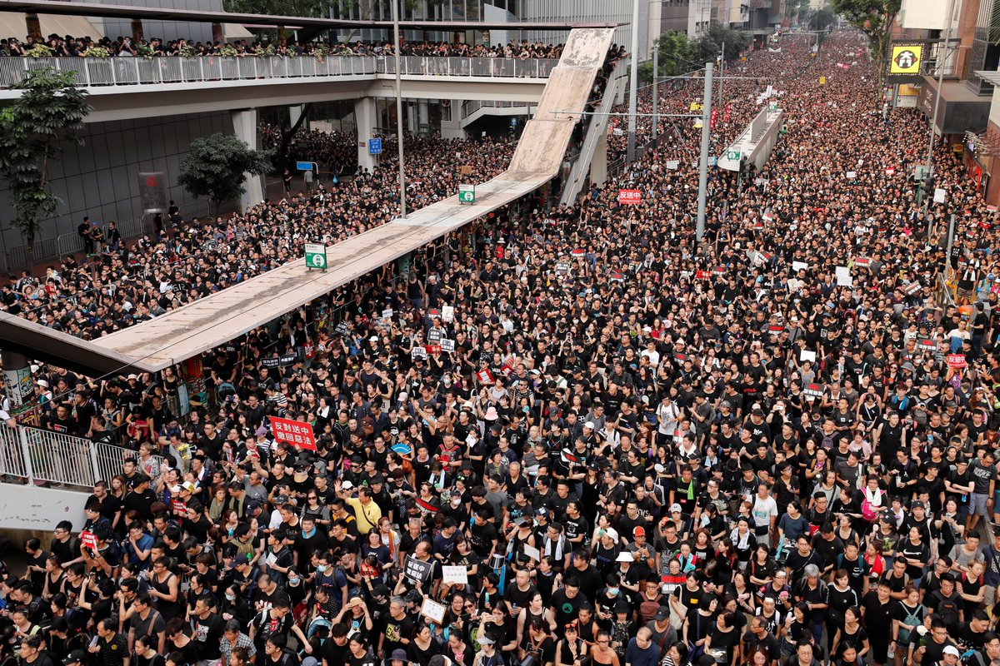
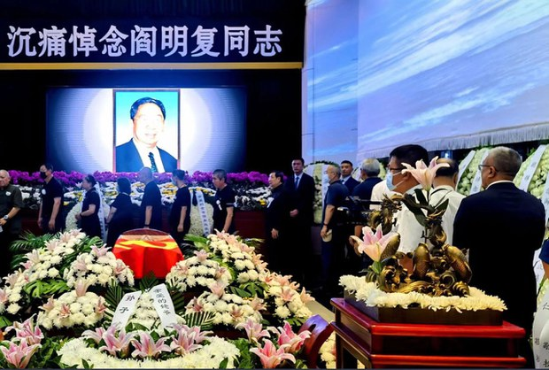
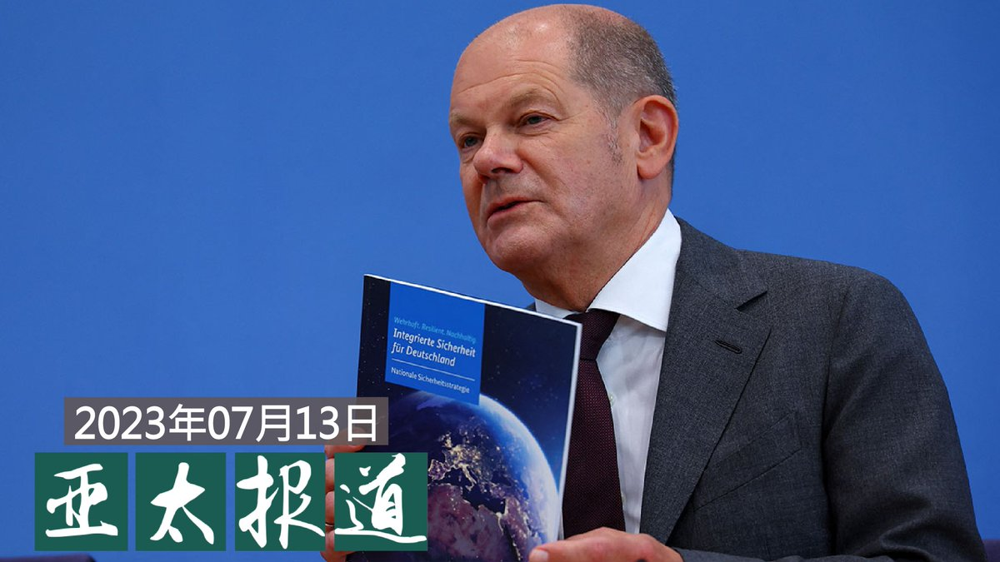
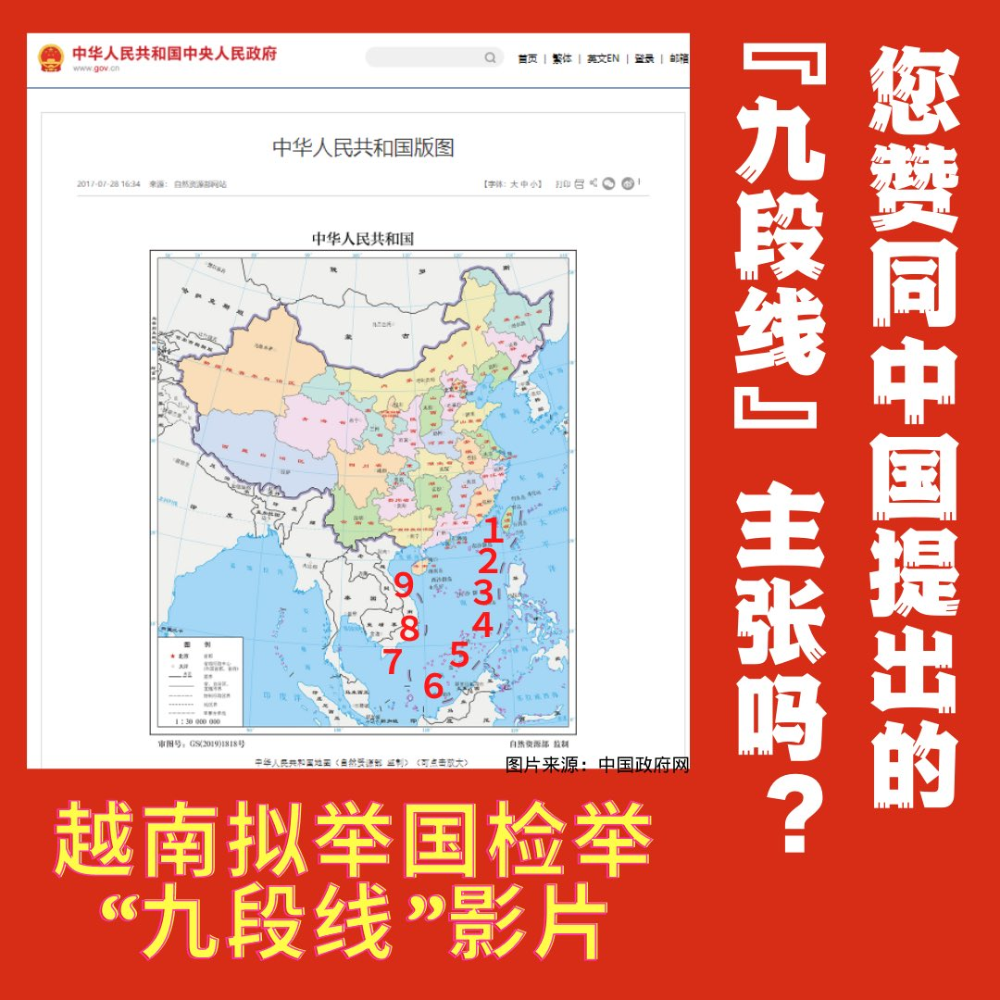
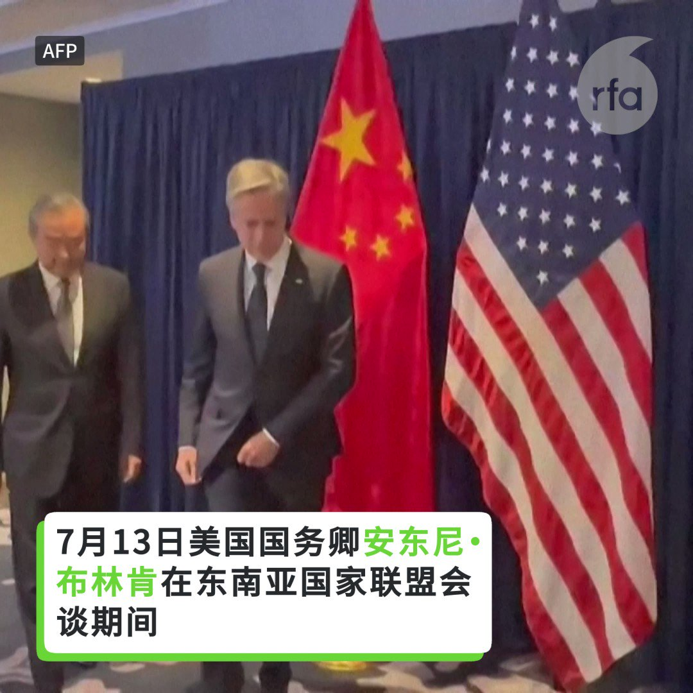
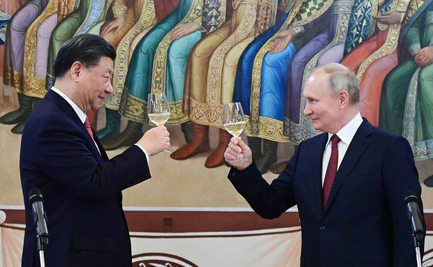

自由亚洲电台 北京时间 2023-07-14T23:48:52Z 1679880651091378178 “#消失的旗” https://t.co/LW4yJKttgP   自由亚洲电台 北京时间 2023-07-14T20:47:27Z 1679834995580452865 RT @RFA_Chinese: 【布林肯见王毅放狠话】
美国国务卿 #布林肯 在雅加达会见中国最高外交官 #王毅。虽然两国近期频繁互动，但在一系列贸易、安全和地缘政治问题上仍存在分歧。布林肯告诉王毅，美国将追究侵犯美国政府机构的 #黑客 责任。 https://t.co/1o…   自由亚洲电台 北京时间 2023-07-14T21:51:00Z 1679850989732626433 多伦多大学 #公民实验室（@citizenlab 周四（7月13日）公布最新的调查研究报告，显示公开2800名港人个人资料的"#香港解密"网站，极大可能是有组织进行的信息战，并与中国有关。

 https://t.co/dKXUHXY832   自由亚洲电台 北京时间 2023-07-14T22:07:14Z 1679855073730633728 #布林肯 13日出席东盟(ASEAN)外长会议，在场边会晤中共中央外事办主任 #王毅。这张照片亮了：这是握手，还是掰手腕？
 https://t.co/lgYdwUHWv9   自由亚洲电台 北京时间 2023-07-14T18:23:23Z 1679798742244020224 【研究报告: 泄漏港人隐私网站与中共信息战手段相似】
多伦多大学公民实验室最新的学术研究报告揭露，针对反送中运动公开2800名港人隐私资料的”#香港解密"网站，极有可能与中共信息战有关。
有受害者表示，虽然网站已关闭，但住址、手机等资料全被公开，除了人身安全，还有所谓"暴徒"的标签，永远无法抹去。学者表示，这份研究突显中共如何通过信息战，实践数字威权主义的操作，达到巩固政权的目的。详细报道：https://t.co/NFqxb7OWbC   自由亚洲电台 北京时间 2023-07-14T20:23:22Z 1679828933737431040 RT @RFA_Chinese: 多部影视作品因置入中国立场的"＃九段线"地图，遭越南政府下架。越南更是打算制定奖励机制，动员全民举报含“九段线”的“非法影片”，共同纠错。
中国以九段线对南海提出主张，但2016年经海牙常设仲裁法院裁定没有法律基础，并说中国的南海九段线在国际法…   自由亚洲电台 北京时间 2023-07-14T15:39:18Z 1679757446720655360 【台湾立法院人权委员会呼吁中国释放 #富察】
八旗文化总编辑富察（李延贺）3月赴中国大陆遭捕。台湾立法院人权委员会14日发布声明，呼吁中国当局释放富察并保障出版自由与人权。
立法院人权委员会的声明指出，对富察的处境深感担忧与关切，作为旅居台湾的中国籍出版人及八旗文化出版社的总编辑，他为推动知识传播与文化发展做出了重要贡献。然而，得知他最近返乡时在上海被中国有关部门“监视居住”，失去人身自由，家属和律师无法见到他。
声明表示，深知自由的价值与珍贵，台湾曾经走过威权到民主自由的转型，因此“我们更加珍惜言论、出版、思想、表达自由这些核心价值。这段转型历程是艰难而漫长的，但我们坚信每个人都应享有自由的权利，包括言论自由和出版自由”。
声明指出，强烈呼吁中国当局立即释放富察，让他能够早日与家人团聚，并回到他热爱的出版工作。同时，呼吁中国政府保障言论自由和出版自由，尊重人权，进一步成为现代民主国家之一员。
声明最后说，将继续关注富察的情况，并致力于维护出版自由和人权。期待富察能够尽快重返自由，继续为文化发展做出贡献。
这份声援富察的声明由立法院人权委员会会长王定宇、副会长范云、王婉谕、林昶佐，秘书长吾尔开希，联署委员张宏陆等人署名，委员联属签名仍在进行中。   自由亚洲电台 北京时间 2023-07-14T12:09:41Z 1679704695688900610 【华尔街日报：习对外企施压导致中国经济熄火】
美国华尔街日报周四刊文表示，今年以来，#习近平 推出 #国家安全 议程，任何外企对中国的投资都成为潜在雷区，这将阻碍中国经济复苏。

这篇题为《习近平对外企施压摁灭中国经济关键引擎》的文章表示，中国政府今年启动“#投资中国年”活动，地方政府官员向海外开启宣传活动，吸引外资上门。但这些努力却撞上了习近平的国家安全议程。

今年以来，在习近平领导的维护国家安全运动中，西方管理顾问公司、审计公司等机构遭遇突击搜查和拘留行动。同时，反间谍法扩大范围，使外企高管越发担心，在中国展开市场调研等常规商业活动可能被视为”间谍活动“。

文章说，对中国领导人来说，一方面向外企施压，同时还要努力吸引这些企业投资，这样试图平衡充满风险，还可能使中国失去帮助其发展的资金、技术、管理技能等。这种拉锯战使得中国各地经历3年防疫而深陷债务泥潭，又难以创造就业机会且亟需资金的城市饱受煎熬。

文章引述多项调查指出，不少美国和欧洲企业最近决定减少在中国投资，或暂停增资。咨询公司Tidal Wave Solution 的负责人强生 （Cameron Johnson） 说，中国政策的不确定性，导致全球企业的决策层一筹莫展。   自由亚洲电台 北京时间 2023-07-14T10:25:22Z 1679678445268377600 RT @RFA_Chinese: 【#亚太报道（2023-7-13）】
欢迎收听和订阅播客【亚太报道】 https://t.co/MjLNSvVMqc

#德国 发布首份 #中国战略 报告 / #中国黑客 入侵美国政府电子邮件系统 / 中共开明派 #阎明复 告别式高层送花圈 纽…   自由亚洲电台 北京时间 2023-07-14T10:25:51Z 1679678564810014722 RT @RFA_Chinese: 多部影视作品因置入中国立场的"＃九段线"地图，遭越南政府下架。越南更是打算制定奖励机制，动员全民举报含“九段线”的“非法影片”，共同纠错。
中国以九段线对南海提出主张，但2016年经海牙常设仲裁法院裁定没有法律基础，并说中国的南海九段线在国际法…   自由亚洲电台 北京时间 2023-07-14T10:26:40Z 1679678771840819201 RT @RFA_Chinese: 【中共开明派 #阎明复 告别式高层送花圈】 
【纽约长椅纪念 #刘晓波】
https://t.co/FVNBkWCQHx https://t.co/9liH41b3Be   自由亚洲电台 北京时间 2023-07-14T07:11:28Z 1679629646466514944 【#亚太报道（2023-7-13）】
欢迎收听和订阅播客【亚太报道】 https://t.co/MjLNSvVMqc

#德国 发布首份 #中国战略 报告 / #中国黑客 入侵美国政府电子邮件系统 / 中共开明派 #阎明复 告别式高层送花圈 纽约长椅纪念 #刘晓波 / 中国六月出口下滑创新高 / 中国军机军舰连续两日扰台 https://t.co/Kbp5F0AFf8   自由亚洲电台 北京时间 2023-07-14T07:25:39Z 1679633216536461317 中国与东盟国家周四同意在三年内完成久拖未决的南中国海行为准则的制定，以避免这个繁忙海域内不断发生的领土争端演变成重大武装冲突。

 https://t.co/MkhTy26oEZ   自由亚洲电台 北京时间 2023-07-14T07:26:21Z 1679633391702949889 RT @RFA_Chinese: 德国政府13日发布首份“#中国战略”。总理 #朔尔茨（Olaf Scholz）在新战略发布后的推文中称：“我们的目标不是与北京 #脱钩。但我们希望未来减少在关键领域的对华依赖。”他还称，这一新战略是“对一个已经改变并且变得更具扩张侵略性的中国作…   自由亚洲电台 北京时间 2023-07-14T08:55:41Z 1679655874711756800 【#于建嵘 的《#让人妄议又何妨》引发讨论】

中国著名社会学者于建嵘日前发表文章感叹，向党政干部讲课，前些年课堂出现热烈讨论，近两年却鸦雀无声。有学员透露，因为”纪律要求“，党员不允许发表有悖党意的言论。

据中央社报道，于建嵘在题为《让人妄议又何妨》的文章中说，这名学员表示，作为党员领导干部，绝对不允许在党外群众面前，随便发表与各党组织相反相悖的言论，也不允许党员间，在党内非正式场合发表相反的言论。这番话让他非常震惊，也感到悲凉。

于建嵘表示，课堂不应该只是教授表演的舞台，应该是交流的地方。各级领导干部应该有自信，只要不是造谣或攻击，就不怕下属妄论。自己也要敢于妄议。因妄议而获罪，会人人自危，而人人自危，这个社会也就真的危险了。   自由亚洲电台 北京时间 2023-07-14T05:00:01Z 1679596568033521664 有外国驻中国的外交官透露，中国在一些 #驻华外交使馆 周围部署了大批警力，显示为了维护国家安全，中国当局加强审查和干预，阻挠疫情三年后外交官与中国人接触的努力。

 https://t.co/57sw1YVupg   自由亚洲电台 北京时间 2023-07-14T05:25:27Z 1679602968188862467 多部影视作品因置入中国立场的"＃九段线"地图，遭越南政府下架。越南更是打算制定奖励机制，动员全民举报含“九段线”的“非法影片”，共同纠错。
中国以九段线对南海提出主张，但2016年经海牙常设仲裁法院裁定没有法律基础，并说中国的南海九段线在国际法之下不具效力。
你是否赞成中国的“九段线”领土主张？   自由亚洲电台 北京时间 2023-07-14T05:43:52Z 1679607600139337731 据《纽约时报》报道，本周二 #微软 披露，代号为Storm-0558的中国黑客伪造数字身份验证令牌，利用微软云计算漏洞入侵邮箱系统，此次始于今年五月的网络间谍行动波及包括政府部门在内的二十五家机构和组织。此外，#黑客 至少在被发现的一个月前就得到了一些帐号的进入权限。

 https://t.co/SyAoxJWjeA   自由亚洲电台 北京时间 2023-07-14T05:50:00Z 1679609144511430660 【布林肯见王毅放狠话】
美国国务卿 #布林肯 在雅加达会见中国最高外交官 #王毅。虽然两国近期频繁互动，但在一系列贸易、安全和地缘政治问题上仍存在分歧。布林肯告诉王毅，美国将追究侵犯美国政府机构的 #黑客 责任。 https://t.co/1oJKxteHkM   自由亚洲电台 北京时间 2023-07-14T02:47:37Z 1679563244862853121 【中共开明派 #阎明复 告别式高层送花圈】 
【纽约长椅纪念 #刘晓波】
https://t.co/FVNBkWCQHx https://t.co/9liH41b3Be   自由亚洲电台 北京时间 2023-07-14T03:22:36Z 1679572051814907908 专栏 | #军事无禁区：#人工智能 发威－#乌克兰 创下经典战例
 https://t.co/o68OZ7Vhhm   自由亚洲电台 北京时间 2023-07-14T03:58:20Z 1679581044977303556 德国政府13日发布首份“#中国战略”。总理 #朔尔茨（Olaf Scholz）在新战略发布后的推文中称：“我们的目标不是与北京 #脱钩。但我们希望未来减少在关键领域的对华依赖。”他还称，这一新战略是“对一个已经改变并且变得更具扩张侵略性的中国作出的反应”。

 https://t.co/p8kiOEEkCK   自由亚洲电台 北京时间 2023-07-14T03:59:36Z 1679581362406445056 #事实查核 │因前线缺人，#乌克兰 再次上演暴力征兵？

 https://t.co/QR2sECRYBV   自由亚洲电台 北京时间 2023-07-14T01:07:02Z 1679537934528311296 台湾公布“汉光演习”之际，中国解放军连续两日派出71架次军机和18艘次舰艇扰台，其中过半都逾越海峡中线。同时，美国海军一架P-8A海神号反潜机星期四在台湾海峡执行任务。美国第七舰队表示，此举表明美国对自由开放印太地区的承诺。

 https://t.co/PCi4YT3MNw   自由亚洲电台 北京时间 2023-07-14T01:48:51Z 1679548459349602304 RT @RFA_Chinese: 【欢迎加入自由亚洲电台电报群】https://t.co/UkKZmFSRkG https://t.co/Qid2LNZxJn   自由亚洲电台 北京时间 2023-07-14T00:18:37Z 1679525747847749646 克里姆林宫12日表示，#普京访华 已“提上议程”，并称“现在是进一步巩固两国关系的最佳时机”。

据路透社报道，克里姆林宫发言人佩斯科夫在例行新闻发布会上表示，普京的访问日期将在确定后公布。他指出，“现在绝对是保持俄中双边关系高速发展的好时机。与中国各个级别官员的对话仍在继续。”

针对中国已经邀请普京10月访华的消息，中国外交部发言人 #汪文斌 12日回应说，正就一带一路国际合作高峰论坛同合作伙伴保持沟通。

佩斯科夫还表示，“预计普京在访华行程中与中国国家主席习近平重点讨论双边经贸合作和全球问题”。他还说，“基于莫斯科和北京对国际关系本质的相似看法，我们有非常好的进一步讨论的前景，最重要的是进行建设性互动。”   