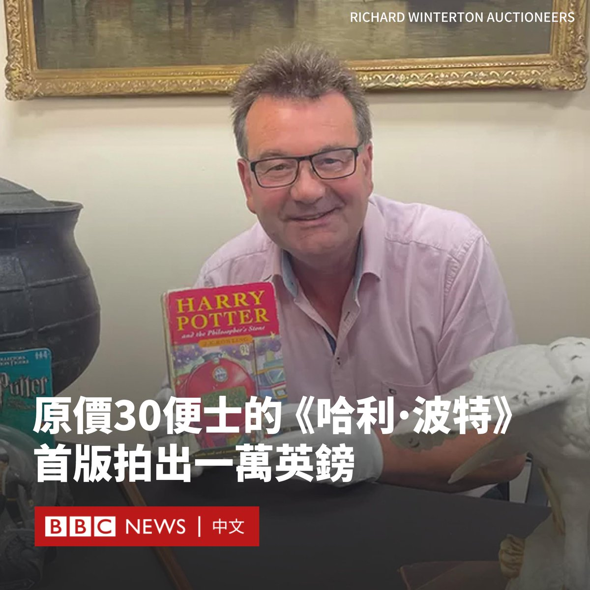

D英国广播公司BBC 北京时间 2023-07-13T18:17:33Z 1679434884849500160 北约组织在立陶宛召开峰会，乌克兰加入该军事集团的进程备受关注。此次峰会有哪些进展，各方有何表态？ https://t.co/dq5oMOim2M   D英国广播公司BBC 北京时间 2023-07-13T15:15:19Z 1679389024283410432 中国西南部的四川省多地持续经历暴雨，绵阳市一座大桥上的积水垂泻，宛如巨大的水帘。 https://t.co/KIv9WV14SU   D英国广播公司BBC 北京时间 2023-07-13T13:09:06Z 1679357259628040192 在中国近1300万毕业生收到高考成绩之际，一所乌托邦式的虚拟“大学”意外地在中国网络上引起轰动。

这所名为“山河大学”的学校拥有自己的校徽、校训、校园卡和网站，甚至还有多个校友聊天群，尽管它在现实中并不存在。

这所“大学”最早是由一批网友在6月底创建的。当时，很多高中毕业生正忙于选择就读什么大学，一些人抱怨中国的教育体系对部分省份的考生不公平。

中国大学招生是分省进行的，而中东部的河南、河北、山东、山西等省份知名大学较少，但人口众多，因此分数线高，这导致与北京和上海等一线城市相比，当地考生很难挤入好大学。

因此，网友们开玩笑道，上述四省的考生有300多万人，每人拿出1000元人民币（140美元），即可创办出一所综合大学。

他们用各省名称的组合，将其称为“山河大学”，并想象它位于四省的交汇处。

这个天马行空的想法很快在社交媒体上激起了中国学生的想象力，很多网友加入其中，在短短一天内，校训、校徽和招生手册就出炉了，甚至还有人搭建了一个学校网站。数以千计的网友还建立了在线聊天群，并将其标记为山河大学的不同院系。

知名唐代诗人杜甫被封为这所大学的校长，他的诗“安得广厦千万间，大庇天下寒士俱欢颜”被认为完美体现了这所学校的创立初衷。

“（山河大学）致力于解救困于不公之中的山河四省学子，让每一个山河四省学子都有学上。”一张广为流传的该“大学”的招生简章图片中写道。

中国教育部官员在7月6日对此作出回应，称将“不断优化高等教育资源的布局结构，支持中西部地区，特别是人口大省扩大高等教育资源规模”。

尽管当局表示注意到了学生们的诉求，但社交媒体平台也开始通过审查相关话题、封禁聊天群来阻止该事件的发酵。

“好吧，终究只是一个遥不可及的梦想。”一名微博网友感叹道。

据中国媒体报道，尽管这四个省份的人口总数超过3亿，但全国39所被视为顶级名校的“985工程”大学中，这四个省份仅有两所，均位于山东。与此同时，北京和上海共有12所“985工程”大学，占全国39所的近三分之一。   D英国广播公司BBC 北京时间 2023-07-13T14:15:19Z 1679373925447262209 香港移民潮持续，官方最新数字显示四年间香港流失近6.8万名中小学生，过去一年的流失率更创近年高峰。退学潮是如港府所言“最坏情况已过”，还是只是开始？https://t.co/03JrlC0lEy   D英国广播公司BBC 北京时间 2023-07-13T11:18:57Z 1679329541339381760 随着人形AI机器人走上舞台中央，科学家们希望证明，相比于被大量讨论的威胁，它们更能给人类带来好处。 https://t.co/GYzZ38Z3Uq   D英国广播公司BBC 北京时间 2023-07-13T09:20:21Z 1679299695070580736 一本罕见的《哈利波特：神秘的魔法石》（Harry Potter and the Philosopher's Stone）首印版在拍卖会上以10,500英镑的价格售出，而它的主人当时仅以30便士购入。

这本书的首印版只有500本，其中一本由一位来自英国斯塔福德郡（Staffordshire）的收藏家购得，他在今年较早时候去世。

这位收藏家在一次搬家期间，把书本放入仓库，他的妹妹曾表示他们担心这本书已经散佚。

拍卖师理查德·温顿（Richard Winterton）表示，这本书由一位来自洛杉矶的买家在网上竞拍得到的。

他说：“我们对这个结果非常高兴。”

这本书于1997年出版，当时有300本送到图书馆，而该书的收藏者则是从伍尔弗汉普顿图书馆（Wolverhampton Library）购得这本书。

他的家人表示，他们知道他买了一本价值连城的《哈利波特》，但认为它丢失了。

他的妹妹表示，四年前搬家时，所有的书都被装进了“数百个箱子”，她说：“我们知道他有这本书，但如果你让他指出具体位置，他却说不出来。”

她补充说，她的哥哥从上学时期开始，就对收藏书籍和印刷品有执着的热情。

这位收藏家在55岁时意外去世，拍卖商的团队在整理他的物品时最终找到了这本书。   