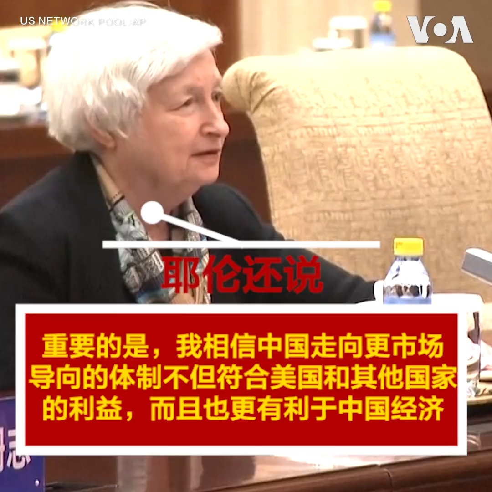
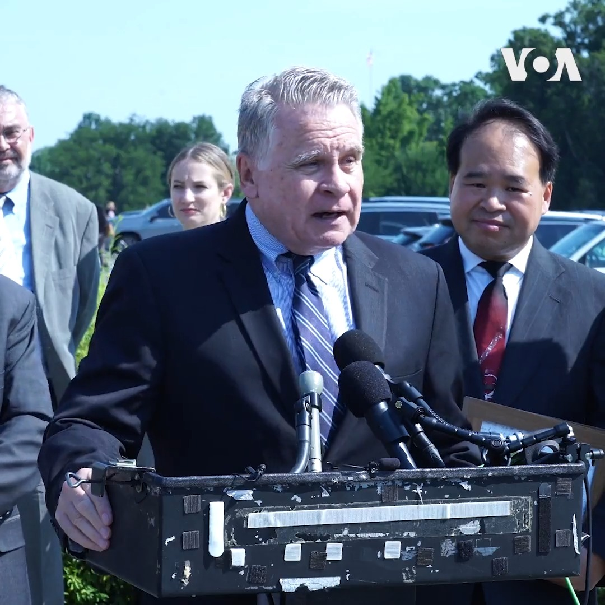
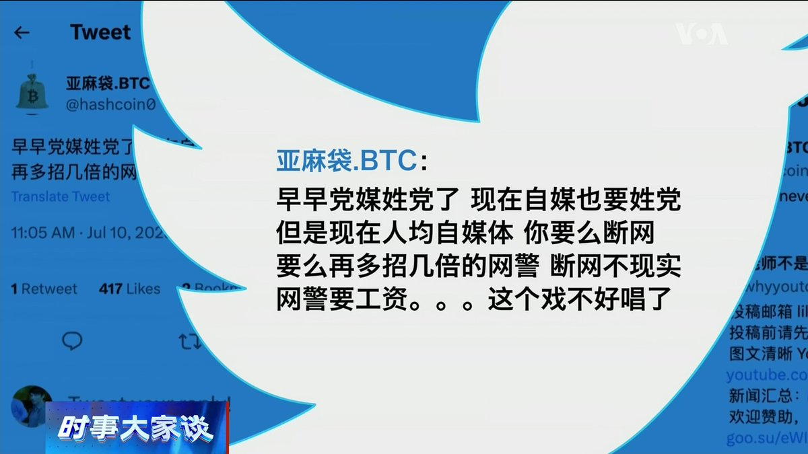
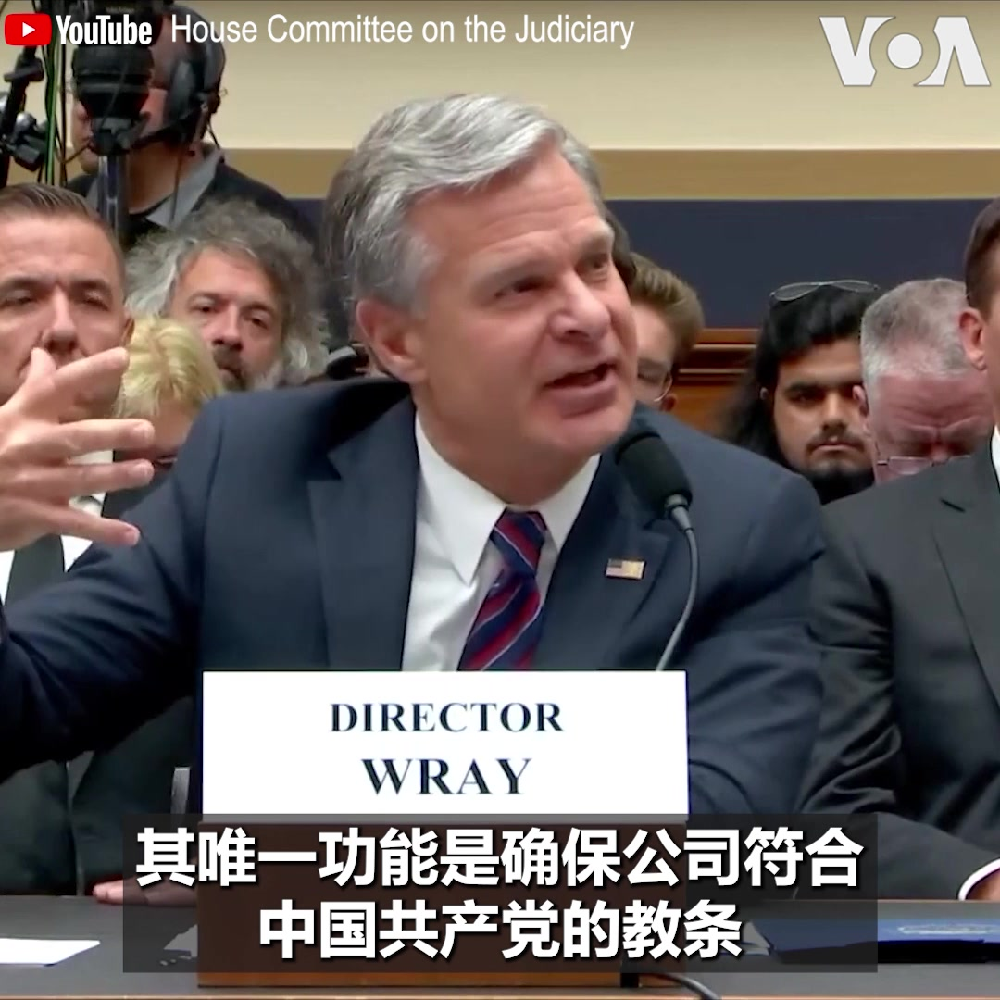
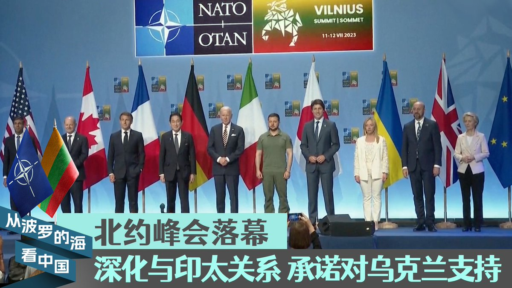

美国之音中文网 北京时间 2023-07-13T11:58:58Z 1679339609430564864 五角大楼表示，中国驻美国大使谢锋星期三(7月12日)在五角大楼与美国国防部负责亚洲事务的最高官员举行了一次罕见的会谈。在此之前，美国曾批评中国不愿意进行军事沟通。 https://t.co/J7sc68JiJ7   美国之音中文网 北京时间 2023-07-13T12:02:45Z 1679340561717932033 上周，越南还禁止了原定于下周在该国上映的华纳兄弟电影《芭比娃娃》的发行，因为电影中的一个场景显示了一张地图似乎也描绘了九段线。自1950年代以来，一条涵盖南中国海约90%的九段线就出现在中国发行的地图上。 https://t.co/QWLU6no8DJ   美国之音中文网 北京时间 2023-07-13T12:10:02Z 1679342394398113793 美国国务院对全球发布的旅行警示(Travel Advisory)星期二(7月11日)重新发布对台湾的旅游建议，原先两处“国家”(country)字眼被改为“台湾”，引发台湾媒体注意。针对媒体询问，美国在台协会(AIT)表示美国对台政策没有改变。 https://t.co/JW68ZZUnff   美国之音中文网 北京时间 2023-07-13T08:00:01Z 1679279478294425600 世界媒体看中国——金哲报道：中国走市场经济  无法完成的使命？报道：https://t.co/PchNYtJ6JD https://t.co/LKvhEkpyp1   美国之音中文网 北京时间 2023-07-13T10:10:00Z 1679312187343380482 2019年逃离中国的深圳五月花教会的64名成员，经韩国和泰国辗转于今年4月来到美国寻求庇护。教会成员说，他们在中国遭到了宗教迫害。7月12日，他们在国会大厦外与议员和媒体见面。协助营救的美国议员说，中国的宗教打压在习近平治下达到最差水平，习近平令人想起毛泽东。报道：https://t.co/DUI4htrl8a https://t.co/FtYJHKrE7V   美国之音中文网 北京时间 2023-07-13T07:00:25Z 1679264477106020357 中国网信办发出加强自媒体管理的13条通知，再次压缩言论空间。香港荣休全国政协委员刘梦熊说，中国的媒体已经全都姓党，现在自媒体也要姓党，决策高层听不到真实的声音，陷入“盲人骑瞎马，夜半临深池”的险境。 完整版： https://t.co/jyScXMbHbs https://t.co/7Tt5e4qZAT   美国之音中文网 北京时间 2023-07-13T07:05:01Z 1679265634536783876 美国联邦调查局局长克里斯托弗.雷(Christopher Wray)7月12日在一国会听证会上回答议员提问时表示，中国法律规定，包括美企在内的公司都必须在内部设立党委，其唯一功能是确保公司遵守中共教条。“在我看来，没有一个国家比中国政府和中共对我们的思想、创新和经济安全构成更全面的威胁，”他说。 https://t.co/ozvM9C9RcJ   美国之音中文网 北京时间 2023-07-13T07:20:00Z 1679269405430104064 北约峰会落幕，这场历史性峰会的成果是否令俄罗斯和中国压力倍增？克里姆林宫日前公开披露，普京曾在瓦格纳兵变后会见了瓦格纳的首领，这是否意味着普京与瓦格纳和解？面对兵变，普京的应对方式反映出他的手腕还是软肋？7/13时事大家谈将讨论这些问题，请留言参与。 https://t.co/kjTBkBLrjS   美国之音中文网 北京时间 2023-07-13T08:10:00Z 1679281988077862913 李恒青：蚂蚁金服遭到71.23亿元巨额罚款后回应：“诚恳接受、坚决服从。” 美国“信息与战略研究所”经济学者李恒青说，蚂蚁“今”服了，服了，政府才放你一条活路，这让民企噤若寒蝉，内资外资都在“润”，这才是对政府的威胁。 #完整版： https://t.co/jyScXMbHbs https://t.co/yOn67VgsTj   美国之音中文网 北京时间 2023-07-13T09:12:13Z 1679297646412853254 一键解锁#美国热搜 榜1、突发：二十大后第一虎，上海人大主任董云虎被查2、沈栋：全民回到喝奶粉麦乳精时代？3、习近平如何制造了中国的巨额负债4、中国一只脚已踏进通缩5、宝格丽辱华，人民日报宣传诈骗APP6、网信办自媒体新规7、习时代中国寻求庇护人数飙升 https://t.co/OkRHYdJV09 https://t.co/Kt5fDruJXO   美国之音中文网 北京时间 2023-07-13T04:27:04Z 1679225885147406337 美国消费者价格出现2021年初以来的最小增幅 https://t.co/jro77mf6RS   美国之音中文网 北京时间 2023-07-13T04:36:02Z 1679228144883204096 东盟召开系列会议 能为缅甸及南中国海危机找到解方吗？ https://t.co/DNE9xX4Kt7   美国之音中文网 北京时间 2023-07-13T05:14:20Z 1679237782730948609 在维尔纽斯举行的北约峰会12日落幕。这次峰会尽管没有为乌克兰加入北约提供具体时间表，但承诺向乌克兰提供安全保障和经济支持。峰会也深化了北约与印太盟友的关系，以共同应对峰会公报所说的中国对北约构成的“系统性挑战”。相关内容：https://t.co/A4dU9an4vR https://t.co/k3WlNl8Ywx   美国之音中文网 北京时间 2023-07-13T02:36:21Z 1679198025678192672 五角大楼7月12日发表声明，美国国防部印太安全事务助理部长伊莱.拉特纳(Ely Ratner)周三在五角大楼和中国驻美大使谢锋进行了会谈。两人就美中防务关系和一系列国际及地区安全问题进行了讨论。声明说，拉特纳同时强调国防部致力于维持美国和中华人民共和国之间开放的军事交流渠道。 https://t.co/hgpvS49tlk   美国之音中文网 北京时间 2023-07-13T00:41:02Z 1679169001430319106 北约告诉泽连斯基:“我们平等地相见” https://t.co/LwzQDHTJMq   美国之音中文网 北京时间 2023-07-13T00:49:03Z 1679171019997868033 中日福岛水之争港府扮北京战狼,威胁禁止日本十都县水产品进口 https://t.co/vYVhViqwZC   美国之音中文网 北京时间 2023-07-13T00:51:51Z 1679171723772542985 【现场直播： 美国总统拜登北约峰会后讲话（同声传译）】 https://t.co/FkSRjGz9Ue   美国之音中文网 北京时间 2023-07-13T01:06:32Z 1679175422540681221 南中国海仲裁裁决七周年之际，美国呼吁北京停止在南中国海骚扰别国船只 https://t.co/aHrONzB2xr   美国之音中文网 北京时间 2023-07-13T02:26:08Z 1679195453194108933 获拜登总统提名出任下届美军参谋长联席会议主席的空军上将查尔斯·布朗7月11日说，和欧洲相比，印太地区对美国的军力部署更具挑战性。布朗是当天在国会参议院军事委员会出席提名确认听证时作出上述表示的。 https://t.co/wXpJdXEY2p   美国之音中文网 北京时间 2023-07-13T00:15:00Z 1679162451668111361 “北约现在有更好的组织、协调、装备和人员，能够在其东翼向俄罗斯发出强有力的威慑信息，”美国国家安全顾问沙利文7月12日在北约峰会现场接受美国之音采访时谈到了这次峰会与以往的不同。他说，随着芬兰的加入以及瑞典即将加入北约，该联盟比以往任何时候都更为强大。 https://t.co/KbcvhXlCGd   美国之音中文网 北京时间 2023-07-13T00:26:14Z 1679165280725942272 “北约维尔纽斯峰会的成果，对乌克兰来说，是个非常有必要且有意义的成功，”乌克兰总统泽连斯基7月12日在北约峰会最后一天感谢北约国家与七国集团对乌克兰的支持。美国总统拜登表示，盟国同意为乌克兰加入北约开辟途径，同时继续为乌克兰提供长期安全保障。他强调， “只要有需要，我们就会在那里”。 https://t.co/OX2hKZkIu1   