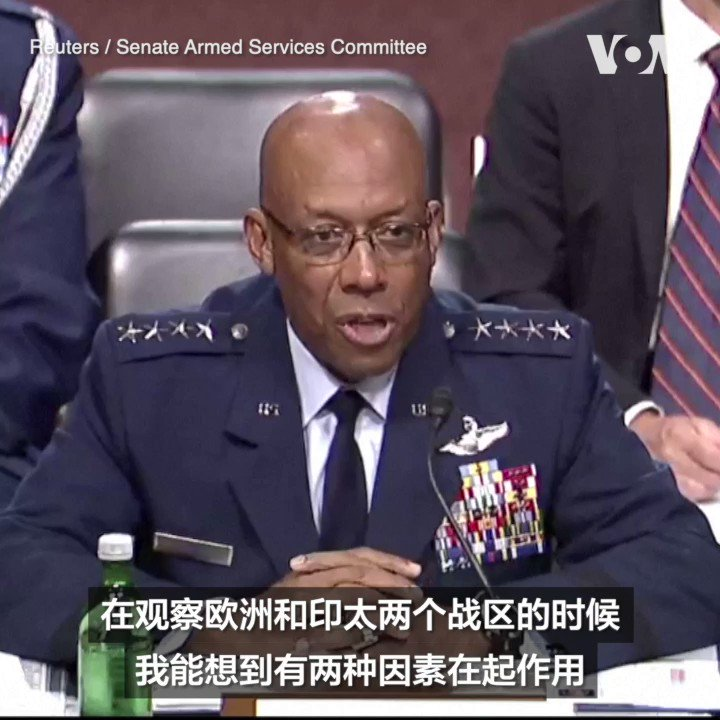
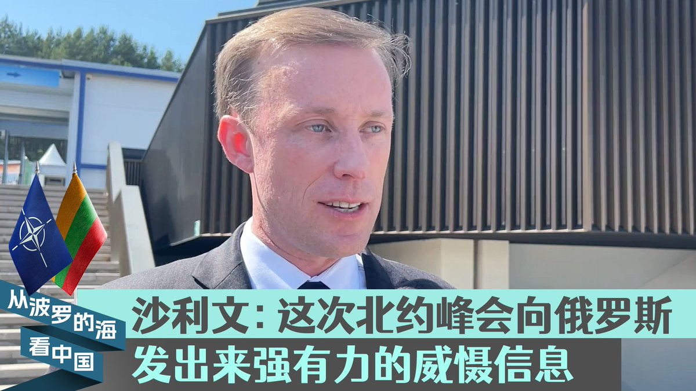
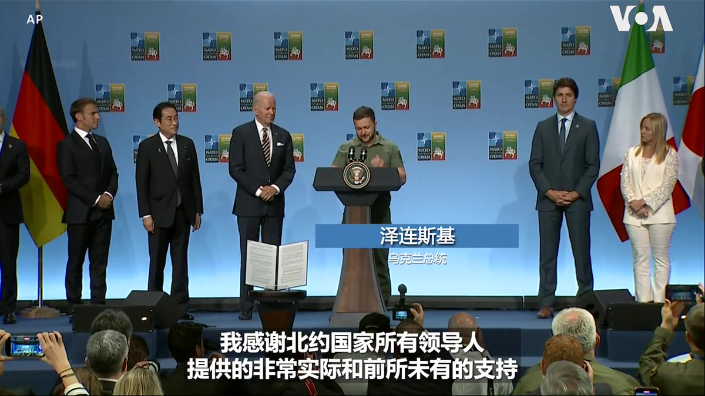

美国之音中文网 北京时间 2023-07-13T02:26:08Z 1679195453194108933 获拜登总统提名出任下届美军参谋长联席会议主席的空军上将查尔斯·布朗7月11日说，和欧洲相比，印太地区对美国的军力部署更具挑战性。布朗是当天在国会参议院军事委员会出席提名确认听证时作出上述表示的。 https://t.co/wXpJdXEY2p   美国之音中文网 北京时间 2023-07-13T00:15:00Z 1679162451668111361 “北约现在有更好的组织、协调、装备和人员，能够在其东翼向俄罗斯发出强有力的威慑信息，”美国国家安全顾问沙利文7月12日在北约峰会现场接受美国之音采访时谈到了这次峰会与以往的不同。他说，随着芬兰的加入以及瑞典即将加入北约，该联盟比以往任何时候都更为强大。 https://t.co/KbcvhXlCGd   美国之音中文网 北京时间 2023-07-13T00:26:14Z 1679165280725942272 “北约维尔纽斯峰会的成果，对乌克兰来说，是个非常有必要且有意义的成功，”乌克兰总统泽连斯基7月12日在北约峰会最后一天感谢北约国家与七国集团对乌克兰的支持。美国总统拜登表示，盟国同意为乌克兰加入北约开辟途径，同时继续为乌克兰提供长期安全保障。他强调， “只要有需要，我们就会在那里”。 https://t.co/OX2hKZkIu1   