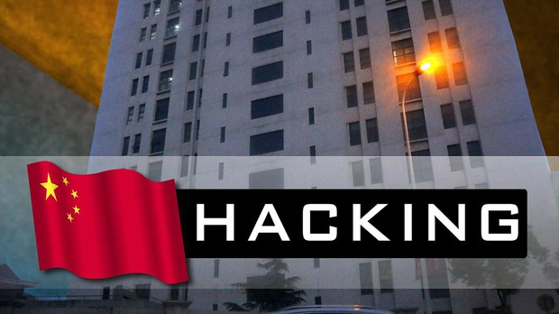

自由亚洲电台 北京时间 2023-07-13T02:50:59Z 1679201705609555976 美国 #微软 公司周二晚间披露，#中国黑客 入侵了美国政府电子邮件帐号，试图收集美国情报。纽约时报报道援引知情人士的话说，这次攻击是具有针对性的，黑客针对特定帐号，而非大范围入侵。美国白宫国家安全委员会发言人亚当.霍奇表示，目前机密网络还未受到影响，对被获取的信息量的评估仍在进行当中。

微软称，共有25个包括美国政府在内的组织受到黑客的攻击。这个团伙使用伪造的身份验证工具来访问个人电子邮件账户。微软还表示，骇客在被发现前至少一个月就已经有入侵某些账户的记录。此次攻击的复杂性及其针对性表明，这个骇客团伙要么隶属于北京情报部门，要么为其工作。

微软执行副总裁查理·贝尔在社交媒体上写道，“据我们评估，对手主要从事间谍活动，例如进入电子邮件系统收集情报”。

微软没有透露被黑客入侵的组织和机构名称。星期三美国国务院表示，已经侦察到不寻常情况，并立即采取行动，保障其电脑系统的安全。   自由亚洲电台 北京时间 2023-07-13T03:00:50Z 1679204186393808896 评论 | 胡平 
@HuPing1：伟大的殉道者，永远的道义典范 — 纪念 #刘晓波逝世六周年
 https://t.co/cywn5mW8zG   自由亚洲电台 北京时间 2023-07-13T03:44:05Z 1679215068070772737 [#中国驻英大使馆 新址建案纠纷演变成英中外交僵局】
中国原计划在伦敦塔旁建造新使馆的计划去年12月遭到伦敦区议会驳回，该计划从地区层面的地方争端，现已上升到中国和英国两国之间的外交冲突。

路透社引述中英两国官员的话说，这场对峙正在破坏修复两国严重受损关系所作的努力。

两名中国官员和三名英国官员告诉路透社，中国政府对于未能获得使馆新址的建筑许可证表示失望，并在官方会议上表达了不满。

中国以3亿一千万美元买下了距离伦敦市中心使馆现址约6.4公里的土地，新址和旧址都位于东伦敦“塔村”行政区，主管都市建设规划的地方官员基本同意此建案，然而，区议员以安全问题以及可能影响居民等理由反对这项计划。

中国官员表示，他们怀疑英国政府密谋阻止大使馆新址建造计划，并策划了当地的反对声浪。一名中国官员称，“这绝对是政治问题”。

而英国官员则驳斥这些指控，声称地方议会能自行决定。   自由亚洲电台 北京时间 2023-07-13T03:55:53Z 1679218040767156225 海曼资本管理公司创始人凯尔·巴斯（Kyle Bass）认为，在不远的将来，中国国家主席习近平有高度可能性会决定 #攻台。巴斯指出，北京当局自2020年以来，修改了众多法律整合国内资源，同时也透过石油进口多元化、加大黄金储备、增加粮食存量等作法，为对台出兵做准备。 https://t.co/vIkd2OkR98   自由亚洲电台 北京时间 2023-07-13T00:14:28Z 1679162316401823744 美国总统拜登7月11日发布行政命令，再度延长前总统特朗普于2020年7月，因应中国全国人大常委会通过实施《港版国安法》，发布对香港的紧急状态命令，维持中止或取消对香港的特殊待遇。

 https://t.co/J6KPAAKaQw   