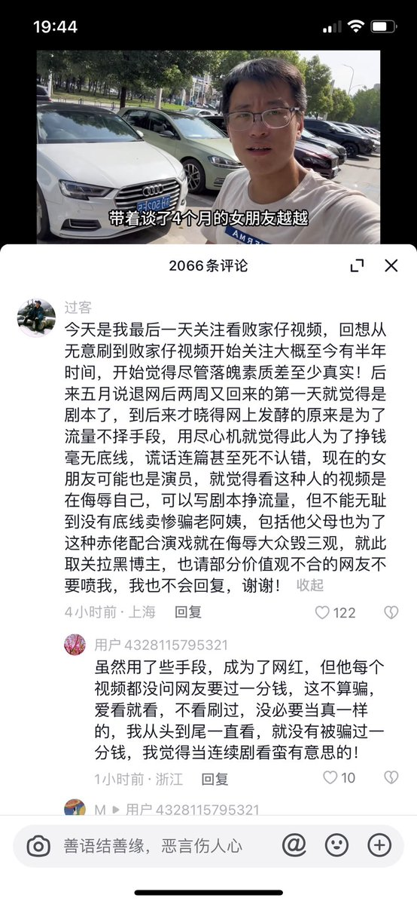
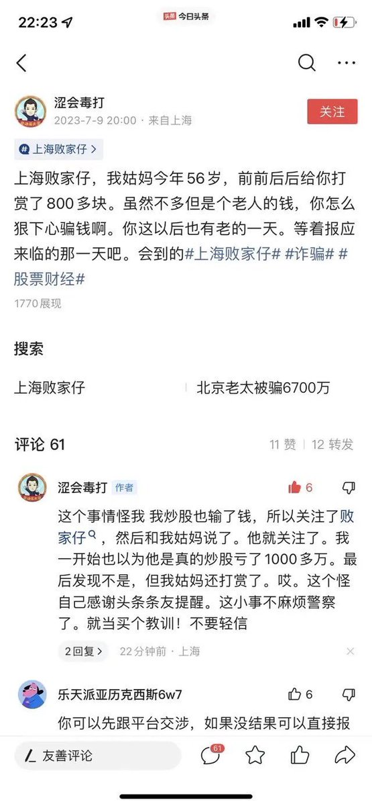
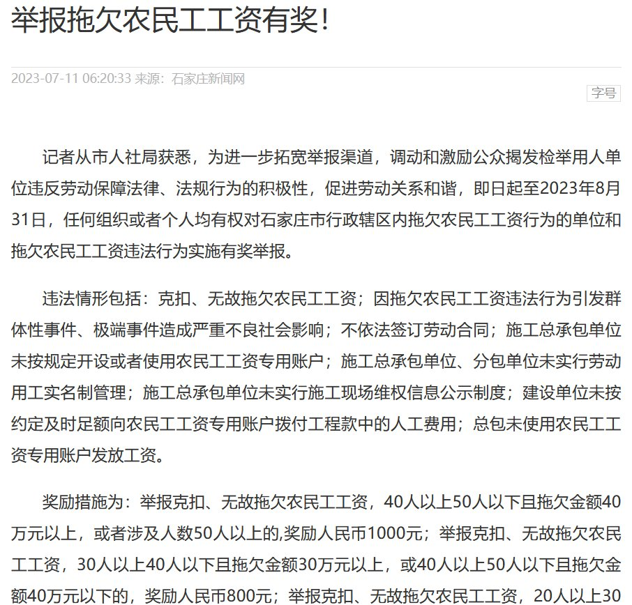

谁将十万横扫三江 北京时间 2023-07-13T15:00:20Z 1679385252043829248 网友投稿：揭露上海败家仔：虚假自媒体的背后真相

抖音、西瓜视频和今日头条上有一个自媒体人名叫“上海败家仔”，他编造虚假剧情，以卖惨、哭穷、啃老为手段，声称他的所有视频都是真实记录自己的生活。他利用这种手法来获取广大网友，尤其是老年网友的同情和怜悯，并多次诱导他们在西瓜视频给他打赏。目前，他已经收到了总计过万的打赏金额。然而，他的一位认识七八年的朋友终于无法忍受他的虚伪行为，于是在今日头条上揭露了他一切伪装的真相。起初，他还坚决不承认，声称对方提供的微信聊天记录和语音都是假的。然而，随着越来越多的网友认识到他的骗局，并开始对他进行举报，他的视频播放量和收益严重受到影响。他曾试图转移到他女友“越越爱小败”的账号上发布视频，但不久后该账号也遭到网友举报，流量急剧下降。无奈之下，他只能承认之前的所有视频都是编造的，甚至包括他父母、姑妈等人的台词也是他事先写好让他们背的。（期间，由于视频收益急剧下降，他假装与女友分手，并以此为借口开设了一场直播。据网友统计，这场直播的总收入至少达到三万五千元。）在最新的视频中（视频链接：https://t.co/t4o0HMpoD1），他一方面承认过去视频的内容都是虚构的，另一方面也试图洗脑那些老年粉丝，声称自己起步拍视频的时间晚了，正常拍视频无法赚到钱，只能通过弯道超车（不择手段）的方式来获得成功。他希望大家能够理解他的做法。

目前，仍有很多他的水军或者缺乏是非观念的人在视频评论中故意挑起争端。他们声称那些批评者是因为嫉妒他而诋毁他，这导致网络环境变得混乱不堪。

7.11日，上海电视台新闻综合频道点名批评了他，目前虽然他的关注者可以在他的主页上看到他的作品，但他的所有作品都被限制了。最近国务院网信办发布了关于自媒体整治的细则，不能弄虚作假。他这种行为对社会和谐和稳定产生了负面影响。他今天还发了视频，说电视台对他进行了失实报道，他要起诉上海新闻综合频道SMG上海早晨栏目，仍然不知悔改。
附件是部分网友为举报他整理并准备的一些资料，希望平台能够封杀他的两个账号，为大家提供一个干净、积极向上的网络平台。

谢谢   谁将十万横扫三江 北京时间 2023-07-13T15:14:53Z 1679388915814518786 石家庄人社局：举报石家庄市内拖欠农民工工资者最高奖1000元
网友：我信了，讨薪的结果是高新区劳动监察大队让60个工作日内等回复，之后没下文 https://t.co/r9ncI8oIvE   谁将十万横扫三江 北京时间 2023-07-13T15:16:54Z 1679389420598984705 后续：事发后该公司严密封锁消息，已经有新消息确认是结构工程师，家属于2023年7月9日前往设计大厦维权，结构师讨薪坠楼，死因是否涉及他杀尚无定论，也无该企业彻查劳动争议违约，抚恤家属，或者做出澄清的相关消息。   谁将十万横扫三江 北京时间 2023-07-13T15:20:23Z 1679390297263083521 在西安干工程的李军童反映，他们2021年给临潼区政府翻修和绿化，至今竣工已两年区政府分文没给。

李军童公司与西安市临潼区秦汉大道建设有限公司（简称秦汉大道公司）所签施工承包合同显示，双方约定工程款503万元。李军童出示的一段秦汉大道公司人员回应不付款的录音中，一男子说：“城投（指秦汉大道公司股东，西安市临潼区城市投资集团有限公司）的钱是借下来的，资金很紧张。”总之就是政府没有钱，暂时没有办法付钱

李军童说，这些工程款里有约140万都是农民工工资，工人们干完活两年都拿不到工钱，因此四处讨薪、上访。拿不到钱的同时，农民工们发现临潼区政府旁边的区委院子又开始了大翻修，大家忍不住质疑：“既然没钱为什么要打肿脸充胖子？疫情3年经济形势不好，区政府和区委却把办公楼和院子翻修的很是气派，到底是没钱还是没有信誉呢？”

现在不但老板拖欠农民工工资，连政府的工程都拖欠农民工资，到劳动局去申诉都无用，告老板，老板说政府都没有给我、我拿什么发工资，一拖就是几月或几年都难要到工资，真无奈，特别是好多甲方和政府关系好，农民工要钱就更难了。

国务院曾经三令五申禁止拖欠农民工工资，而这临潼区政府部门带头拖欠，不依法维护百姓利益， 这是对国家公信力的严重亵渎和挑战，这是对法治的践踏，更是一种不负责任的行为，严重损害了政府的形象和公信力。

除此之外，国家财政部还发文表示要精打细算过日子！要严控会议、差旅、培训、论坛等支出，严禁新建扩建政府楼堂馆所。而在此背景下，临潼区政府不但顶风扩建政府楼堂馆所，还在拖欠农民工工资，这如此肆意妄为！真的太令人失望了！

政府作为一个国家的管理者和代表，应该以身作则，诚实守信，履行自己的承诺和义务。

临潼区政府此举不仅损害了政府的形象，也影响了社会的稳定和发展。希望相关部门能拿够出面解决这件事   谁将十万横扫三江 北京时间 2023-07-13T15:52:13Z 1679398309058969603 在中国，讨薪都得打擦边球 https://t.co/pqX4o2v3qm   谁将十万横扫三江 北京时间 2023-07-13T15:54:09Z 1679398796147695616 后清四大奇案：江西指鼠为鸭，山西介休吃屎，东北修桥寻衅滋事，浙江恶意讨薪灭门   谁将十万横扫三江 北京时间 2023-07-13T16:06:21Z 1679401865405161473 13名小区绿化工人被公司拖欠4个月工资 https://t.co/j561ToOpHG   谁将十万横扫三江 北京时间 2023-07-13T16:06:25Z 1679401881632919552 天津法院：不签合同就不算有劳动关系 https://t.co/wSouSR7awk   谁将十万横扫三江 北京时间 2023-07-13T12:00:34Z 1679340012977160192 7月12日广州天河，珠江嘉苑，一位11岁小孩坠楼死亡 https://t.co/ceO3Q11Bnw   谁将十万横扫三江 北京时间 2023-07-13T12:41:53Z 1679350411835363328 经查系P图，国内天气最高仅有39度不会出现这种情况 https://t.co/sHZJx2gf81   谁将十万横扫三江 北京时间 2023-07-13T12:51:06Z 1679352732644442117 RT @whyyoutouzhele: 突发！7月13日中午，江苏盐城。
一辆宝马车闯红灯连撞八人 https://t.co/cMNTkwcUUH   谁将十万横扫三江 北京时间 2023-07-13T13:46:06Z 1679366571133894656 云南大理有网友发帖称云南大理喜洲环卫工被拖欠10个月工资，环卫工月工资1千余元，环卫工设备很久未更新

喜洲镇人民政府工作人员回应称确实拖欠了几个月工资，具体拖欠时长尚不清楚。政府目前还在等待银行贷款，程序走得有点慢，另表示环卫工均已承包给第三方公司管理。 https://t.co/h8KQvlmUIM   谁将十万横扫三江 北京时间 2023-07-13T12:06:15Z 1679341441758425088 深圳顺络汽车电子有限公司，员工讨薪 https://t.co/aw1QnIe9dQ   谁将十万横扫三江 北京时间 2023-07-13T12:07:31Z 1679341761569910785 7月12日广西梧州红星美凯龙，开发的楼盘烂尾，业主维权 https://t.co/omDEMknzDk   谁将十万横扫三江 北京时间 2023-07-13T12:10:39Z 1679342552946995202 广东惠州，园洲镇，东江公元楼盘，工人追工资，供应商追货款，房产中介追佣金，今天来追工钱的人更多 https://t.co/vyB8N0giJQ   谁将十万横扫三江 北京时间 2023-07-13T12:11:15Z 1679342702234828801 广西贵港市平南，大乌古镇楼盘烂尾，业主连续几天维权 https://t.co/5r8pzkHTL0   谁将十万横扫三江 北京时间 2023-07-13T12:13:11Z 1679343187645841409 7月12日浙江省杭州市萧山区南阳街道南丰村这个叫阳光拆迁 https://t.co/cvqgM6Fbcv   谁将十万横扫三江 北京时间 2023-07-13T12:15:25Z 1679343751188320256 出国办签证很正常啊 https://t.co/tXRrBc3fHA   谁将十万横扫三江 北京时间 2023-07-13T10:57:34Z 1679324159141367808 浙江温岭市贯庄永康养老院，打老人，墙上写着老有所养 https://t.co/kGaaxumgxx   谁将十万横扫三江 北京时间 2023-07-13T07:28:32Z 1679271553685676032 https://t.co/FldfRAcvpX   谁将十万横扫三江 北京时间 2023-07-13T07:32:28Z 1679272545357549568 辽宁大连，工人干6个月了，没发一毛钱工资，农民工下跪讨薪

逆版本讨薪没效果的，老乡还是上刀子吧 https://t.co/OgKJtT4Isu   谁将十万横扫三江 北京时间 2023-07-13T07:49:23Z 1679276803209281536 😇唉，资本 https://t.co/TSbmrgZtjG   谁将十万横扫三江 北京时间 2023-07-13T07:57:21Z 1679278807684100096 公安禁毒？公安贩毒

辽宁省公安厅原副厅长刘家铎犯容留他人吸毒罪

据悉依据法律规定，容留他人吸食、注射毒品不构成犯罪的，由公安机关拘留、罚款

此公安厅长通报构成犯罪，则是构成以下几点

（一）一次容留多人吸食、注射毒品的；

（二）二年内多次容留他人吸食、注射毒品的；

（三）二年内曾因容留他人吸食、注射毒品受行政处的；

（四）容留未成年人吸食、注射毒品的；

（五）以牟利为目的容留他人吸食、注射毒品的；

（六）容留他人吸食、注射毒品造成严重后果的；   