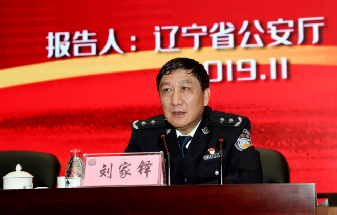

谁将十万横扫三江 北京时间 2023-07-13T07:57:21Z 1679278807684100096 公安禁毒？公安贩毒

辽宁省公安厅原副厅长刘家铎犯容留他人吸毒罪

据悉依据法律规定，容留他人吸食、注射毒品不构成犯罪的，由公安机关拘留、罚款

此公安厅长通报构成犯罪，则是构成以下几点

（一）一次容留多人吸食、注射毒品的；

（二）二年内多次容留他人吸食、注射毒品的；

（三）二年内曾因容留他人吸食、注射毒品受行政处的；

（四）容留未成年人吸食、注射毒品的；

（五）以牟利为目的容留他人吸食、注射毒品的；

（六）容留他人吸食、注射毒品造成严重后果的；   