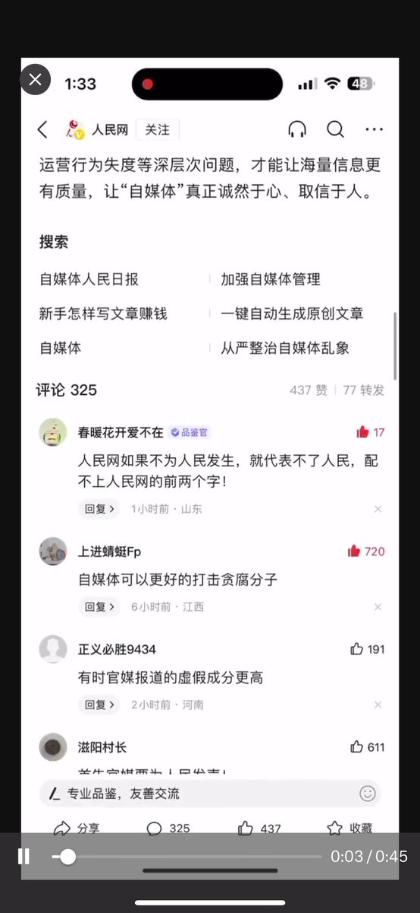
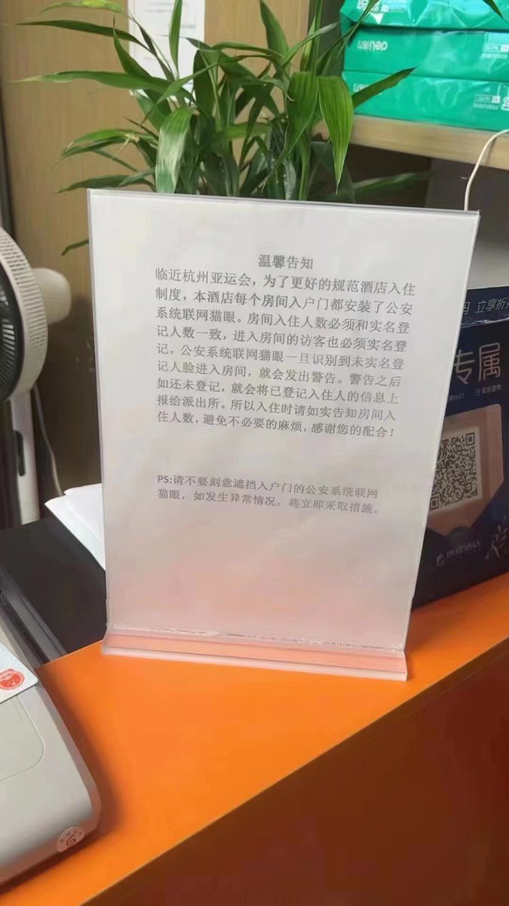
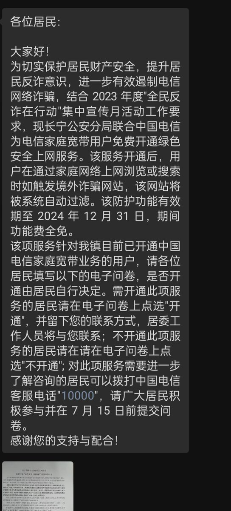
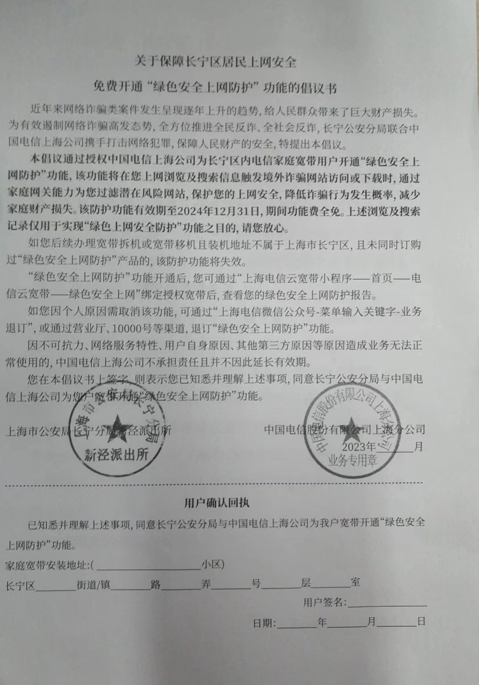

A李老师不是你老师 北京时间 2023-07-12T23:32:42Z 1679151807980007426 RT @bbcchinese: 中国最大城市上海宣布，将延续疫情时期的健康码程序“随申码”，并将其改造升级为针对每个市民的“城市码”。

据中国官方媒体周一（7月10日）报道，上海正在将“随申码”改版成为“城市码”以在多个场景使用，并已制订新版“随申码”标准规范和管理制度。……   A李老师不是你老师 北京时间 2023-07-12T14:31:06Z 1679015510258663425 网友投稿 https://t.co/SSzBVKR94A   A李老师不是你老师 北京时间 2023-07-12T14:43:34Z 1679018644968292352 网友投稿
在人民网关于“加强自媒体管理”的视频下方，人民有话说： https://t.co/1Ryg39DQRW   A李老师不是你老师 北京时间 2023-07-12T13:45:40Z 1679004076523044864 网友投稿
7月12日，汕头交警发布了一则高温下交警坚守在岗的视频
引发网友热议 https://t.co/upXRQtrgR3   A李老师不是你老师 北京时间 2023-07-12T14:11:34Z 1679010593183809537 网友投稿
杭州某酒店的公告
因临近杭州亚运会，每个房间入户门都安装了联网猫眼
一旦发现未实名登记人脸进入房间，将会发出警告。 https://t.co/x9hiur6pgu   A李老师不是你老师 北京时间 2023-07-12T11:15:53Z 1678966381021200388 网友投稿
7月12日，上海长宁区小区业主群发布通知，长宁公安分局将联合中国电信开通“绿色上网安全服务” 。
该服务开通后，用户在通过家庭网络上网浏览或搜索时如触发境外诈骗网站，该网站将被系统自动过滤。
通知要求用户在问卷中填写是否开通该功能，是否开通由用户个人决定。 https://t.co/ZrMutz8WjI   A李老师不是你老师 北京时间 2023-07-12T11:30:46Z 1678970124718448642 网友投稿
7月12日，今日微博官方置顶：没有网络安全就没有国家安全 https://t.co/hQP69fITGO   A李老师不是你老师 北京时间 2023-07-12T00:00:53Z 1678796511361085441 网友投稿
7月11日，有消息称，北京城管委近日发布意见稿，途经天安门的公交车拟禁设车身广告 https://t.co/T1rEOtrsuh   