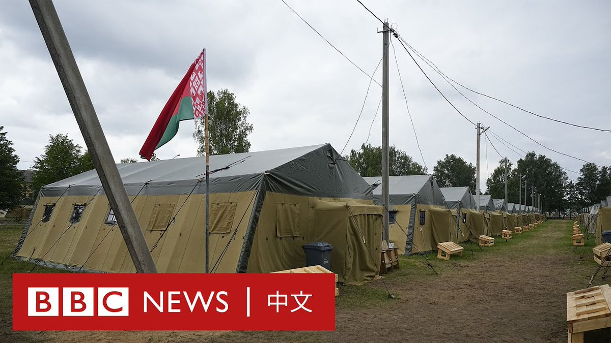
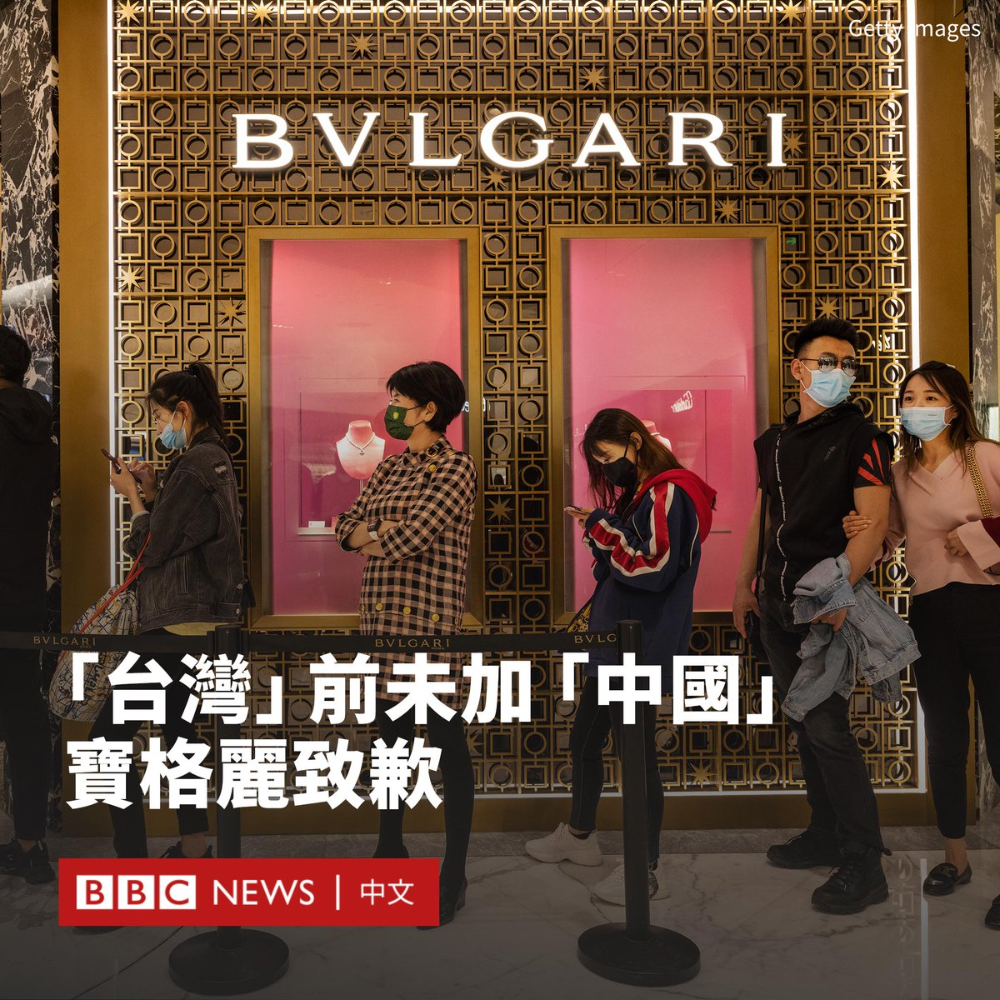
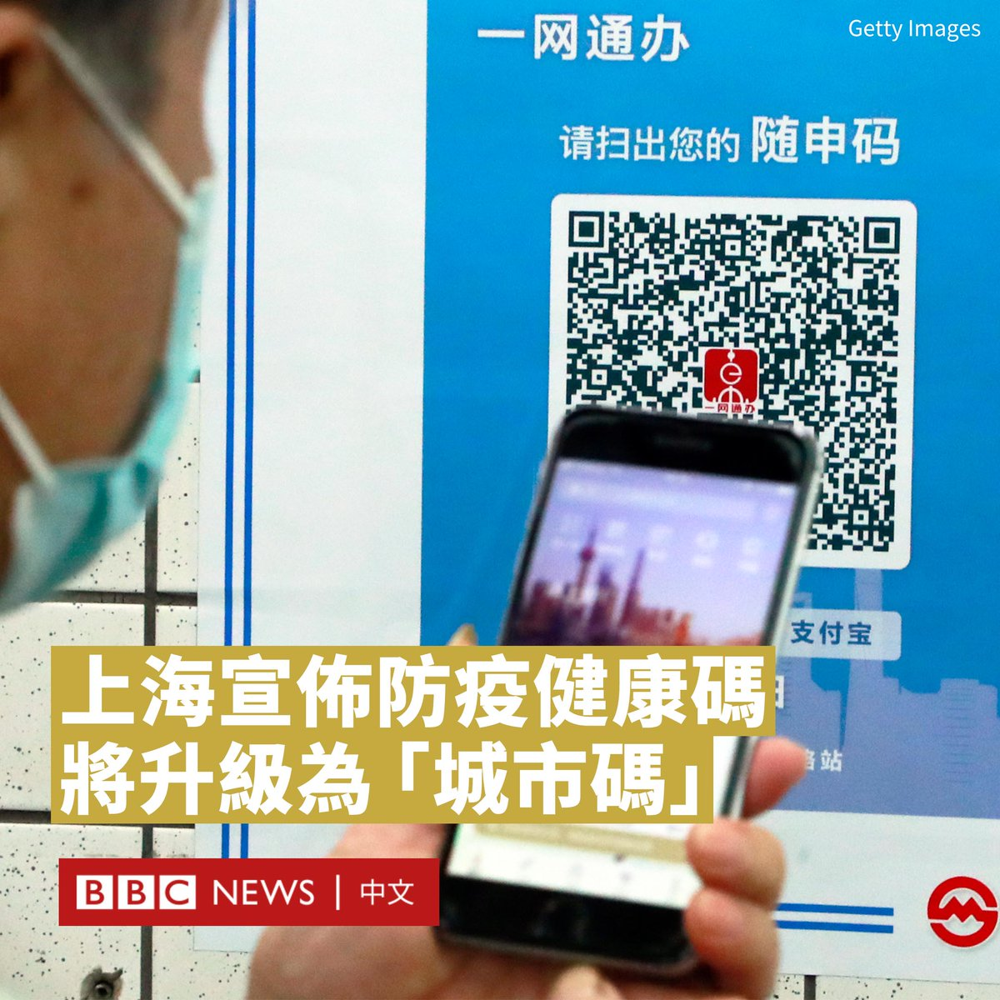

D英国广播公司BBC 北京时间 2023-07-12T19:44:03Z 1679094266797207552 鸿海科技集团旗下的富士康（Foxconn）已退出与印度石油巨头威达塔（Vedanta）合作的一项195亿美元的投资项目，该项目原本计划在在印度建设一座晶片制造厂。https://t.co/K3A4b5Lovf   D英国广播公司BBC 北京时间 2023-07-12T16:37:06Z 1679047218454753280 白俄罗斯安置瓦格纳的军营是什么样子？

BBC俄罗斯事务编辑罗森伯格（Steve Rosenberg）得到许可，前往白俄罗斯提供给瓦格纳雇佣军的营地采访。但目前为止，只有白俄罗斯的军队驻扎在此。

这个军营的用途尚未知晓，但这里足够容纳5000人。 https://t.co/QLniKua5f4   D英国广播公司BBC 北京时间 2023-07-12T17:59:55Z 1679068057074012160 意大利奢侈珠宝品牌宝格丽（Bulgari）在中国引发网民愤怒，原因是有人发现其官网将“中国”与“台湾”并列。

宝格丽周二（7月11日）在微博道歉，表示该公司因“管理疏忽”发生错误，已经“立即纠正”。

“宝格丽公司尊重中国主权和领土完整的立场，一如既往，坚定不移。”声明写道。

此前，有网友发现，在宝格丽官网的店铺分布信息中，亚洲市场一栏下分别列有“中国”、“中国香港特别行政区”、“中国澳门特别行政区”和“台湾”，日本、新加坡、印度、以色列等国家也一同在列。

该行为引发中国网友质疑，认为宝格丽此举是在将台湾单独列为一个国家。#宝格丽#一度成为微博热搜话题。

目前，宝格丽官网上将“中国”改为“中国大陆”，而“台湾”改为“台湾地区”。

尽管宝格丽发布了致歉声明，但中国官方媒体和网民似乎并不买账。

党报《人民日报》发文批评称：“道歉别弄成专供中国大陆”、“寥寥几句，满满求生欲……原则问题不容打马虎眼，中国一点都不能少！ ”

在配图中，《人民日报》还列出了推特（Twitter）、脸书（Facebook）、YouTube和Instagram的标志，似乎是在指责宝格丽并未在这些海外社交媒体平台上道歉，而仅仅是在微博上发布了声明。

许多网友也同样质疑宝格丽的道歉“没有诚意”。一名微博网友发帖说：“外网不发，说明眼里只有钱，根本没认识到错误呗。”

由于中国大陆封锁了推特、脸书、YouTube和Instagram，因此中国网友们经常将这些平台形容为“外网”。一些人使用虚拟专用网（VPN）浏览这些网站，但该行为被视为违法。

在推特上，一些网友则批评该事件是“上纲上线”。“在台湾前面加中国两个字，就可以统一台湾吗？”一名网友写道。   D英国广播公司BBC 北京时间 2023-07-12T14:49:39Z 1679020175520313346 中国最大城市上海宣布，将延续疫情时期的健康码程序“随申码”，并将其改造升级为针对每个市民的“城市码”。

据中国官方媒体周一（7月10日）报道，上海正在将“随申码”改版成为“城市码”以在多个场景使用，并已制订新版“随申码”标准规范和管理制度。

“随申码”在2020年2月上线，在疫情时用于记录每个市民的行踪信息、核酸检测和疫苗接种情况。被赋红码或黄码的人会被限制出行甚至强制隔离。

中国在去年12月放弃“清零”政策，全面废除疫情管控措施。尽管市民出行不再检查健康码，但上海当局表示，“随申码”不会停用。

据报道，在未来，“随申码”将被用于线下政务服务、看病就医、交通出行和文体旅游等场景。

每家企业也将被要求申领“随申码”，在安全生产和监管等领域使用。

尽管与疫情时期的健康码相比，功能上似乎有所改变，但上海是中国首个宣布继续大规模沿用这种电子通行证的地区。

目前，上海市民可以使用“随申码”乘坐地铁或公交，进入部分医院、学校和体育场等公共场所也需使用该程序以作身份登记之用。

该政策在互联网引发争议。一些人支持者认为，如果“随申码”被升级用于多种其他用途，是方便居民的好事。

但质疑者则批评其是“电子镣铐”，并对个人信息的安全性表达了担忧。去年，有黑客声称窃取了“随申码”4850万名用户的个人资料，并在黑客论坛出售。   D英国广播公司BBC 北京时间 2023-07-12T12:47:41Z 1678989482903629825 自国安法实施后，数十万人离开了香港。有评论指香港发生了天翻地覆的变化。民主派批评该法被用作噤声的武器，许多反对派人士不是被逮捕就是流亡海外，留下来的人则难以分辨政治红线在哪里。

BBC追踪了数名留下来以及移居海外的香港人，纪录社会的改变如何影响他们的生活。https://t.co/Bf78qUGEMF   D英国广播公司BBC 北京时间 2023-07-12T10:32:02Z 1678955345123880960 正在立陶宛举行峰会的北约（NATO）领导人在一份公报中称，该集团意识到需要加快乌克兰加入北约的进程，但不会就时间表发表评论。

乌克兰总统泽连斯基（Volodymyr Zelensky）则批评不设时间表是“荒谬的”。他早些时候表示，北约似乎没有“准备好”邀请乌克兰加入或成为成员。

北约表示，“当盟友同意并满足条件时”，乌克兰可以加入该军事联盟。

泽连斯基现正在立陶宛首都维尔纽斯。他表示，在与俄罗斯交战期间无法加入北约，但希望在战斗结束后尽快加入。

在北约秘书长斯托尔滕贝格（Jens Stoltenberg）发表评论之前，泽连斯基在推特上表示，缺乏商定的时间表意味着乌克兰的成员资格可能成为一种“讨价还价的筹码”。

北约官员强调，他们已经制定了更清晰的入盟路径，而繁琐的申请程序已经大为缩短。

北约承认乌克兰军队与北约部队的“协同性”和“政治一体化”日益增强，并将继续支持乌克兰的民主和安全领域改革。

外交官们还强调将成立新的“北约-乌克兰理事会 ”，其将于周三举行首次会议，该理事会将赋予基辅召集整个联盟会议的权利。

一些成员国担心，乌克兰的快速加入可能会刺激俄罗斯，使其加剧并延长战争。现在的焦点是北约成员国将向乌克兰承诺何种长期安全保障，以作为马上加入北约的替代方案。   D英国广播公司BBC 北京时间 2023-07-12T09:03:04Z 1678932956809756672 BBC走进首尔的统一院，看看这里如何帮助初到韩国的朝鲜脱北者面对新生活。https://t.co/BWy00JPkzZ   