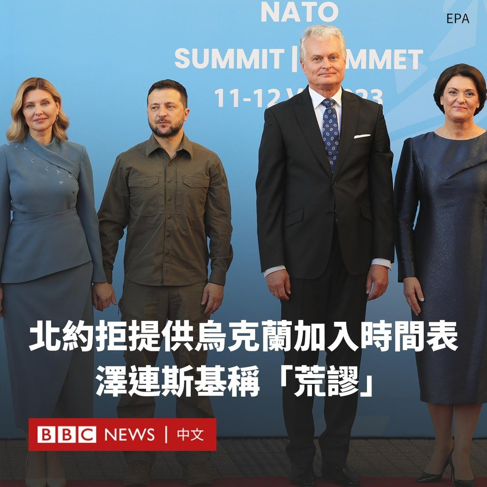

D英国广播公司BBC 北京时间 2023-07-12T10:32:02Z 1678955345123880960 正在立陶宛举行峰会的北约（NATO）领导人在一份公报中称，该集团意识到需要加快乌克兰加入北约的进程，但不会就时间表发表评论。

乌克兰总统泽连斯基（Volodymyr Zelensky）则批评不设时间表是“荒谬的”。他早些时候表示，北约似乎没有“准备好”邀请乌克兰加入或成为成员。

北约表示，“当盟友同意并满足条件时”，乌克兰可以加入该军事联盟。

泽连斯基现正在立陶宛首都维尔纽斯。他表示，在与俄罗斯交战期间无法加入北约，但希望在战斗结束后尽快加入。

在北约秘书长斯托尔滕贝格（Jens Stoltenberg）发表评论之前，泽连斯基在推特上表示，缺乏商定的时间表意味着乌克兰的成员资格可能成为一种“讨价还价的筹码”。

北约官员强调，他们已经制定了更清晰的入盟路径，而繁琐的申请程序已经大为缩短。

北约承认乌克兰军队与北约部队的“协同性”和“政治一体化”日益增强，并将继续支持乌克兰的民主和安全领域改革。

外交官们还强调将成立新的“北约-乌克兰理事会 ”，其将于周三举行首次会议，该理事会将赋予基辅召集整个联盟会议的权利。

一些成员国担心，乌克兰的快速加入可能会刺激俄罗斯，使其加剧并延长战争。现在的焦点是北约成员国将向乌克兰承诺何种长期安全保障，以作为马上加入北约的替代方案。   D英国广播公司BBC 北京时间 2023-07-12T09:03:04Z 1678932956809756672 BBC走进首尔的统一院，看看这里如何帮助初到韩国的朝鲜脱北者面对新生活。https://t.co/BWy00JPkzZ   