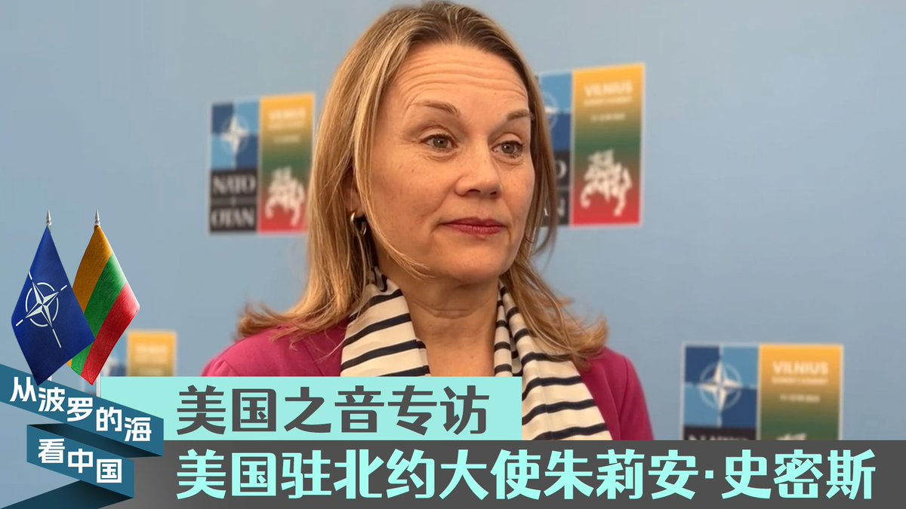
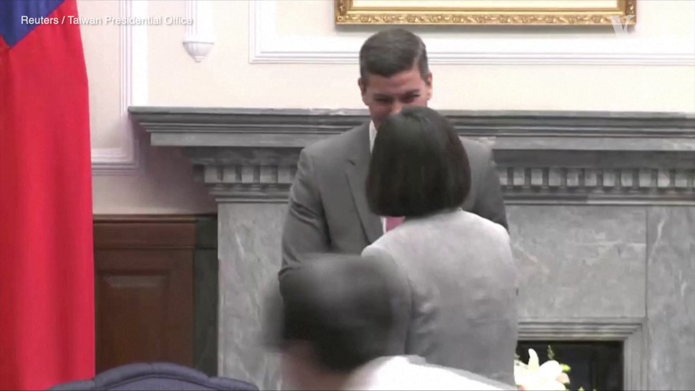
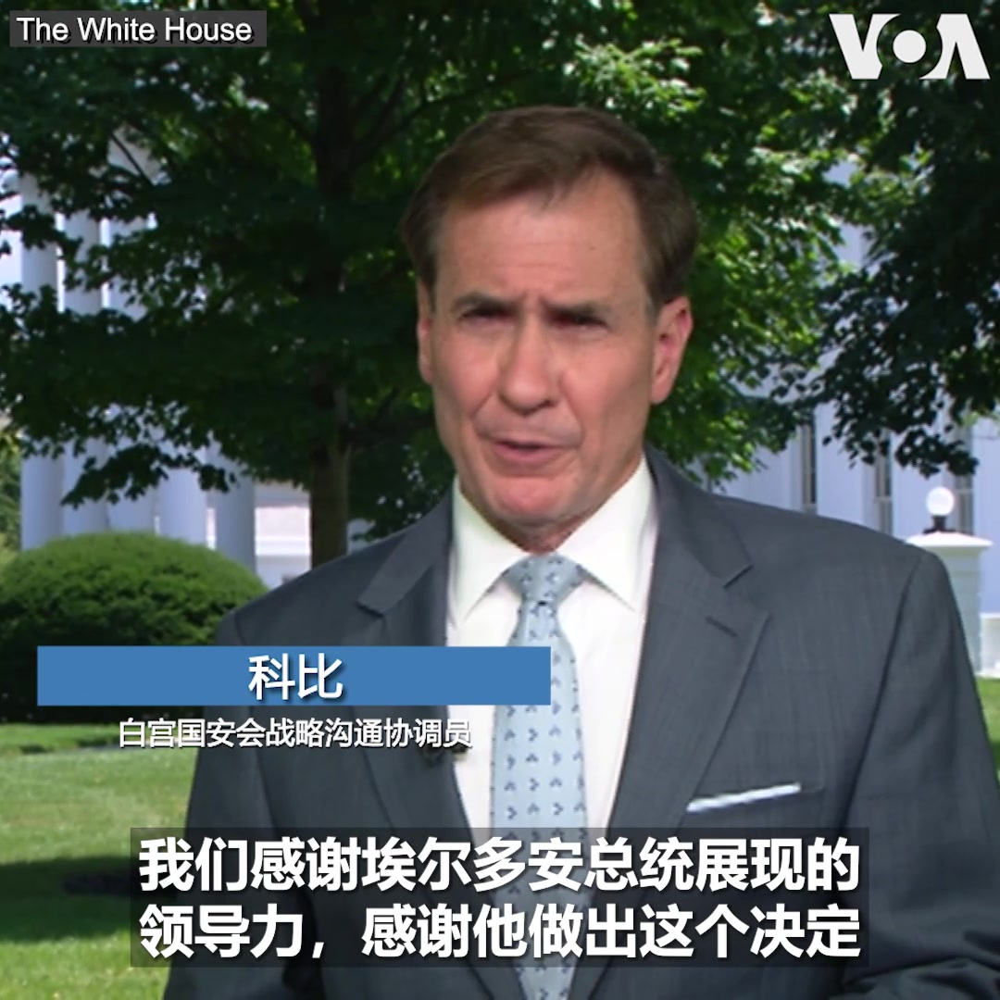
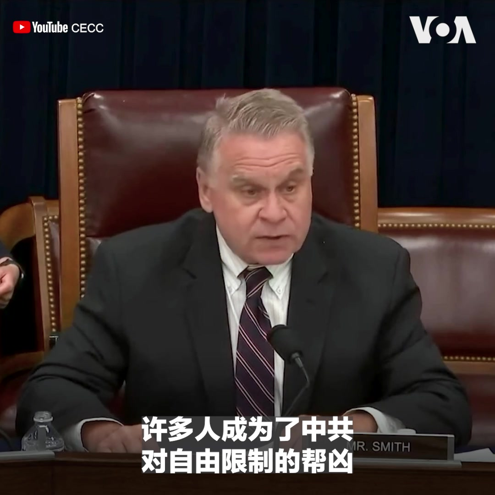
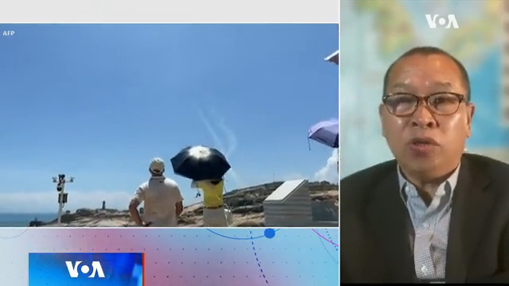
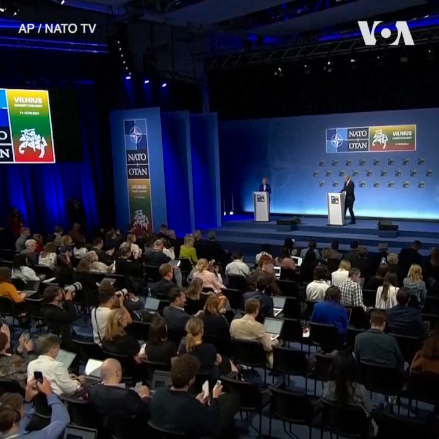
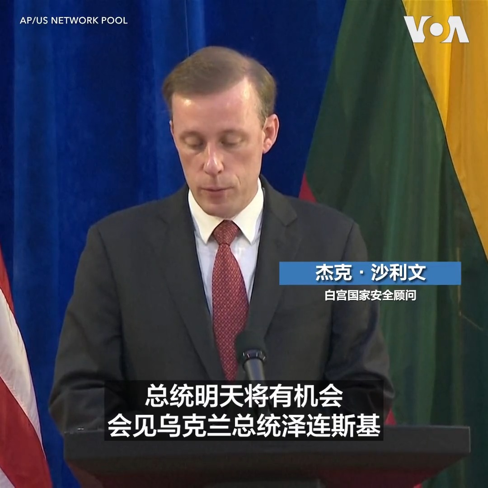

美国之音中文网 北京时间 2023-07-12T22:48:09Z 1679140594692521988 【直播预告】美国总统拜登将在北约峰会结束后于美东时间7月12日中午12点45分从立陶宛首都维尔纽斯发表讲话。预计他将强调美国及其盟友伙伴如何齐心协力支持乌克兰，捍卫民主价值，并为解决全球挑战采取行动。美国之音将在美国之音官网、YouTube频道和推特平台进行同传直播，敬请收看! https://t.co/Q5d1jHH9cE   美国之音中文网 北京时间 2023-07-12T22:58:33Z 1679143211833647104 克里姆林宫：普京访华已“排上日程” https://t.co/ubHbKR7jUK   美国之音中文网 北京时间 2023-07-12T23:32:04Z 1679151647216349188 中国黑客攻破多个美政府部门电邮系统获取敏感信息 https://t.co/LogKqpLMVc   美国之音中文网 北京时间 2023-07-12T23:51:15Z 1679156476550561793 “我们正在越来越多地打破美国的大西洋盟友和太平洋盟友之间的壁垒，”美国驻北约大使史密斯7月12日在维尔纽斯接受美国之音采访时说。她表示，北约正在与印太盟友推出“量身定制的合作伙伴项目”。她在回应北京对北约公报做出的批评时说，加强与印太盟友的合作并不意味着让它们正式加入联盟。 https://t.co/PrWcPi9yNZ   美国之音中文网 北京时间 2023-07-12T23:56:42Z 1679157846947102722 泰国外长敦·帕马威奈7月12日说，他在刚刚过去的周末与被关押的缅甸前领导人昂山素季会面。他说，昂山素季健康状况良好。这是自2021年缅甸发生军事政变后，昂山素季首次获准与外国政要会面。帕马威奈是在雅加达出席东盟成员国外长会议时对媒体作出上述表示的。 https://t.co/PQRCvTdz6S   美国之音中文网 北京时间 2023-07-12T21:01:32Z 1679113765046951938 7/12 【#时事大家谈】中国网信办推13条 自媒体管控无死角？蚂蚁金服遭巨额罚款 释放出什么信号？

嘉宾：刘梦熊，金融专家、香港荣休全国政协委员（香港）；李恒青，美国“信息与战略研究所”经济学者
主持人：叶凡   
YouTube： https://t.co/nj8pdkI5MM https://t.co/JS52jrHoGC   美国之音中文网 北京时间 2023-07-12T21:28:57Z 1679120661992579074 北约秘书长延斯·斯托尔滕贝格7月12日说，他期待着乌克兰成为北约成员。斯托尔滕贝格与出席北约峰会的乌克兰总统泽连斯基当天在维尔纽斯举行了记者会。此次峰会没有为乌克兰加入北约设定时间表，但斯托尔滕贝格重申，乌克兰将在条件成熟的时候加入北约。 https://t.co/LOVgWHz3HU   美国之音中文网 北京时间 2023-07-12T21:33:33Z 1679121822309302272 在当局“整顿”、“反垄断”大棒下，中国科技巨头1.1万亿美元市值蒸发 https://t.co/I6Ui4tZBJ1   美国之音中文网 北京时间 2023-07-12T22:14:03Z 1679132013918318595 遭港府通缉活动人士郭凤仪担忧自身安全 盼在美政庇尽快获批 https://t.co/VK15LxereY   美国之音中文网 北京时间 2023-07-12T22:14:05Z 1679132022667616259 东盟外长会议讨论缅甸危机 https://t.co/yMNAmdPYvm   美国之音中文网 北京时间 2023-07-12T18:33:32Z 1679076520638427137 中国积极发展航太 称成功发射全球首枚液氧甲烷火箭 https://t.co/hwWyHrutQf   美国之音中文网 北京时间 2023-07-12T20:23:04Z 1679104082383093760 伊朗总统开始非洲三国之行 希望加强同非洲经济往来 https://t.co/mKU6jqop6q   美国之音中文网 北京时间 2023-07-12T20:33:07Z 1679106611162251264 正在台湾访问的巴拉圭总统当选人圣地亚哥·贝尼亚（又译：佩纳）7月12日承诺在执政后将致力于密切巴拉圭与台湾的双边关系。贝尼亚当天在台北与蔡英文总统举行会晤。贝尼亚在为期五天的访问中还将与台湾学术界与企业界人士会面。 https://t.co/cfyksimiZJ   美国之音中文网 北京时间 2023-07-12T16:46:34Z 1679049599313649664 《化学武器公约》9月大限将至 美国关注中俄朝库存化武 https://t.co/werMHHpqlJ   美国之音中文网 北京时间 2023-07-12T17:30:34Z 1679060672955678720 中国谴责北约峰会公报对华取态 反对北约‘东进亚太’ https://t.co/Ysmw7kEX1m   美国之音中文网 北京时间 2023-07-12T17:51:03Z 1679065826287304705 日韩强化与北约伙伴关系 中国坚决反对北约东进亚太 https://t.co/ywOL9mU0ao   美国之音中文网 北京时间 2023-07-12T15:29:34Z 1679030221952139266 美日韩高层讨论半岛局势之际 朝鲜发射远程导弹显示实力 https://t.co/CF29djgxcG   美国之音中文网 北京时间 2023-07-12T15:43:04Z 1679033619132874753 气候问题特使克里接力访华 布林肯呼吁中国官员访美继续对话 https://t.co/2JGlJFtkVy   美国之音中文网 北京时间 2023-07-12T15:58:02Z 1679037386364428288 中国军队又举行大规模演习 连两日在台湾南部海空联训 https://t.co/TbgH9cH7Y7   美国之音中文网 北京时间 2023-07-12T11:43:23Z 1678973300448407554 美国国会暨行政当局中国委员会11日举办听证，包括前NBA球员坎特与中国维权人士程渊的妻子施明磊都出席作证，呼吁抵制帮助中国政府侵犯人权的企业。坎特点名NBA，好莱坞和耐克为了中国市场，忽视中国政府的作为。https://t.co/EO0iQr783B https://t.co/wQPUGpJiP2   美国之音中文网 北京时间 2023-07-12T10:03:34Z 1678948179990179840 地球有记录以来最热一周加剧对气候变化的担忧 https://t.co/dQiJaw7VwU   美国之音中文网 北京时间 2023-07-12T10:26:03Z 1678953839020642304 坎特：你不必成为NBA球员就能带来改变，从抵制“中国制造”做起 https://t.co/qb2QBZa4Db   美国之音中文网 北京时间 2023-07-12T06:30:00Z 1678894435159998464 李强以彩虹比喻美中关系，习近平却到战区高喊备战打仗，中共是否在对美国玩和战两手策略？加拿大女王大学历史系兼职助理教授赖小刚告诉美国之音，习李两人耍权谋扮黑白脸只能一时佔上风，难以改变美中博弈的终局。完整访谈请看7/11【时事大家谈】：https://t.co/n4Ct6TMggK https://t.co/wKJp21yU6z   美国之音中文网 北京时间 2023-07-12T06:39:04Z 1678896715519373314 参与监督伊朗核计划的美国情报官员说，伊朗没有生产核武器，但依然有理由担忧。 https://t.co/bb1M0xnOj1   美国之音中文网 北京时间 2023-07-12T06:39:06Z 1678896724012826625 拜登总统宣布把有关香港局势的国家紧急状态再延长一年 https://t.co/vlzg7ide79   美国之音中文网 北京时间 2023-07-12T06:51:32Z 1678899856579133440 俄罗斯在联合国否决对叙利亚西北部数百万人的援助，中国弃权 https://t.co/5viHlW6tvr   美国之音中文网 北京时间 2023-07-12T07:00:00Z 1678901984198557696 中国网信办公布加强自媒体管理13条，规定不得集纳负面信息、翻炒旧闻旧事、蹭炒社会热点，对造成“恶劣影响”者一律予以关闭。是必要治理？还是压缩言论空间？蚂蚁金服被罚71.23亿元巨款，意味着审查结束？还是进一步打压民企的关键一步？请收看和参加美国之音【时事大家谈】7月12日上午9点的讨论。 https://t.co/JCVeRj3NYg   美国之音中文网 北京时间 2023-07-12T07:04:02Z 1678902999832248322 北约峰会7月11日在立陶宛首都维尔纽斯拉开帷幕。白宫国安会战略沟通协调员科比当天接受美国之音采访时对土耳其同意瑞典加入北约表示感谢。科比说，北约将在峰会期间和乌克兰讨论加入联盟的最佳途径。他强调，乌克兰正在枪林弹雨中为自己的国家战斗和牺牲，“我们必须集中精力帮助他们取得成功”。 https://t.co/U4aPXNHgNA   美国之音中文网 北京时间 2023-07-12T07:14:04Z 1678905524132405249 维吾尔三兄弟在印度入狱10年后恐被遣返中国 https://t.co/85A0cQPNuV   美国之音中文网 北京时间 2023-07-12T07:30:00Z 1678909535082217473 北约扩大与印太国家合作，能否吓阻中共对台动武？日本国际教养大学中国研究助理教授陈宥桦告诉美国之音，印太版北约未来或可对台军售、交换情报与协助训练，令习近平每天早上起床得出今天攻打台湾难以成功的结论，这就是印太版北约维护台海安全的战略目标。7/11【时事大家谈】https://t.co/n4Ct6TMggK https://t.co/luKUyGNsyK   美国之音中文网 北京时间 2023-07-12T07:34:02Z 1678910551488098305 候任美参联会主席布朗上将：将加快供台军备 确保维持台海和平现状 https://t.co/DClijFw5D6   美国之音中文网 北京时间 2023-07-12T07:58:02Z 1678916590212108288 联合国人权理事会谴责惊人增长的宗教仇恨 https://t.co/VdSDQ1iV5y   美国之音中文网 北京时间 2023-07-12T08:03:33Z 1678917976341504007 台湾将在印度扩大存在，经济关系日益紧密 https://t.co/d3PZ0ykr0I   美国之音中文网 北京时间 2023-07-12T08:18:22Z 1678921708865028098 美国国会暨行政当局中国委员会 @CECCgov 7月11日召开听证会，审查与中国开展业务的美国企业成为中共侵犯人权的帮凶的案例，并探讨因应对策。“美国公司与中国共产党串通一气，协助和怂恿其犯下极其恶劣的反人类和种族灭绝的罪行，这令人深感沮丧，”  委员会主席、共和党众议员克里斯.史密斯说。 https://t.co/9fuYKgZKmy   美国之音中文网 北京时间 2023-07-12T08:30:00Z 1678924634568413184 习近平曾说火箭军是中共战略威慑核心力量，但火箭军近来风波不断，接连传出高层被带走调查和非正常死亡，前解放军前海军司令部中校姚诚告诉美国之音，火箭军在攻台作战中势必将成为美国首先摧毁的目标，因此火箭军内部官兵畏战情绪非常强烈，成为被整肃的对象。【#时事大家谈】https://t.co/n4Ct6TMO6i https://t.co/Xr0YlpmT7t   美国之音中文网 北京时间 2023-07-12T08:54:33Z 1678930812576882689 汹涌的河流威胁佛蒙特州首府，一百多人获救 https://t.co/HzPXIqOYcF   美国之音中文网 北京时间 2023-07-12T09:15:33Z 1678936097781608448 VOA专访国安会发言人：乌克兰能在不远的将来加入北约吗？是什么促使土耳其不再阻拦瑞典入盟？ https://t.co/aSNVCgmpXo   美国之音中文网 北京时间 2023-07-12T09:23:33Z 1678938112574238720 “印太地区为美军首要重点” 候任美参联会主席布朗上将：中俄挑战国际秩序 https://t.co/PUgDrIrkUS   美国之音中文网 北京时间 2023-07-12T09:39:04Z 1678942015965503488 加拿大调查两家涉嫌卷入中国强迫劳动的公司 https://t.co/2jjCNzrVLU   美国之音中文网 北京时间 2023-07-12T04:41:35Z 1678867151321698307 拜登：今年北约峰会代表“历史性的时刻” https://t.co/QWLs82rdtW   美国之音中文网 北京时间 2023-07-12T05:17:03Z 1678876078339932160 中国称外长秦刚生病，王毅将代他参加东盟会议 https://t.co/UFxwQkwnlF   美国之音中文网 北京时间 2023-07-12T05:25:03Z 1678878090880249856 被控为中国代理人的李贞驹状告英国军情5处 https://t.co/XPKkP9e01J   美国之音中文网 北京时间 2023-07-12T05:36:34Z 1678880990511476741 #现场直击 北约峰会首次在立陶宛首都维尔纽斯召开。虽然当局为了保障峰会的安全举行，在领导人下榻的酒店周围以及通往会场的主干道设置了安保设施，但是仍抵挡不住当地民众的热情。许多民众聚集在美国总统拜登下榻的酒店周围，希望一睹拜登风采。跟随美国之音记者莉雅去现场看一看。 https://t.co/BIskKOPaec   美国之音中文网 北京时间 2023-07-12T06:03:14Z 1678887701599358976 美国起诉一名智库负责人非法充当中国代理人并促成中国武器交易 https://t.co/O0tCjbFhsQ   美国之音中文网 北京时间 2023-07-12T02:51:33Z 1678839460992270336 自媒体管控再收紧 网信办新规强调严防假冒 https://t.co/L9YQnHz8f4   美国之音中文网 北京时间 2023-07-12T02:57:25Z 1678840939228397568 北约秘书长延斯·斯托尔滕贝格7月11日说，目前不是接纳乌克兰加入北约的最佳时机，北约盟国将在乌俄战争结束后就乌克兰是否满足加入条件作出评估。斯托尔滕贝格是在北约维尔纽斯峰会的第一天对媒体作出上述表示的。他在记者会上还提到来自中国的威胁。 https://t.co/E9fnjoEPmw   美国之音中文网 北京时间 2023-07-12T03:05:27Z 1678842957078622209 #现场直击 北约峰会11日在立陶宛首都维尔纽斯开幕。这是北约1949年成立以来首次在立陶宛举行峰会。为了确保峰会的安全举行，立陶宛动用了全国的警力和储备警察，在峰会会场还安排了军车和军人维护安全。在峰会召开前夕，土耳其与北约秘书长和瑞典达成协议，同意瑞典加入北约。https://t.co/6vjpFKc6oQ https://t.co/XAaPD9uuO7   美国之音中文网 北京时间 2023-07-12T03:19:15Z 1678846431744913408 冰柠檬茶、新鲜花束、铁板烤肠……随着中国后疫情时代就业形势愈发严峻，越来越多的民众选择上街摆摊。他们希望这份收入能够支付房租或是补贴家用。中国4月份青年失业率达到创纪录的20.4%，许多城市已放宽对“摆摊”的限制。 https://t.co/qf4CiZSSpF   美国之音中文网 北京时间 2023-07-12T03:47:35Z 1678853560887287809 乌克兰总统泽连斯基7月11日抵达立陶宛维尔纽斯，参加北约峰会。北约领导人目前尚未向基辅发出入盟邀请或是入盟时间表，泽连斯基早些时候批评这种立场“荒谬”。 https://t.co/Be47ZquNDj   美国之音中文网 北京时间 2023-07-12T00:37:55Z 1678805832576663553 白宫国家安全顾问杰克·沙利文7月11日说，美国总统拜登将在维尔纽斯北约峰会期间会见乌克兰总统泽连斯基。沙利文说，双方将讨论美国与盟友如何帮助乌克兰保家卫国，阻止未来的侵略。他还说，现在邀请乌克兰入盟或将使北约与俄罗斯开战，但北约盟国在乌克兰未来的入盟之路上将发出“团结、积极的信号”。 https://t.co/ApwX0Y3sOV   美国之音中文网 北京时间 2023-07-12T01:06:08Z 1678812932644409344 美国国防部修改政策 不再为接受中国审查的电影摄制提供帮助 https://t.co/rTs8GdRlG8   美国之音中文网 北京时间 2023-07-12T01:06:10Z 1678812941343391744 凡涉生孩儿都得政府管 北京发起六个月辅助生殖技术应用专项严打 https://t.co/Miru9985AG   美国之音中文网 北京时间 2023-07-12T01:52:04Z 1678824492804747264 气候异常威胁人类，去年夏天欧洲热浪造成近6.2万人死亡 https://t.co/hp5AiL1Zgk   美国之音中文网 北京时间 2023-07-12T02:09:02Z 1678828762962731009 北约在立陶宛的维尔纽斯举行历史性峰会 https://t.co/L3bPRVaKk5   