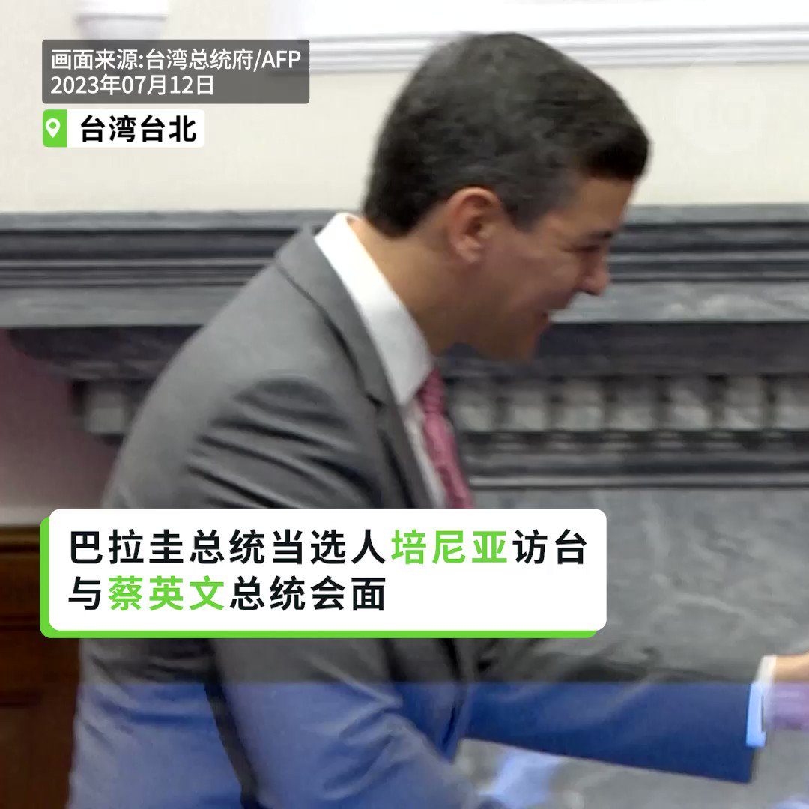
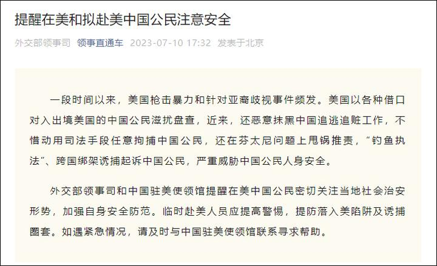
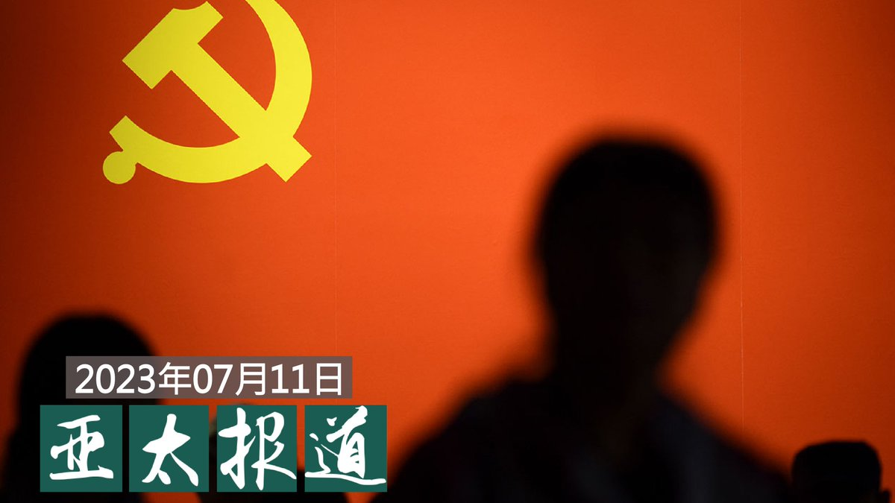

自由亚洲电台 北京时间 2023-07-12T19:10:24Z 1679085795054067712 【中国高考生1300万 27所 #军校招不满】
【父母不愿子女当兵】
中国高考分数和各地高校录取人数陆续公布。在1291万名考生中，中国 #军事院校 报考人数连续三年下滑，今年27所军校招生仅一万余人。面对待遇优厚的军校，即使降低分数仍吸引不了考生，家长的回答是不愿把孩子送上战场。
https://t.co/QTSUGP8Jn5   自由亚洲电台 北京时间 2023-07-12T19:45:00Z 1679094503230021633 【巴拉圭总统当选人会蔡英文】
【承诺“站在台湾这边”】
台湾友邦 #巴拉圭 共和国总统当选人 #培尼亚（Santiago Peña Palacios）率团访台，他当面对 #蔡英文 承诺，未来五年执政，一定站在"中华民国"、"台湾"这边。"我们在价值观以及共同的理想目标上面，是绝对不会妥协的。" https://t.co/j4iYwKTRN3   自由亚洲电台 北京时间 2023-07-12T15:25:00Z 1679029071395815426 【北京多家青旅拒年逾35岁入住】
【网民炮轰歧视无处不在】
近日，北京一家 #青年旅舍 拒绝 #35岁以上 的旅客入住的消息，引发网民关注。近日，李先生（化名）在某社交平台上发帖抱怨北京多家青旅拒绝接待35岁以上的中年人。学者称，从招聘公务员到社会各领域，#歧视 规定无处不在。
https://t.co/feJuznuJiY   自由亚洲电台 北京时间 2023-07-12T08:04:42Z 1678918268797726720 7月10日，中国外交部领事司官方公众号“领事直通车”发布通知，“#提醒在美和拟赴美公民注意安全，提防落入美陷阱及诱捕圈套”。措辞之严厉，引起中国网民热议，上了知乎热榜。有人说中美冲突进一步升级了，有人说“危邦不居”，呼唤在美华人赶紧回国。
您怎么看？ https://t.co/ozj54FEhV8   自由亚洲电台 北京时间 2023-07-12T04:38:45Z 1678866440898719748 上海划定区域鼓励新型设摊经营，27岁IT技术员走上街头兼职摆摊卖冰柠檬茶 https://t.co/XgsOP7FSGZ   自由亚洲电台 北京时间 2023-07-12T04:43:02Z 1678867515685085186 #事实查核｜美国防部称"比起平民伤亡，打败俄更重要"？
 https://t.co/cdSICoop01   自由亚洲电台 北京时间 2023-07-12T05:00:29Z 1678871907175923712 评论 | #陈光诚 @iguangcheng："'#七一'党庆"："#九千八百万党员"原来是滥竽充数
 https://t.co/nvK0L5KNzi   自由亚洲电台 北京时间 2023-07-12T05:41:52Z 1678882323146870785 香港国安警察周二搜查了流亡活动人士 #罗冠聪 的住所，并带走其父母兄弟进行长时间讯问，然后释放。
这是港警在发出逮捕令后首次讯问活动人士的亲属。 https://t.co/ASVFCyFvSd   自由亚洲电台 北京时间 2023-07-12T05:45:36Z 1678883261018427392 【#亚太报道（2023-7-11）】
欢迎收听和订阅播客【亚太报道】 https://t.co/MjLNSvVMqc
《#人民日报》特稿 #树立正确的就业观 引发舆论反弹 / 北京计划禁止 #天安门 公交车设置广告 / #郑州 当局也在”大撒币“吗？ / 广东公务人员集体大幅 #降薪 / 台湾即将举行 #汉光军演 https://t.co/5p8YkjUHRz   自由亚洲电台 北京时间 2023-07-12T02:34:31Z 1678835175403278346 据维权网消息，人权观察、美国笔会、人道中国等四十个国际组织和纽约大学法学院教授孔杰荣等20多位国际人士联合发表声明，反对中国再次镇压人权律师，并指出这一镇压正在演变成709律师大抓捕案2.0版。
 https://t.co/LfWdtxr30h   自由亚洲电台 北京时间 2023-07-12T02:35:00Z 1678835297419956224 评论 | #胡平：为什么要他们用笔记？
 https://t.co/bihHqVVC2h   自由亚洲电台 北京时间 2023-07-12T03:38:44Z 1678851334055817216 RT @RFA_Chinese: #人民日报 《#树立正确的就业观》，像火柴点燃社交媒体怒火。
网民说：
“忽悠年轻人去搞乡村振兴、绿色发展、社会服务、卫国戌边。绝口不提中石油、中石化、中国烟草、中国银行”
“让我们去烟草、电力、石油、发达地区做公务员发光发热吧”
“内外脱钩、…   自由亚洲电台 北京时间 2023-07-12T03:39:29Z 1678851523348930562 中国国家主席 #习近平 日前会见到访的俄罗斯联邦委员会主席马特维延科，重申两国“世代交好”，社会和民意基础更加“牢固”。这也是俄罗斯 #瓦格纳兵变 后，习近平首次针对中俄关系表态。
有学者指出，由于中方并未在第一时间力挺普京，因此要借此修补双边关系。
https://t.co/EdDT5b63Kr   自由亚洲电台 北京时间 2023-07-12T03:39:54Z 1678851630668869633 7月11日，美国国会及行政当局中国委员会（Congressional-Executive Commission on China，CECC）就跨国企业是否在为中国当局侵犯人权的行动提供支持举行听证会，以加强对国际供应链的审查。 https://t.co/9X83EiaLwh   自由亚洲电台 北京时间 2023-07-12T03:58:15Z 1678856244617170944 随着中国对外扩张的影响力日趋加剧，#印太安全局势 也成为全球关注的焦点。外界普遍认为，本届 #北约峰会 中，各国领导人也将重点讨论有关中国议题。其中，澳大利亚、新西兰、韩国、日本等”亚太四国”今年也接获邀请，将以伙伴国家身份连续第二年参与峰会。

 https://t.co/4iYeRWLRN3   自由亚洲电台 北京时间 2023-07-12T00:35:20Z 1678805182828908544 近日，#广东 省人民政府举行新闻发布会，宣布公务员集体降薪 25%，证实了早前民间的传言。在此之前，全国已有多个省份调低了公务员薪资。其中，浙江降薪25%，江苏降薪15%，福建降薪20%。随着近期 #广东公务员集体降薪，其它各省 #公务员降薪 大幕也将陆续拉开。 https://t.co/9ux0FAgI57   自由亚洲电台 北京时间 2023-07-12T01:06:09Z 1678812937019092992 据美国《华尔街日报》报道，#中国经济 面临着双重冲击，一是中国经济复苏正陷入停滞，二是西方国家 #央行加息 抑制了消费者支出。
 
另外，中国虽然放宽了对 #房地产 市场的限制，但房市复苏的势头却在减退。 https://t.co/HIbbNPQf92   自由亚洲电台 北京时间 2023-07-12T01:36:39Z 1678820610959613952 中国官媒似乎不依不饶，《人民日报》微博官方账号发表微评论：「#宝格丽道歉 了，寥寥几句，满满求生欲。所谓的『管理疏忽』『标识误注』，难以服众。
这事您怎么看？
 https://t.co/anrsJOyTp1   自由亚洲电台 北京时间 2023-07-12T00:14:08Z 1678799846315274245 台湾年度 #汉光 39号实兵演练将在7月24至28日举行，三军实兵实装操演将涵盖海空兵力、电子、网路与认知作战等科目。而全台22县市也将同步进行万安46号防空演习、疏散避难、灾民收容等演练。

 https://t.co/n8xel9Uk1o   