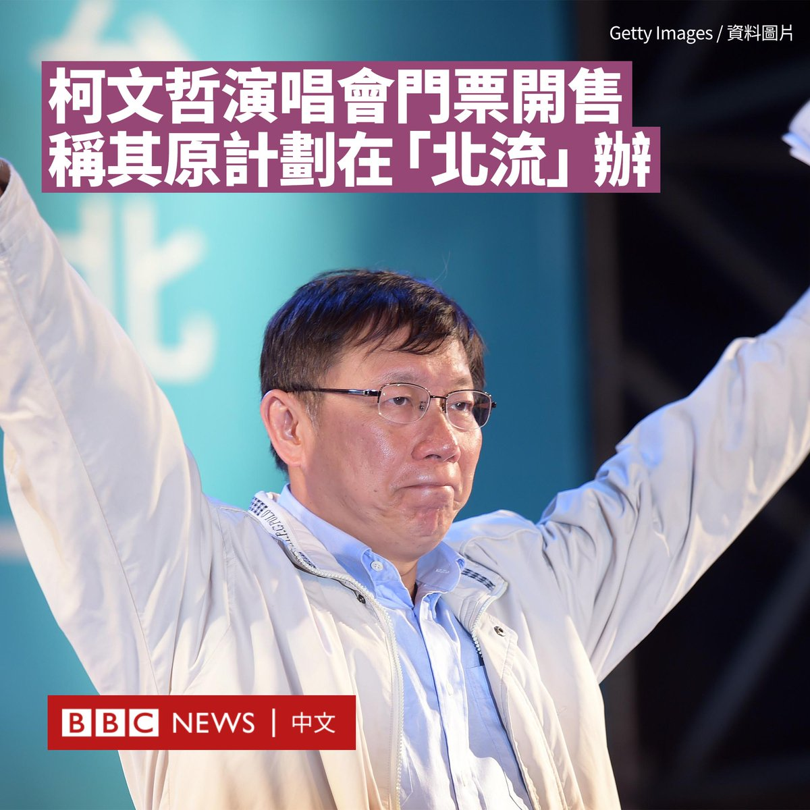
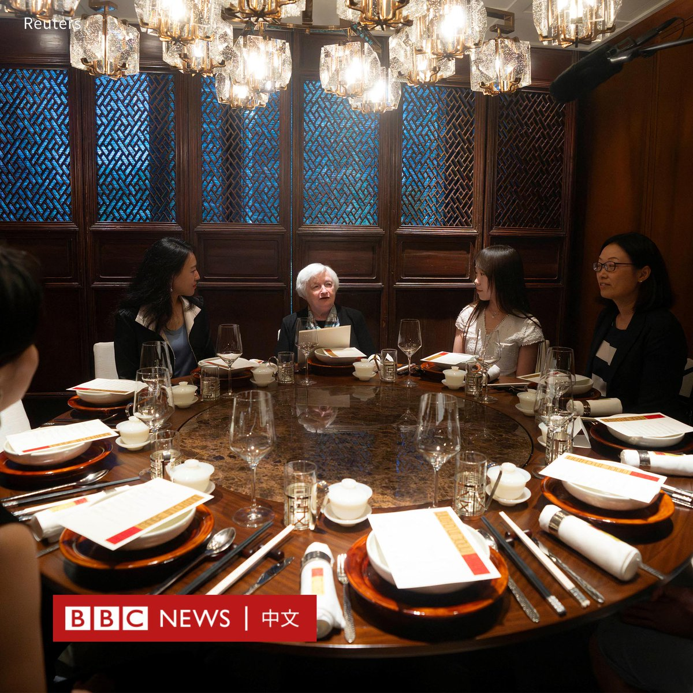
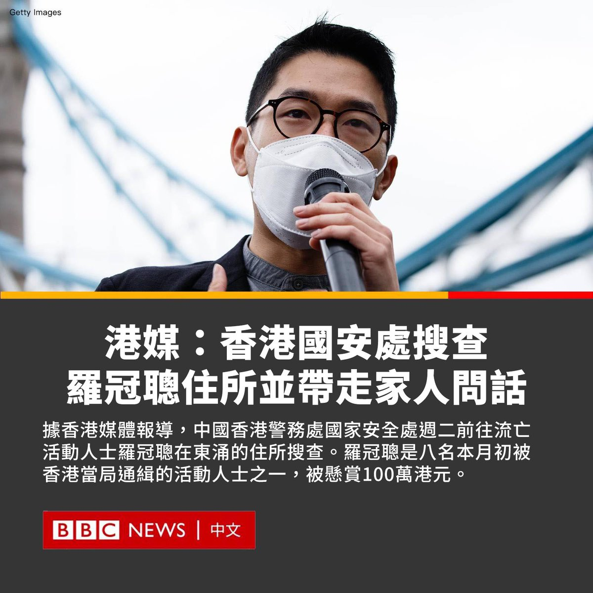
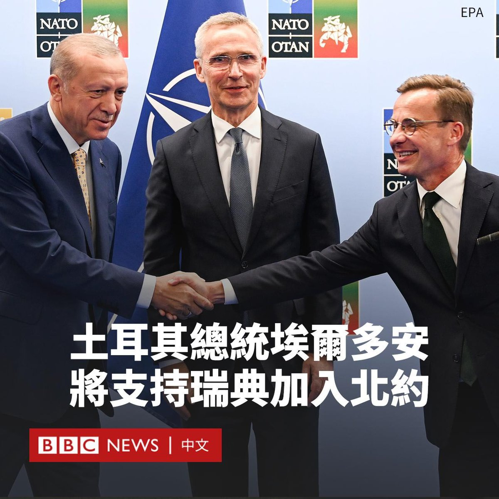
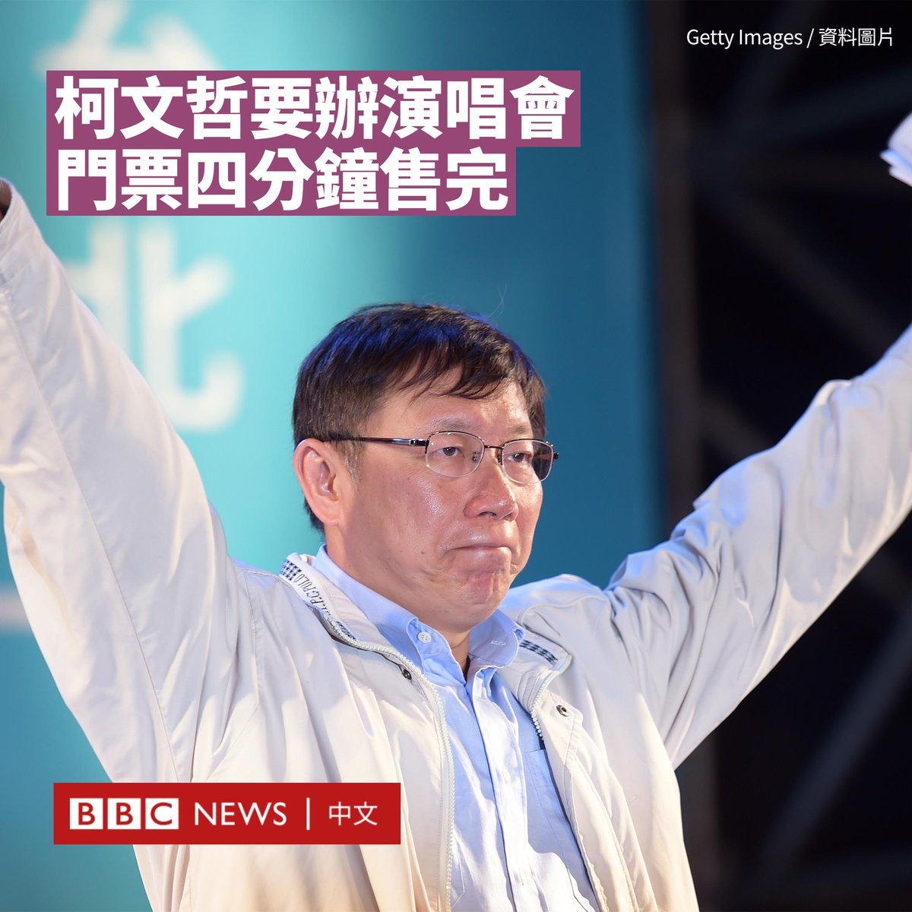

D英国广播公司BBC 北京时间 2023-07-11T17:05:38Z 1678692012344897538 台湾民众党主席、2024年大选总统参选人柯文哲将于本月底在台北市举行演唱会。他指该演唱会原计划在台北流行音乐中心举办，但遭到台北市政府拒绝。

对此，台北市长蒋万安周一（7月10日）反驳称，该中心场地租借有明确规定，不能涉及政治活动，这还是柯文哲担任台北市长时订下的规定。

柯文哲计划于7月29日举办“KP SHOW”演唱会，据台湾媒体报道，该演唱会门票周一（7月10日）开售后，四分钟即售罄，不过后来有网友发现截至次日购票网站仍有余票。

据报导，柯文哲演唱会的实体票价为8800元新台币（280美元；2025元人民币），线上参与票价500元（16美元；115元人民币）。

这一票价与今年3月韩国人气女团Blackpink高雄站演唱会核心区的票价相同，但柯文哲没有公布演唱会的歌单。

63岁的柯文哲曾任台北市长，目前作为民众党党魁参与角逐2024年台湾总统大选，成为台湾政坛在蓝绿之外异军突起的第三势力。

尽管柯文哲曾自嘲唱歌“很烂”，但他过去曾在台北跨年晚会演唱台湾乐团五月天的歌曲《憨人》，还曾多次挑战《囚鸟》等歌曲。

由于无法在台北流行音乐中心举办，该演唱会将在大安区的Corner Max多功能展演馆进行，观众席仅有342个名额。

“他，从台大医院创伤医学部主任到台北市长，现在准备参选中华民国总统，如今，竟然还要挑战观众感官极限，开人生第一场售票演唱会。”演唱会的广告写道。

虽然开演唱会的决定受到其粉丝支持，但有网民表示“这就是卖信仰的”、“第一次听到选总统看演唱会的”，还有批评者反对他借演唱会名义进行政治募款。   D英国广播公司BBC 北京时间 2023-07-11T18:21:50Z 1678711187775561729 阳光忧郁症并非专业医学名词，但近来在网络空间被不断讨论，主要指外显个性及形象正向，活泼乐观人士罹患忧郁症，人们很难发现他们心理有忧郁倾向。https://t.co/91qxOnJt4q   D英国广播公司BBC 北京时间 2023-07-11T14:40:59Z 1678655608210477057 美国财政部长耶伦（Janet Yellen）上周访华期间，除了会晤中国高级官员外，还在上周六（7月8日）宴请多名中国女性经济界人士，但这在中国网络引发争议。

一些中国网民批评与耶伦聚餐的人都是亲美人士，是“美国官方认证的反贼”，还有人指责她们是“汉奸”和“极端女权主义者”。

路透社报道称，与耶伦共进午餐的有六名女性经济学者，旨在强调性别多样性。76岁的耶伦是美国历史上首位女财长，也曾是美联储首位女性主席。

除了坐在主位的耶伦，其余在座者目前能确定的包括经济学人集团（The Economist Group）大中华区总裁刘倩与清华大学经济学博士郝景芳。

郝景芳在回应为何参加宴会时写道：“因为耶伦是对中国最友好的美国官员，她一直致力于发展友好的中美关系。”

但这并没有让一些网友买账。他们指责耶伦是“明显的危险人物”，还有网友呼吁对参会者开展《反间谍法》调查。

不过，也有网友表示，这种与民间人士的餐叙在外交中很正常，指责一些人“搞运动式的批斗”。

美国驻华大使馆在一份会谈纪要中称，耶伦在聚餐时与这些女性就中国经济，以及有哪些机会可以增加女性在劳动力中——包括领导岗位上——的代表性展开了讨论。

她称，女性在劳动人口结构中的参与是促成包容性增长的主要推动力之一，尤其是在帮助确保经济研究和政策制定能够恰当体现社会的优先事项方面，女性对经济学的贡献十分重要。   D英国广播公司BBC 北京时间 2023-07-11T15:41:46Z 1678670905575350273 据多家香港媒体报导，中国香港警务处国家安全处周二（7月11日）早上前往流亡活动人士罗冠聪在东涌的住所搜查。

据报导，他的父母及兄长三人被警方带走问话，但目前没有拘捕任何人。

香港特首李家超同日向媒体表示，自警方宣布通缉并悬红八名流亡港人之后，警方已收到一些资料，会“继续收集情报、穷追猛打、执法必严”。

他呼吁任何获得情报的民众通知警方，指民众都应该把这八人当作“过街老鼠、避之则吉”。

罗冠聪是八名本月初被香港当局通缉的活动人士之一，被悬赏100万港元（127,800美元）。他目前以政治避难身份居住在英国，中国大使馆指责英国“包庇违法犯罪分子”。

罗冠聪曾于2020年在个人社交平台上发帖指“与家人已经没有联络，正式断绝关系”。

BBC中文已向香港警务处就有关事件查询，暂未获回复。   D英国广播公司BBC 北京时间 2023-07-11T16:26:21Z 1678682124269023233 【最新消息】中国外交部表示，中国外交部长秦刚“因健康原因”无法出席在印尼举办的东南亚国家联盟（东盟）部长级会议。

外交部发言人汪文斌表示，作为中国最高外交官员的中共中央外事工作委员会办公室主任王毅将代为出席。

现年57岁的秦刚最后一次公开露面是在6月25日，他在北京会见了斯里兰卡、俄罗斯和越南的官员。

中国还取消了欧盟外交政策负责人博雷利（Josep Borrell）原定于本周对北京的访问，但没有给出理由。

欧盟外交事务发言人表示，北京告知预计的日期“已不可能实现”。中国外交部则表示，欢迎他在“双方方便的时候尽早访华”。   D英国广播公司BBC 北京时间 2023-07-11T13:09:25Z 1678632564242935809 北约秘书长斯托尔滕贝格（Jens Stoltenberg）表示，土耳其总统埃尔多安（Recep Tayyip Erdogan）同意支持瑞典加入北约（NATO）。

他说，埃尔多安将把瑞典的申请提交给安卡拉的议会，并“确保批准”。

与此同时，瑞典首相克里斯特松（Ulf Kristersson）表示：“我非常高兴，这是瑞典美好的一天。”

数月以来，土耳其都拒绝瑞典的加入申请，指责其纵容库尔德武装分子。

作为北约的31个成员国之一，土耳其对于任何新国家加入该组织都有否决权。

美国总统拜登（Joe Biden）回应称，他欢迎埃尔多安总统致力于“快速批准”瑞典加入北约的决定。

“我已准备好与埃尔多安总统和土耳其一起加强欧洲大西洋地区的防御和威慑。我期待及欢迎克里斯特松首相和瑞典成为我们的第32个北约盟友。”白宫的一份声明称。

英国首相苏纳克（Rishi Sunak）表示，瑞典的加入将“让我们所有人更加安全”。

斯托尔滕贝格在周一（7月10日）晚间宣布了这项协议，此前土耳其和瑞典领导人在立陶宛首都维尔纽斯进行了会谈。

北约秘书长将其描述为“历史性的一步”，但强调无法确定瑞典加入该军事联盟的“明确日期”，因为这取决于土耳其议会的批准。   D英国广播公司BBC 北京时间 2023-07-11T12:00:03Z 1678615106715025408 泰国曼谷一段约500米长的在建高架桥突然倒塌，造成至少一人死亡，数人重伤。

现场画面显示，巨大的钢筋和混凝土砸中周边建筑，并压毁路上车辆。 https://t.co/sevLeejqwB   D英国广播公司BBC 北京时间 2023-07-11T10:52:39Z 1678598146153385985 台湾民众党主席、2024年大选总统参选人柯文哲将于本月底在台北市举行演唱会。据台湾媒体报道，该演唱会门票周一（7月10日）开售后，四分钟即售罄。

柯文哲计划于7月29日举办“KP SHOW”演唱会，实体票价8800元新台币（280美元；2025元人民币），线上参与票价500元（16美元；115元人民币）。

这一票价与今年3月韩国人气女团Blackpink高雄站演唱会核心区的票价相同，但柯文哲没有公布演唱会的歌单。

63岁的柯文哲曾任台北市长，目前作为民众党党魁参与角逐2024年台湾总统大选，成为台湾政坛在蓝绿之外异军突起的第三势力。

尽管柯文哲曾自嘲唱歌“很烂”，但他过去曾在台北跨年晚会演唱台湾乐团五月天的歌曲《憨人》，还曾多次挑战《囚鸟》等歌曲。

据台湾媒体报导，该演唱会将在大安区的Corner Max多功能展演馆举办，观众席仅有342个名额。

虽然开演唱会的决定受到其粉丝支持，但有网民表示“这就是卖信仰的”、“第一次听到选总统看演唱会的”，还有批评者反对他借演唱会名义进行政治募款。   D英国广播公司BBC 北京时间 2023-07-11T09:01:43Z 1678570228765323265 越来越多的应用程式采用“端对端加密”，保障除了讯息的传送者与接收者双方以外，没有人能看见他们之间的讯息。但是有些政府威胁要禁止这项技术，为什么？ https://t.co/7hVNxOFKvN   