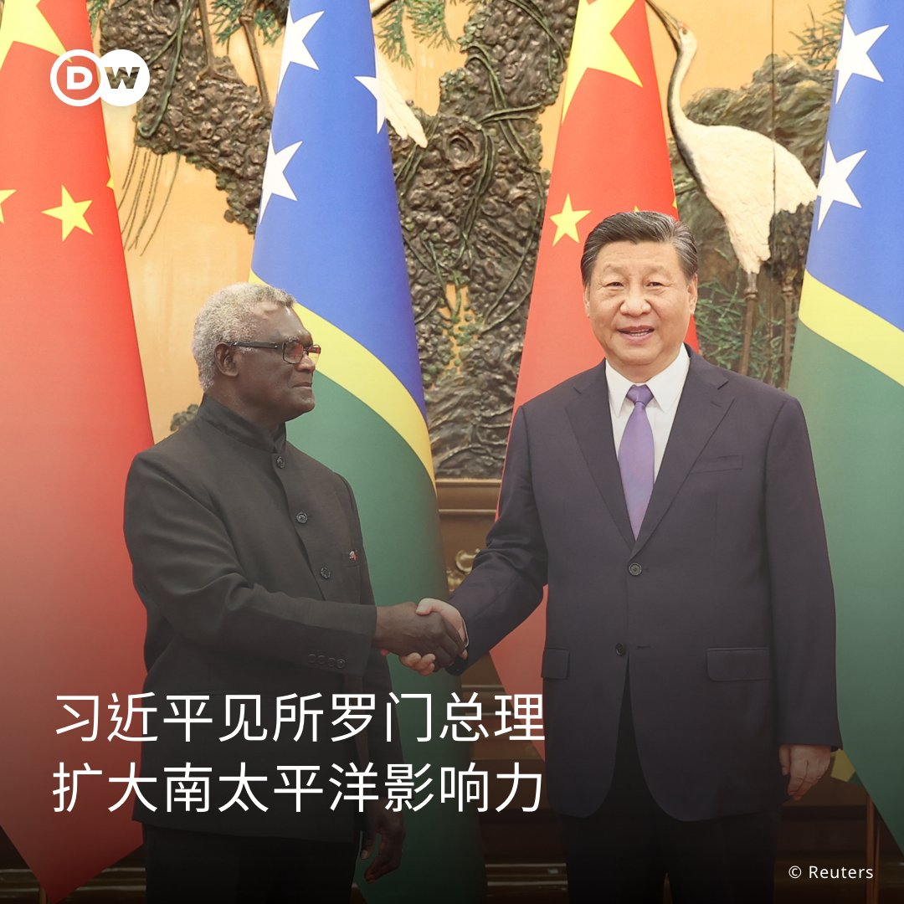

德国之声 北京时间 2023-07-11T16:24:49Z 1678681737377742848 详情请见：https://t.co/n4o5EGfcnN https://t.co/esEFMVfJ8t   德国之声 北京时间 2023-07-11T11:23:23Z 1678605880043118592 【中国、所罗门群岛是 #好兄弟？ 】🇨🇳 🇸🇧 

所罗门群岛总理 #索加瓦雷 造访中国时，习近平形容 #所罗门群岛 为"可以依靠的好兄弟"，称双方关系"后来居上"。 2019年，索加瓦雷上任不久后，切断与台湾邦交，转而与中国建交。
详细报导👉https://t.co/HYujUYr7ws https://t.co/FXL04LeQBe   德国之声 北京时间 2023-07-11T10:26:09Z 1678591475511091200 #美国 1名智库主任被控担任「#中国 代理人」，涉嫌非法促成武器、石油交易，以及影响时任美国总统 #特朗普 的政策。该嫌犯否认指控，自称遭政治针对。检方指出，这名嫌犯已经潜逃。
https://t.co/RfKIFgFqQG   德国之声 北京时间 2023-07-11T05:41:00Z 1678519715461836800 《商报》就美国财长耶伦访华评论说，认为美中两个大国短期内会相互靠近，这是幻觉。两国竞争世界最大经济强国的头号交椅，其它一切几乎都服务于这一目标。

在与中国划清界限方面，拜登与其前任特朗普一样毫不妥协。2024年无论是谁在总统选举后入主白宫，都会继续该路线。

https://t.co/Xs8eaOdz7A https://t.co/nCGbU5qUIl   