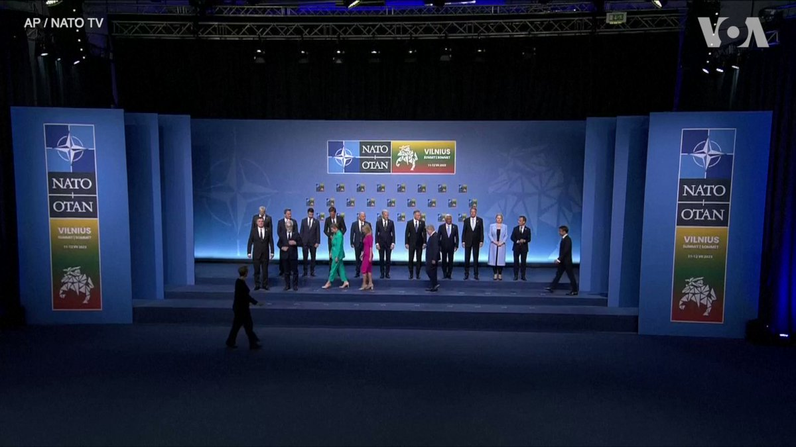
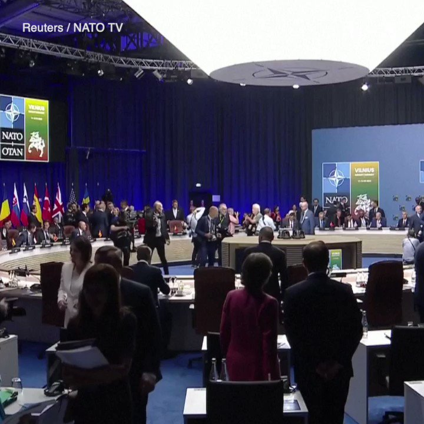
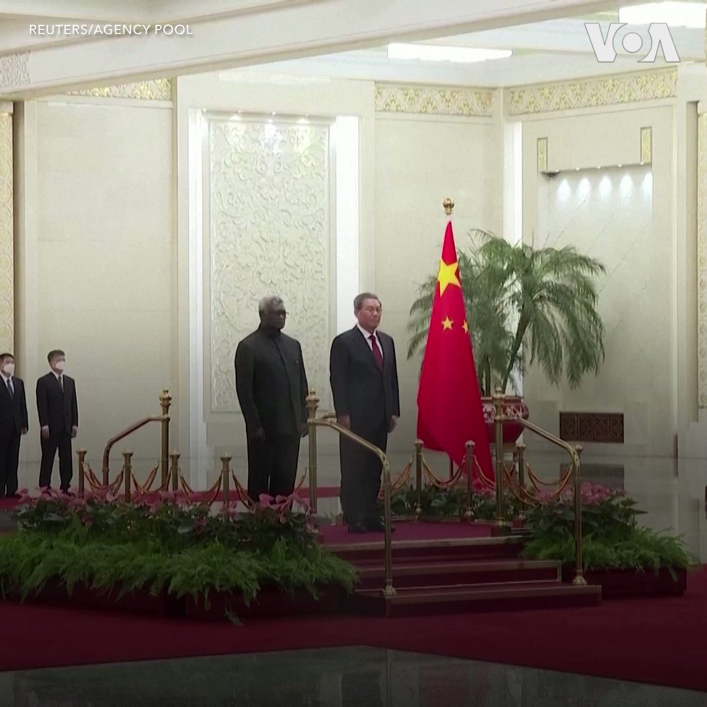
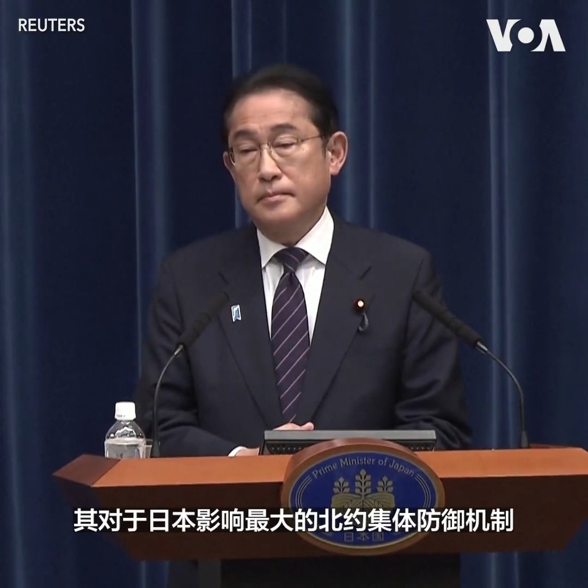
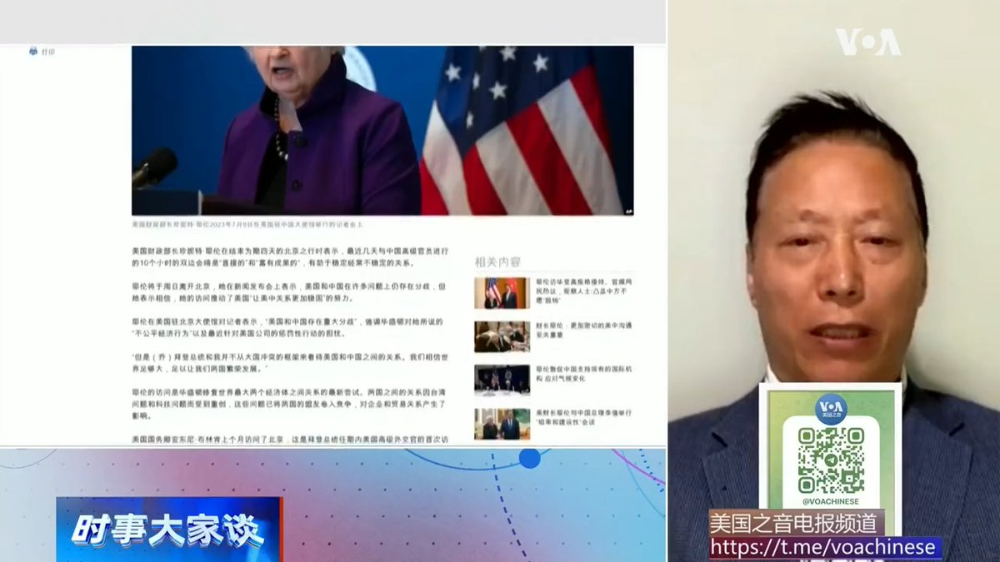
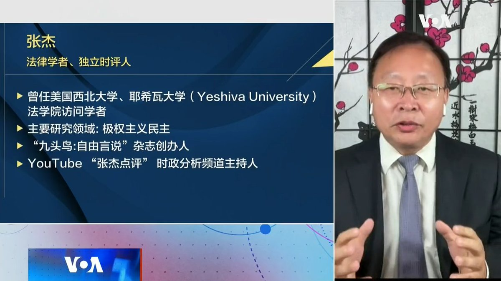
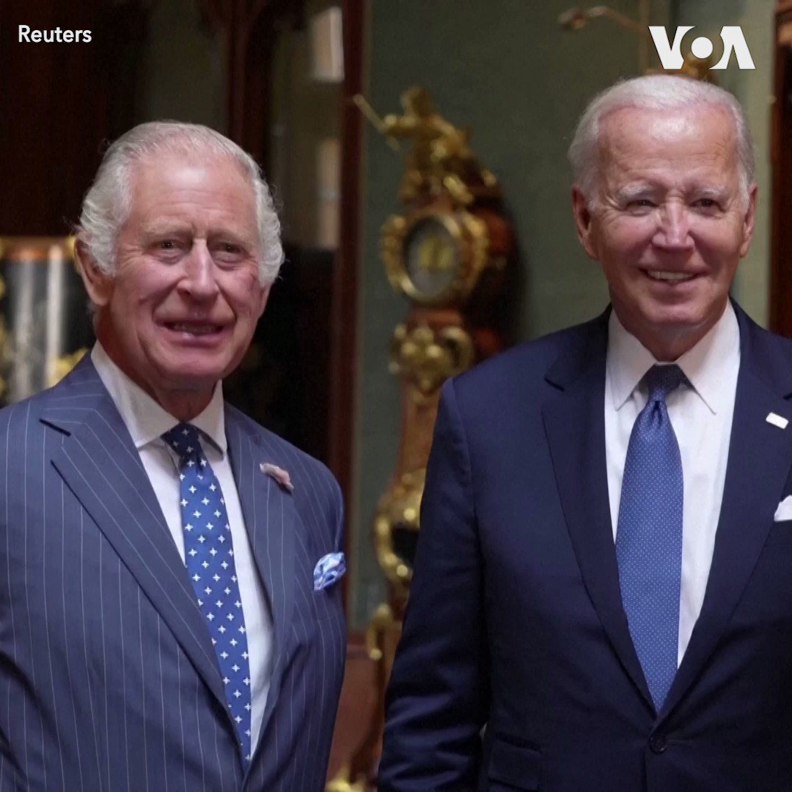

美国之音中文网 北京时间 2023-07-11T21:00:59Z 1678751239134232579 7/11【#时事大家谈】北约峰会再邀日韩 触动北京敏感神经？习近平玩和战两手 美中博弈谁佔上风？

嘉宾：加拿大女王大学历史系兼职助理教授赖小刚；日本国际教养大学中国研究助理教授陈宥桦 ；中共解放军前海军司令部中校姚诚
主持人：樊冬宁

Youtube https://t.co/MOy9KAT5oR https://t.co/cqPtfoehMc   美国之音中文网 北京时间 2023-07-11T21:16:35Z 1678755165585776640 出席北约峰会的各成员国领导人7月11日拍摄“全家福”合照。此次为期两天的峰会在立陶宛首都维尔纽斯举行。北约去年发布的“战略概念”首次提及中国对北约的“利益、安全及价值观”构成挑战。有迹象显示，中国或成为维尔纽斯峰会的重点议题之一。https://t.co/RfCcQV50pQ https://t.co/3paMJjYC3Q   美国之音中文网 北京时间 2023-07-11T22:05:05Z 1678767367692877824 土耳其最终同意瑞典加盟，北约秘书长称北约峰会具有历史意义 https://t.co/555Ih7xzg4   美国之音中文网 北京时间 2023-07-11T22:10:49Z 1678768810176954368 北约秘书长延斯·斯托尔滕贝格7月11日欢迎瑞典加入北约。一天前，土耳其领导人埃尔多安宣布该国议会将审议并批准瑞典加入北约的议定书。此举为瑞典入盟扫清了障碍。https://t.co/PPj7wNnIW9 https://t.co/2RAkePUlfQ   美国之音中文网 北京时间 2023-07-11T22:29:05Z 1678773407280959488 澳大利亚担忧中国-所罗门群岛警务合作协议，敦促公布细节 https://t.co/eXEo9WQSsU   美国之音中文网 北京时间 2023-07-11T23:18:04Z 1678785737758756864 印度将进行第二次登月 https://t.co/AIddt6QHv9   美国之音中文网 北京时间 2023-07-11T23:25:03Z 1678787493557313537 港国安警搜查海外被通缉者住所，带走父母兄长录口供 https://t.co/5HPX9Jh5so   美国之音中文网 北京时间 2023-07-11T23:39:05Z 1678791025001918466 巴拉圭当选总统潘尼亚访台，矢言建立更亲密的巴台关系 https://t.co/BWQe0paEyi   美国之音中文网 北京时间 2023-07-11T18:40:05Z 1678715779804696578 世界媒体看中国：耶伦访中成就何在 https://t.co/C4dFfJFfS4   美国之音中文网 北京时间 2023-07-11T17:12:03Z 1678693627168686085 中国外长秦刚消失逾两周引发猜测 港媒称其确诊新冠肺炎 https://t.co/6v52cx0ewB   美国之音中文网 北京时间 2023-07-11T17:54:04Z 1678704198031122432 岸田文雄与泽连斯基预计北约峰会期间会面 乌克兰希望日本提供“实战性”装备 https://t.co/efjEJODo9u   美国之音中文网 北京时间 2023-07-11T18:06:33Z 1678707340135243778 诋毁美国的假消息漫天飞 台湾政府忙于澄清 https://t.co/Strsqbcrcp   美国之音中文网 北京时间 2023-07-11T14:55:33Z 1678659273226878976 中国据信最快本月推出法规严管生成式人工智能操作 https://t.co/fYTyOIOJhz   美国之音中文网 北京时间 2023-07-11T15:26:02Z 1678666946487934977 朝鲜斥美军侦察机“侵犯”专属经济区 扬言再擅闯将予以军事反制 https://t.co/WNtwTwgB2f   美国之音中文网 北京时间 2023-07-11T14:19:34Z 1678650220249481221 美议员曝TikTok砸1亿美金游说 导致限用法案被拖延 https://t.co/TTXVSThhJV   美国之音中文网 北京时间 2023-07-11T10:59:50Z 1678599952992292865 中国与所罗门群岛10日宣布建立全面战略伙伴关系，并签署包括警务执法合作在内的多项合作协议。所罗门群岛2019年与台湾断交后与中国建交。访华的所罗门总理索加瓦雷与习近平等中国领导高层会面后，还将访问江苏和广东，并参加所罗门群岛驻华大使馆开馆仪式。如何解读中所之间日渐紧密的联系？ https://t.co/zJTPyf7mG2   美国之音中文网 北京时间 2023-07-11T11:12:51Z 1678603228307685376 日中关系专家表示，日本首相再度受邀参加北约峰会是针对中国在亚洲造成的威胁，这表示日本与北约的安全合作已大幅升级。台湾战略学者认为，日本将确保其后续的国家安全政策与北约的后俄乌战争安全政策一致。报道： https://t.co/VIRT6cSAyV https://t.co/3EWB8Sf0Jl   美国之音中文网 北京时间 2023-07-11T11:37:06Z 1678609330533466112 中国快时尚巨头Shein雇佣美国前副总统之子在华盛顿游说 https://t.co/XSSZGJLDDA   美国之音中文网 北京时间 2023-07-11T12:21:33Z 1678620519074263040 立陶宛对华强硬立场或为北约印太政策潜在风向标 https://t.co/q5t9RRjXtK   美国之音中文网 北京时间 2023-07-11T06:33:05Z 1678532823647506437 耶伦传递了美国希望缓和的意向，中国似乎迅速领会了美方的意图，中国总理李强以风雨后的彩虹预示美中关系，希望美中关系历经风雨后，也有希望看到彩虹、重回正轨。北京独立政治顾问吴强说，北京并非像它表面上那么强硬，它有种种迹象希望缓和美中关系，尤其是美中经贸关系 。https://t.co/EISD39wCes https://t.co/HzyDHjuc9I   美国之音中文网 北京时间 2023-07-11T06:51:34Z 1678537473306288129 联合国：专家担心腐锈超级油轮泄露 下周开始转移超百万桶石油 https://t.co/4TGTQJqBOu   美国之音中文网 北京时间 2023-07-11T06:51:35Z 1678537480696659983 大额支出下滑，中国6月份汽车销量萎缩2.9% https://t.co/MOxKGnc51j   美国之音中文网 北京时间 2023-07-11T07:00:02Z 1678539604570558464 北约峰会登场、北京绷紧神经。日韩向北约靠拢为何令中共惴惴不安？李强用彩虹比喻美中关系，习近平却到战区高喊备战打仗，中共是否在对美国玩“和战两手”策略？新一轮美中博弈究竟谁占上风？美东时间周二上午9点【#时事大家谈】和大家一起来谈谈这两个话题，欢迎留言参与讨论。 https://t.co/xYTvc4QOSQ   美国之音中文网 北京时间 2023-07-11T07:36:06Z 1678548682806005761 北约秘书长：土耳其同意速将瑞典入北约的议定书送交议会 https://t.co/KVIQY2PkGo   美国之音中文网 北京时间 2023-07-11T07:38:00Z 1678549159404785672 耶伦一个引发外界关注的表述是，当美国正在考虑可能更严格地监管美国在华投资的新措施时，这些措施将是有高度针对性的，仅集中在有国家安全关切的几个部门。专栏作家蔡慎坤说，从“脱钩”到“去风险”，再到“供应链多样化”，美国尚未找到行之有效地同中国打交道的方法？https://t.co/EISD39xa40 https://t.co/OVTq8TukCD   美国之音中文网 北京时间 2023-07-11T07:50:33Z 1678552319234027521 美参院本周将举行首场人工智能发展闭门简报 https://t.co/va5JmzrTS4   美国之音中文网 北京时间 2023-07-11T08:15:00Z 1678558470797422592 中共新成立的中央工作部表明看来是一个主管信访和社会基层组织的职能部门，但外界将其视为一个特务机构，标志着军警特三大专政体系的建立和习近平对社会全方位控制的完成。独立时评人张杰说，中央社会工作部和特务系统如何挂钩？它具体如何运作#时事大家谈完整版：https://t.co/EISD39xa40 https://t.co/XzE1Ar7mSd   美国之音中文网 北京时间 2023-07-11T08:52:06Z 1678567810581291008 美国海军陆战队一百年来首次没有被参议院确认的司令 https://t.co/3pUviGuTrX   美国之音中文网 北京时间 2023-07-11T09:00:01Z 1678569801005027328 一键解锁#美国热搜 榜1、习近平开始清洗纪检监察系统2、高净值移民潮影响中国发展3、耶伦访华引发的围观4、太平鸟童装的11条军规5、奸商：放弃缴纳社保“承诺书”6、文革闹剧公然街头上演批斗臭老九7、警察怕洋人8、学生斗交警 9、夹娃娃机也辱俄 https://t.co/cRRCMXh1SV https://t.co/GGqyanr3JD   美国之音中文网 北京时间 2023-07-11T09:09:33Z 1678572198192377857 中国企图影响台湾选举引担忧 专家：美或低调协助台湾加强应对假信息能力 https://t.co/r5cd1RBmvr   美国之音中文网 北京时间 2023-07-11T09:22:35Z 1678575478209409024 美国智库负责人被控充当中国代理人 https://t.co/EEh3iReDN4   美国之音中文网 北京时间 2023-07-11T09:43:33Z 1678580755847614466 由于生产率增长停滞，中国面临潜在的通货紧缩危机 https://t.co/OKXtJeMlgj   美国之音中文网 北京时间 2023-07-11T05:02:04Z 1678509918788395008 乌克兰最新进展：北约对乌克兰的加入继续存在分歧 https://t.co/5e6MgpDYf1   美国之音中文网 北京时间 2023-07-11T05:49:32Z 1678521864644366337 美俄中三国外长参加东盟会谈，缅甸暴力和海洋争端成为主导议题 https://t.co/028kgLEjEk   美国之音中文网 北京时间 2023-07-11T06:05:03Z 1678525768757018625 韩国称尽管朝鲜与中国贸易有所增加，其粮食状况仍然糟糕 https://t.co/u5JuSMCQkX   美国之音中文网 北京时间 2023-07-11T02:56:04Z 1678478211787952128 北约秘书长延斯·斯托尔滕贝格7月10日在立陶宛首都维尔纽斯就北约接纳乌克兰和瑞典加入等议题发表了评论。他说，即将召开的北约维尔纽斯峰会将就乌克兰的加入发出强有力的信息。他还说，瑞典的加入将有助于北约强化波罗的海地区的防务。 https://t.co/4zC08KLin9   美国之音中文网 北京时间 2023-07-11T01:10:05Z 1678451536748478466 瓦格纳雇佣军兵变后不久，普京曾会晤普里戈津等人 https://t.co/DAJPsXdtcn   美国之音中文网 北京时间 2023-07-11T01:24:32Z 1678455175185588224 北约秘书长对中国咄咄逼人行为发出隐喻警告 https://t.co/QClR1YCrSz   美国之音中文网 北京时间 2023-07-11T02:03:41Z 1678465025613152256 中国广东省廉江市一名男子10日持刀在当地一家幼儿园行凶，导致包括老师、家长和幼儿在内的六人死亡、一人受伤，警方说凶嫌已经落网。路透社获得的视频显示，有被刺伤的人倒在地上。  
https://t.co/yj2IXzUBbw https://t.co/RKSrhAttvS   美国之音中文网 北京时间 2023-07-11T00:12:19Z 1678437002637713409 美国总统拜登10日在温莎城堡会晤英国国王查尔斯三世，参加会晤的还有总统气候特使克里。拜登总统10日已启程前往立陶宛首都维尔纽斯参加北约峰会。 https://t.co/r7x2Izllql   美国之音中文网 北京时间 2023-07-11T00:27:04Z 1678440712277458944 没有最荒唐，只有更荒唐：耶伦与六位中国经济界女性午餐竟遭五毛谩骂 https://t.co/92njil4FrE   