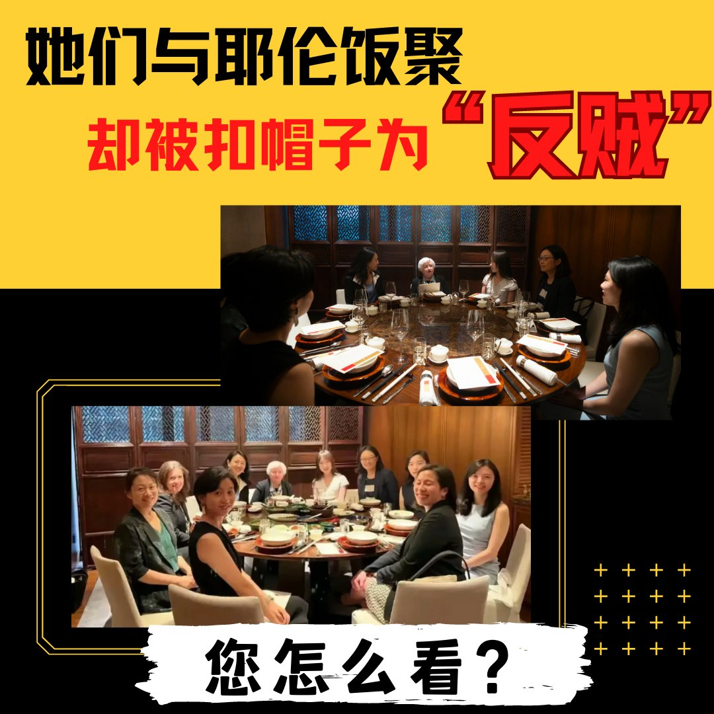
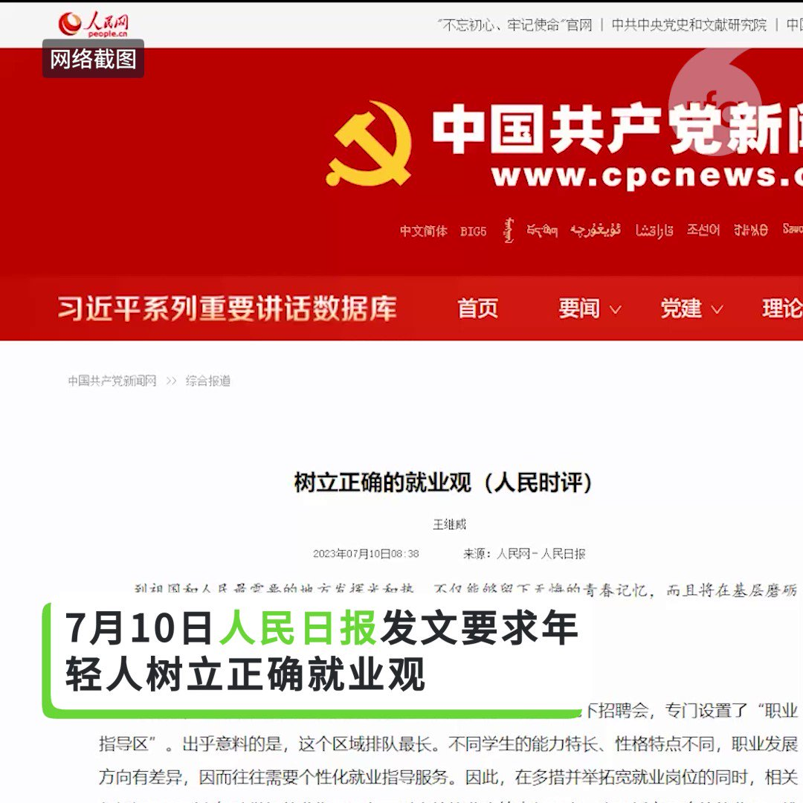
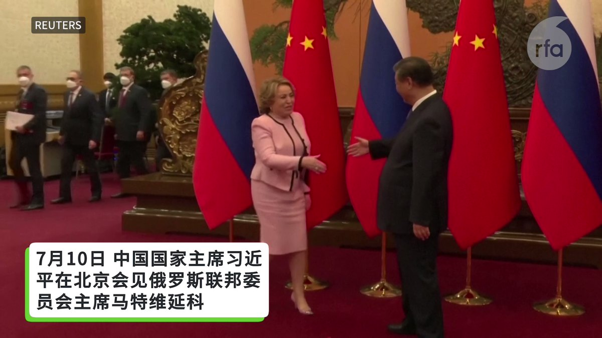
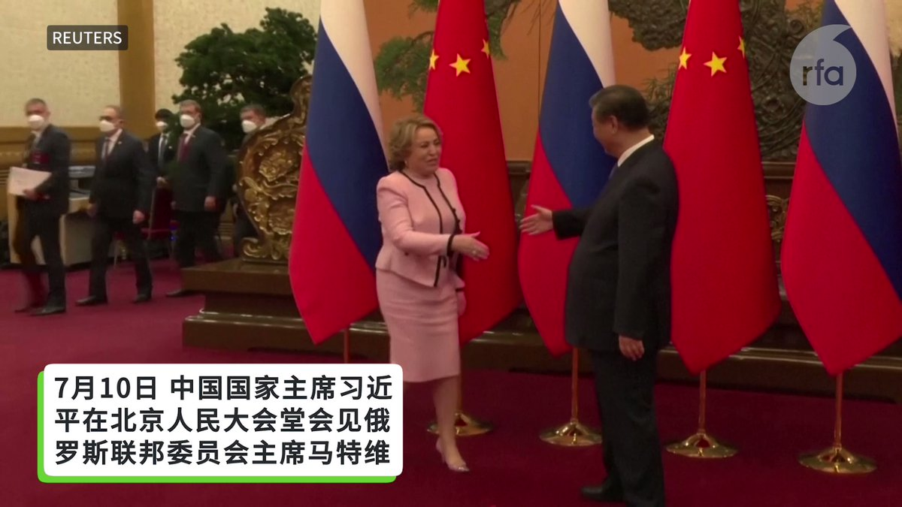
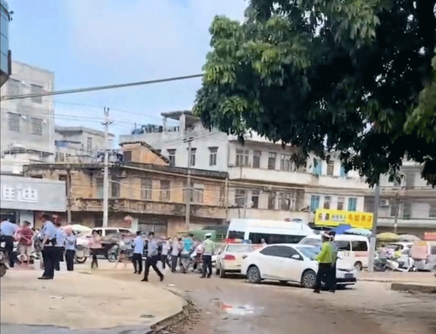
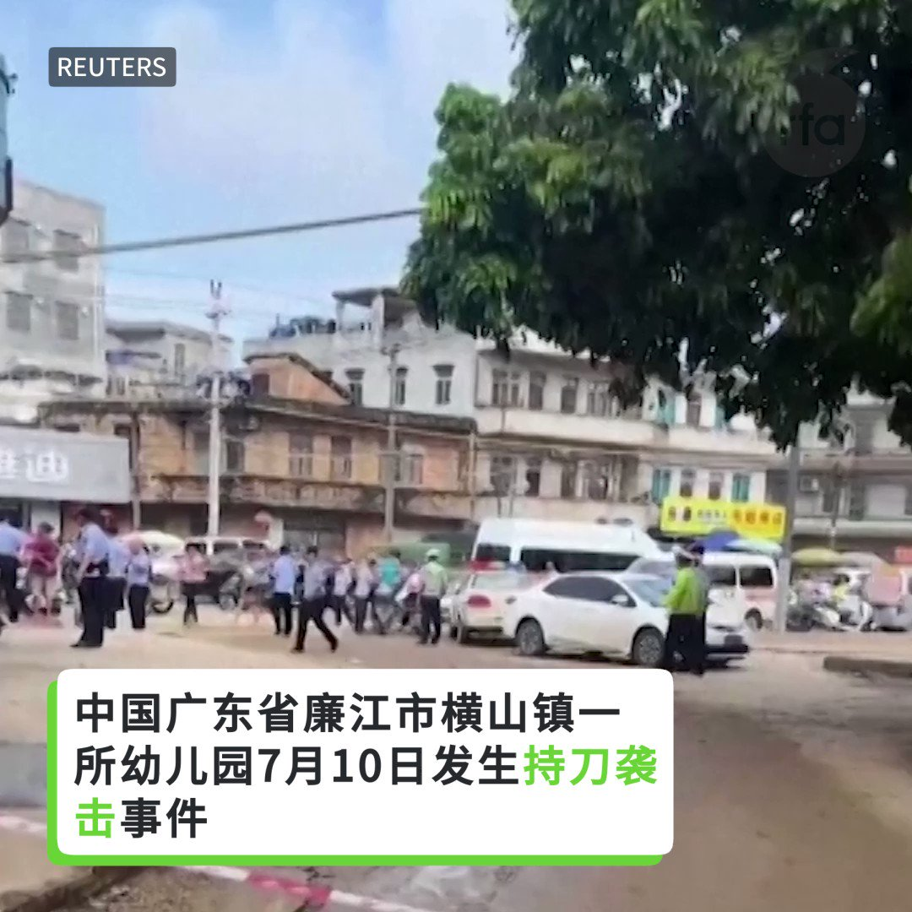

自由亚洲电台 北京时间 2023-07-11T09:52:26Z 1678582993433100290 RT @RFA_Chinese: 【#亚太报道（2023-7-10）】 
欢迎收听和订阅播客【亚太报道】 https://t.co/MjLNSvVeAE 
暴力袭击导致广东 #廉江幼儿园 6死1伤 / 上海“#城市码”取代“#健康码” / 网信办要求加强“#自媒体”管理 / #…   自由亚洲电台 北京时间 2023-07-11T10:12:22Z 1678588008189108224 RT @RFA_Chinese: 美国财政部长耶伦是学院派经济学家出身，也是美国历史上首位女财政部长。7月8日，她在私下宴请了一群中国女性经济学家举行午餐。然而，据路透社说，周末与耶伦会面的这群中国女性经济学家遭到部分中国网友猛烈抨击，指责她们与耶伦会面，并说她们是“激进女权主…   自由亚洲电台 北京时间 2023-07-11T07:05:56Z 1678541091187077120 #事实查核｜美国承认 #中国间谍气球 事件"搞错了"？
https://t.co/v2Nc8Be5hF https://t.co/v2Nc8Be5hF   自由亚洲电台 北京时间 2023-07-11T08:11:28Z 1678557581999210496 专栏 | #夜话中南海：美国财长宣布了中国央行新行长的任命？
 https://t.co/U5MxJ8LRqb   自由亚洲电台 北京时间 2023-07-11T08:16:31Z 1678558853573517312 【#亚太报道（2023-7-10）】 
欢迎收听和订阅播客【亚太报道】 https://t.co/MjLNSvVeAE 
暴力袭击导致广东 #廉江幼儿园 6死1伤 / 上海“#城市码”取代“#健康码” / 网信办要求加强“#自媒体”管理 / #中共中央社会工作部 投入运行 / 多位中国女性经济学者与 #耶伦 餐叙遭网民辱骂 https://t.co/xFGtf9uNaU   自由亚洲电台 北京时间 2023-07-11T08:17:19Z 1678559054916902912 RT @RFA_Chinese: 【超6成受访应届毕业生愿当网红，超9成主播月入不到5千】
微博近日发布一项“当代年轻人就业在关注什么”问卷数据：近万名受访应届毕业生中，61.6%的人就业时会考虑 #网红直播 等新兴职业，只有38.4%选择完全不考虑。… https://t.c…   自由亚洲电台 北京时间 2023-07-11T04:54:35Z 1678508035516387331 美国财政部长耶伦是学院派经济学家出身，也是美国历史上首位女财政部长。7月8日，她在私下宴请了一群中国女性经济学家举行午餐。然而，据路透社说，周末与耶伦会面的这群中国女性经济学家遭到部分中国网友猛烈抨击，指责她们与耶伦会面，并说她们是“激进女权主义者”，扣帽子批她们是“反贼”、“叛徒” 。

您如何看待此事？   自由亚洲电台 北京时间 2023-07-11T04:56:43Z 1678508572404236294 7月10日《#人民日报》发文要求年轻人 #树立正确就业观，看看广大网友怎么说。 https://t.co/T06oWOAvhb   自由亚洲电台 北京时间 2023-07-11T04:59:47Z 1678509344856461314 7 月 10 日, 俄罗斯联邦委员会主席马特维延科在北京会见中国国家主席习近平，以及全国人大常委会委员长赵乐际。她表示，俄罗斯将继续与北京合作，并可以依靠中国坚实可靠的的“友好肩膀”。 https://t.co/CNRfIPxFxl   自由亚洲电台 北京时间 2023-07-11T05:26:15Z 1678516004991954946 在旧金山中领馆外，一批示威者于7月8日下午聚集起来，手持中国被捕维权律师的照片，呼喊着“习近平下台，共产党下台”，举行抗议活动。
中国民主教育基金会会长方政表示，#709大抓捕 是一个标志性事件：“因为从那之后，中国的法制大踏步地后退，中国的人权状况急剧地恶化。”

 https://t.co/LBqj4Xg25M   自由亚洲电台 北京时间 2023-07-11T05:56:18Z 1678523567242354688 张开宇在上海经营一家时尚精品店，到2022年已做了16年。他的客户是上海的富人阶层，在他固定联系的一千名客户名单上，很多人都是身家几千万以上。但上海四月份封控之后，这批客户逐渐离散，“特别是那两个月里，跟朋友聊起来，都是想离开，不顾一切想离开...”
#民营企业家 
 https://t.co/Dakt6JwBlK   自由亚洲电台 北京时间 2023-07-11T03:12:33Z 1678482357534486528 在今年4月香港举办的一场庆祝活动中，中国官员与商人共同出席 #萨摩亚 数位资产交易所、股票交易中心、以及 #大洋洲区块链经济特区 的启动仪式，萨摩亚财政部长也在会上发表了讲话。
然而时隔一个月后，上述庆祝活动的照片经互联网传播，却引发萨摩亚民众的质疑...

https://t.co/N0Si7A02xT https://t.co/GfgEEEeLey   自由亚洲电台 北京时间 2023-07-11T03:17:11Z 1678483523680993280 近日，#中国汽车工业协会 发出通知，要求十六家车企签署承诺书，遏制 #电动车价格战 。但相关内容却在四十八小时内删除。有学者认为，中国经济状况不佳，车企行业内卷严重。

https://t.co/pIugTV9DoA   自由亚洲电台 北京时间 2023-07-11T03:24:40Z 1678485407065862144 7 月 10 日, 俄罗斯联邦委员会主席马特维延科在北京会见中国国家主席习近平后表示，俄罗斯将继续与北京合作，并可以依靠中国坚实可靠的的“友好肩膀”。 https://t.co/CUUzywhFYy   自由亚洲电台 北京时间 2023-07-11T03:41:08Z 1678489551868686338 路透社统计的中国近年 #校园恶性暴力事件 包括：
2022年8月，江西一家幼儿园发生持刀袭击事件，造成3人死亡、6人受伤；
2021年4月，广西一家幼儿园发生2死16伤的持刀伤人惨案；
2018年，上海一家小学校门口发生持刀伤人事件，造成2名儿童死亡，1名儿童及家长受伤；
2017年，江苏一家幼儿园校门口发生爆炸，导致8人死亡，65人受伤...
2023年7月10日广东 #廉江幼儿园恶性伤害事件 详细报道：https://t.co/dOHt2V7R2L   自由亚洲电台 北京时间 2023-07-11T04:13:07Z 1678497600536981504 推特网友“#李老师不是你老师” 对本台分析说，网信办新规可能会产生很大影响：“不要去蹭热点事件，不要去消费灾难事故，这就基本上把自媒体，尤其是时政自媒体这条路给堵死了。几乎是什么事都不能谈，因为这个框架实在是太大了，只有不谈，才能算得上‘不蹭’。”  https://t.co/19Uqc6rWdh   自由亚洲电台 北京时间 2023-07-11T00:53:05Z 1678447261569912833 美国财长 #耶伦 私下邀请了多名中国年轻女性经济学者共进午餐。
她们是谁？
她们是 #反贼 吗？

 https://t.co/Q7jVMYjteU   自由亚洲电台 北京时间 2023-07-11T01:37:44Z 1678458497984503808 #洪都拉斯 要200亿美元建铁路，北京会埋单吗？
#所罗门 与北京建交， 近四年后才设大使馆，中间有多少讨价还价？
#太平洋岛国外交，其实并没你想的那么简单！ https://t.co/XgKksGTvs6   自由亚洲电台 北京时间 2023-07-11T01:42:05Z 1678459592471363584 中国广东省 #廉江 市横山镇一所 #幼儿园 7月10日发生持刀袭击事件，据报道造成六人死亡，其中包括三名儿童。 https://t.co/mKmrvYj6UL   自由亚洲电台 北京时间 2023-07-11T02:14:15Z 1678467687423561728 在今年4月香港举办的一场庆祝活动中，中国官员与商人共同出席 #萨摩亚 数位资产交易所、股票交易中心、以及 #大洋洲区块链经济特区 的启动仪式，萨摩亚财政部长也在会上发表了讲话。
然而时隔一个月后，上述庆祝活动的照片经互联网传播，却引发萨摩亚民众的质疑... https://t.co/5Q30ycpHJU   自由亚洲电台 北京时间 2023-07-11T00:22:06Z 1678439464279093249 #严歌苓 强调，《#米拉蒂》是她第一部未经中国审查的作品。 https://t.co/nptMJVRLCs   