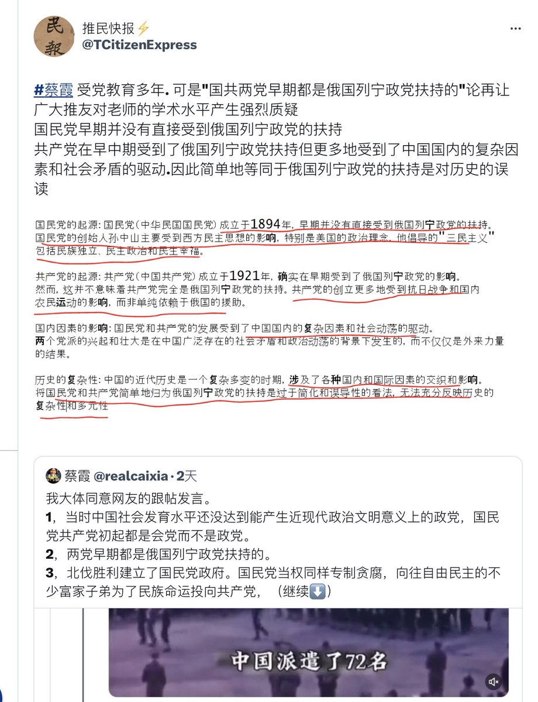
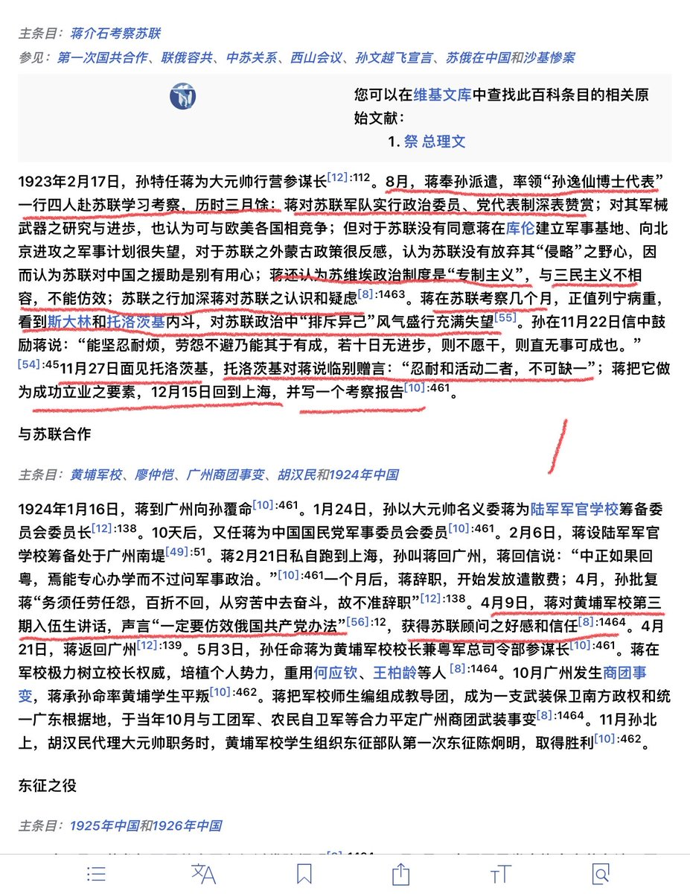
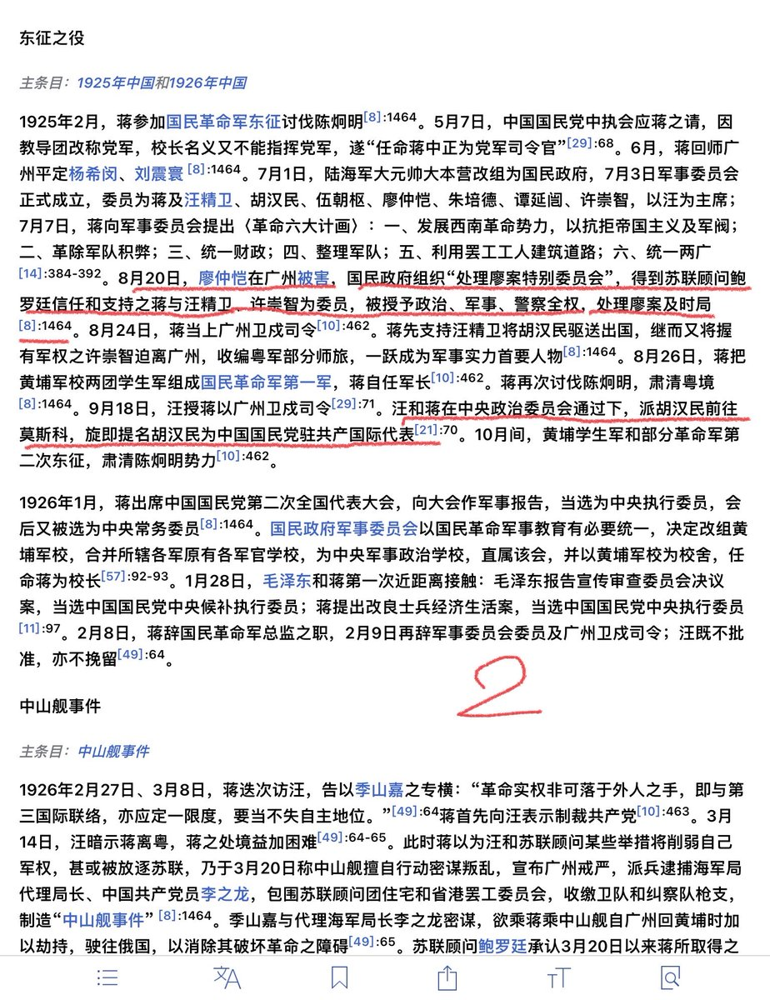
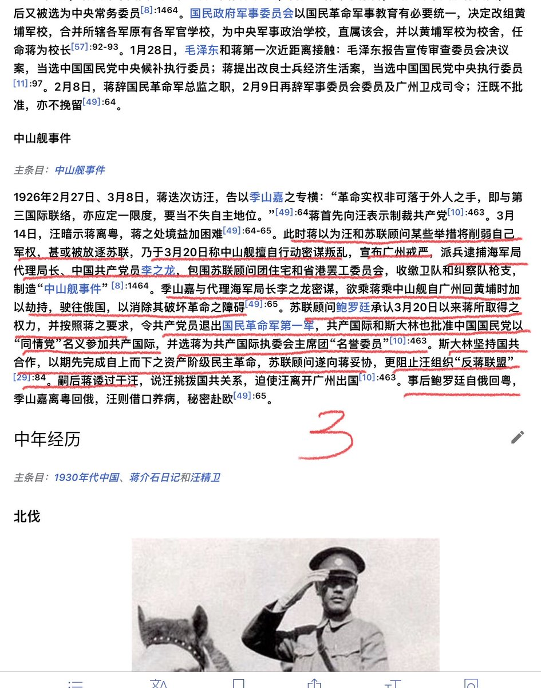
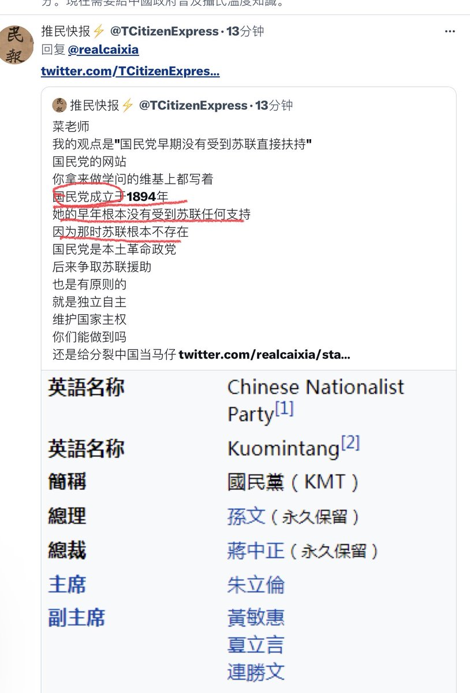
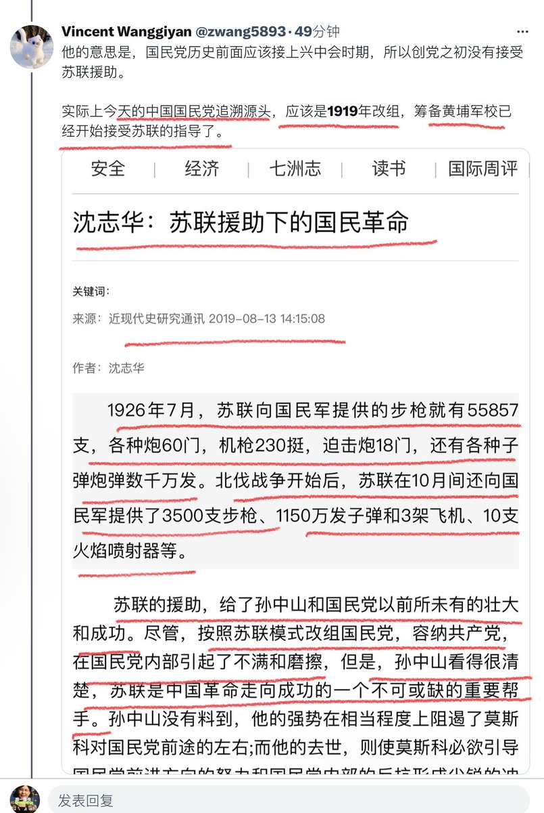
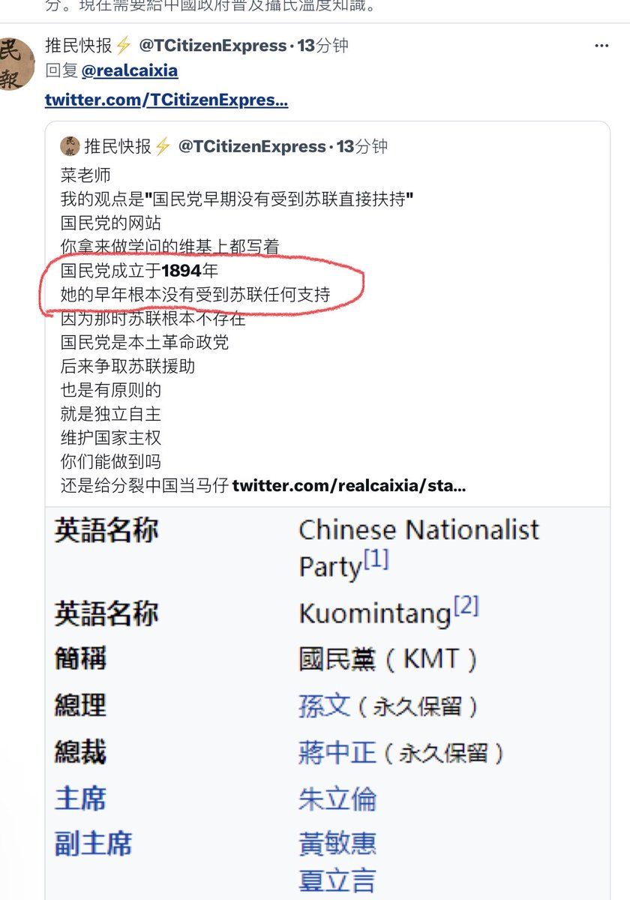
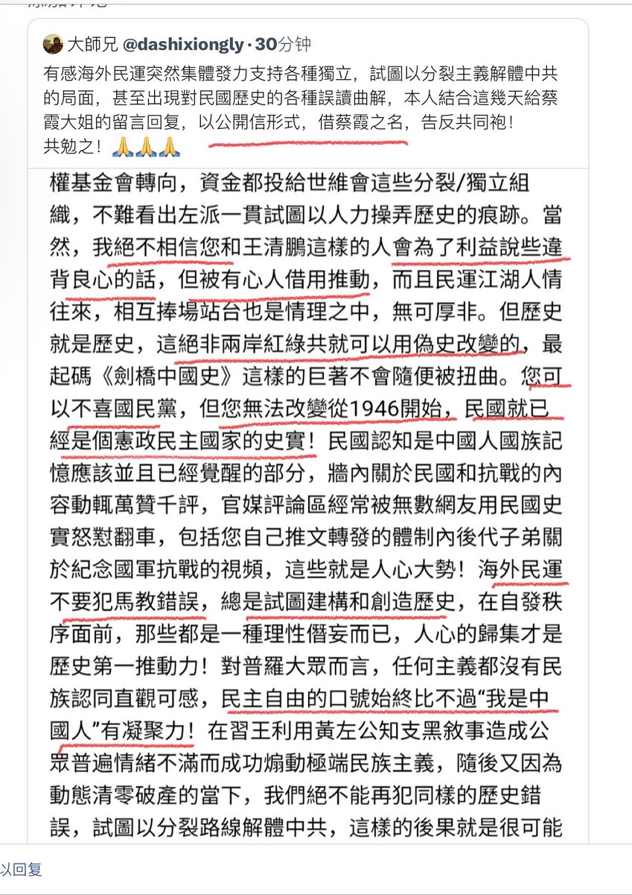
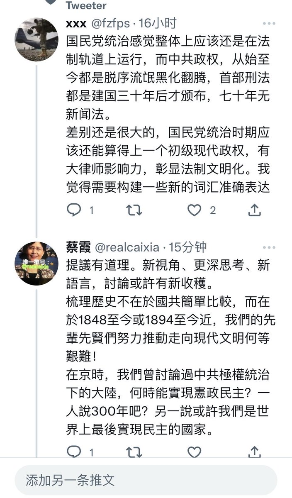
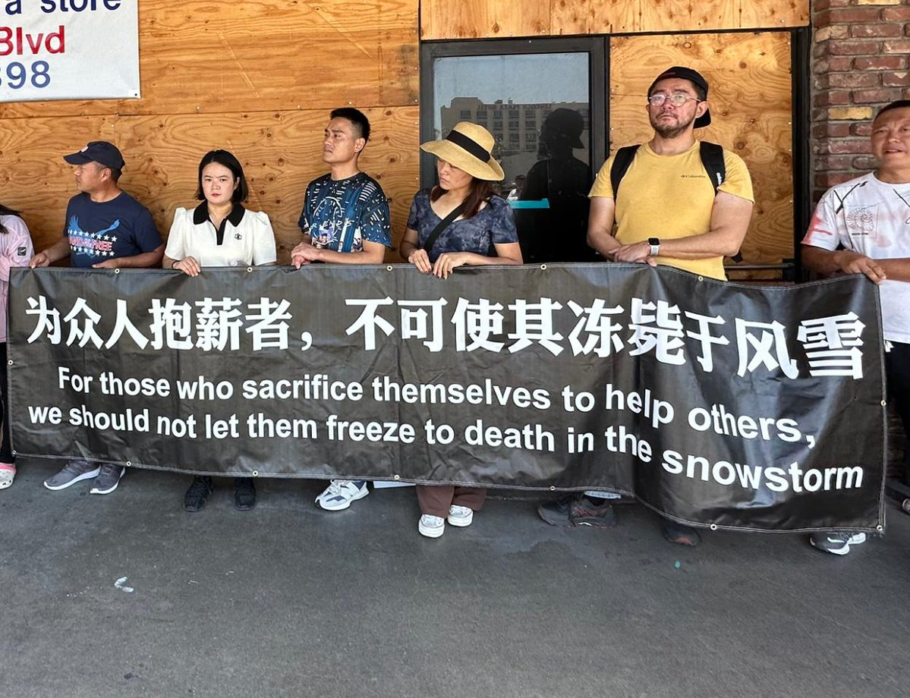

蔡霞 北京时间 2023-07-11T10:55:15Z 1678598801232363521 等傻子明白过来时，再花几千亿美元去撑着人民币汇率慢点贬。   蔡霞 北京时间 2023-07-11T06:25:26Z 1678530900420620288 我说国共两党早期都受到俄国列宁政党扶持，有人否定。请看下列资料。

1923年8月蒋介石带团去苏联考察3个月。
1926年3月后，共产国际和斯大林也批准中国国民党以“同情党”名义参加共产国际，并选蒋介石为共产国际执委会主席团“名誉委员”。
俄国列宁政党与国民党的关系，再详细的情况，请看下面截图。 https://t.co/G2g9yF0UVF   蔡霞 北京时间 2023-07-11T07:15:37Z 1678543528023011330 你问：“请问国民党创立于哪一年？”我：“你是真不知还是假不知？”没想到你是真不知。孙中山于1905年在日本创立“中国同盟会”，而后的组织演变：1912改为国民党-1913年11月国民党解散—1914年成立中华革命党—1919年改组为中国国民党。林伯渠既协助孙中山改组中华革命党为国民党，又是中共党的创建人之一。 https://t.co/o8b064WgAf   蔡霞 北京时间 2023-07-11T07:42:37Z 1678550322535333888 借用一网友推文举出的文章资料，来看看“国民党早年根本没有受到苏联任何支持”这个说法成立吗？
搞清楚史实就好。俄国列宁政党一旦在俄国夺得政权，就把手伸到中国来。国共两党都受到很大影响。中共是第三国际的一个支部，卢布养党。即便国民党军队也同样仿效苏联红军，设有政治工作部，有党代表。 https://t.co/EXMY1uMzbI   蔡霞 北京时间 2023-07-11T08:06:59Z 1678556455639691265 网友说得好！   蔡霞 北京时间 2023-07-11T08:19:45Z 1678559668744994822 耶伦与中国女经济学家一起吃饭，是真正的民间交流吗？
别忘了董郁宇在大餐厅与日本外交官一起吃饭，就是“间谍罪”嫌疑被抓进监狱！
这6个人与耶伦吃饭照片在墙里非但没有封删相反到处流传。中共不批准，她们谁敢在北京豪华包间里关门叙话？！谁知道饭桌下有没有窃听器？
耶伦不识北京的水有多深。   蔡霞 北京时间 2023-07-11T08:48:11Z 1678566822013022208 你这种做法很不地道。请把你自己要批的观点言论列举出来，你不列举实例，凭借想象扣了不少帽子。点名拿我当批判靶子，你有什么权利把我放在你的审判台上？！你这种做法，文革中见的太多了！文革中把人揪出来当批斗对象就是这么做的！ https://t.co/3R7fYDmhEi   蔡霞 北京时间 2023-07-11T05:45:17Z 1678520796640325633 學會討論不搞辯論，逐步擺脫那種一辯論非白即黑，非要決出正確和罪錯，強求觀點一致的思維模式影響。
學會依史實立論，從史實中開出新的視角和獲得新的認知，通過多角度的觀察分析，多線索的獲取更多資料，提升認知同時也是提升自身素養。每天獲得新知識新信息，讓自己每天活的快樂。 https://t.co/3XmnPXyoMw   蔡霞 北京时间 2023-07-11T00:38:02Z 1678443473031028736 特别推荐：
许小年：中国经济学界最恶劣的品质是违背良心 - 议

问：您认为经济学家最重要的品质是什么？
许小年：最重要的品质就是忠于自己的良心。
问：最恶劣的品质呢？
许小年：那当然就是违背自己的良心了。

忠于自己的良心，不仅对经济学家重要，对我们自己同样如此。 https://t.co/Qu3ECisjhz   蔡霞 北京时间 2023-07-11T01:49:41Z 1678461505434468352 RT @VOAChinese: 洛杉矶民主人士在709大抓捕人权律师八周年之际，在洛杉矶举行抗议活动。本次活动的组织者界立建表示，“为众人抱薪者，不可使其冻毙于风雪。我们要为所有的良心犯、人权律师发声。” https://t.co/VrdZW4Yy4r   