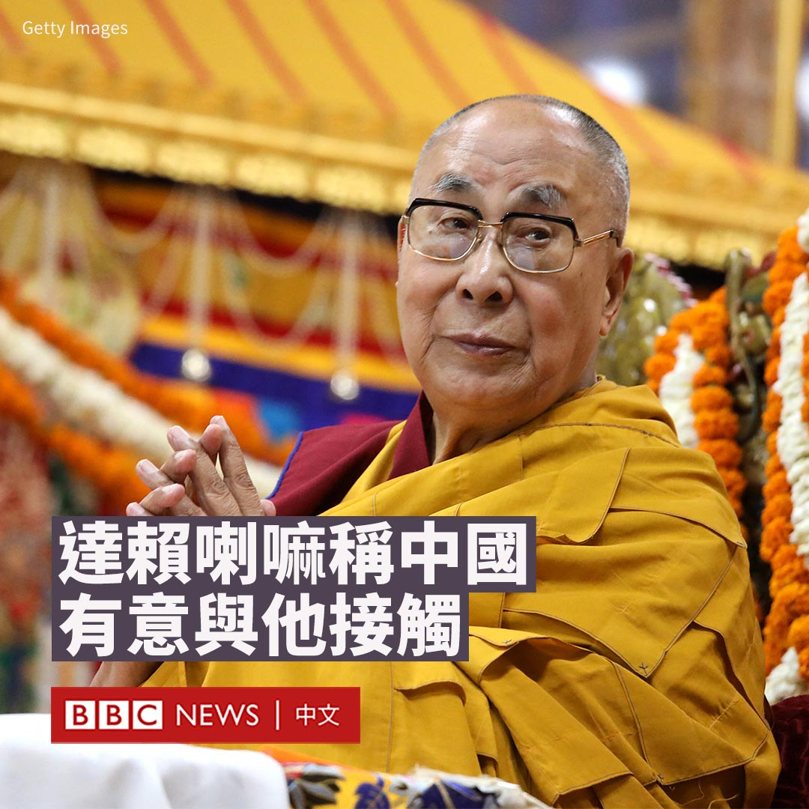

D英国广播公司BBC 北京时间 2023-07-10T20:35:32Z 1678382446050508800 俄罗斯被指控犯下许多战争罪行，这已有充分的证据，但美国军援基辅集束弹药会引来对美国虚伪的指责，该举动也将不可避免地使其与西方盟友产生分歧。https://t.co/R2m3dIdxRQ   D英国广播公司BBC 北京时间 2023-07-10T16:56:36Z 1678327350000513024 中国广东省廉江市横山镇一所幼儿园周一（7月10日）发生持刀袭击事件，造成六人死亡，包括三名儿童。

警方表示，他们已经逮捕了一名25岁的吴姓男子，并正在调查袭击的原因。

据法新社引述当地官员称，另外三名死者是一名老师和两名家长，还有一人受伤。

警方称其是一起故意伤害案件，尚未说明袭击者的动机。

这起袭击案发生在当地时间周一早上07:40，当时家长们正在送孩子去上暑假班，其后这名男子于8点被逮捕。

一位在幼儿园附近工作的店主告诉BBC，周围地区已经被封锁。

廉江市人口约为187万，随着袭击现场画面在社交媒体上传播，许多网友表达了愤怒。

尽管中国整体犯罪率较低，但是近年来中国发生了多起持刀袭击事件，很多案件由对社会的怨恨或其他纠纷引发。

据BBC统计，自2010年以来，至少发生了17起在中小学及大学的持刀袭击事件，其中10起发生在2018年至2023年间。

2021年4月，广西壮族自治区北流市发生持刀袭击事件，造成2名儿童死亡、16人受伤。

在该事件发生后，中国教育部要求各地学校以突发暴力伤害事件等为重点，组织开展应急疏散演练和紧急避险教育。   D英国广播公司BBC 北京时间 2023-07-10T18:01:03Z 1678343570023907328 华盛顿与北京再次进行了面对面对话，哪怕不算热情，也算是彬彬有礼和互相尊重。拜登政府似乎在试图证明，其中国政策并不是单纯延续特朗普政府对北京的公开敌视。https://t.co/4wDnsWUhta   D英国广播公司BBC 北京时间 2023-07-10T14:52:45Z 1678296182412709888 流亡的西藏宗教领袖达赖喇嘛称，中国方面正通过“正式或非正式”途径与他接触，而他不寻求西藏独立。

北京不承认西藏流亡政府，2010年以来也没有与达赖喇嘛的代表再进行过公开谈判。

据多家印度媒体周六（7月8日）报道，达赖喇嘛在印度达兰萨拉对媒体表示，他对与中国的对话持“开放”态度。

“中国现在意识到西藏人民的精神非常坚强。因此，为了解决西藏问题，他们希望与我联系，我也做好了准备。”他说道。

达赖喇嘛还表示他“并不谋求独立”。“我们在许多年前就决定要留在中华人民共和国里面。”他说道。

“现在，中国正在发生变化。”达赖喇嘛说，“中国方面通过正式或非正式方式表示愿意与我接触。”

中国外交部曾表示，中国政府同达赖喇嘛“接谈的大门始终是敞开的”，但“接谈只能谈达赖的个人前途问题，而不是谈什么所谓的西藏问题”。

刚刚庆祝88岁生日的达赖喇嘛已经流亡印度超过60年。虽然他表示其目标是西藏自治，但与北京多次谈判未果，中国政府将他定性为“分裂分子”。

2008年3月，西藏发生了近20年来最严重的骚乱，中国与西藏流亡政府之间的关系进一步恶化。

2011年3月，达赖喇嘛宣布从流亡政府退休，交权给民选产生的藏人行政中央领导人来处理政务。

年事已高的达赖喇嘛曾在2019年表示，在他圆寂后，转世灵童可能会在印度被找到，而北京可能会试图强加给西藏佛教徒一位继任者。   D英国广播公司BBC 北京时间 2023-07-10T12:34:34Z 1678261407773491206 【最新消息】中国东南部广东省廉江市横山镇发生持刀袭击事件。警方对BBC表示，事发在一所幼儿园，目前已造成6人死亡，1人受伤。

警方表示，他们已经逮捕了一名25岁的男子，并正在调查袭击的原因。

警方没有透露受害者的细节，但称这是一起“故意伤害”案件。他们表示，袭击发生在当地时间周一（7月10日）早上07:40。   D英国广播公司BBC 北京时间 2023-07-10T11:30:09Z 1678245194540494848 世界上最大的镍生产国印度尼西亚的活动人士警告说，采矿正在威胁当地人的生活方式。https://t.co/P9QBzmneRJ   D英国广播公司BBC 北京时间 2023-07-10T09:19:39Z 1678212352540565507 在走出疫情后，中国正在面临低迷的消费和年轻人的高失业率。与此同时，为刺激经济，在疫情前对臃肿且负债累累的房地产行业的依赖仍在继续。

BBC驻中国记者麦笛文（Stephen McDonell）前往中国东部的山东省，一睹中国的经济现状。 https://t.co/RQ0keptC8Q   