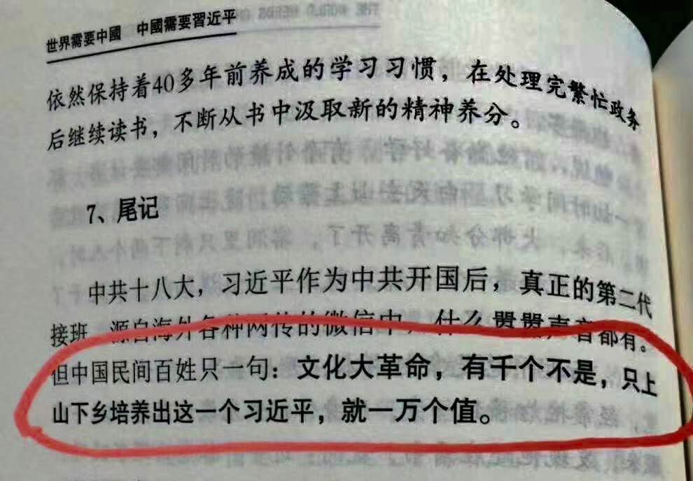
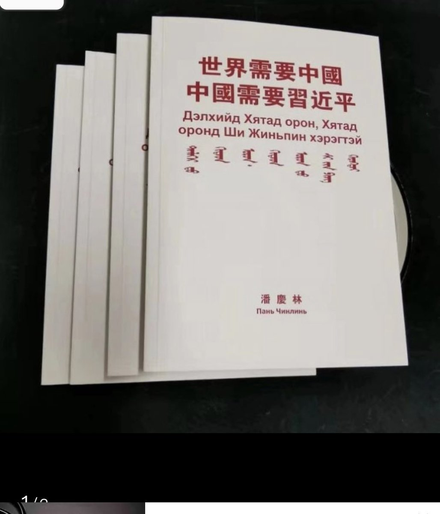
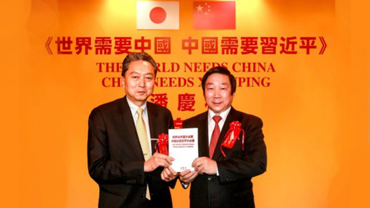

Petrichor 北京时间 2023-07-10T10:51:33Z 1678235480259788808 据美国海洋和大气管理局的数据，7月6日全球气温创下历史新高，地球表面以上2米的全球平均气温达到17.23℃。自19世纪50年代有仪器记录以来，过去7天是地球上最热的7天。德国莱比锡大学Karsten Haustein说，地球上一次如此炎热是在大约12万年前的艾木间冰期。   Petrichor 北京时间 2023-07-10T09:20:55Z 1678212672079233026 几年前一个远房亲戚的儿子（开水果店）就发过这些话，所以我不相信这是习总最近讲的话，估计是有人故意传谣，习总不至于这么没水平。说这些话的还不够硬气，最好是“不用外国人发明的任何东西，包括机器、理论和方法。官员最好保证：孩子、老婆、小三一律住中国，不拿外国护照，财产只存中国。 https://t.co/Uac4Z5Tknc   Petrichor 北京时间 2023-07-10T04:15:16Z 1678135753660850176 舔痔的这位，名叫潘庆林 ，天津人，1969年参军，退伍后于1985年自费去了日本，为留在日本，找了日籍女人结婚。1989年在到钓鱼台国宾馆办公室任中日业务顾问。2008年开始混进中共统战队伍，尝到甜头，越发不可收拾。 https://t.co/anChKYUO2W   