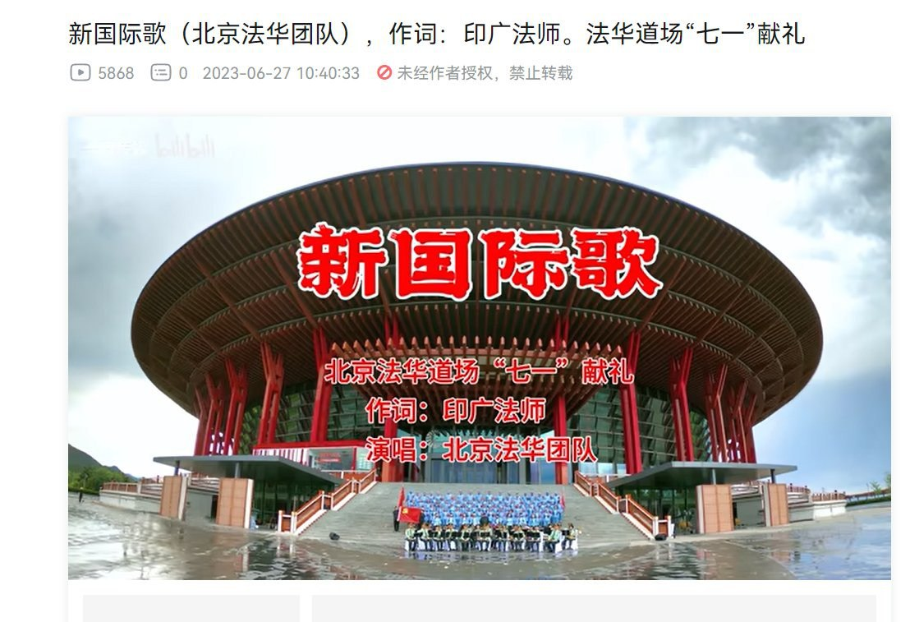
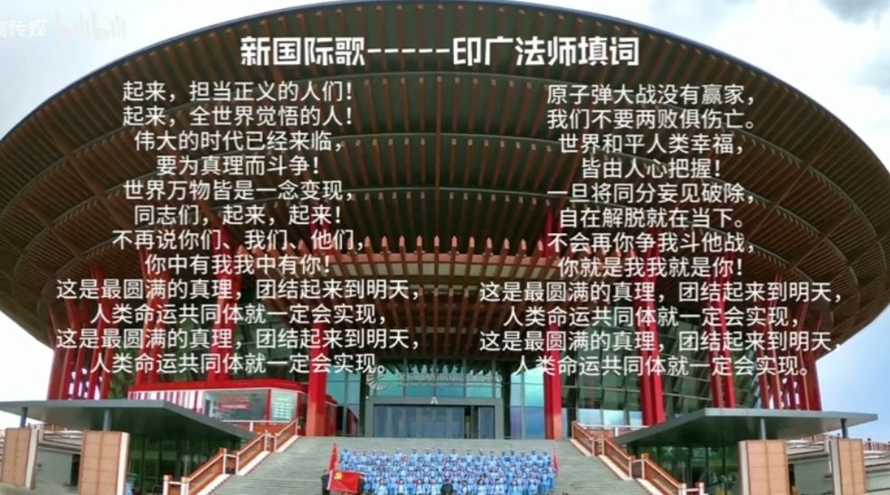

墙国蛙蛤蛤 北京时间 2023-07-10T09:08:32Z 1678209555618996226 《新国际歌》于2023年6月27日由“一商传媒”发布在B站，虽然该帐号粉丝数仅为个位数，但这一疑似由一个名叫“北京法华团队”的官办佛教团体进行的“魔改国际歌为宣扬习近平人类命运共同体理念和爱党佛教思想”的献礼七一建党102周年活动还是在B站评论区和推特引发群嘲。随后这一视频被删除，账号亦被封禁。 https://t.co/RzQE5sMJWs   