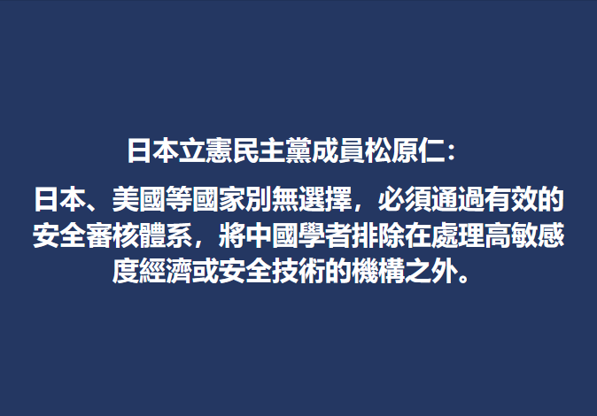
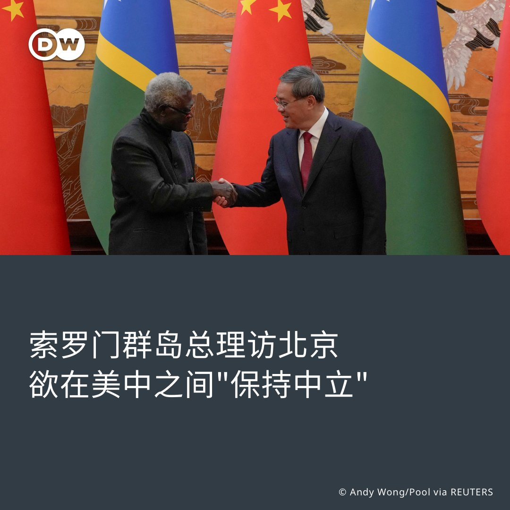
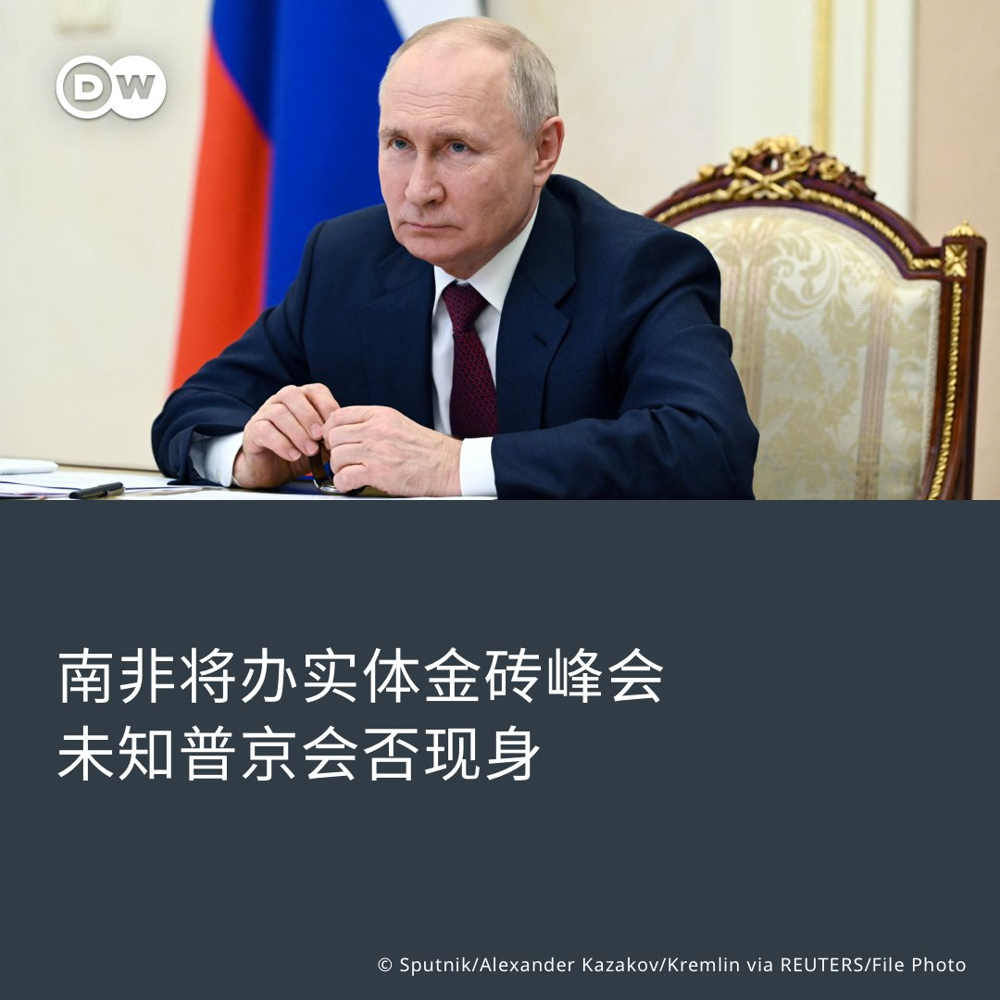

德国之声 北京时间 2023-07-10T21:13:33Z 1678392013689872386 朝鲜国防部发言人在一份声明中表示，美国“多次”实施的“挑衅性”军事行动正在使朝鲜半岛更接近核冲突。

朝中社援引该发言人的声明称，“谁也不能保证朝鲜东海不会发生美国空军战略侦察机被击落这样的冲击性事件。”

https://t.co/ilgA3EJdri   德国之声 北京时间 2023-07-10T22:03:00Z 1678404456202006529 克里姆林宫发言人对外通报称，瓦格纳兵变5天后，俄罗斯总统 #普京 曾在6月29日邀请了35人参加会谈，其中包括瓦格纳军团首领 #普里戈津 和瓦格纳部队指挥官，会议持续了三个小时。

https://t.co/6Km5PsIbNe https://t.co/jFJbV7q4n9   德国之声 北京时间 2023-07-10T19:07:00Z 1678360164225753088 非洲最时髦的衣服　是你不要的二手货 来自欧洲的 #二手服饰 在 #非洲 是一个蓬勃发展的市场，但这损害了当地生产商的利益。欧洲计划要求制造商负责回收或处理废弃衣物，在肯尼亚，这一举动引发了二手贸易上的担忧。 https://t.co/UP2qoiEAR4   德国之声 北京时间 2023-07-10T19:40:00Z 1678368468985577474 三鞠躬、找平衡、唱双簧——外界如何评耶伦中国行？

详细报道： https://t.co/4hiikVtt9a https://t.co/9iNfXpwZME   德国之声 北京时间 2023-07-10T20:21:53Z 1678379009162330114 德国新移民法允许外国专业人才带着父母来，谁行谁不行？点击查内情👉 https://t.co/n4o5EGfcnN   德国之声 北京时间 2023-07-10T16:55:02Z 1678326955576360960 上周末，6万人簇拥德国科隆街头，参加 #骄傲游行。这场盛大的街头派对，气氛比炎热的夏日更为热烈。 

今年的游行口号是「为了人权；大家；团结；强大！」，参与者要求给予 #酷儿群体 更多的关注和保护。 

夏天，全德各地都会陆续举行骄傲游行。科隆骄傲游行是最盛大的骄傲游行之一。接下来的几周，法兰克福、莱比锡、柏林等德国大小城市都会陆续举行骄傲游行及相关活动。 #LGBTQ   德国之声 北京时间 2023-07-10T18:14:02Z 1678346836984098817 日本一家领先的研究所一名中国研究员涉嫌泄露技术机密而受到司法指控。专家认为，此案应给日本政府敲响警钟。

https://t.co/yqwISNwxBM https://t.co/RL3Np3bEbG   德国之声 北京时间 2023-07-10T14:44:54Z 1678294207717576704 #达赖喇嘛 6日在庆祝88岁生日之际，向媒体表示近来 #北京 政府试图联系他，而他也愿就藏人议题与其对话🇨🇳
https://t.co/AqeIO2ptiP https://t.co/WobIFFX5Lx   德国之声 北京时间 2023-07-10T15:40:55Z 1678308303708000257 索罗门群岛总理索加瓦雷 9日造访中国，行前特别强调不会在美中之间选边站。
10日，#索加瓦雷 在北京会晤中国总理 #李强，两国签署了新的警务合作协议，李强还称索罗门选择与中国建交是正确的决定。 2019年索加瓦雷上任，不久后与台湾断交。
详细报导👉https://t.co/TLIYt0vYUJ https://t.co/l2LzCNBlc4   德国之声 北京时间 2023-07-10T16:24:23Z 1678319241114648579 你的 #马桶 有一天可以和你的手机对话，这可是 #物联网 的功劳。只能马桶可以播放音乐或者告诉你天气如何。甚至能通过你的便便来判断你是否生病或怀孕。#dwdigital https://t.co/aFdhNBugEn   德国之声 北京时间 2023-07-10T11:13:20Z 1678240965050392576 #美国 总统🇺🇸 #拜登 9日抵达伦敦，准备参加11日于立陶宛召开的 #北约 峰会。他表示🇺🇦乌克兰还没有准备好加入北约。 #中国 与 #印太局势 预计将是本次峰会另一大重点，🇨🇳中国官媒亦发表社论，抨击北约对中国"包藏祸心"。 https://t.co/wtZg5d5VtY   德国之声 北京时间 2023-07-10T10:35:29Z 1678231436686508036 【金砖国家峰会将以实体方式举办】🇷🇺

#南非 总统9日表示，本届 #金砖国家峰会 将不会以线上方式登场，而将实体举办。由于俄罗斯总统 #普京 面临国际刑事法院的逮捕令，他若前往南非参加峰会，南非可能不得不逮捕他。此前，曾有传言称峰会将改到 #中国 举行。

详细报导👉https://t.co/bm6iwzg7sB https://t.co/DEmd9yYPzK   德国之声 北京时间 2023-07-10T09:23:05Z 1678213219326869506 【佛州州长：应撤销 #中国 贸易最惠国待遇】🇺🇸 🇨🇳

有意代表共和党角逐美国总统的佛州州长 #德桑蒂斯（Ron DeSantis）9日告诉福克斯新闻，如果他当上总统，将采取行动撤销中国的"#永久正常贸易关系地位"，并补充说中国是美国的"头号地缘政治威胁"。

自1998年起，美国把 #贸易最惠国 更名为"正常贸易关系地位"。 2000年，美国国会投票给予中国此地位。如今若要撤回，仍需国会批准。

不过最新民调显示，美国前总统 #特朗普 的支持度遥遥领先德桑蒂斯。特朗普曾表示若他胜选，将会给中国48小时的时间撤离其遭西方指控设于 #古巴 的间谍设施。   德国之声 北京时间 2023-07-10T05:17:00Z 1678151287752335360 德国工商总会主席阿德里安：比起放弃中国🇨🇳 交流是更好的选择 #DIHK  他说：我对是否放弃 #贸易 会导致更多积极的变化，或更美好的世界感到非常怀疑。我认为，恰恰相反，当我们进行交流时，我们可以更好地理解对方，传递我们的价值观。#你同意这个观点吗？https://t.co/Camf4K86J3   