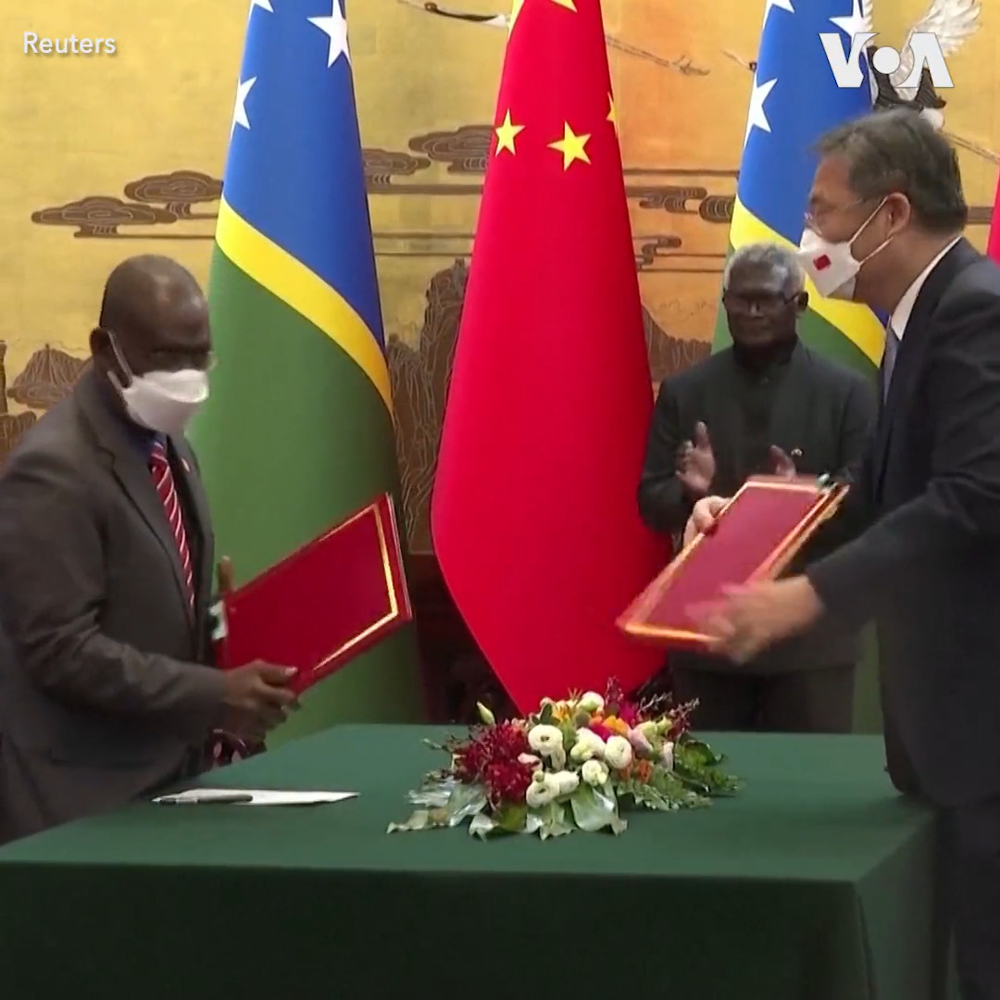
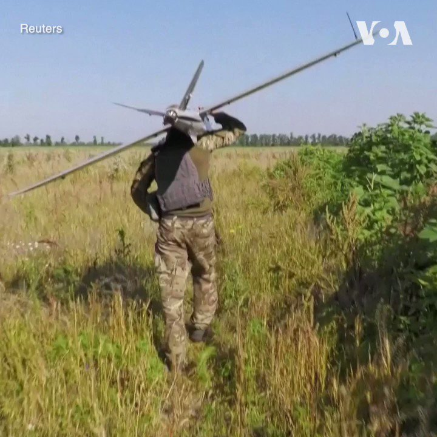
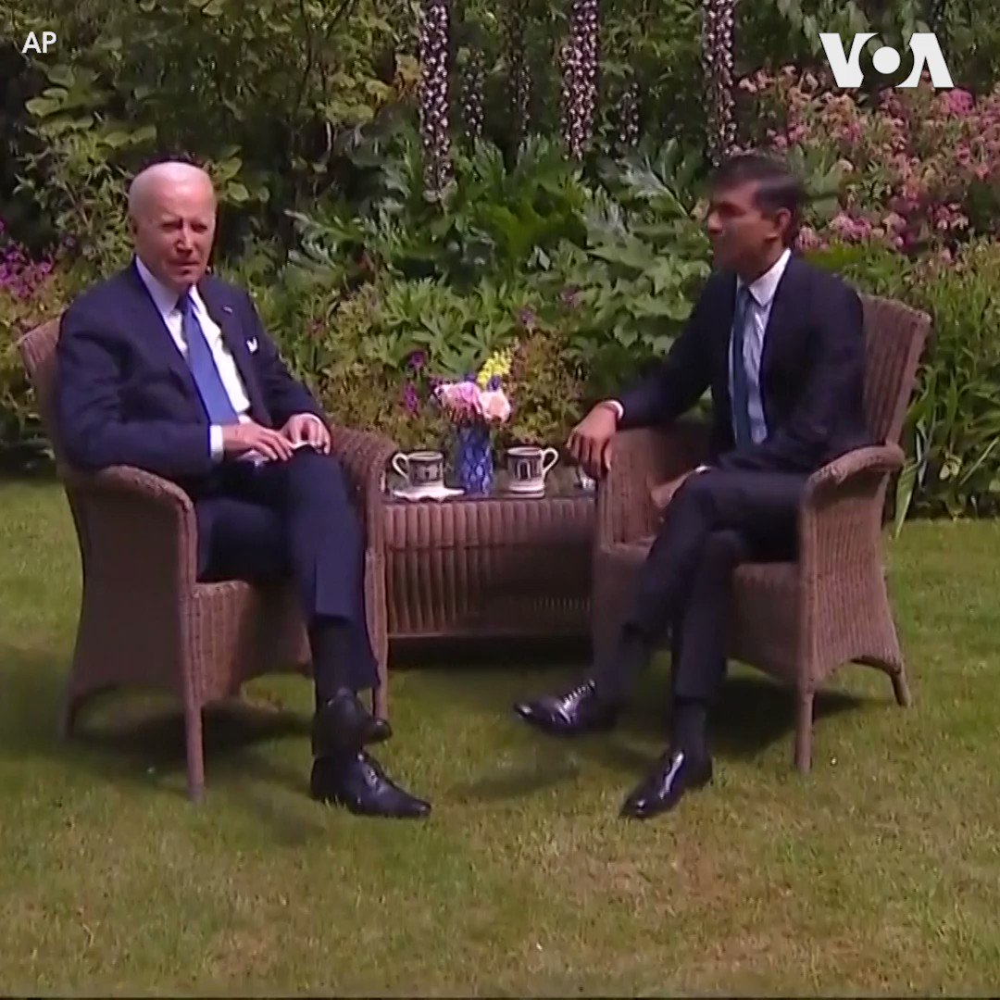
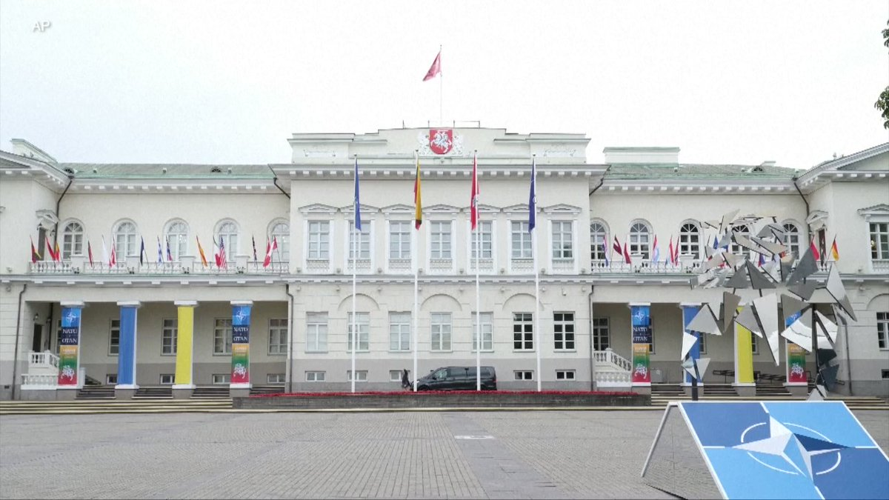

美国之音中文网 北京时间 2023-07-10T23:16:33Z 1678422965661343744 北约峰会前，拜登突访伦敦会晤苏纳克首相和查尔斯国王 https://t.co/AP3riiV7r4   美国之音中文网 北京时间 2023-07-10T23:44:28Z 1678429994014441473 加拿大总理贾斯汀·特鲁多7月10日宣布，加拿大将向拉脱维亚增派最多可达1千2百名军人，以强化北约在波罗的海地区吓阻俄军入侵的能力。正在拉脱维亚访问的特鲁多当天在与拉脱维亚总理卡林斯共同举行的记者会上宣布了这一消息。 https://t.co/rAIcu194z3   美国之音中文网 北京时间 2023-07-10T21:00:45Z 1678388793303347200 7/10【#时事大家谈】耶伦结束访华，美中关系能否见到“风雨后的彩虹”？中国“契卡”横空出世，中央社会工作部是干什么的？

嘉宾：独立时评人、专栏作家蔡慎坤；政治学博士、北京独立政治顾问吴强；法学博士、独立时评人张杰
主持人：许波

Youtube🔗 https://t.co/ex4HA56XWK
 https://t.co/OhSfLmUOEg   美国之音中文网 北京时间 2023-07-10T21:22:14Z 1678394199186743297 广东廉江一幼儿园遭人持刀行凶酿6死1伤惨剧，25岁凶嫌已被捕 https://t.co/AKKVV9nHYD   美国之音中文网 北京时间 2023-07-10T21:26:37Z 1678395300921188356 所罗门群岛总理索加瓦雷10日与中国总理李强举行了会谈，双方签署了为期三年的警务合作协议。在这次由北京资助的访问中，索加瓦雷将为所罗门群岛驻中国大使馆主持开幕仪式，与中国企业会面并访问江苏和广东，索加瓦雷2019年上任后与台湾断交并与中国建交。 https://t.co/Atl6GYRNjU   美国之音中文网 北京时间 2023-07-10T21:52:16Z 1678401756215099393 乌克兰军方人员7月10日说，乌军自上个月以来已经在南部和东部地区分别收复了大约169平方公里和24平方公里的失地。乌军说，无人机在反攻战役中发挥了重要作用。乌俄战争已经持续了500多天，在西方军援的支持下，乌军正试图夺回对东部城市巴赫穆特及周边地区的控制。 https://t.co/fTctL1uYX9   美国之音中文网 北京时间 2023-07-10T22:10:33Z 1678406357660180482 日相再度赴北约峰会示警勿忘印太 日欧安保合作大幅升级 https://t.co/j8pTxetFMk   美国之音中文网 北京时间 2023-07-10T22:20:04Z 1678408750598610944 印度暴雨成灾，造成22人死亡 https://t.co/JurGBc9mAt   美国之音中文网 北京时间 2023-07-10T22:20:06Z 1678408759637360644 嘴上说中立 实际捞好处，所罗门群岛与北京建立全面战略伙伴关系 https://t.co/H89TXSJNR4   美国之音中文网 北京时间 2023-07-10T18:45:34Z 1678354773198913536 聿文视界：102岁的中共垂垂老矣 https://t.co/2FJIcZLXTD   美国之音中文网 北京时间 2023-07-10T18:49:37Z 1678355791890219008 日本政经专家表示，日本藉由与东盟的互信关系，建立G7民主阵营和东盟的合作桥梁。台湾战略学者认为，没有任何大国能完全拉拢东盟选边站。报道：https://t.co/vrm9LHV01b https://t.co/j8Mc3lSFk1   美国之音中文网 北京时间 2023-07-10T19:59:25Z 1678373354980376577 美国总统拜登10日与英国首相苏纳克在唐宁街10号举行了会晤。苏纳克表示两位领导人将讨论作为北约成员加强合作与伙伴关系等问题。拜登总统表示两国的关系坚如磐石。这是苏纳克成为首相后双方的第六次会晤。 https://t.co/dvALwIWaYV   美国之音中文网 北京时间 2023-07-10T20:23:17Z 1678379363782344704 为期两天的北约峰会将于本星期二（7月11日）拉开帷幕。主办城市立陶宛首都维尔纽斯正在为峰会召开做最后准备。当地警方在立陶宛议会大厦和维尔纽斯大教堂等市区主要地点设立了路障并加强警戒。 https://t.co/TMLe53YbqD   美国之音中文网 北京时间 2023-07-10T18:14:04Z 1678346843791704064 美国总统大选一名主要参选人誓言取消中国“永久正常贸易关系”资格 https://t.co/g8D8jKmSPm   美国之音中文网 北京时间 2023-07-10T15:09:03Z 1678300285087916032 耶伦结束访华 向中国官员“三鞠躬”引发争议 https://t.co/4TyPXY3u8u   美国之音中文网 北京时间 2023-07-10T16:11:03Z 1678315884404957184 耶伦结束访华 北京要求美方采取实际行动停止打压措施 https://t.co/xp96OlGfRd   美国之音中文网 北京时间 2023-07-10T16:26:34Z 1678319790233124865 随着日韩官方关系升温 两国民间往来激增 https://t.co/3uNYWSJ3os   美国之音中文网 北京时间 2023-07-10T12:44:02Z 1678263790633365505 朝鲜警告称 可能会击落侵犯其领空的美国间谍飞机 https://t.co/ch4XqAz8Rs   美国之音中文网 北京时间 2023-07-10T12:13:03Z 1678255990582673414 埃尔多安告诉拜登 仍不同意瑞典加入北约 https://t.co/H1s5Ew7dz9   美国之音中文网 北京时间 2023-07-10T10:33:03Z 1678230825706590209 尹锡悦将在北约峰会上敦促坚决反对朝鲜的核野心 https://t.co/45FIUcv2ja   美国之音中文网 北京时间 2023-07-10T10:48:33Z 1678234725662576641 洛杉矶民主人士在709大抓捕人权律师八周年之际，在洛杉矶举行抗议活动。本次活动的组织者界立建表示，“为众人抱薪者，不可使其冻毙于风雪。我们要为所有的良心犯、人权律师发声。” https://t.co/VrdZW4Yy4r   美国之音中文网 北京时间 2023-07-10T07:00:00Z 1678177211843485696 美国财政部长耶伦结束访华行程，她说世界之大足以让美中两国都能蓬勃发展。拜登政府如何处理美中经贸关系？美中关系会不会见到中国总理李强说的“风雨之后的彩虹”？时隔80多年，中共重建中央社会工作部，军警特三大专政体系全面建立？习近平社会控制全面完成？请看7月10日时事大家谈并留言互动。 https://t.co/tKNYSVrc1y   美国之音中文网 北京时间 2023-07-10T08:22:02Z 1678197853695377410 朝鲜谴责美国将弹道导弹潜艇部署到半岛的举动 https://t.co/87XrS2NLAJ   美国之音中文网 北京时间 2023-07-10T09:14:33Z 1678211069032972292 援助组织：300名移民在西班牙加那利群岛附近海域失踪 https://t.co/D9Vb67fejz   美国之音中文网 北京时间 2023-07-10T04:27:02Z 1678138715951239168 拜登称乌克兰尚未准备好加入北约      https://t.co/b4w2Kx12PE   美国之音中文网 北京时间 2023-07-10T05:17:03Z 1678151303615352832 美国俄克拉荷马州法官驳回要求赔偿1921年塔尔萨种族大屠杀的诉讼 https://t.co/2TLQmsf7Re   美国之音中文网 北京时间 2023-07-10T06:00:02Z 1678162119748096002 拜登抵达欧洲进行三国之行 https://t.co/WIGSRVHTuy   美国之音中文网 北京时间 2023-07-10T02:52:06Z 1678114822754537474 教宗任命21位红衣主教 香港和耶路撒冷主教入列引人注目 https://t.co/hvDtk2E56u   美国之音中文网 北京时间 2023-07-10T00:30:53Z 1678079286203367427 英国粉丝9日到伦敦市中心的一家书店购买韩国BTS（防弹少年团）出道10年新书 Beyond the Story: 10-Year Record of BTS。书中有许多过去未曾曝光的照片并记录了BTS 出道10年来的生活趣事。 https://t.co/dYHNfuIyY6   美国之音中文网 北京时间 2023-07-10T00:48:46Z 1678083787014414338 最近有迹象表明，中国最先进的第五代隐形战斗机歼-20疑似换上了期待已久的国产涡扇-15发动机并成功首飞，此举对中国来说无疑是科技上的一大进步，终于可以跟美军F-22战机的发动机F-119一较高下，但距离量产服役保守估计至少还要5年，而且追的是美国30年前的科技。报道： https://t.co/GC9CBLm0ln https://t.co/4A0RbCBuXC   美国之音中文网 北京时间 2023-07-10T01:07:29Z 1678088494822948864 美国总统拜登9日启程前往欧洲。拜登总统抵达英国后10日将会晤英国国王查尔斯三世，接下来前往立陶宛参加北约峰会。他此行最后一站是赫尔辛基，在那里他将与北约新成员芬兰一起庆祝北约扩展。 https://t.co/BswuvPpolR   美国之音中文网 北京时间 2023-07-10T01:09:33Z 1678089018133856256 黄浦江封：和平还是战争？耶伦访华探索美中经济和平可能 https://t.co/FRgfEzaReJ   美国之音中文网 北京时间 2023-07-10T02:05:33Z 1678103108378062848 战俘交换后得以返回乌克兰的亚速营指挥官们誓言重返前线 https://t.co/tVSGvF3rD7   