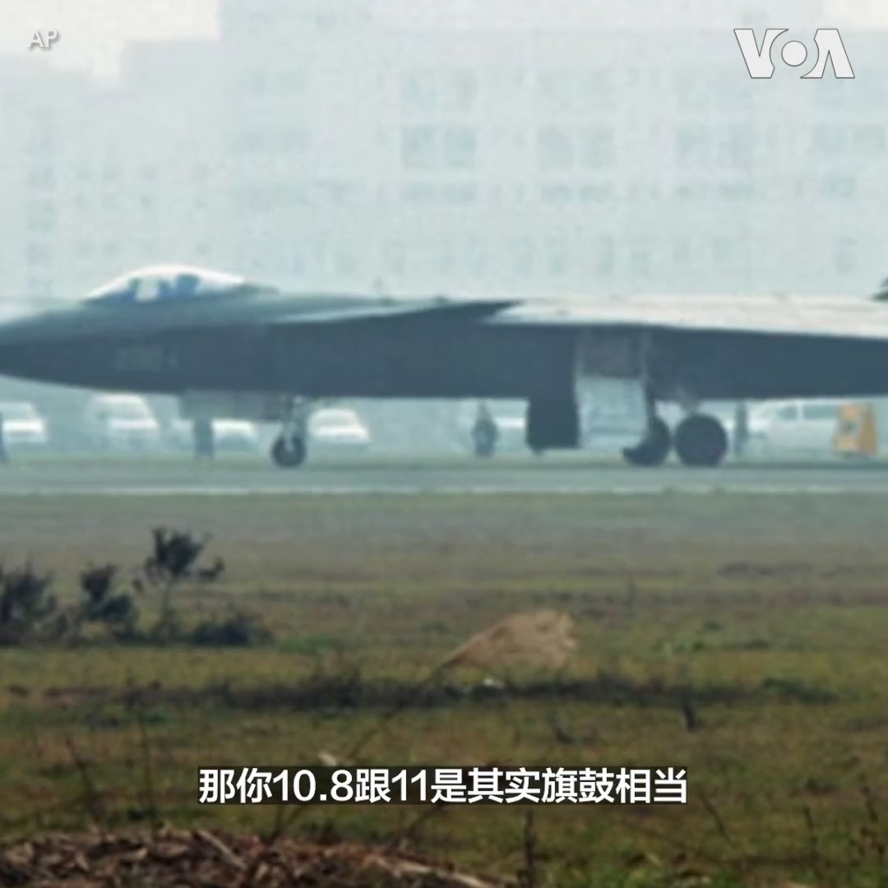

美国之音中文网 北京时间 2023-07-10T00:48:46Z 1678083787014414338 最近有迹象表明，中国最先进的第五代隐形战斗机歼-20疑似换上了期待已久的国产涡扇-15发动机并成功首飞，此举对中国来说无疑是科技上的一大进步，终于可以跟美军F-22战机的发动机F-119一较高下，但距离量产服役保守估计至少还要5年，而且追的是美国30年前的科技。报道： https://t.co/GC9CBLm0ln https://t.co/4A0RbCBuXC   美国之音中文网 北京时间 2023-07-10T01:07:29Z 1678088494822948864 美国总统拜登9日启程前往欧洲。拜登总统抵达英国后10日将会晤英国国王查尔斯三世，接下来前往立陶宛参加北约峰会。他此行最后一站是赫尔辛基，在那里他将与北约新成员芬兰一起庆祝北约扩展。 https://t.co/BswuvPpolR   美国之音中文网 北京时间 2023-07-10T01:09:33Z 1678089018133856256 黄浦江封：和平还是战争？耶伦访华探索美中经济和平可能 https://t.co/FRgfEzaReJ   美国之音中文网 北京时间 2023-07-10T02:05:33Z 1678103108378062848 战俘交换后得以返回乌克兰的亚速营指挥官们誓言重返前线 https://t.co/tVSGvF3rD7   