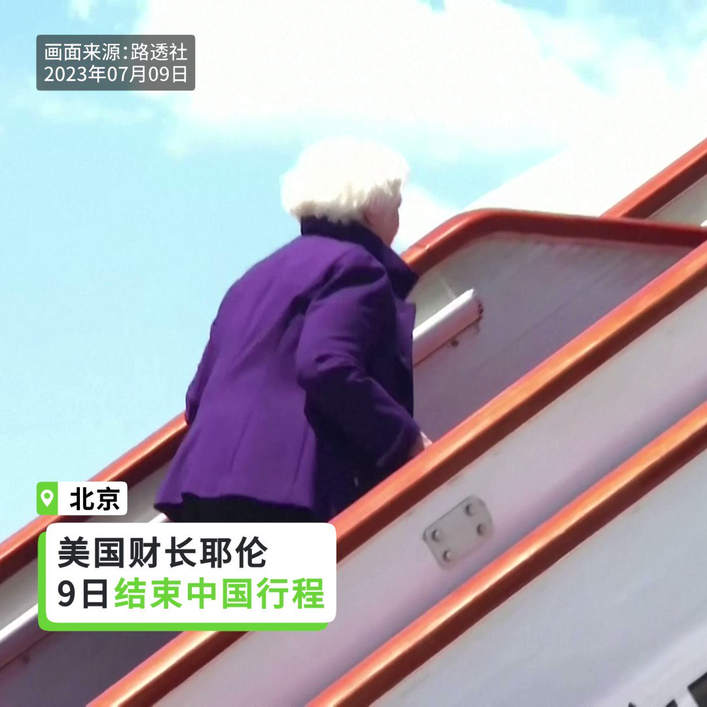
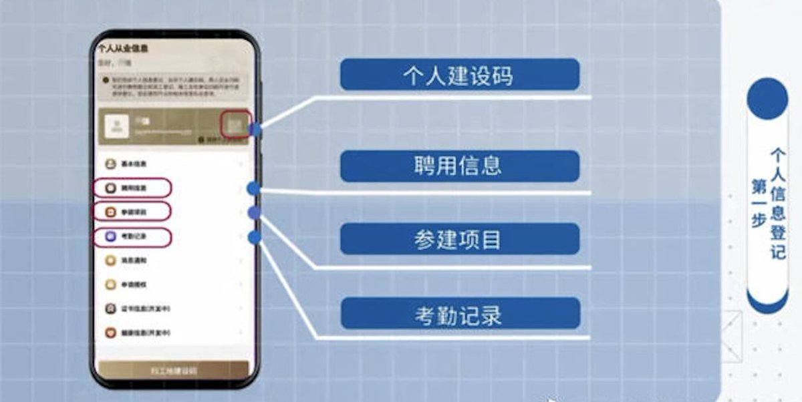

自由亚洲电台 北京时间 2023-07-10T18:25:35Z 1678349740684251137 【耶伦访中：世界够大两国可 #共荣】
【中方关切美方经济制裁】
美国财长 #耶伦 9日结束四天访中行，美国和中国财政部针对此行访问发出声明，耶伦指出，此行的目标是与北京新的经济领导团队建立并加深关系。耶伦强调，没有任何一次访问能在一夜之间解决美中之间的挑战。而中方称，#中美经济 关系是本质是互利共赢，中方在会面中对于美国的 #经济制裁 表达重大关切。   自由亚洲电台 北京时间 2023-07-10T17:34:16Z 1678336826434813952 【中共中央社会工作部已运作】
【各级基层党委设同类机构“维稳”】
中共 #中央社会工作部 近日在官媒曝光并投入运作，#吴汉圣 出任部长，柳拯任副部長。不过，官方并未披露其内部架构。学者认为，中央社工部延续了1941年 #毛泽东 在 #延安 成立的中央社会部职能，其工作涵盖面更广，深入到基层政府。
https://t.co/JG41qvvgvs   自由亚洲电台 北京时间 2023-07-10T15:40:32Z 1678308205867433987 【上海将率先推出“城市码”】
【 疫情产物构建城市“治理体系”】
上海将在“#健康码”基础上，更新迭代推出“#城市码”。上海大数据中心通过“#一人一码”掌握个人资讯，同时对企业也实施“#一企一码”。官方的解释是“构建全方位的城市服务和治理体系”。学者认为，这是加强对人群流向的 #监控。
详细报道：https://t.co/wW2XNCSOMG   自由亚洲电台 北京时间 2023-07-10T10:14:00Z 1678226032380493824 7月9日，是中国当局针对维权律师和人权捍卫者的“#709大抓捕事件”八周年纪念日。中国民间权益组织“#民生观察”当天发表声明，谴责该事件得到中共高层支持，并且暴露当局敌视法治的专制本质。

 https://t.co/8f8CKFQuU7   自由亚洲电台 北京时间 2023-07-10T10:17:10Z 1678226826710380544 【专栏 | #有问有答：维权人士 #陈光诚 介绍“#恶人榜”及《马格尼茨基人权问责法》的影响力】
“恶人榜”在网上公布违反人权，犯法的具体恶行信息，对阻遏恶行是否有帮助？美国通过的《全球马格尼茨基人权问责法》是否能够帮助 “恶人榜“ 活动促进改善中国人权呢？
 https://t.co/WEsNsFTVZF   自由亚洲电台 北京时间 2023-07-10T03:42:29Z 1678127502026477568 台湾中央社7月9日引述国安高级官员表示，中国目前除透过机舰扰台、认知作战外，更操作经济工具介入 #台湾2024年大选。例如，中方曾禁止台湾某些农渔产品输入，但随着台湾选举将至，北京方面在近期开始“由收转放”，目的是营造施惠氛围。

 https://t.co/bvpwwlLpdW   自由亚洲电台 北京时间 2023-07-10T01:12:40Z 1678089801382395911 #耶伦 周日在美国驻中国大使馆举行的新闻发布会上重申，“美国和中国存在重大分歧”，华盛顿对中方“不公平经济行为”以及最近针对美国公司的惩罚性行动感到担忧。
 https://t.co/uMjGrwDNsV   