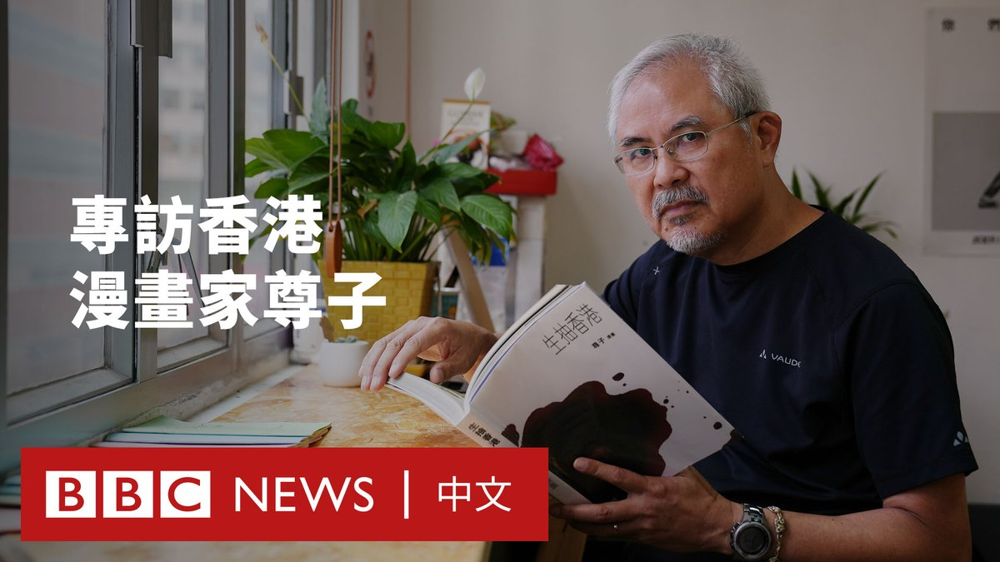
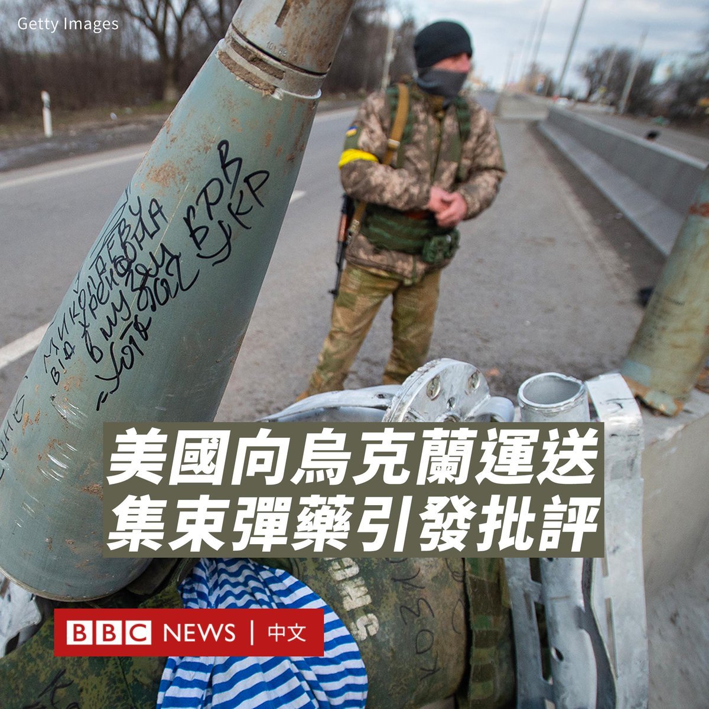

D英国广播公司BBC 北京时间 2023-07-09T14:53:44Z 1677934040299585537 【一周热点回顾】过去几个月，“去风险”（De-risking）成为地缘政治上的一大热词，风头盖过之前特朗普治下美国对华政策中的“脱钩”之说。北京指责“去风险”是西方新的话语陷阱。

那么，这个热词是否代表欧美对中国的战略转向，背后又有哪些考量？https://t.co/YCe3mIJtUh   D英国广播公司BBC 北京时间 2023-07-09T15:01:04Z 1677935887370313729 【一周热点回顾】香港特首李家超在“七一”前夕表示，涉及国家安全的香港《基本法》第23条“在今年或最迟明年一定要立法”。“23条”与《国安法》有何差异？其运用会更广、更严吗？https://t.co/mIs5LJjh11   D英国广播公司BBC 北京时间 2023-07-09T13:59:35Z 1677920415119982592 尊子是香港时事漫画家，从事创作超过四十年。由于他的作品主题多与社会政治议题有关且风格大胆，作品不时引发争议。今年5月，在香港官员多次公开抨击其作品后，《明报》宣布其专栏停刊。

尊子表示，北京在香港实施的《国安法》，为当地的新闻和艺术创作带来诸多“红线”，但他表示不会停止创作或离港。 https://t.co/TFtZtWpcIc   D英国广播公司BBC 北京时间 2023-07-09T11:01:03Z 1677875483365482504 赖清德提出“四大支柱”，强调要加强台湾国防并维持台海现状。多名学者分析称，赖清德在美媒发文是对华府的“交心”，希望减弱其“台独”形象争取美国信任，预料他在国际和两岸政策上将延续蔡英文的路线。https://t.co/M5qGY2XGXk   D英国广播公司BBC 北京时间 2023-07-09T01:21:37Z 1677729664083820545 在美国政府宣布向乌克兰提供新的8亿美元军事援助计划，其中包括被广泛禁用的集束弹药后，总统拜登（Joe Biden）辩护称其是“非常艰难的决定”。

拜登称，他花了“一段时间才被说服这样做”，这是因为“乌克兰人的弹药正在耗尽”。

这一决定很快遭到人权组织的批评。国际特赦组织（Amnesty International）表示，集束弹药“对平民的生命构成严重威胁，甚至在冲突结束很久之后”。

联合国也对此表示反对。联合国秘书长副发言人哈克（Farhan Haq）周五（7月7日）表示，联合国秘书长希望各国能够遵守《集束弹药公约》（Convention on Cluster Munitions）条款，不希望在战场上继续使用这种武器。

英国、加拿大和西班牙均表示反对使用集束弹药。

西班牙国防大臣罗伯斯（Margarita Robles）表示，西班牙支持乌克兰的正当防卫，但将坚持部分武器和炸弹不能运往乌克兰。

作为《集束弹药公约》签署国的德国表示，虽然柏林不会向基辅提供这种武器，但它理解华盛顿的立场。

乌克兰领导人泽连斯基（Volodymyr Zelensky）则称赞该举措是“及时的”。

俄罗斯国防部发言人称此举是“绝望之举”，是“面对广为宣传的乌克兰‘反攻’失败而表现出的无能为力”。

拜登周五（7月7日）接受CNN采访时表示，他已就这一决定与盟友进行了交谈，该决定是在下周在立陶宛举行北约峰会之前宣布的。

全球有逾100国禁止使用集束炸弹，但美国、乌克兰和俄罗斯都没有签署《集束弹药公约》，而莫斯科和基辅在战争期间都使用了集束弹药。

集束炸弹会释放大量较小的炸弹，可以在大范围攻击多个目标，杀伤力强。未爆炸的小炸弹往往会在冲突结束多年后，仍然对平民的生命安全构成威胁。

乌克兰国防部长承诺这批集束弹药将用于突破敌人的防线，而不会在城市地区使用。

美国法律禁止生产、使用或转让哑弹率超过1%的集束弹药，拜登此举将绕过该法律。

在乌克兰战争初期，当白宫被问及有关俄罗斯使用集束炸弹和真空弹的指控时，时任新闻秘书表示，如果属实那将是一种潜在的“战争罪”。   