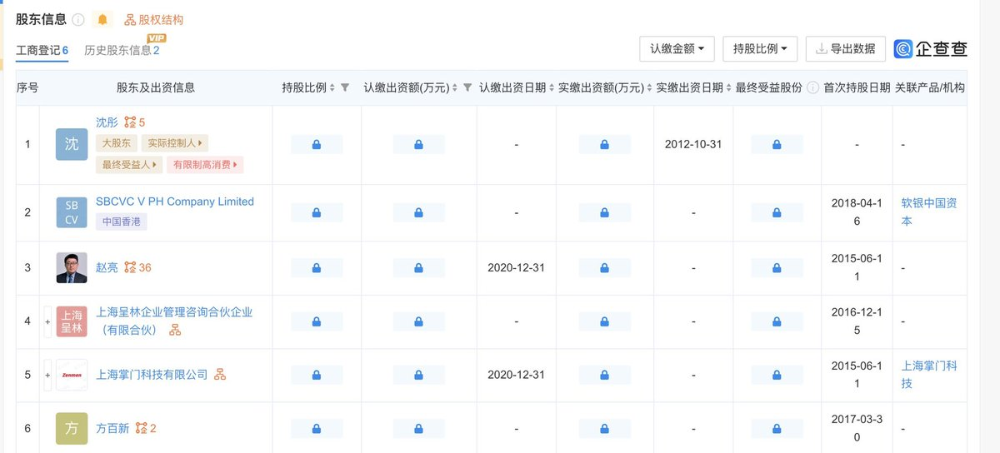
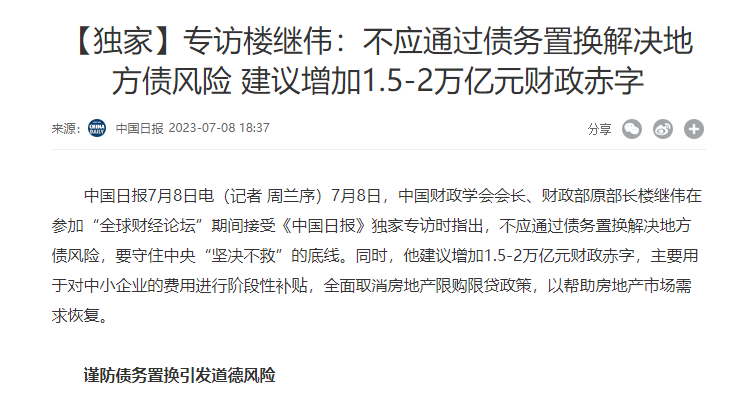

多伦多方脸 北京时间 2023-07-09T18:42:18Z 1677991562419277829 一看就没仔细研究过我的视频。
比较典型方式，有提高人均可支配收入，降低国有经济在中国经济里的占比。
放弃大基建，以建立福利国家为目标。
通过社会兜底来促进消费。
当然这些只要中共在就不会做。   多伦多方脸 北京时间 2023-07-09T20:37:42Z 1678020602005970951 最近刷抖音评论区
刷出了推特的感觉   多伦多方脸 北京时间 2023-07-09T16:35:33Z 1677959663730712576 我天天关注中国民生问题，你说我不爱国。
是殖人，是反贼
你天天个人简介里说心系祖国，心系国家
所有转发的新闻都是美国枪杀了多少人，法国又出现了骚乱，对中国发生的一切置若罔闻
不对矿难，鸭脖，等问题发表任何评价
你心系的祖国是美国吗？   多伦多方脸 北京时间 2023-07-09T17:24:20Z 1677971940030681088 是啊，那个沈彤不就被限制高消费了吗，不过就是不知道解除没。
不是还是天天到处跑（至少他自己表述的状态是这样） https://t.co/TCvtp218vo   多伦多方脸 北京时间 2023-07-09T14:34:46Z 1677929266615562242 中国前财政部长，2015年那次化债的主导人之一楼继伟，出来表示不应该进行债务置换的方式解决地方债务风险。
看起来和中央目前的决定有所冲突，算不算是技术官僚的最后呐喊了？ https://t.co/Obe7s0j8fK   多伦多方脸 北京时间 2023-07-09T14:03:00Z 1677921272850952194 好的👌半年后我们看看 https://t.co/bAwq2UkwnK   多伦多方脸 北京时间 2023-07-09T14:21:22Z 1677925896655872000 讲道理迷人的小红 ，是我看最近粉红里面涨粉比较快的。
他应该大概率是个网军。
这涨粉速度，中央不该给他颁发一个劳动奖章？嘉奖一下运营人员？   