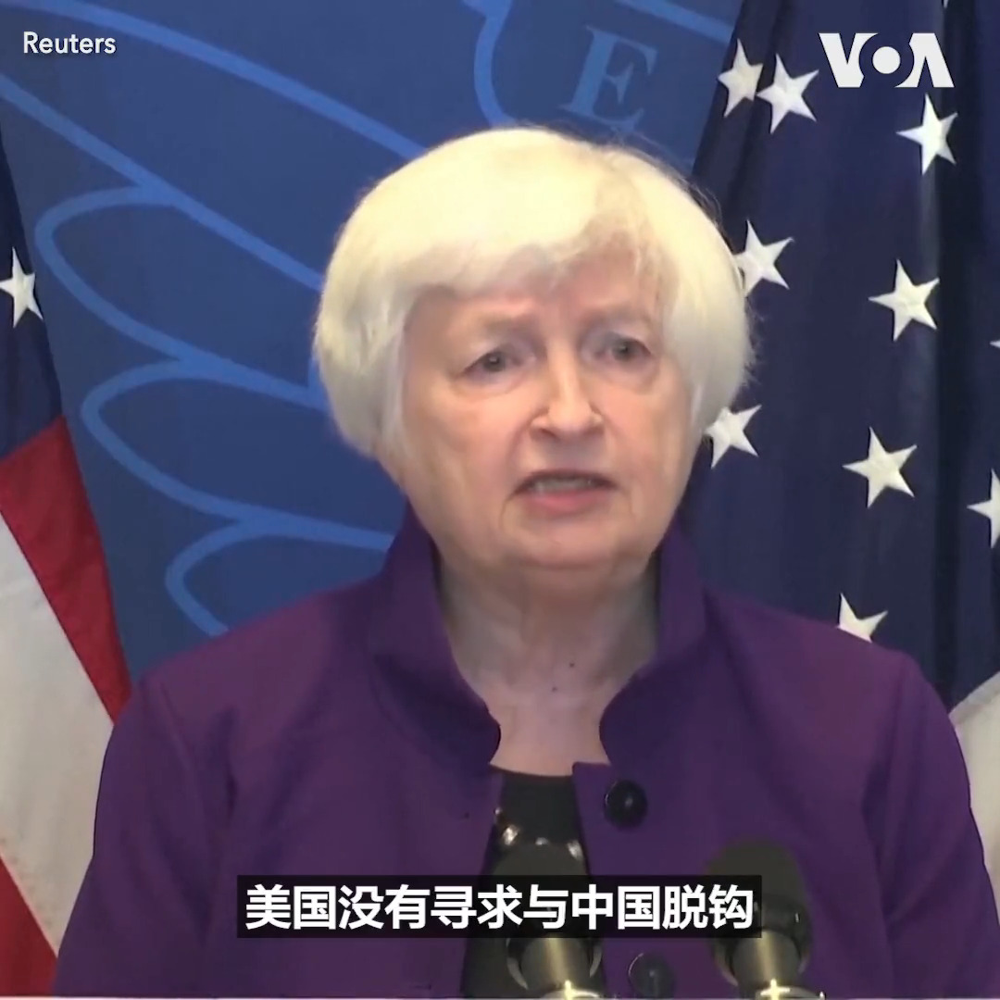
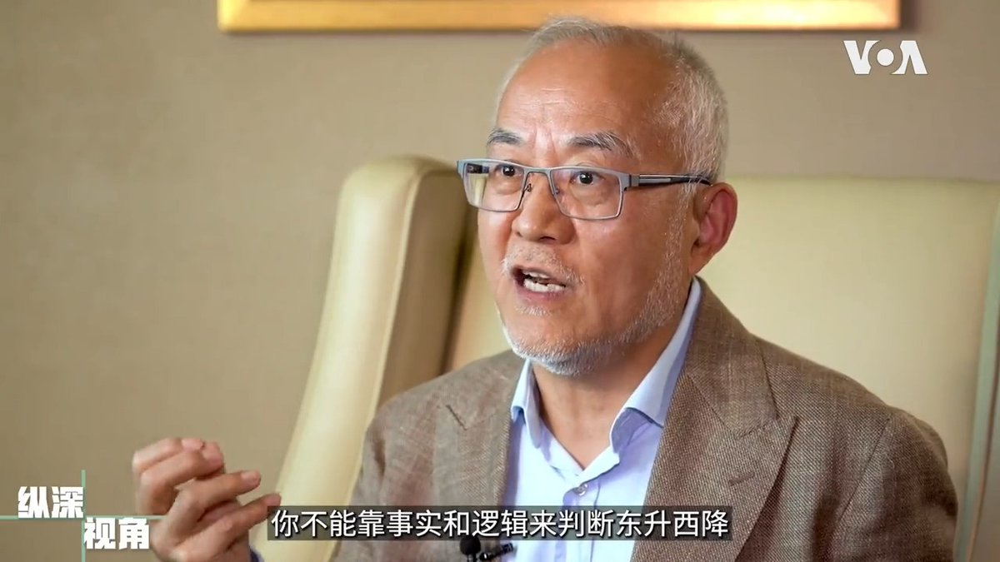
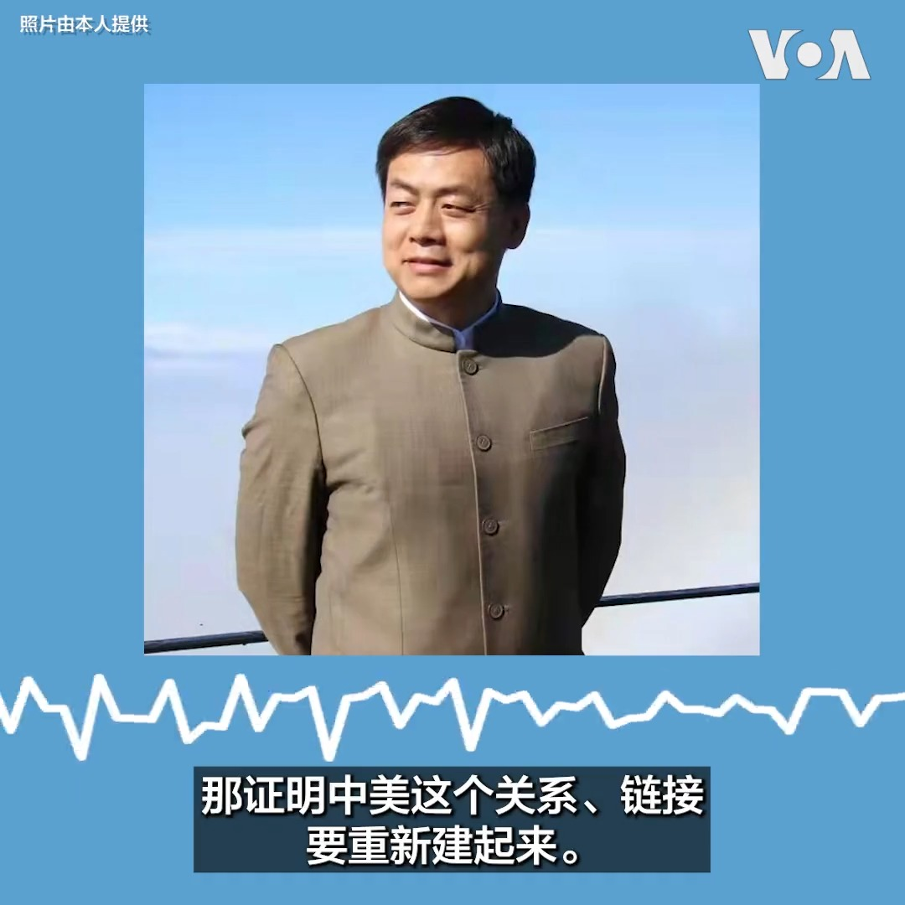
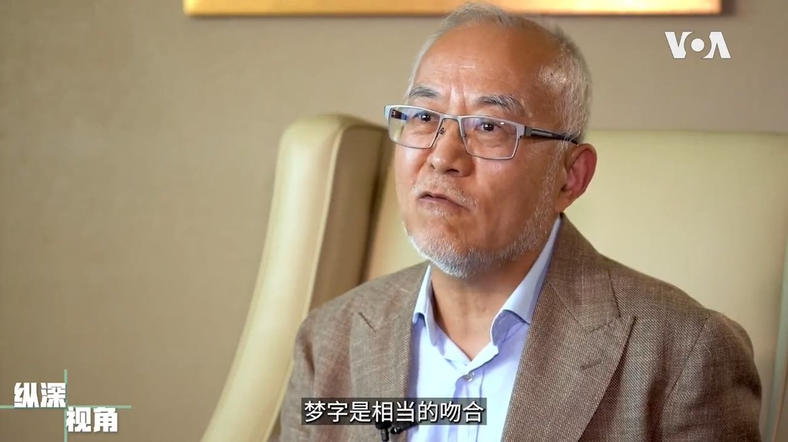

美国之音中文网 北京时间 2023-07-09T20:10:40Z 1678013801386393606 美国财政部长耶伦9日在离开北京前的记者会上表示，最近几天她与中国高级官员进行的10小时双边会谈是“直接”和“有成效的”。耶伦说美国与中国有重大的分歧，双方必须就这些分歧进行明确和直接的沟通。 https://t.co/okBQZudVJP   美国之音中文网 北京时间 2023-07-09T20:36:17Z 1678020246098132992 伦敦9日在为美国总统拜登来访进行安全措施的准备。按照惯例，来访的美国总统将下榻于美国驻英大使官邸温菲尔德宫 Winfield House 。拜登总统将会晤英国首相苏纳克以及英国国王查尔斯三世，拜登总统访问英国后前往立陶宛参加北约峰会。 https://t.co/cXBvMh2Xoh   美国之音中文网 北京时间 2023-07-09T18:06:03Z 1677982438558146561 韩国议员严厉指责IAEA批准日本计划排放处理过的核废水 https://t.co/q4v4TDDprQ   美国之音中文网 北京时间 2023-07-09T10:43:32Z 1677871077803065346 所国总理访问安全伙伴中国 着重讨论基础设施建设 https://t.co/IcPRzTRsMQ   美国之音中文网 北京时间 2023-07-09T11:29:02Z 1677882525946109955 耶伦在不稳定的美中关系中看到“进展”，期待更多沟通 https://t.co/8OwBTkdLvW   美国之音中文网 北京时间 2023-07-09T07:00:00Z 1677814821885026307 另外一个在中国国内外引发重大争议的认知战口号是习近平提出的“百年未有之大变局”和“东升西降”。斯坦福大学中国经济与制度研究中心高级研究员吴国光说，习近平希望通过中西方对比来改变中国人的认知，但不曾想却把自己的盟友普京给忽悠掉了。#纵深视角完整版： https://t.co/cHIbE8GLcd https://t.co/Jc83LqpxT0   美国之音中文网 北京时间 2023-07-09T08:05:33Z 1677831316350595072 财长耶伦：更加密切的美中沟通至关重要 https://t.co/YA9Vc7lDP9   美国之音中文网 北京时间 2023-07-09T09:47:32Z 1677856984241000455 #美中对标 中国热点对标美国论据，用一杯咖啡的时间聊聊中国热点的美国冷思考。最近拜登的学生贷款减免政策遭到最高法院的无情否决，理由是行政部门不能绕过立法机构擅自诠释法律条文。然而在中国习大大的雄安新区虽然号称千年大计，耗资巨大，却无人敢置喙。本期节目对比美中领导人谁的权利大？ https://t.co/lAeZkZ4xYQ   美国之音中文网 北京时间 2023-07-09T04:28:16Z 1677776638212276229 美国财政部长耶伦访华，中方罕见安排她与多位前后任财经高官会晤，官媒宣传和微博网民也热议她的访华花絮，释出颇为友善的氛围。学者分析，中国高度重视耶伦此行，凸显中方不愿与美国脱钩，而且中国经济困境仍待美国和外资伸出援手。详细内容：https://t.co/60CvBNMPPX https://t.co/keuT2BsUCv   美国之音中文网 北京时间 2023-07-09T05:15:32Z 1677788533757730816 美国盟友对集束炸弹的决定做出反应 https://t.co/hv7g7eqbiP   美国之音中文网 北京时间 2023-07-09T02:28:33Z 1677746507741634561 法国反对北约转向亚太，日本强调欧亚安全紧密相连 https://t.co/5BlKQQylmY   美国之音中文网 北京时间 2023-07-09T03:26:02Z 1677760976274477057 泽连斯基在俄罗斯入侵500天之际在蛇岛发表讲话 https://t.co/Ti8hj4Sm1n   美国之音中文网 北京时间 2023-07-09T03:50:04Z 1677767022619533312 耶伦访华受高规格接待、官媒网民热议，观察人士:凸显中方不愿“脱钩” https://t.co/2d6y6b3XY2   美国之音中文网 北京时间 2023-07-09T04:15:33Z 1677773436234637312 国际原子能机构总干事在韩国缓解福岛核电站废水排放的担忧 https://t.co/yZsvoGgDXg   美国之音中文网 北京时间 2023-07-09T01:00:01Z 1677724229427675136 习近平新时代发起的认知战是中共自毛时代以来长期的洗脑宣传和思控制在信息时代的最新翻版，目的是提供虚假的信息扰乱受众的认知系统，让民众在亢奋的憧憬中接受官方叙事。斯坦福大学中国经济与制度研究中心高级研究员吴国光说，“中国梦”就是认知战的一个完美诠释。#纵深视角 https://t.co/cHIbE8Hj1L https://t.co/hqqzTmtgIj   美国之音中文网 北京时间 2023-07-09T01:02:14Z 1677724785378222080 “如果我们不是北约成员，这里的情况可能已经和乌克兰一样了”，靠近白俄罗斯边界一个村镇的一位立陶宛民众说。北约领导人将于11日在立陶宛首都维尔纽斯举行峰会，立陶宛在边界一带加强了安全部署；拉脱维亚和波兰还派遣了警力协助在维尔纽斯巡逻。 https://t.co/vcJp36bnz8   美国之音中文网 北京时间 2023-07-09T01:21:03Z 1677729524333826048 美国销毁最后一批化武，拜登：向消除化武恐怖的目标前进了一步 https://t.co/qSSXvXkmPV   