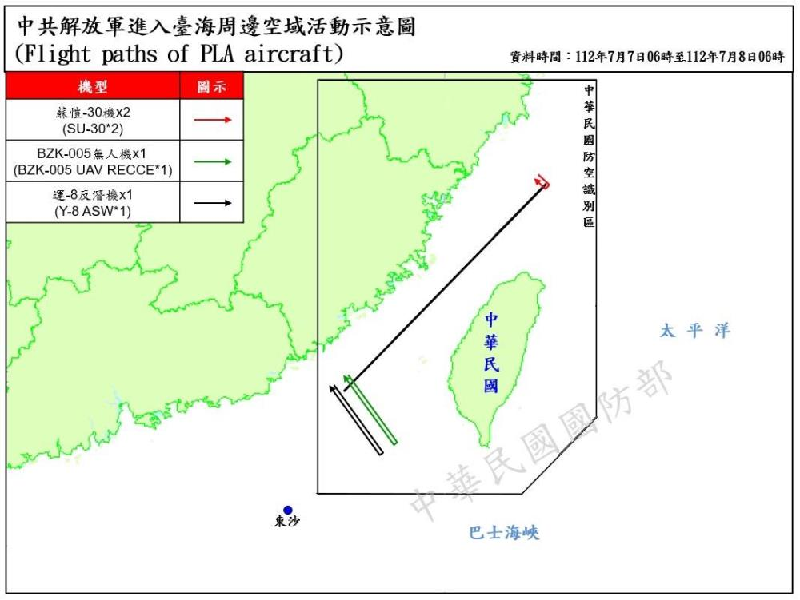
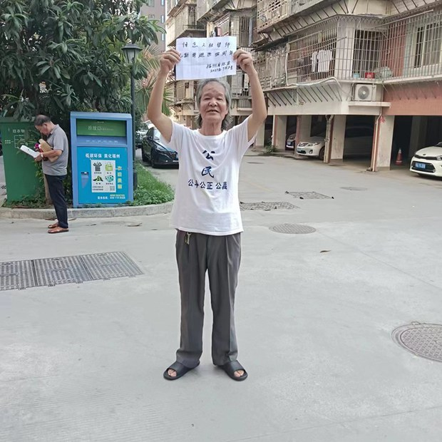

自由亚洲电台 北京时间 2023-07-09T06:46:55Z 1677811530706944000 据国际媒体8日消息，中国解放军在截至周六凌晨的过去24小时内，派出了13架次飞机和6艘次军舰进入台湾周围的空域和水域。此时，美国财政部长 #耶伦 正在北京访问。

台湾国防部表示，目前正从空中和海上监视事态的发展，陆基导弹系统已做好应对准备。国防部的新闻稿称，四架中国飞机——两架SU-30战斗机、一架BZK-005侦察机和一架Y-8反潜战机——越过 #台湾海峡 的中线，进入 #台湾西南防空识别区。台海中线曾经被视为是双方事实上的边界线，但是中国表示不承认所谓的中线。

中国声称台湾是其领土的一部分，必要时可以武力吞并，并几乎每天都派出空军和海军在台湾周边执行所谓的任务，试图削弱台湾的防御能力并恐吓台湾的 2300万人民。然而，到目前为止，台湾人民似乎基本上没有受到中共武力威吓行动的影响。

预计在 #耶伦访华 期间，习近平不会与她会面。   自由亚洲电台 北京时间 2023-07-09T06:52:48Z 1677813009542963200 据印度媒体印度斯坦时报8日报道，#达赖喇嘛 在前往印度德里和拉达克地区访问之前在达兰萨拉对媒体表示，中国方面通过“正式”或“非正式”方式表示愿意与他接触的意思。
不过，这篇报道没有说明达赖喇嘛讲话的具体日期。
https://t.co/rBgo6bdbox   自由亚洲电台 北京时间 2023-07-09T07:03:07Z 1677815607608193025 【特斯拉开始解雇中国工厂部分工人】
【离职补偿怎么算？】

彭博社7日援引知情人士的消息说，电动汽车制造商 #特斯拉 正在解雇其在上海工厂的部分电池组装工人。

据路透社称，目前尚不清楚特斯拉有多少工人可能被解雇，也不清楚裁员背后的具体原因。特斯拉没有立即回应置评请求。

#特斯拉上海超级工厂 是其规模最大、生产力最高的工厂，拥有大约 20,000 名员工，包括 Model Y 和 Model 3 的组装工人。而特斯拉的电池工人总数可能不足一千。因为特斯拉主要从LG新能源和宁德时代获取电池，只有两个车间完成组装电池的最后工序。

该消息还说，特斯拉将为被裁的电池组装工人提供最高N+3的离职补偿，以平均7000元月薪计算，部分被裁员工有望一次性获得2-4万元补偿金。   自由亚洲电台 北京时间 2023-07-09T09:55:31Z 1677858990066155522 RT @RFA_Chinese: 《华尔街日报》根据联合国人口司数据，发现在21世纪头十年初的大部分时间里，每年 #中国净迁出人数 约为50万。… https://t.co/pMLUxEwRWR   自由亚洲电台 北京时间 2023-07-09T05:43:21Z 1677795532218019847 RT @RFA_Chinese: 【调查报道 |中国“秘密警察站”在纽约】林海:寻找没有恐惧的土地
https://t.co/SpNH1RA0J4
2019年从中国逃亡到美国的林海从没想到，他会在曼哈顿街头的民主活动上，遭到不明身份的人挥舞五星红旗袭击。但随着中国“秘密警察站”…   自由亚洲电台 北京时间 2023-07-09T05:43:45Z 1677795631623020544 RT @RFA_Chinese: “#牵手门”男女主都凉了
#中国石油北京项目管理公司 通报调查处理结果：
#胡继勇 被双开，
董某某被解除劳动合同。
除生活作风问题，未查出其他问题！！！
网友议论纷纷，这样的处分，您觉得是重了还是轻了？ https://t.co/Ht6JOt…   自由亚洲电台 北京时间 2023-07-09T02:28:24Z 1677746472299921413 据美国有线电视新闻网（CNN）报道，在俄罗斯总统普京与中国国家主席习近平会面后，美国总统 #拜登 警告 #习近平 要“当心”，因为北京仰赖西方的投资。

拜登表示：“我是说：这不是威胁，而是一种观察。 ” https://t.co/Xb1upNXKZQ   自由亚洲电台 北京时间 2023-07-09T02:52:42Z 1677752587309957120 【#耶伦 会 #何立峰】
美国财政部长耶伦当天表示，美中应就特定经济做法的疑虑“直接”沟通，尽管两国关系紧张，但仍敦促世界两大经济体之间加强合作，强调必须公平竞争并密切沟通，以避免误解。

 https://t.co/T9f35XxnQG   自由亚洲电台 北京时间 2023-07-09T03:06:09Z 1677755973421895682 据德国调查新闻媒体Correctiv报道，一名拥有德国国籍的年轻华裔男子不久前在中国旅行时，遭到中国警方施压，迫使其提供对中国政府持批评态度的在德华人信息。

 https://t.co/CrMDx20bNY   自由亚洲电台 北京时间 2023-07-09T03:17:38Z 1677758859551690752 据海外维权网8日报道，“#709八周年 纪念日前，福建维权人士 #唐兆星 在其居住的福州市仓山区上渡街道南台紫竹苑小区，穿上“公平、公正、公义”文化衫，举牌悼念遭迫害去世4年的“赤脚律师”#纪斯尊。

“赤脚律师”纪斯尊是在2019年7月10日、也就是“709”纪念日的次日遭迫害去世。当天维权人士唐兆星举的是“悼念人权律师纪斯尊逝世四周年”的牌子，唐兆星说，“快整整四年了，他当时走的时候我还被关在看守所里面，所以说我这个牌子给他举一举呀，纪念他一下，他是真正的人权律师，无偿帮助了太多的弱势群体，不能忘记他。”

人们称纪斯尊为“赤脚律师”，是因为他没有官方核发的律师执业证书，但却倾其一生为无权无势的平民百姓，跟违法行政的官府及随意践踏人权的官员打官司，也屡屡遭到当局的“铁拳”专政，最终未能逃过失去生命的劫难。   自由亚洲电台 北京时间 2023-07-09T02:00:21Z 1677739413642592261 RT @RFA_Chinese: 【官媒带头报道西方人“饿肚子“】
【郑旭光：中国可能要闹饥荒】
【明居正：中国的洗脑宣传 要反着看】
 #亚洲很想聊 最新一期完整视频：https://t.co/RjRRqPCjMj
近期新华社等官媒密集报道“#七分之一的英国人吃不饱”，“#美…   自由亚洲电台 北京时间 2023-07-09T02:00:32Z 1677739457997418497 RT @RFA_Chinese: 中国监管当局对对蚂蚁集团及旗下机构处以罚款（含没收违法所得）71.23亿元。
蚂蚁集团回应：诚恳接受、坚决服从，目前已完成相关整改事项。 https://t.co/WEeywo3XOW   自由亚洲电台 北京时间 2023-07-09T02:00:35Z 1677739471297474561 RT @RFA_Chinese: #李玟 轻生离世的消息引发公众对 #抑郁症 的探讨。据中国官媒报道，中国每4名青少年中就有1人患抑郁症。

《中国国民心理健康发展报告（2019一2020）》中指出，2020年中国青少年的抑郁症状检出率为24.60%，重度抑郁症占比7.4%。…   自由亚洲电台 北京时间 2023-07-09T02:00:44Z 1677739508547084289 RT @RFA_Chinese: 【调查报道 |中国“秘密警察站”在纽约】林海:寻找没有恐惧的土地
https://t.co/SpNH1RA0J4
2019年从中国逃亡到美国的林海从没想到，他会在曼哈顿街头的民主活动上，遭到不明身份的人挥舞五星红旗袭击。但随着中国“秘密警察站”…   自由亚洲电台 北京时间 2023-07-09T02:01:19Z 1677739655419031554 RT @RFA_Chinese: “#牵手门”男女主都凉了
#中国石油北京项目管理公司 通报调查处理结果：
#胡继勇 被双开，
董某某被解除劳动合同。
除生活作风问题，未查出其他问题！！！
网友议论纷纷，这样的处分，您觉得是重了还是轻了？ https://t.co/Ht6JOt…   