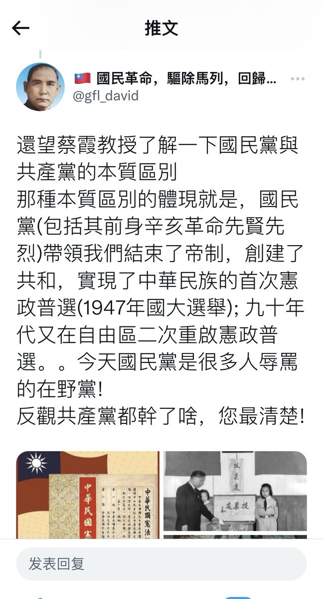
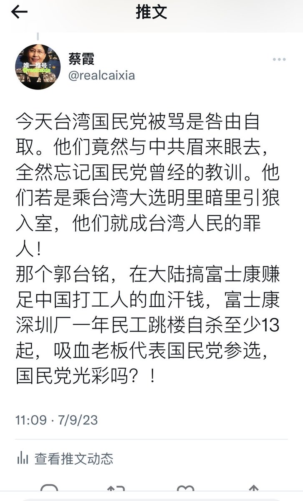
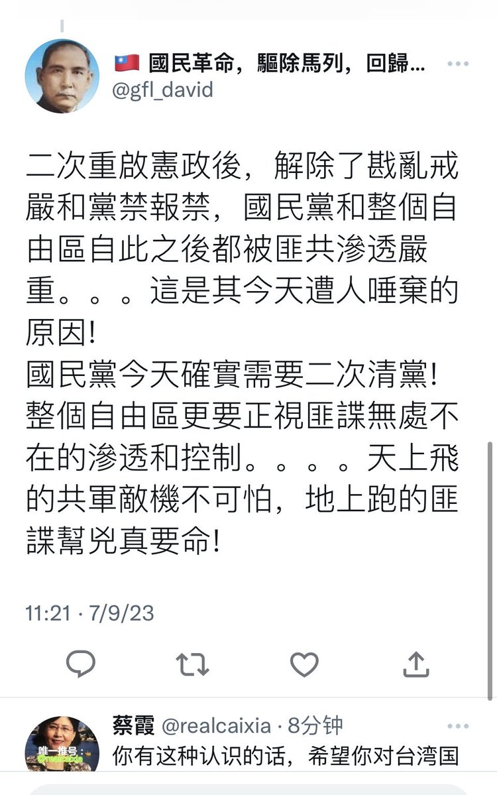
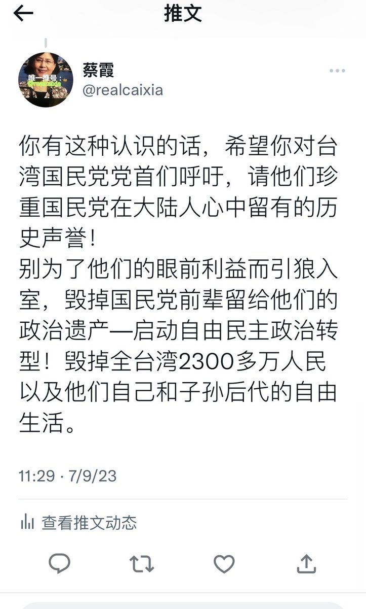
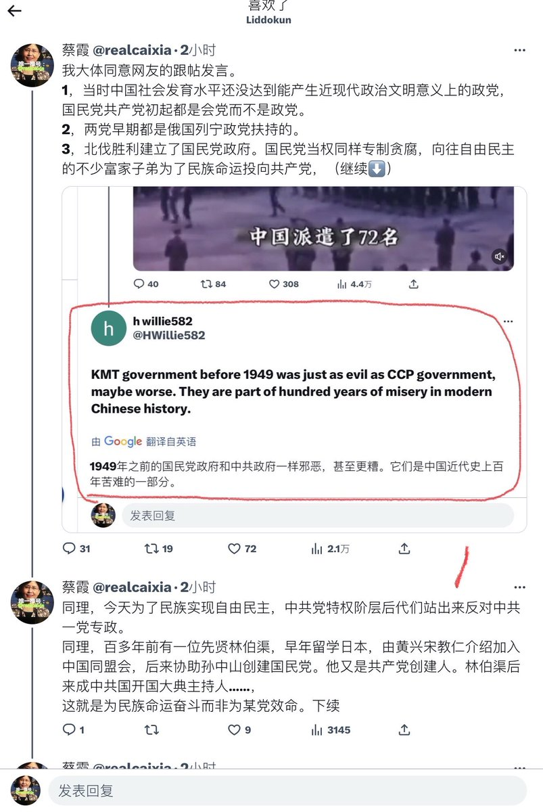
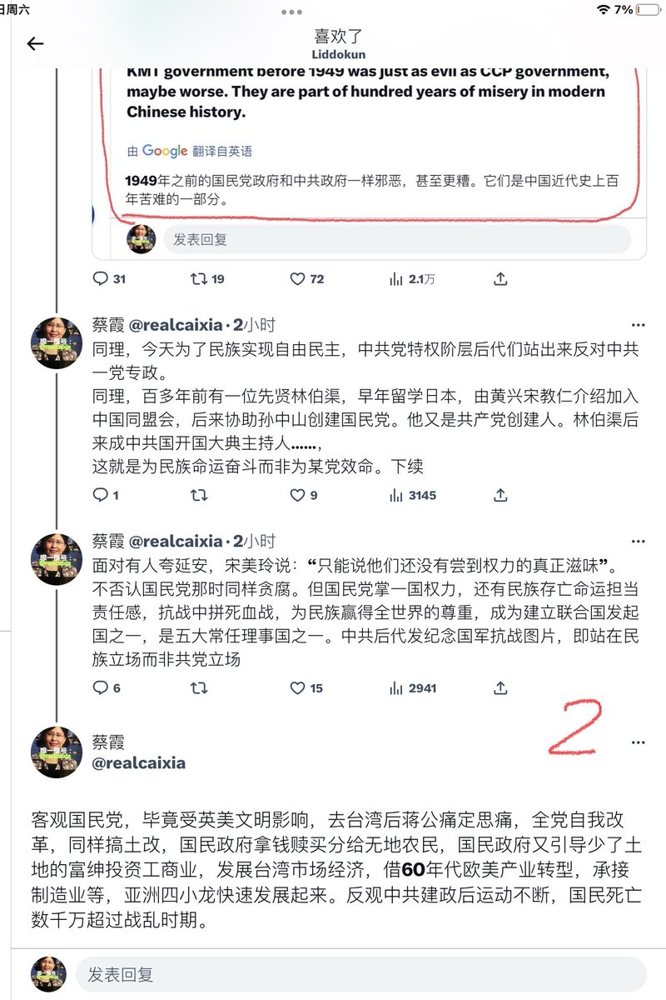
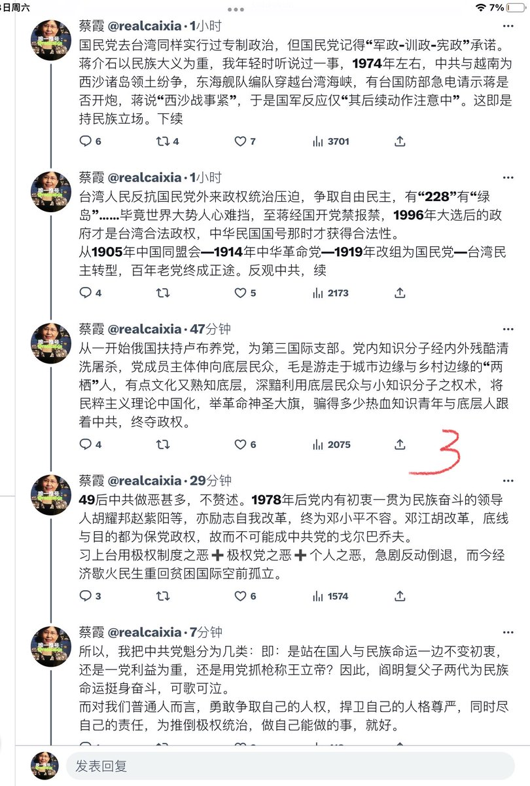

蔡霞 北京时间 2023-07-09T23:50:45Z 1678069183685484547 国民党在大陆是威权统治，中共在大陆是极权统治。尽管都是专制政体，但性质上依旧有很多不同点。
这也是为什么民国一辈的学者，去了台湾的都有善终，留在大陆的全部悲惨结局的原因，也是今日大陆人怀念49年前的原因。
今日台湾国民党人，望珍惜珍重国民党前辈在大陆的历史，在台湾民主转型的功勋与声誉 https://t.co/PTDMisfr0I   蔡霞 北京时间 2023-07-09T21:02:52Z 1678026936965267469 本是政府该做的事，政府不做，乡民自己做了，为收回成本而收费。这本该是民众问责政府，政府应该赔偿乡民造桥的费用，结果是政府竟然反而敲诈式罚款，公然捏造罪名颠倒黑白拘禁乡民。这个实例明白无误地告诉人们，什么是罪恶的政府，什么是恶法。   蔡霞 北京时间 2023-07-09T11:50:33Z 1677887942625206272 RT @blumengirl1: #周世锋 律师 709八周年纪念日感言
八年前的今天，孙力军政治团伙开始大规模抓捕维权律师、人权捍卫者；八年后的今天，孙力军已被判处终身监禁，但其政治势力仍然逍遥法外，还在肆无忌惮践踏人权，一直在侵害着人类文明。
八年前，我们对法治心存希望；八…   蔡霞 北京时间 2023-07-09T06:27:54Z 1677806742787203079 合起来再推一下，便于感兴趣的网友方便完整观看。
再补充两点：1，中共好战分子不承认有74年之事一说，请查看台湾公开资料。
2，中共恐惧自由民主台湾对全世界和大陆国民的影响力，不仅叫嚣武统台湾，而且渗透利诱台湾。提醒国民党人千万别忘两次国共合作的教训。送句话给你们：相信中共党，台湾变香港 https://t.co/6Xrc3g2EuP   蔡霞 北京时间 2023-07-09T09:28:31Z 1677852196376043521 RT @JueMuRen0: 北平沦陷前夕，共产党派胡适的高徒吴晗劝其留下，并保证北平“解放”后，仍让胡适担任北京大学校长和北京图书馆的馆长。
但胡适却只是摇摇头，并留下著名的三句话：在苏俄，有面包，没有自由；在美国，又有面包，又有自由；牠们来了，没有面包，也没有自由。 htt…   蔡霞 北京时间 2023-07-09T09:28:58Z 1677852311031533568 RT @GvqVd6J2jdCOJYP: 廣州整治電動車簡直肆無忌憚,見車就搶。
眾多交警大街上公然搶奪一學生電動車，由當初的合力拉扯，引發眾怒，仍不停手，群眾群起而攻之，打得交警抱頭鼠竄…
這是人民的勝利！👍👍👍
https://t.co/soqQTxdbpU   蔡霞 北京时间 2023-07-09T09:29:12Z 1677852368631922688 RT @xingzhe2021: 開大會，學習思想，同時學成語！一舉兩得！
（題外話:從這段新聞來看，央視裡面起碼潛藏有4個反賊: 攝影師拍入鏡頭，編輯照樣剪輯在視頻裡，導播繼續讓播出，主持人也當沒看見…) https://t.co/wmVF3SIZJQ   蔡霞 北京时间 2023-07-09T09:48:59Z 1677857349170782209 RT @safarier777: 乌克兰总统泽连斯基登上著名的“蛇岛”，那个俄罗斯全面入侵初期乌克兰守军宁死不屈的那个蛇岛。

本世纪最有勇气的总统，没有豪华卫队没有雄伟舰队保护的情况下毅然登岛向在此牺牲的乌克兰守军敬献花圈，以纪念这五百个不凡的日日夜夜。

#乌克兰最新消息…   蔡霞 北京时间 2023-07-09T02:20:17Z 1677744428973268992 阎明复父子俩代为民族挺身奋斗可歌可泣。父亲闫宝航与国民党高层私交很好，于右任，宋美玲，孙科是阎宝航好朋友，阎宝航参加共产党并阎明复哥姐都投向延安，宋美玲等知晓此情。
文革中阎宝航与阎明复同被囚秦城，父子俩囚号只隔23人，却彼此不知对方音信。闫宝航68年惨死于秦城，阎明复被囚7年多。   蔡霞 北京时间 2023-07-09T00:20:52Z 1677714377422643200 一切反对极权统治的力量都携手合作共同努力，推倒中共的信息封锁墙、推倒极权统治的目标都能实现。中国人终有实现宪政民主的一天。   