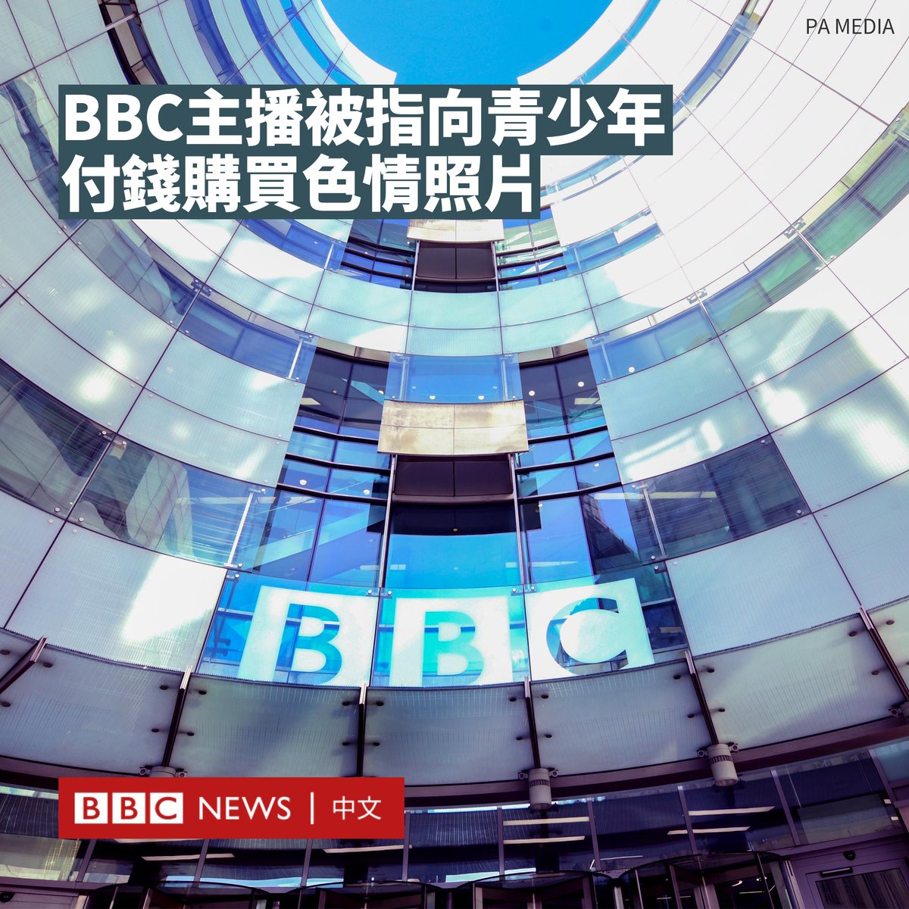

D英国广播公司BBC 北京时间 2023-07-08T23:41:22Z 1677704435714363399 据报道，BBC一名知名主持人被指控向一名青少年支付了数万英镑，以换取其色情照片。

《太阳报》报道称，这名男性主播从这名青少年17岁开始，便向其购买色情照片。受害者的母亲表示，这位现年20岁的匿名人士用这笔钱来吸食可卡因。

据报道，这名年轻人的家人于5月19日向BBC投诉，其对该主播仍在荧屏上感到沮丧。

据悉，BBC正在调查这些指控，遭指控的主播在近日将不会主持节目。

这名青少年的母亲表示，她的孩子在三年内从一个“无忧无虑的年轻人变成了一个幽灵般的瘾君子”。

BBC一名发言人表示：“我们非常认真地对待所有指控，我们已经制定了积极处理这些指控的程序。”

“作为其中一部分，如果我们收到需要进一步调查或检查的信息，我们将采取措施。”

BBC文化编辑凯蒂·拉扎尔（Katie Razzall）表示，尽管BBC发言人进行了回应，但许多问题仍未得到解答，包括该公司已如何调查该家庭的投诉，以及在遭严重指控后，这位未被公布姓名的主播是否适合继续主持节目。   D英国广播公司BBC 北京时间 2023-07-08T17:01:05Z 1677603702637490176 【一周热点回顾】纳赫勒在驾车逃离警察时被近距离射杀。法国检察官认为，使用枪支在法律上是没有道理的。这名少年的死再次引发了人们对法国种族问题的不满。https://t.co/LksnWVGLZP   D英国广播公司BBC 北京时间 2023-07-08T15:01:05Z 1677573504223309826 【一周热点回顾】作为在亚洲乐坛享负盛名的歌手，李玟为华人歌手在国际舞台开拓了一片天地。https://t.co/Ryhx7XdpyT   D英国广播公司BBC 北京时间 2023-07-08T13:01:05Z 1677543302298476546 本周全球平均温度连续两天创下史上最高温纪录，人体在高温天气中会发生什么呢? https://t.co/lxrIc0NrfT   D英国广播公司BBC 北京时间 2023-07-08T11:44:19Z 1677523983095283712 【一周热点回顾】一名腾讯公司的程序员7月3日在北京被拘捕。他被指在读硕士研究生期间，侵入了母校中国人民大学的数据库，并用学生的照片和信息建立了一个外貌打分平台。https://t.co/0Zxw3r2H7K   D英国广播公司BBC 北京时间 2023-07-08T11:46:29Z 1677524530527338497 【一周热点回顾】放眼欧洲各国，你会看到不同风格的极右翼政党，包括怀旧民族主义、民粹民族主义，甚至带有新法西斯根源的极端保守主义等等，正在明显复苏。无论是在意大利、瑞典、法国还是希腊，曾经被排斥的声音正在稳步迈入主流。https://t.co/srTOmxmn74   