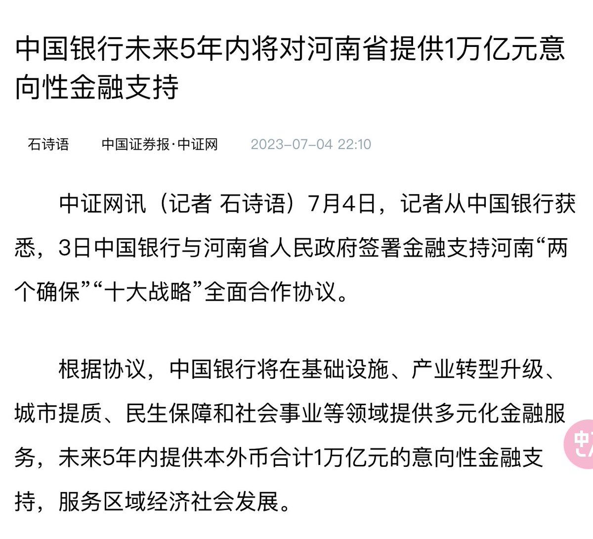
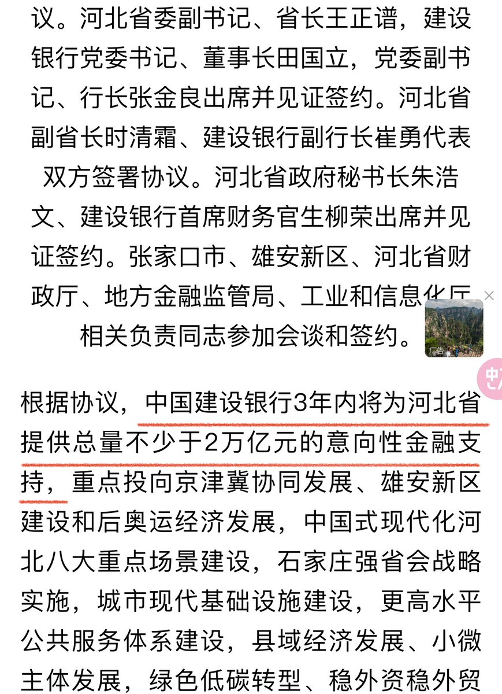
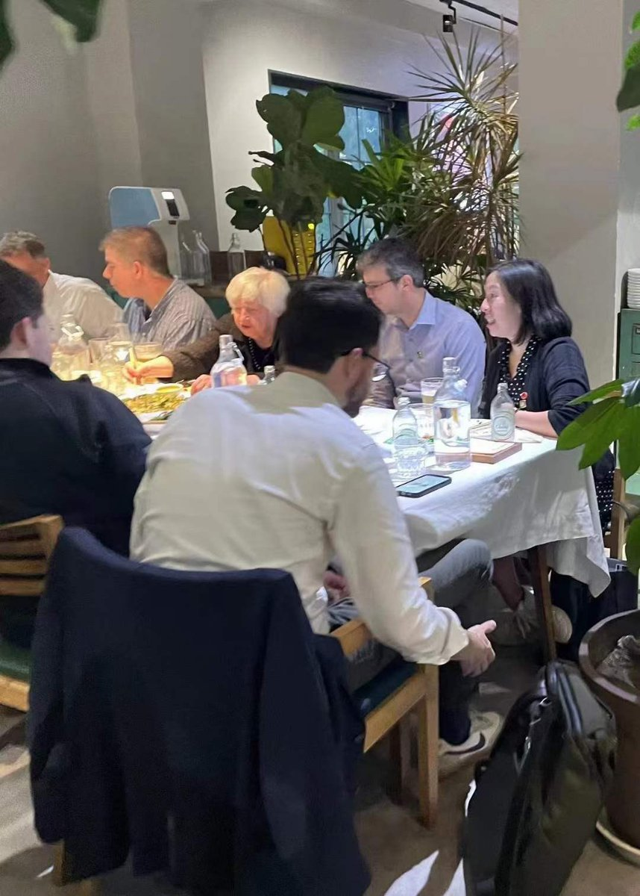

多伦多方脸 北京时间 2023-07-08T11:00:27Z 1677512947386707969 习近平说过中国有四个自信
但是我看到的却是中国人全面失去信心
中国人现在深深陷入了四个失望
1.对经济政策的失望
2.对外交关系的失望
3.对执政水平的失望
4.对政治改革的失望

方脸说：中国人失去了对未来的信心，请善待中国自己的同胞！
https://t.co/hUJDhrv3iI   多伦多方脸 北京时间 2023-07-08T16:43:25Z 1677599257170432000 你是从什么事情开始转变的？
开始对共产党失去信心，开始觉得失望的？   多伦多方脸 北京时间 2023-07-08T17:04:50Z 1677604646561644545 中国银行将对河南省政府提供一万亿支持
建设银行将对河北省政府提供两万亿支持 https://t.co/O6B0bMLPkz   多伦多方脸 北京时间 2023-07-08T17:54:15Z 1677617082408763392 看到中共现在又开始给地方债兜底了
这就证明我错了，我这段时间一直，还在期待中共能放出眼前一亮的救市政策。
至少我觉得中央有那么多金融专家，集思广益，怎么也能想出点新意，搞点不一样的东西。
但是看来看去就还是那三板斧。
我不该对他抱有期待的，是我的问题。   多伦多方脸 北京时间 2023-07-08T11:15:00Z 1677516607722237953 你要夸夸共产党，夸他经济治理，反腐，就算了。
你要是现在还能夸中共的新冠防疫政策。
我觉得你都不能称之为粉红，你应该去测一下自己的智商。   多伦多方脸 北京时间 2023-07-08T00:32:44Z 1677354975314481153 最近lol号被封了。
找了个代练，帮练级。
我看他打了3天，30多小时。
问了下他，抽成完到手才160块钱，合5块钱一小时都没   多伦多方脸 北京时间 2023-07-08T00:34:20Z 1677355378382884864 下半年经济你认为会回暖吗？   多伦多方脸 北京时间 2023-07-08T01:06:24Z 1677363449196871681 面对中国很多网友，现在经常在评论区各种阴阳怪气政府和国家
我有以下三点建议
1.成立意识形态小组，拟招募10亿人，(可以解决了就业问题)
2.对评论区发言进行监督，但凡发言不爱国的(由意识形态小组决定)，则判定有罪，解决了AI不能识别的一些痛点
3.对判定有罪的人展开公开批判，直播谢罪(防止再犯)   多伦多方脸 北京时间 2023-07-08T01:08:39Z 1677364012718370817 一边说要支持企业家
一边对阿里腾讯重拳出击
搞反差感，还得看中共   多伦多方脸 北京时间 2023-07-08T01:43:02Z 1677372666406371329 中国的高级官员，敢随便去餐厅里
这样吃顿饭吗？ https://t.co/nLlZ1fu7SD   多伦多方脸 北京时间 2023-07-08T01:53:53Z 1677375396399185921 好好好好，生怕大家不厌恶公职人员是吧。 https://t.co/d86yDtXtdp   多伦多方脸 北京时间 2023-07-08T02:12:12Z 1677380005729570817 在一般国家加入一个党派，是基于共同的价值观。
而加入中国共产党，却是一种身份的象征，他往往是在中国走向“成功”的入场券。
其实你信与不信共产主义，都无所谓，也没啥人是真因为想要支持共产主义而加入共产党。   多伦多方脸 北京时间 2023-07-08T02:22:50Z 1677382681817128960 看来中国地方财政还是富余的。 https://t.co/anlXNrZuGB   